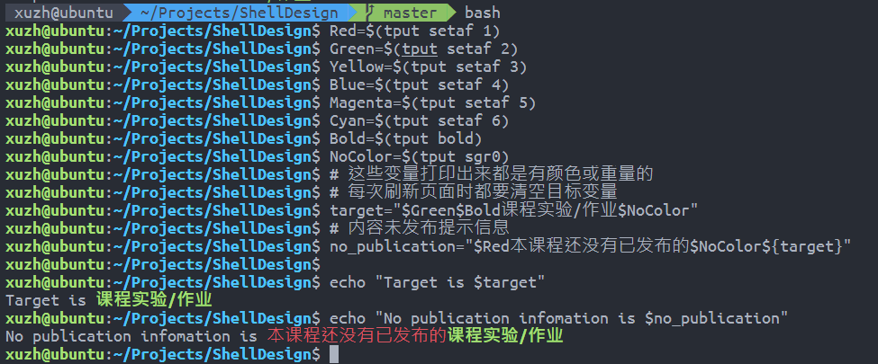

# 基于Bash的现代课程管理系统设计文档

## 基本信息

- 课程名称：Linux程序设计

- 实验项目名称：Shell命令

- 学生姓名：徐震

- 学号：3180105504

- 专业：计算机科学与技术

- 电子邮件地址：[3180105504@zju.edu.cn](mailto:3180105504@zju.edu.cn)

- 实验日期：2020.07.15

## 实验环境

### 硬件配置

- CPU: `2.6 GHz 6-Core Intel Core i7-9750H`
- GPU: `NVIDIA® GeForce® GTX 1650 and Intel(R) UHD Graphics 630`
- Memory: `16 GB 2666 MHz DDR4`
- Disk: `500 GB Solid State PCI-Express Drive * 2`

### 软件环境

- System: `Microsoft Windows 10, macOS Catalina 10.15.5 dual booting`

- Linux: `WSL2 on Windows 10, VMWare Virtual Machine Ubuntu 18.04, Manjaro USB Boot Disk, Ali Cloud ECS Server CentOS 7`

- 注意：我们会==在VMWare Virtual Machine Ubuntu 18.04上进行绝大多数实验操作（Host: Windows 10）==，如实验过程中使用了其他系统我们会注明。

- 主要实验环境详细配置：

  - 系统内核：`Linux ubuntu 5.3.0-43-generic #36~18.04.2-Ubuntu SMP Thu Mar 19 16:03:35 UTC 2020 x86_64 x86_64 x86_64 GNU/Linux`

  - CPU：`Intel(R) Core(TM) i7-9750H CPU @ 2.60GHz`

  - Memory：`MemTotal 6060516 kB`

## 需求描述

## 设计文档

用bash编写程序，实现一个简单的**作业管理系统。使用数据库软件包来实现**。系统具备以下的基本功能：

- 仿图形界面的页面性逻辑：在Terminal等纯文字终端实现页面逻辑
- 重要信息的高亮显示
- 打印有用错误信息，方便调试
- 与后端数据库系统的交互衔接

- 系统登陆
  1. 教师、学生、管理员都通过其ID和密码登陆，需要事先说明自身身份。
  2. 系统内部通过`sha256`加密存储和验证密码。
  3. 在系统Banner处显示当前用户身份。

系统中根据不同的权限分为三类用户：管理员、教师、学生，简要说明如下：

- 管理员：

  1. 管理管理员账户
     1. 创建、修改、删除、显示（进入相关界面直接显示）管理员帐号。
     2. 对修改密码操作单独询问。
     3. 教师帐户包括管理员账号、管理员姓名等。
     4. 可以修改自身账号的信息，或删除自身账号，在下一次登陆时体现修改/删除效果。

  2. 管理教师账户
     1. 创建、修改、删除、显示（进入相关界面直接显示）教师帐号。
     2. 对修改密码操作单独询问。
     3. 教师帐户包括教师工号、教师姓名、性别、职称、注册时间、教师简介等。

  3. 管理学生账户
     1. 创建、修改、删除、显示（进入相关界面直接显示）学生帐号。
     2. 对修改密码操作单独询问。
     3. 学生帐户包括学生学号、学生姓名、性别、录取时间、学生简介等。

  4. 管理课程列表
     1. 创建、修改、删除、显示（进入相关界面直接显示）课程；绑定（包括添加、删除）课程与教师用户。
     2. 课程名称以简单的中文和英文命名，课程列表中包括课程号、课程中文名，课程英文名，课程简介等。

- 教师：

  1. 管理课程中的学生列表
     1. 显示修读课程的学生名单。
     2. 对某门课程，导入或删除学生帐户，根据学号查找学生帐号。
     3. 注：所有==可登录账户本身只有管理员有权限管理==。

  2. 发布课程信息
     1. 管理课程简介
        1. 显示、修改本课程的简介，支持换行。
     2. 管理课程公告
        1. 管理课程公告，包括新建、编辑、删除、显示（进入相关界面直接显示）课程信息等功能，公告内容支持换行。。
        2. 对于课程公告可以选择添加附件。
        3. 显示课程公告的附件情况。

  3. 布置作业或实验
     1. 管理课程作业/实验
        1. 包括新建、编辑、删除、显示（进入相关界面直接显示）作业或实验等功能，添加时可设定作业/实验截止时间。
        2. 作业/实验简介支持换行。
        3. 对于实验/作业可以选择添加附件。
        4. 显示课程实验/作业的附件情况。
     2. 查看作业/实验的完成情况
        1. 显示全部修读学生的完成情况。
        2. 单独查询某个同学的作业完成情况，并查看其所有提交内容。

- 学生：
  1. 查看自己修读的课程列表
  2. 总体查看作业/实验的完成情况，列举提交的次数等
  3. 管理课程作业的提交
     1. 对已经布置的课程作业/实验新建、编辑、删除、显示（进入相关界面直接显示）提交
     2. 根据设定的作业/实验截止时间判断学生是否真的可以创建/修改/删除提交。

### 设计思想

#### 数据库交互

我们通过MySQL命令来直接执行数据库操作，这也是本实验的核心内容

您需要有一个==版本号至少为5.7.\*的MySQL数据库==，并且您需要对其有管理权限

我们通过设置文件的方式使得MySQL不会抱怨直接在命令行输入密码不安全：

```bash
mysql: [Warning] Using a password on the command line interface can be insecure.
```

- 注意：您可以修改程序运行目录下的`.mysql.cnf`文件来设置自己的数据库登陆信息

- 第一次使用本软件时请运行当前目录下的`table.sql`来初始化数据库中的表
  
  必须运行的部分是所有的`create table`

  后面的`insert`内容是可选的，但是至少要有一个管理员账户，否则本软件没有什么意义

  样例初始化语句（假设您知道root密码）：`mysql -uroot -p < tables.sql`：此语句会要求您输入root密码

- 请保证MySQL已经在本机正确安装，且`.mysql.cnf`已经被正确配置
  
  您需要在`.mysql.cnf`中设置您的登录名/密码/服务器，并设置数据库名称(和您在MySQL中使用的相同)

  例如您在MySQL中创建了`ShellDesigner`这个用户，密码为`ShellDesigner`，并打算使用`ShellDesign`这个数据库来管理本软件涉及到的内容

  登陆root用户后，可使用如下操作修改密码

```bash
ALTER USER 'user'@'hostname' IDENTIFIED BY 'newPass';
```

可以通过如下操作创建新用户

```bash
create user ShellDesigner identified by 'ShellDesigner';
create database ShellDesign;
grant all on ShellDesign.* to ShellDesigner;
```

.mysql.cnf就将有类似如下的内容

```mysql
[client]
user=ShellDesigner
password=ShellDesigner
host=localhost
database=ShellDesign
```

下列是我们默认的一些设置

```bash
mysql_u_default="ShellDesigner"
mysql_p_default="ShellDesigner"
mysql_h_default="localhost"
mysql_d_default="ShellDesign"
mysql_f=".mysql.cnf"

# 类似调用alias，我们在下面的Shell语句中执行MySQL调用时都会使用$mysql_prefix来开头
mysql_prefix="mysql --defaults-extra-file=$mysql_f"
```

我们采用了命令行调用MySQL数据库的方式实现此管理系统的主要功能。

为了方便复用和嵌套，我们将所有的SQL查询语句存储在字符串变量中（容易遭到SQL Injection攻击，后面会提到如何防御）

注意在每一次事件循环后我们都会尽量更新一次查询语句的变量内容（除非此语句是固定的）。

```bash
query_id="select cid from take where sid=$sid"
query_course="select id 课程号, name_zh 中文名称, name_en 英文名称 from course where id in ($query_id)"
```

第一层括号将返回结果当作数组处理，第二层`$()`是执行了一个Bash语句，在此是执行了一个MySQL查询

- 在本程序中，我们将结果存入变量时基本都会采用这种调用MySQL的方式，我们会使用`-se`选项，其中`-e`代表执行，`-s --slient`，安静模式，在此的效果是去除列名

- 在直接执行MySQL并原封不动的打印信息时，我们会使用-e选项，代表执行

值得注意的是，在命令行直接调用MySQL时，会打印列分隔符，而将结果存入变量则不会打印（列分隔符自动会得到删除）

```bash
# 重定向标准输出的到文件并打印文件
 xuzh@ubuntu  ~/Projects/ShellDesign   master ●  mysql -uShellDesigner -pShellDesigner ShellDesign -e "select * from admin;" > temp.txt; cat temp.txt
mysql: [Warning] Using a password on the command line interface can be insecure.
name    id      password_hash
root    1       53175bcc0524f37b47062fafdda28e3f8eb91d519ca0a184ca71bbebe72f969a
admin   2       fc8252c8dc55839967c58b9ad755a59b61b67c13227ddae4bd3f78a38bf394f7

# 直接执行语句，打印到标准输出
 xuzh@ubuntu  ~/Projects/ShellDesign   master ●  mysql -uShellDesigner -pShellDesigner ShellDesign -e "select * from admin;"
mysql: [Warning] Using a password on the command line interface can be insecure.
+-------+----+------------------------------------------------------------------+
| name  | id | password_hash                                                    |
+-------+----+------------------------------------------------------------------+
| root  |  1 | 53175bcc0524f37b47062fafdda28e3f8eb91d519ca0a184ca71bbebe72f969a |
| admin |  2 | fc8252c8dc55839967c58b9ad755a59b61b67c13227ddae4bd3f78a38bf394f7 |
+-------+----+------------------------------------------------------------------+

# 将标准输出重定向到Terminal标准输出
 xuzh@ubuntu  ~/Projects/ShellDesign   master ●  mysql -uShellDesigner -pShellDesigner ShellDesign -e "select * from admin;" > /dev/tty
mysql: [Warning] Using a password on the command line interface can be insecure.
+-------+----+------------------------------------------------------------------+
| name  | id | password_hash                                                    |
+-------+----+------------------------------------------------------------------+
| root  |  1 | 53175bcc0524f37b47062fafdda28e3f8eb91d519ca0a184ca71bbebe72f969a |
| admin |  2 | fc8252c8dc55839967c58b9ad755a59b61b67c13227ddae4bd3f78a38bf394f7 |
+-------+----+------------------------------------------------------------------+

# 重定向到变量并打印标准输出
 xuzh@ubuntu  ~/Projects/ShellDesign   master ●  temp=$(mysql -uShellDesigner -pShellDesigner ShellDesign -e "select * from admin;");echo "$temp"
mysql: [Warning] Using a password on the command line interface can be insecure.
name    id      password_hash
root    1       53175bcc0524f37b47062fafdda28e3f8eb91d519ca0a184ca71bbebe72f969a
admin   2       fc8252c8dc55839967c58b9ad755a59b61b67c13227ddae4bd3f78a38bf394f7
```

因此当我们想要让此变量获取打印的信息时，我们应直接将返回信息赋值到变量中，当我们想直接使用MySQL的格式化功能时，我们应直接使用命令将输出导入到`/dev/tty`。

调用举例：

```bash
# 通过变量$mysql_prefix中定义的格式执行MySQL查询：mysql --defaults-extra-file=$mysql_f
# 查询的内容是$query_id变量中存储的查询：select cid from take where sid=$sid
# 通过-s参数去除列名
# 并且将查询结果以数组形式存储到$cids变量中
cids=($($mysql_prefix -se "$query_id;"))

# 直接调用$mysql_prefix变量中定义的内容：mysql --defaults-extra-file=$mysql_f
# 查询的内容是$query_course变量中存储的查询：select id 课程号, name_zh 中文名称, name_en 英文名称 from course where id in ($query_id)
# 不进行输入输出的引导，直接打印到屏幕
# 直接调用MySQL并输出到/dev/tty可以使MySQL用分割线打印各种信息
$mysql_prefix -e "$query_course;"
```

同时，为了防止SQL注入攻击，我们设计了如下字符串来过滤敏感字符

不进行过滤直接运行就有可能遭到SQL注入攻击，泄露重要密码HASH值


这一函数会手动转义要插入到SQL命令中的字符串，使得MySQL可以正确解释被转义了的危险字符

```bash
function RemoveDanger() {
    danger_set=${2:-"[\"'\.\*;%]"}
    danger=$1
    safe=""
    for i in $(seq ${#danger}); do
        thechar="${danger:$i-1:1}"
        if [[ "$thechar" =~ $danger_set ]]; then
            # echo "$thechar"
            safe="$safe""\\""$thechar"
        else
            safe="$safe$thechar"
        fi
    done
    echo "$safe"
}
```

桐言的，出于安全性考虑，我们没有在数据库中明文存放密码，而是使用了加密用的`sha256 hash`

我们将用户密码进行sha256 hash后储存

并在登陆时将用户输入的内容进行sha256 hash，与数据库内部的hash值进行比较，若相等则认为密码正确

- 这种方式可以提高系统的安全性

  即使数据库内容被泄露，sha256的加密也会让数据偷盗者很难猜出正确的密码

  [一个解释相关操作的视频](https://www.youtube.com/watch?v=7U-RbOKanYs)

#### 页面逻辑

我们通过一些页面循环来搭建页面逻辑

一个完整页面的结构如下所示


我们通过类似如下结构的代码来构建上述的事件循环页面：

```bash
function TeacherOPCourse() {
    while :; do # 课程操作UI主循环
        ##############################################
        #                                             #
        #                  打印Banner                 #
        #                                             #
        ##############################################
        PrintTeacher # 打印Banner

        target="$Green课程$NoColor" # 此时的目标字符串为：课程，用绿色显示以方便辨认


        ##############################################
        #                                             #
        #                  打印查询信息                 #
        #                                             #
        ##############################################
        query_tid="select tid from teach where cid=$cid"
        query_teacher="select id 教师工号, name 教师姓名, if(gender='F', \"女\", \"男\") 性别, registration_time 注册时间, title 职称, brief 简介 from teacher where id in ($query_tid)"

        echo "您选择的${target}为："

        # 此时我们打印课程简介信息，方便用户在后续使用过程中决定是否要修改课程简介信息
        $mysql_prefix -e "select id 课程号, name_zh 中文名称, name_en 英文名称, brief 课程简介 from course where id=$cid;"

        # 打印除了当前老师外一同教这门课的老师一共用户参考
        tids=($($mysql_prefix -e "$query_tid and tid <> $tid;"))
        if [ ${#tids[@]} -gt 0 ]; then
            echo "与您一同教这门课的老师有："
            $mysql_prefix -e "$query_teacher and id <> $tid;"
        else
            echo "这门${target}只有您自己在教"
        fi

        ##############################################
        #                                             #
        #                  操作栏循环                  #
        #                                             #
        ##############################################
        echo "您可以进行的操作有："
        echo "1. 管理修读${target}的学生"
        echo "2. 管理${target}作业/实验"
        echo "3. 管理本${target}信息（管理公告/简介等）"
        echo "0. ${ReturnPrev}"
        while :; do
            # 输入处理循环，这里比较tidy，因为我们将三个子操作都封装成了函数
            # 且这里无论选择那种操作都没有直接清屏返回的必要
            read -rp "请输入您想要进行的操作：" op
            case $op in
            1)
                echo "您选择了管理修读该${target}的学生"
                TeacherManageStudent
                break
                ;;
            2)
                echo "您选择了管理本${target}的实验和作业"
                TeacherManageHomework
                break
                ;;
            3)
                echo "您选择了管理本${target}的公告/信息"
                TeacherManageCourse
                break
                ;;
            0)
                echo "您选择了${ReturnPrev}"
                return 0
                ;;
            *)
                echo "您输入的操作$op有误，请输入上面列出的操作"
                ;;
            esac
        done
    done
}
```

我们通过每次主循环都调用这样的一个函数来清空屏幕：

其中的`clear`功能可以清空当前页面已打印的信息

接着我们通过`cat`打印ASCII ART

```bash
function PrintTeacher() {
    # TEACHER分隔符，会在老师登陆后的管理界面打印
    clear
    cat <<"EOF"
   ______   ______     ______     ______     __  __     ______     ______    
  /\__  _\ /\  ___\   /\  __ \   /\  ___\   /\ \_\ \   /\  ___\   /\  == \   
  \/_/\ \/ \ \  __\   \ \  __ \  \ \ \____  \ \  __ \  \ \  __\   \ \  __<   
     \ \_\  \ \_____\  \ \_\ \_\  \ \_____\  \ \_\ \_\  \ \_____\  \ \_\ \_\ 
      \/_/   \/_____/   \/_/\/_/   \/_____/   \/_/\/_/   \/_____/   \/_/ /_/ 
                                                                             
EOF
}
```

主循环保证了下一级函数返回后仍然会留在当前页面征求用户的意见

且同时屏幕上的信息会刷新

```bash
while :; do # 屏幕主循环

# 打印表格内容
$mysql_prefix ...

# 打印可用操作内容
echo "..."
    while :; do # 操作循环
    case $choice in
        1)
        # 用户输入了正确的选项
        # 在此执行下一步的功能
        ...
        # 运行结束后重新开始主循环，刷新数据
        break
        ;;

        0)
        # 通过return命令直接返回上一级函数调用/或退出运行
        return 0
        ;;

        *)
        # 用户输入有误
        # 不调用break命令直接进行操作循环
        ;;
    done
done
```

#### 页面交互

我们通过设置颜色，字体，以及精心调教read函数和嵌套循环，构成了一套较为流畅的UI导航交互逻辑

- 通过调用`tput`命令我们会将重要信息高亮显示，加快用户的定位过程

  我们通过初始化这样的语句来定义颜色命令，以后只需要调用相关变量就可以完成颜色的改变

  ```bash
  Red=$(tput setaf 1)
  Green=$(tput setaf 2)
  Yellow=$(tput setaf 3)
  Blue=$(tput setaf 4)
  Magenta=$(tput setaf 5)
  Cyan=$(tput setaf 6)
  Bold=$(tput bold)
  NoColor=$(tput sgr0)
  ```

  使用样例：

  ```bash
  # 这些变量打印出来都是有颜色或重量的
  # 每次刷新页面时都要清空目标变量
  target="$Green$Bold课程实验/作业$NoColor"
  # 内容未发布提示信息
  no_publication="$Red本课程还没有已发布的$NoColor${target}"
  
  echo "Target is $target"
  echo "No publication infomation is $no_publication"
  ```

  

- 通过嵌套循环，我们让用户有很多试错机会

  ```bash
  while :; do
      read -rp "请输入您想要管理的课程号：" cid
  
      # 注意到我们使用正则表达式展开数组来进行元素检查
      # 因此表达式右侧的值应用引号括起以保证完全匹配
      # 我们使用了ShellCheck工具，而此工具会对=~右侧的表达式报错，因此我们使用了
      # shellcheck disable=SC2076
      # 来关闭这一报错
      [[ "${cids[*]}" =~ "${cid}" ]] && break
      echo "您输入的课程号$cid有误，请输入上表中列举出的某个课程号"
  done
  ```

  上衣部分描述的嵌套循环也是一个例子。

- 通过调教`read`命令，我们给了用户在清屏前观察屏幕的机会，配合高亮，可以快速定位操作中的错误

  ```bash
  function ContinueWithKey() {
      # 按任意键继续...
      # 有的时候我们会在清空屏幕之前打印一些信息，我们决定给用户一些时间来看看这些信息是什么
      read -n 1 -rp "$Blue$Bold按任意键继续...$NoColor" -s
  }
  ```

  

  即使换成不同的终端，显示效果依然不错。

  

- 通过调教`read`命令，我们使得用户的明文密码不会得到显示

  同时，我们会==对错误的登录请求添加1s的超时惩罚==，以防止暴力破解密码的操作

  ```bash
  while :; do
      # todo: 使用cat命令可以清楚密码变量，提高安全性，但是我们还没发现该如何换行
      # 所以暂时使用了变量来存储密码
      read -rp "请输入您的密码：" -s password
      echo ""
      password_hash=$(echo "$password" | sha256sum - | tr -d " -")
      echo "验证中……"
      [ "$password_hash" = "$right_hash" ] && break
      sleep 1s # 为了防止暴力登录攻击，每次密码错误都要得到1s的时间惩罚
      echo "验证失败，请重新输入"
  done
  ```

- 通过嵌套循环，我们使得用户无需提前输入一些稍显冗余的数量信息

  例如在附件添加的过程中，用户无需实现输入要添加的附件数目

  ```bash
  # 这里我们通过Bash内部计数来减少一次MySQL链接
  attachment_count=0
  while :; do
      # 我们根据用户回答来修改程序运行流程
      # 用户无需提前知道需要添加的附件数量
      # 他/她只需要不断输入Y并添加内容
      read -rp "请输入您是否需要为${target}添加附件（Y/n）：" need_attach
      if [[ $need_attach =~ ^[1Yy] ]]; then # 正则表达式匹配
          attachment_count+=1
  
          echo "您选择了添加附件"
          read -rp "请输入您想要添加的附件名称：" attach_name
          attach_name=$(RemoveDanger "$attach_name") # 可能包含危险字符
          echo "您的附件名称为：$attach_name"
  
          read -rp "请输入您想要添加的附件URL：" attach_url
          # 对于URL，我们使用不同的转义策略
          attach_url=$(RemoveDanger "$attach_url" "[\"'\.\*;]")
          echo "您的附件URL为：$attach_url"
  
          # 添加附件到附件相关表，并修改attach_to表来对应附件和Content的关系
          # 我们暂时只使用了attach_to表格的一部分功能，在日后的开发中我们可以将一个附件分配给多个不同的Content
          # todo: 可以重用已经上传过的附件，建立多对多的附加/带附件内容的对应
          query_insert_attach="insert into attachment(name, url) value (\"$attach_name\", \"$attach_url\")"
          query_insert_attach_to="insert into attach_to(aid, uid) value (last_insert_id(), $subid)"
  
          # 同样的，我们利用了Transaction功能
          attach_id=$($mysql_prefix -se "set autocommit=0;$query_insert_attach;select last_insert_id();$query_insert_attach_to;commit;set autocommit=1;")
  
          echo "您刚刚添加的附件ID为：$attach_id"
      else
      	break
      fi
  done
  ```

- 通过使用ASCII ART，我们让用户很容易的认识到自己的身份

  上面打印的STUDENT和TEACHER BANNER就是一个例子

  我们还在程序的登陆界面打印了CourseworkManager的字样以方便辨识

  ```bash
  # 以下几个Print函数都是用于打印ASCII Art的
  # 同时，它们通过调用clear函数来进行假GUI的页面模拟功能
  # 我们使用ASCII Art的初衷是让用户能在程序的不同Section中更快的找到自己想要的信息
  # 后来我们发现通过调用clear函数可以达到模拟GUI的功能
  function PrintBanner() {
      # 程序的主横幅：CourseworkManger
      # 会在初始登陆界面打印
      clear
      cat <<"EOF"
     _________                                                       __        _____                                                  
     \_   ___ \  ____  __ _________  ______ ______  _  _____________|  | __   /     \ _____    ____ _____     ____   ___________      
     /    \  \/ /  _ \|  |  \_  __ \/  ___// __ \ \/ \/ /  _ \_  __ \  |/ /  /  \ /  \\__  \  /    \\__  \   / ___\_/ __ \_  __ \     
     \     \___(  <_> )  |  /|  | \/\___ \\  ___/\     (  <_> )  | \/    <  /    Y    \/ __ \|   |  \/ __ \_/ /_/  >  ___/|  | \/     
      \______  /\____/|____/ |__|  /____  >\___  >\/\_/ \____/|__|  |__|_ \ \____|__  (____  /___|  (____  /\___  / \___  >__|        
             \/                         \/     \/                        \/         \/     \/     \/     \//_____/      \/            
                                                                                                                                      
  EOF
  }
  ```

- 通过清屏功能，我们避免打印太多冗余信息，并模拟了GUI式的交互性操作

### 功能模块

#### 数据库定义

为了方便用户，我们定义了一个SQL脚本文件，用于快速初始化用户的数据库。

用户在初次运行程序之前可以通过如下的脚本设置数据库（假设您知道root密码）：

```bash
mysql -uroot -p < tables.sql
```

- 用户/数据库定义部分

  ```mysql
  # note: we should define the default charset of the database before creating the tables without explicitly
  # defining charset
  
  drop database if exists ShellDesign;
  drop user if exists ShellDesigner;
  create user ShellDesigner identified by 'ShellDesigner';
  create database ShellDesign;
  grant all on ShellDesign.* to ShellDesigner;
  alter database ShellDesign character set utf8mb4 collate utf8mb4_unicode_ci;
  use ShellDesign;
  
  drop table if exists `take`;
  drop table if exists `info`;
  drop table if exists `teach`;
  drop table if exists `attach_to`;
  drop table if exists `attachment`;
  drop table if exists `submission`;
  drop table if exists `homework`;
  drop table if exists `content`;
  drop table if exists `teacher`;
  drop table if exists `student`;
  drop table if exists `admin`;
  drop table if exists `course`;
  ```

- 表建立部分

  ```mysql
  create table `teacher`
  (
      name              varchar(100),
      id                bigint primary key auto_increment,
      brief             varchar(2000),
      gender            enum ('F', 'M') default 'F', # F for female and M for male
      registration_time datetime,
      title             varchar(500)    default 'Professor',
      password_hash     varchar(64)
  );
  
  create table `student`
  (
      name          varchar(100),
      id            bigint primary key auto_increment,
      brief         varchar(2000),
      gender        enum ('F', 'M') default 'F', # F for female and M for male
      enroll_time   datetime,
      password_hash char(64)
  );
  
  create table `admin`
  (
      name          varchar(100),
      id            bigint primary key auto_increment,
      password_hash char(64)
  );
  
  create table `course`
  (
      name_zh  varchar(100),
      name_en  varchar(100),
      brief    varchar(2000),
      syllabus varchar(4000),
      id       bigint primary key auto_increment
  );
  
  create table `teach`
  (
      tid bigint,
      cid bigint,
      foreign key (`tid`) references teacher (`id`) on delete cascade on update cascade,
      foreign key (`cid`) references course (`id`) on delete cascade on update cascade
  );
  
  create table `take`
  (
      cid bigint,
      sid bigint,
      foreign key (`sid`) references student (`id`) on delete cascade on update cascade,
      foreign key (`cid`) references course (`id`) on delete cascade on update cascade
  );
  
  # this is a dummy class so that we can ensure foreign key references from attachments to both submissions and homework
  create table `content`
  (
      id bigint primary key auto_increment
  );
  
  create table `info`
  (
      id           bigint primary key,
      content      varchar(2000),
      cid          bigint,
      release_time datetime,
      foreign key (`cid`) references course (`id`) on delete cascade on update cascade,
      foreign key (`id`) references content (`id`) on delete cascade on update cascade
  );
  
  create table `homework`
  (
      id            bigint primary key auto_increment,
      cid           bigint,
      tid           bigint,
      intro         varchar(2000),
      creation_time datetime,
      end_time      datetime,
      type          enum ('H', 'E') default 'H', # H for homework and e for experiment
      foreign key (`id`) references content (`id`) on delete cascade on update cascade,
      foreign key (`tid`) references teacher (`id`) on delete cascade on update cascade,
      foreign key (`cid`) references course (`id`) on delete cascade on update cascade
  );
  
  create table `submission`
  (
      id                       bigint primary key auto_increment,
      sid                      bigint,
      hid                      bigint,
      submission_text          varchar(2000),
      creation_time            datetime,
      latest_modification_time datetime,
      foreign key (`id`) references content (`id`) on delete cascade on update cascade,
      foreign key (`sid`) references student (`id`) on delete cascade on update cascade,
      foreign key (`hid`) references homework (`id`) on delete cascade on update cascade
  );
  
  create table `attachment`
  (
      id    bigint primary key auto_increment,
      name  varchar(100),
      url   varchar(800),
      brief varchar(2000)
  );
  
  create table `attach_to`
  (
      aid bigint,
      uid bigint,
      foreign key (`aid`) references attachment (`id`) on delete cascade on update cascade,
      foreign key (`uid`) references content (`id`) on delete cascade on update cascade
  );
  ```

- Dummy内容插入部分

  ```mysql
  insert into `course`(id, name_zh, name_en)
  values (1, '数据库系统', 'Database System'),
         (2, 'Linux程序设计', 'Linux Program Design'),
         (3, '高级数据结构与算法分析', 'Advances Data Structure and Algorithm Design'),
         (4, '计算机图形学', 'Computer Graphics'),
         (5, '视觉识别中的深度卷积神经网络', 'Convolutional Neural Network for Visual Recognition'),
         (6, 'iOS开发', 'iOS Software Development');
  
  insert into `teacher`(id, name, password_hash, registration_time)
  values (1, 'zy', '49aabdaa1b0f6c3506f54521ef81fe5b5fe835d268f1f86e1021a342b59d43bc', now()), # password is zy
         (2, 'xz', 'b44f7d6b5283a44ee5f2bd98f84087a04810092122d75e8fbf8ad85f8f2981f1', now()); # password is xz
  
  insert into `admin`(id, name, password_hash)
  values (1, 'root', '53175bcc0524f37b47062fafdda28e3f8eb91d519ca0a184ca71bbebe72f969a'), # password is root
         (2, 'admin', 'fc8252c8dc55839967c58b9ad755a59b61b67c13227ddae4bd3f78a38bf394f7'); # password is admin
  
  insert into `student`(id, name, password_hash, enroll_time)
  values (1, 'st1', '2238ead9c048f351712c34d22b41f6eec218ea9a9e03e48fad829986b0dafc11', now()), # password is same as name
         (2, 'st2', '5e61d026a7889d9fc72e17f1b25f4d6d48bfe17046fea845aa8c5651ec89c333', now()),
         (3, 'st3', 'bbb977f8e93feb5dbd79e0688b822115b5acf774dd8a1fe6964e03d6b9579384', now()),
         (4, 'st4', '6133396ebcd382b137088d2ea91d60637744e404b4376e4635b45784b718db72', now()),
         (5, 'st5', 'd691a62aa63f1be970582902d0ff78df29899f09c5dd540b1447cdd051dcfc8d', now()),
         (6, 'st6', 'a7a287ffc9cb27131b9dc54199ba96cef87e753968bc620d714af212ef0f7a8c', now()),
         (7, 'st7', '73d0daf13c6159a1fbdeb37b6972325b6e29c312371a0f3d427bd35c0c87b928', now()),
         (8, 'st8', '4ce70fc1eef7303879a2ef33996db2f85058ae06e8590521267ae8d46ec59793', now());
  
  insert into `teach`(cid, tid)
  values (1, 1),
         (1, 2),
         (2, 1),
         (3, 1),
         (4, 2),
         (5, 2);
  
  insert into `take`(cid, sid)
  values (1, 1),
         (1, 2),
         (1, 3),
         (1, 4),
         (2, 3),
         (2, 4),
         (2, 5),
         (2, 6),
         (3, 7),
         (3, 8),
         (4, 1),
         (4, 3),
         (4, 5),
         (5, 2),
         (5, 4),
         (5, 6),
         (5, 8),
         (6, 1),
         (6, 7),
         (6, 8);
  
  
  insert into content(id)
  values (1),
         (2),
         (3),
         (4),
         (5),
         (6),
         (7);
  
  insert into homework(id, cid, tid, intro, creation_time, end_time, type)
  values (5, 1, 1, '实验4 JDBC系统的编写和使用', now(), now() + interval 7 day, 'E'),
         (6, 1, 1, '第五周数据库系统作业', now(), now() + interval 10 day, 'H'),
         (7, 1, 2, '课程大作业 MiniSQL的编写与使用', now(), now() + interval 20 day, 'H');
  
  insert into attachment(id, name, url)
  values (1, 'Linux Shell Program Design 3rd Edition.pdf',
          'https://raw.githubusercontent.com/dendenxu/miniSQL/master/miniSQL.tex'),
         (2, '数据库系统实验报告', 'https://raw.githubusercontent.com/dendenxu/miniSQL/master/xz.tex'),
         (3, '蒙特卡洛树搜索实现', 'https://raw.githubusercontent.com/dendenxu/DeepOthello/master/MCTS.py'),
         (4, 'JDBC接口调用参考与举例', 'https://raw.githubusercontent.com/dendenxu/DeepOthello/master/MCTS.py');
  
  insert into info(id, content, cid, release_time)
  values (1, '作业1的提交就要截止啦！请大家及时关注。', 1, NOW()),
         (2, '实验5的验收将在本周六下午4点开始，请需要验收的组长搜索"数据库系统"钉钉群并加入，钉钉群二维码详见附件', 1, NOW()),
         (3, 'ADS考试将在6月24日以线上/机房同时考试的形式进行，YDS老师的复习视频已上传到学在浙大系统，详见附件', 3, NOW()),
         (4, '明天的实验内容为样条插值（Spline）以及贝塞尔曲线的拟合（Bezier Path），请同学们提前预习相关内容，PPT已上传附件并开放下载', 4, NOW());
  
  insert into attach_to(aid, uid)
  values (1, 1),
         (1, 2),
         (1, 3),
         (2, 1),
         (2, 5),
         (2, 6),
         (4, 5),
         (3, 1);
  ```

#### 初始化模块

我们设计了两个初始化函数，用以定义一些在程序运行过程中全局使用的变量：

- 颜色变量，用以打印有色UI

  ```bash
  function DefineColor() {
      # 我们使用tput命令来定义颜色信息
      # 各类颜色常数，通过echo调用可以改变Shell的输出样式
      # 例如echo "${Red}Hello${NoColor}, world."会打印红色的Hello和原色的World
      # 上述例子会展开成echo "$(tput setaf 1)Hello$(tput sgr0), world."
      # ! consider more about this colorization
      Red=$(tput setaf 1)
      Green=$(tput setaf 2)
      Yellow=$(tput setaf 3)
      Blue=$(tput setaf 4)
      Magenta=$(tput setaf 5)
      Cyan=$(tput setaf 6)
      Bold=$(tput bold)
      NoColor=$(tput sgr0)
      ReturnPrev="$Yellow$Bold返回上一级$NoColor"
  }
  ```

- 数据库变量，用以操作MySQL

  - 数据库操作变量，用以通过CMD调用MySQL
  - 数据库登陆定义，一些用户，密码等的提前设置

  ```bash
  function DefineMySQL() {
      # 下列是我们默认的一些设置
      mysql_u_default="ShellDesigner"
      mysql_p_default="ShellDesigner"
      mysql_h_default="localhost"
      mysql_d_default="ShellDesign"
      mysql_f=".mysql.cnf"
  
      # 若.mysql.cnf在当前目录不存在，我们会创建一个并将默认内容写入
      if [ ! -f "$mysql_f" ]; then
          echo "Automatically generating configuration file..." >&2
          echo "[client]" >$mysql_f
          echo "user=$mysql_u_default" >>$mysql_f
          echo "password=$mysql_p_default" >>$mysql_f
          echo "host=$mysql_h_default" >>$mysql_f
          echo "database=$mysql_d_default" >>$mysql_f
      fi
  
      # 类似调用alias，我们在下面的Shell语句中执行MySQL调用时都会使用$mysql_prefix来开头
      mysql_prefix="mysql --defaults-extra-file=$mysql_f"
  }
  
  ```

#### 登陆模块

正如前面描述的，我们在登陆模块采用了一些防范攻击的方法：

- 去除可能造成SQL注入的危险字符
- 登陆失败的操作会受到1s的惩罚时间
- 每次登陆至少等待100ms防止攻击

#### 学生操作模块

#### 教师操作模块

#### 管理员操作模块

#### Gadgets小部件

- 清除危险字符模块

  可以读取字符串，并检测其全部的字符内容，与给出的`$danger_set`变量所示的正则表达式做匹配

  对于匹配成功的字符，通过调用`safe="$safe""\\""$thechar"`将其内容添加到末尾

  使用时，通过第一个参数`$1`传入目标字符串，通过第二个参数传入自定义的`$2`正则表达式
  
  ```bash
  function RemoveDanger() {
      danger_set=${2:-"[\"'\.\*;%]"}
      danger=$1
      safe=""
      for i in $(seq ${#danger}); do
          thechar="${danger:$i-1:1}"
          if [[ "$thechar" =~ $danger_set ]]; then
              # echo "$thechar"
              safe="$safe""\\""$thechar"
          else
              safe="$safe$thechar"
          fi
      done
      echo "$safe"
}
  ```
  
- 打印附件信息模块

  通过预先设定的一些参数（包括`SQL`语句和是否存在附件的`Bool`值等）

  ```bash
  function PrintAttachment() {
      # 用于打印附件信息的小函数，可以提高代码可读性
      # 这个函数认为：
      # 1. $attachment_count可以用于判断是否有附件需要打印（不一定要是精确的附件数目
      # 2. $target是目标内容的字符串描述，例如"课程作业/实验"
      # 3. $mysql_prefix可以正确执行MySQL命令，$query_attachment可以正确打印相关附件
      if [ "$attachment_count" -gt 0 ]; then
          echo "本${target}的附件包括："
          $mysql_prefix -e "$query_attachment;"
      else
          # 我们是用红色显示来让用户快速定位这一提示
          echo "$Red本${target}$Red还没有附件$NoColor"
      fi
  }
  ```

- 打印各类`ASCII ART`

  1. `Teacher`

     ```bash
     function PrintTeacher() {
         # TEACHER分隔符，会在老师登陆后的管理界面打印
         clear
         cat <<"EOF"
        ______   ______     ______     ______     __  __     ______     ______    
       /\__  _\ /\  ___\   /\  __ \   /\  ___\   /\ \_\ \   /\  ___\   /\  == \   
       \/_/\ \/ \ \  __\   \ \  __ \  \ \ \____  \ \  __ \  \ \  __\   \ \  __<   
          \ \_\  \ \_____\  \ \_\ \_\  \ \_____\  \ \_\ \_\  \ \_____\  \ \_\ \_\ 
           \/_/   \/_____/   \/_/\/_/   \/_____/   \/_/\/_/   \/_____/   \/_/ /_/ 
                                                                                  
     EOF
     }
     ```

  2. `Student`

     ```bash
     function PrintStudent() {
         # STUDENT分隔符，会在学生登陆后的管理界面打印
         clear
         cat <<"EOF"
        ______     ______   __  __     _____     ______     __   __     ______  
       /\  ___\   /\__  _\ /\ \/\ \   /\  __-.  /\  ___\   /\ "-.\ \   /\__  _\ 
       \ \___  \  \/_/\ \/ \ \ \_\ \  \ \ \/\ \ \ \  __\   \ \ \-.  \  \/_/\ \/ 
        \/\_____\    \ \_\  \ \_____\  \ \____-  \ \_____\  \ \_\\"\_\    \ \_\ 
         \/_____/     \/_/   \/_____/   \/____/   \/_____/   \/_/ \/_/     \/_/ 
                                                                                
     EOF
     }
     ```

  3. `Admin`

     ```bash
     function PrintAdmin() {
         # ADMIN分隔符，会在管理员登陆后的管理界面打印
         clear
         cat <<"EOF"
        ______     _____     __    __     __     __   __    
       /\  __ \   /\  __-.  /\ "-./  \   /\ \   /\ "-.\ \   
       \ \  __ \  \ \ \/\ \ \ \ \-./\ \  \ \ \  \ \ \-.  \  
        \ \_\ \_\  \ \____-  \ \_\ \ \_\  \ \_\  \ \_\\"\_\ 
         \/_/\/_/   \/____/   \/_/  \/_/   \/_/   \/_/ \/_/ 
                                                            
     EOF
     }
     ```

- **继续运行**按键模块

  ```bash
  function ContinueWithKey() {
      # 按任意键继续...
      # 有的时候我们会在清空屏幕之前打印一些信息，我们决定给用户一些时间来看看这些信息是什么
      read -n 1 -rp "$Blue$Bold按任意键继续...$NoColor" -s
  }
  ```

#### 主程序

我们通过函数来设计程序：原因是Bash会在读入整个函数的所有内容后运行，这意味着修改脚本的同时运行脚本是可以进行的（原函数已经在内存中了）

[一个关于这个问题的讨论](https://www.shellscript.sh/tips/change-running-script/)

主程序从这里开始，上面定义的都是可供调用的函数

请查看对程序的注释来理解本软件的工作原理

```bash
DefineColor
DefineMySQL
LoginInUI
```

## 附录

### 完整源码
