# 基于Bash的现代课程管理系统设计文档

## 基本信息

- 课程名称：Linux程序设计

- 实验项目名称：Shell程序设计

- 学生姓名：徐震

- 学号：3180105504

- 专业：计算机科学与技术

- 电子邮件地址：[3180105504@zju.edu.cn](mailto:3180105504@zju.edu.cn)

- 实验日期：2020.07.15

## 实验环境

### 硬件配置

- CPU: `2.6 GHz 6-Core Intel Core i7-9750H`
- GPU: `NVIDIA® GeForce® GTX 1650 and Intel(R) UHD Graphics 630`
- Memory: `16 GB 2666 MHz DDR4`
- Disk: `500 GB Solid State PCI-Express Drive * 2`

### 软件环境

- System: `Microsoft Windows 10, macOS Catalina 10.15.5 dual booting`

- Linux: `WSL2 on Windows 10, VMWare Virtual Machine Ubuntu 18.04, Manjaro USB Boot Disk, Ali Cloud ECS Server CentOS 7`

- 注意：我们会==在VMWare Virtual Machine Ubuntu 18.04上进行绝大多数实验操作（Host: Windows 10）==，如实验过程中使用了其他系统我们会注明。

- 主要实验环境详细配置：

  - 系统内核：`Linux ubuntu 5.3.0-43-generic #36~18.04.2-Ubuntu SMP Thu Mar 19 16:03:35 UTC 2020 x86_64 x86_64 x86_64 GNU/Linux`

  - CPU：`Intel(R) Core(TM) i7-9750H CPU @ 2.60GHz`

  - Memory：`MemTotal 6060516 kB`

## 需求描述

### 设计文档

用bash编写程序，实现一个简单的**作业管理系统。使用数据库软件包来实现**。系统具备以下的基本功能：

- 仿图形界面的页面性逻辑：在Terminal等纯文字终端实现页面逻辑
- 重要信息的高亮显示
- 打印有用错误信息，方便调试
- 与后端数据库系统的交互衔接

- 系统登陆
  1. 教师、学生、管理员都通过其ID和密码登陆，需要事先说明自身身份。
  2. 系统内部通过`sha256`加密存储和验证密码。
  3. 在系统Banner处显示当前用户身份。

系统中根据不同的权限分为三类用户：管理员、教师、学生，简要说明如下：

- 管理员：

  1. 管理管理员账户
     1. 创建、修改、删除、显示（进入相关界面直接显示）管理员帐号。
     2. 对修改密码操作单独询问。
     3. 教师帐户包括管理员账号、管理员姓名等。
     4. 可以修改自身账号的信息，或删除自身账号，在下一次登陆时体现修改/删除效果。

  2. 管理教师账户
     1. 创建、修改、删除、显示（进入相关界面直接显示）教师帐号。
     2. 对修改密码操作单独询问。
     3. 教师帐户包括教师工号、教师姓名、性别、职称、注册时间、教师简介等。

  3. 管理学生账户
     1. 创建、修改、删除、显示（进入相关界面直接显示）学生帐号。
     2. 对修改密码操作单独询问。
     3. 学生帐户包括学生学号、学生姓名、性别、录取时间、学生简介等。

  4. 管理课程列表
     1. 创建、修改、删除、显示（进入相关界面直接显示）课程；绑定（包括添加、删除）课程与教师用户。
     2. 课程名称以简单的中文和英文命名，课程列表中包括课程号、课程中文名，课程英文名，课程简介等。

- 教师：

  1. 管理课程中的学生列表
     1. 显示修读课程的学生名单。
     2. 对某门课程，导入或删除学生帐户，根据学号查找学生帐号。
     3. 注：所有==可登录账户本身只有管理员有权限管理==。

  2. 发布课程信息
     1. 管理课程简介
        1. 显示、修改本课程的简介，支持换行。
     2. 管理课程公告
        1. 管理课程公告，包括新建、编辑、删除、显示（进入相关界面直接显示）课程信息等功能，公告内容支持换行。。
        2. 对于课程公告可以选择添加附件。
        3. 显示课程公告的附件情况。

  3. 布置作业或实验
     1. 管理课程作业/实验
        1. 包括新建、编辑、删除、显示（进入相关界面直接显示）作业或实验等功能，添加时可设定作业/实验截止时间。
        2. 作业/实验简介支持换行。
        3. 对于实验/作业可以选择添加附件。
        4. 显示课程实验/作业的附件情况。
     2. 查看作业/实验的完成情况
        1. 显示全部修读学生的完成情况。
        2. 单独查询某个同学的作业完成情况，并查看其所有提交内容。

- 学生：
  1. 查看自己修读的课程列表
  2. 总体查看作业/实验的完成情况，列举提交的次数等
  3. 管理课程作业的提交
     1. 对已经布置的课程作业/实验新建、编辑、删除、显示（进入相关界面直接显示）提交
     2. 根据设定的作业/实验截止时间判断学生是否真的可以创建/修改/删除提交。

## 设计思想

### 数据库交互

我们通过MySQL命令来直接执行数据库操作，这也是本实验的核心内容

您需要有一个==版本号至少为5.7.\*的MySQL数据库==，并且您需要对其有管理权限

我们通过设置文件的方式使得MySQL不会抱怨直接在命令行输入密码不安全：

```bash
mysql: [Warning] Using a password on the command line interface can be insecure.
```

- 注意：您可以修改程序运行目录下的`.mysql.cnf`文件来设置自己的数据库登陆信息

- 第一次使用本软件时请运行当前目录下的`table.sql`来初始化数据库中的表
  
  必须运行的部分是所有的`create table`

  后面的`insert`内容是可选的，但是至少要有一个管理员账户，否则本软件没有什么意义

  样例初始化语句（假设您知道root密码）：`mysql -uroot -p < tables.sql`：此语句会要求您输入root密码

- 请保证MySQL已经在本机正确安装，且`.mysql.cnf`已经被正确配置
  
  您需要在`.mysql.cnf`中设置您的登录名/密码/服务器，并设置数据库名称(和您在MySQL中使用的相同)

  例如您在MySQL中创建了`ShellDesigner`这个用户，密码为`ShellDesigner`，并打算使用`ShellDesign`这个数据库来管理本软件涉及到的内容

  登陆root用户后，可使用如下操作修改密码

```bash
ALTER USER 'user'@'hostname' IDENTIFIED BY 'newPass';
```

可以通过如下操作创建新用户

```bash
create user ShellDesigner identified by 'ShellDesigner';
create database ShellDesign;
grant all on ShellDesign.* to ShellDesigner;
```

.mysql.cnf就将有类似如下的内容

```mysql
[client]
user=ShellDesigner
password=ShellDesigner
host=localhost
database=ShellDesign
```

下列是我们默认的一些设置

```bash
mysql_u_default="ShellDesigner"
mysql_p_default="ShellDesigner"
mysql_h_default="localhost"
mysql_d_default="ShellDesign"
mysql_f=".mysql.cnf"

# 类似调用alias，我们在下面的Shell语句中执行MySQL调用时都会使用$mysql_prefix来开头
mysql_prefix="mysql --defaults-extra-file=$mysql_f"
```

我们采用了命令行调用MySQL数据库的方式实现此管理系统的主要功能。

为了方便复用和嵌套，我们将所有的SQL查询语句存储在字符串变量中（容易遭到SQL Injection攻击，后面会提到如何防御）

注意在每一次事件循环后我们都会尽量更新一次查询语句的变量内容（除非此语句是固定的）。

```bash
query_id="select cid from take where sid=$sid"
query_course="select id 课程号, name_zh 中文名称, name_en 英文名称 from course where id in ($query_id)"
```

第一层括号将返回结果当作数组处理，第二层`$()`是执行了一个Bash语句，在此是执行了一个MySQL查询

- 在本程序中，我们将结果存入变量时基本都会采用这种调用MySQL的方式，我们会使用`-se`选项，其中`-e`代表执行，`-s --slient`，安静模式，在此的效果是去除列名

- 在直接执行MySQL并原封不动的打印信息时，我们会使用-e选项，代表执行

值得注意的是，在命令行直接调用MySQL时，会打印列分隔符，而将结果存入变量则不会打印（列分隔符自动会得到删除）

```bash
# 重定向标准输出的到文件并打印文件
 xuzh@ubuntu  ~/Projects/ShellDesign   master ●  mysql -uShellDesigner -pShellDesigner ShellDesign -e "select * from admin;" > temp.txt; cat temp.txt
mysql: [Warning] Using a password on the command line interface can be insecure.
name    id      password_hash
root    1       53175bcc0524f37b47062fafdda28e3f8eb91d519ca0a184ca71bbebe72f969a
admin   2       fc8252c8dc55839967c58b9ad755a59b61b67c13227ddae4bd3f78a38bf394f7

# 直接执行语句，打印到标准输出
 xuzh@ubuntu  ~/Projects/ShellDesign   master ●  mysql -uShellDesigner -pShellDesigner ShellDesign -e "select * from admin;"
mysql: [Warning] Using a password on the command line interface can be insecure.
+-------+----+------------------------------------------------------------------+
| name  | id | password_hash                                                    |
+-------+----+------------------------------------------------------------------+
| root  |  1 | 53175bcc0524f37b47062fafdda28e3f8eb91d519ca0a184ca71bbebe72f969a |
| admin |  2 | fc8252c8dc55839967c58b9ad755a59b61b67c13227ddae4bd3f78a38bf394f7 |
+-------+----+------------------------------------------------------------------+

# 将标准输出重定向到Terminal标准输出
 xuzh@ubuntu  ~/Projects/ShellDesign   master ●  mysql -uShellDesigner -pShellDesigner ShellDesign -e "select * from admin;" > /dev/tty
mysql: [Warning] Using a password on the command line interface can be insecure.
+-------+----+------------------------------------------------------------------+
| name  | id | password_hash                                                    |
+-------+----+------------------------------------------------------------------+
| root  |  1 | 53175bcc0524f37b47062fafdda28e3f8eb91d519ca0a184ca71bbebe72f969a |
| admin |  2 | fc8252c8dc55839967c58b9ad755a59b61b67c13227ddae4bd3f78a38bf394f7 |
+-------+----+------------------------------------------------------------------+

# 重定向到变量并打印标准输出
 xuzh@ubuntu  ~/Projects/ShellDesign   master ●  temp=$(mysql -uShellDesigner -pShellDesigner ShellDesign -e "select * from admin;");echo "$temp"
mysql: [Warning] Using a password on the command line interface can be insecure.
name    id      password_hash
root    1       53175bcc0524f37b47062fafdda28e3f8eb91d519ca0a184ca71bbebe72f969a
admin   2       fc8252c8dc55839967c58b9ad755a59b61b67c13227ddae4bd3f78a38bf394f7
```

因此当我们想要让此变量获取打印的信息时，我们应直接将返回信息赋值到变量中，当我们想直接使用MySQL的格式化功能时，我们应直接使用命令将输出导入到`/dev/tty`。

调用举例：

```bash
# 通过变量$mysql_prefix中定义的格式执行MySQL查询：mysql --defaults-extra-file=$mysql_f
# 查询的内容是$query_id变量中存储的查询：select cid from take where sid=$sid
# 通过-s参数去除列名
# 并且将查询结果以数组形式存储到$cids变量中
cids=($($mysql_prefix -se "$query_id;"))

# 直接调用$mysql_prefix变量中定义的内容：mysql --defaults-extra-file=$mysql_f
# 查询的内容是$query_course变量中存储的查询：select id 课程号, name_zh 中文名称, name_en 英文名称 from course where id in ($query_id)
# 不进行输入输出的引导，直接打印到屏幕
# 直接调用MySQL并输出到/dev/tty可以使MySQL用分割线打印各种信息
$mysql_prefix -e "$query_course;"
```

同时，为了防止SQL注入攻击，我们设计了如下字符串来过滤敏感字符

不进行过滤直接运行就有可能遭到SQL注入攻击，泄露重要密码HASH值

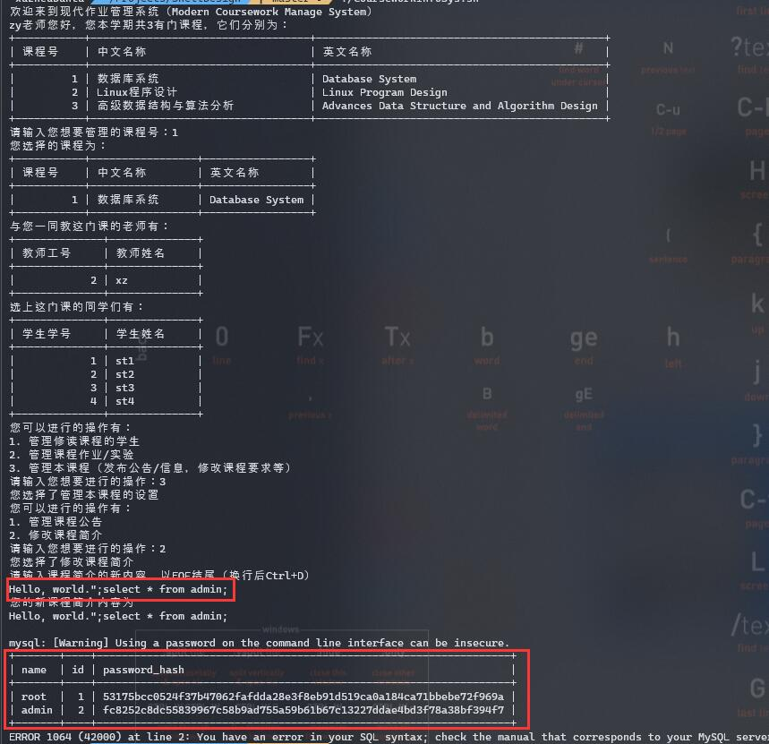

这一函数会手动转义要插入到SQL命令中的字符串，使得MySQL可以正确解释被转义了的危险字符

```bash
function RemoveDanger() {
    danger_set=${2:-"[\"'\.\*;%]"}
    danger=$1
    safe=""
    for i in $(seq ${#danger}); do
        thechar="${danger:$i-1:1}"
        if [[ "$thechar" =~ $danger_set ]]; then
            # echo "$thechar"
            safe="$safe""\\""$thechar"
        else
            safe="$safe$thechar"
        fi
    done
    echo "$safe"
}
```

桐言的，出于安全性考虑，我们没有在数据库中明文存放密码，而是使用了加密用的`sha256 hash`

我们将用户密码进行sha256 hash后储存

并在登陆时将用户输入的内容进行sha256 hash，与数据库内部的hash值进行比较，若相等则认为密码正确

- 这种方式可以提高系统的安全性

  即使数据库内容被泄露，sha256的加密也会让数据偷盗者很难猜出正确的密码

  > [一个解释相关操作的视频](https://www.youtube.com/watch?v=7U-RbOKanYs)

### 页面逻辑

我们通过一些页面循环来搭建页面逻辑

一个完整页面的结构如下所示

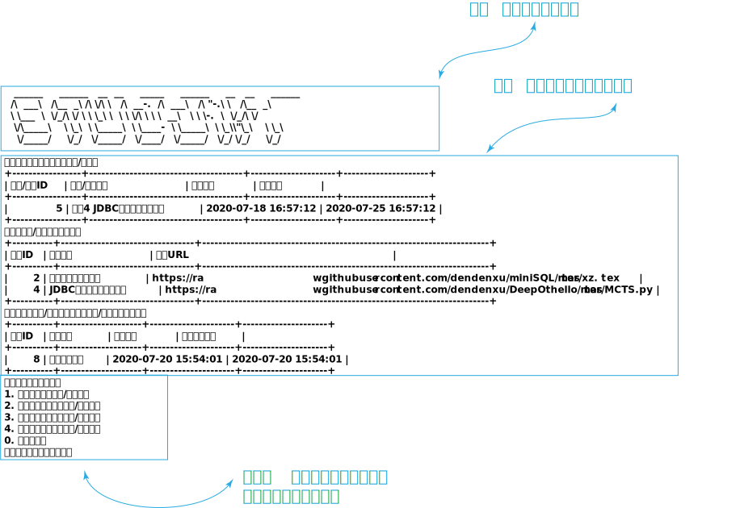

我们通过类似如下结构的代码来构建上述的事件循环页面：

```bash
function TeacherOPCourse() {
    while :; do # 课程操作UI主循环
        ##############################################
        #                                             #
        #                  打印Banner                 #
        #                                             #
        ##############################################
        PrintTeacher # 打印Banner

        target="${Green}课程${NoColor}" # 此时的目标字符串为：课程，用绿色显示以方便辨认


        ##############################################
        #                                             #
        #                  打印查询信息                 #
        #                                             #
        ##############################################
        query_tid="select tid from teach where cid=$cid"
        query_teacher="select id 教师工号, name 教师姓名, if(gender='F', \"女\", \"男\") 性别, registration_time 注册时间, title 职称, brief 简介 from teacher where id in ($query_tid)"

        echo "您选择的${target}为："

        # 此时我们打印课程简介信息，方便用户在后续使用过程中决定是否要修改课程简介信息
        $mysql_prefix -e "select id 课程号, name_zh 中文名称, name_en 英文名称, brief 课程简介 from course where id=$cid;"

        # 打印除了当前老师外一同教这门课的老师一共用户参考
        tids=($($mysql_prefix -e "$query_tid and tid <> $tid;"))
        if [ ${#tids[@]} -gt 0 ]; then
            echo "与您一同教这门课的老师有："
            $mysql_prefix -e "$query_teacher and id <> $tid;"
        else
            echo "这门${target}只有您自己在教"
        fi

        ##############################################
        #                                             #
        #                  操作栏循环                  #
        #                                             #
        ##############################################
        echo "您可以进行的操作有："
        echo "1. 管理修读${target}的学生"
        echo "2. 管理${target}作业/实验"
        echo "3. 管理本${target}信息（管理公告/简介等）"
        echo "0. ${ReturnPrev}"
        while :; do
            # 输入处理循环，这里比较tidy，因为我们将三个子操作都封装成了函数
            # 且这里无论选择那种操作都没有直接清屏返回的必要
            read -rp "请输入您想要进行的操作：" op
            case $op in
            1)
                echo "您选择了管理修读该${target}的学生"
                TeacherManageStudent
                break
                ;;
            2)
                echo "您选择了管理本${target}的实验和作业"
                TeacherManageHomework
                break
                ;;
            3)
                echo "您选择了管理本${target}的公告/信息"
                TeacherManageCourse
                break
                ;;
            0)
                echo "您选择了${ReturnPrev}"
                return 0
                ;;
            *)
                echo "您输入的操作$op有误，请输入上面列出的操作"
                ;;
            esac
        done
    done
}
```

我们通过每次主循环都调用这样的一个函数来清空屏幕：

其中的`clear`功能可以清空当前页面已打印的信息

接着我们通过`cat`打印ASCII ART

```bash
function PrintTeacher() {
    # TEACHER分隔符，会在老师登陆后的管理界面打印
    clear
    cat <<"EOF"
   ______   ______     ______     ______     __  __     ______     ______    
  /\__  _\ /\  ___\   /\  __ \   /\  ___\   /\ \_\ \   /\  ___\   /\  == \   
  \/_/\ \/ \ \  __\   \ \  __ \  \ \ \____  \ \  __ \  \ \  __\   \ \  __<   
     \ \_\  \ \_____\  \ \_\ \_\  \ \_____\  \ \_\ \_\  \ \_____\  \ \_\ \_\ 
      \/_/   \/_____/   \/_/\/_/   \/_____/   \/_/\/_/   \/_____/   \/_/ /_/ 
                                                                             
EOF
}
```

主循环保证了下一级函数返回后仍然会留在当前页面征求用户的意见

且同时屏幕上的信息会刷新

```bash
while :; do # 屏幕主循环

# 打印表格内容
$mysql_prefix ...

# 打印可用操作内容
echo "..."
    while :; do # 操作循环
    case $choice in
        1)
        # 用户输入了正确的选项
        # 在此执行下一步的功能
        ...
        # 运行结束后重新开始主循环，刷新数据
        break
        ;;

        0)
        # 通过return命令直接返回上一级函数调用/或退出运行
        return 0
        ;;

        *)
        # 用户输入有误
        # 不调用break命令直接进行操作循环
        ;;
    done
done
```

### 页面交互

我们通过设置颜色，字体，以及精心调教read函数和嵌套循环，构成了一套较为流畅的UI导航交互逻辑

- 通过调用`tput`命令我们会将重要信息高亮显示，加快用户的定位过程

  我们通过初始化这样的语句来定义颜色命令，以后只需要调用相关变量就可以完成颜色的改变

  ```bash
  Red=$(tput setaf 1)
  Green=$(tput setaf 2)
  Yellow=$(tput setaf 3)
  Blue=$(tput setaf 4)
  Magenta=$(tput setaf 5)
  Cyan=$(tput setaf 6)
  Bold=$(tput bold)
  NoColor=$(tput sgr0)
  ```

  使用样例：

  ```bash
  # 这些变量打印出来都是有颜色或重量的
  # 每次刷新页面时都要清空目标变量
  target="${Green}${Bold}课程实验/作业${NoColor}"
  # 内容未发布提示信息
  no_publication="${Red}本课程还没有已发布的${NoColor}${target}"
  
  echo "Target is $target"
  echo "No publication infomation is $no_publication"
  ```

  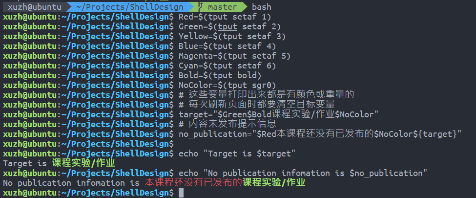

- 通过嵌套循环，我们让用户有很多试错机会

  ```bash
  while :; do
      read -rp "请输入您想要管理的课程号：" cid
  
      # 注意到我们使用正则表达式展开数组来进行元素检查
      # 因此表达式右侧的值应用引号括起以保证完全匹配
      # 我们使用了ShellCheck工具，而此工具会对=~右侧的表达式报错，因此我们使用了
      # shellcheck disable=SC2076
      # 来关闭这一报错
      [[ "${cids[*]}" =~ "${cid}" ]] && break
      echo "您输入的课程号$cid有误，请输入上表中列举出的某个课程号"
  done
  ```

  上衣部分描述的嵌套循环也是一个例子。

- 通过调教`read`命令，我们给了用户在清屏前观察屏幕的机会，配合高亮，可以快速定位操作中的错误

  ```bash
  function ContinueWithKey() {
      # 按任意键继续...
      # 有的时候我们会在清空屏幕之前打印一些信息，我们决定给用户一些时间来看看这些信息是什么
      read -n 1 -rp "${Blue}${Bold}按任意键继续...${NoColor}" -s
  }
  ```

  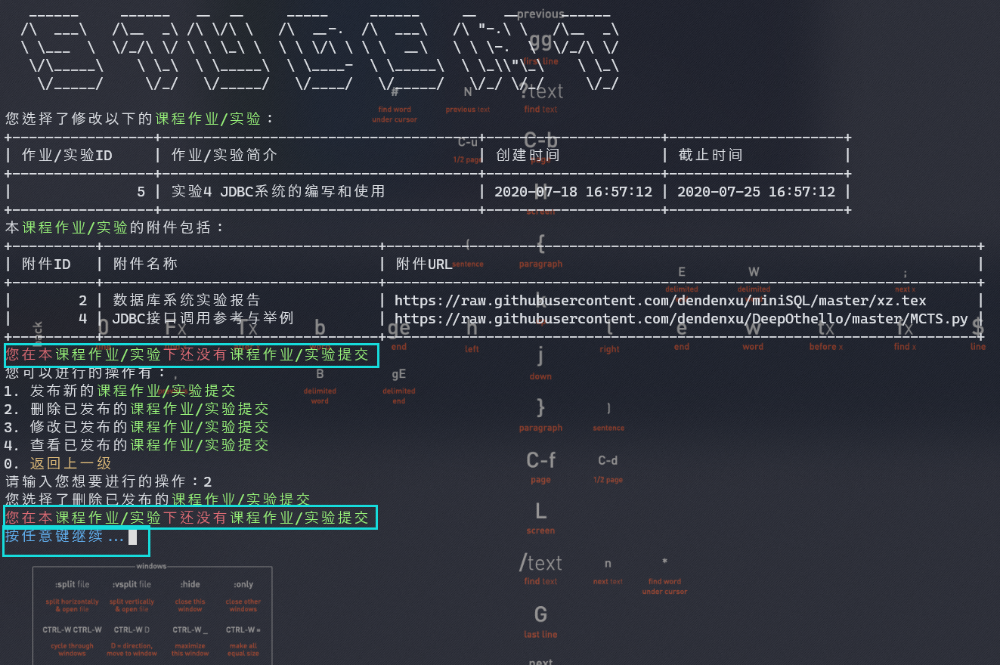

  即使换成不同的终端，显示效果依然不错。

  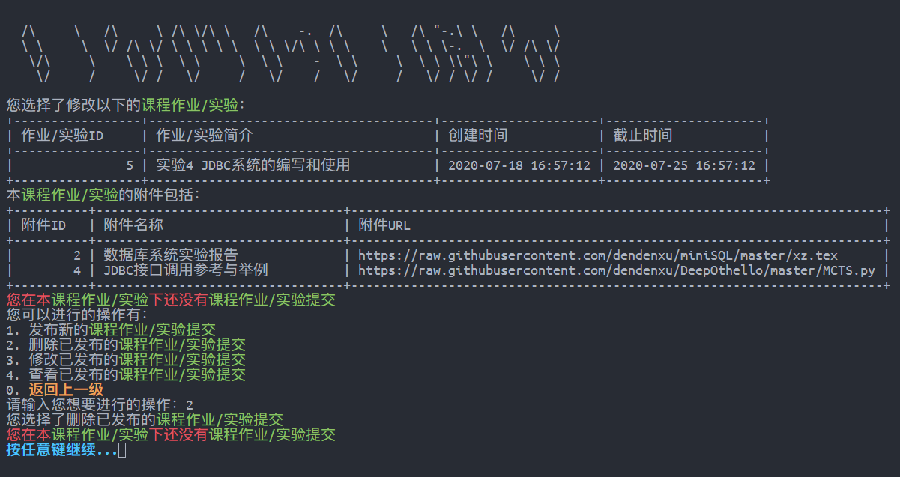

- 通过调教`read`命令，我们使得用户的明文密码不会得到显示

  同时，我们会==对错误的登录请求添加1s的超时惩罚==，以防止暴力破解密码的操作

  ```bash
  while :; do
      # todo: 使用cat命令可以清楚密码变量，提高安全性，但是我们还没发现该如何换行
      # 所以暂时使用了变量来存储密码
      read -rp "请输入您的密码：" -s password
      echo ""
      password_hash=$(echo "$password" | sha256sum - | tr -d " -")
      echo "验证中……"
      [ "$password_hash" = "$right_hash" ] && break
      sleep 1s # 为了防止暴力登录攻击，每次密码错误都要得到1s的时间惩罚
      echo "验证失败，请重新输入"
  done
  ```

- 通过嵌套循环，我们使得用户无需提前输入一些稍显冗余的数量信息

  例如在附件添加的过程中，用户无需实现输入要添加的附件数目

  ```bash
  # 这里我们通过Bash内部计数来减少一次MySQL链接
  attachment_count=0
  while :; do
      # 我们根据用户回答来修改程序运行流程
      # 用户无需提前知道需要添加的附件数量
      # 他/她只需要不断输入Y并添加内容
      read -rp "请输入您是否需要为${target}添加附件（Y/n）：" need_attach
      if [[ $need_attach =~ ^[1Yy] ]]; then # 正则表达式匹配
          attachment_count+=1
  
          echo "您选择了添加附件"
          read -rp "请输入您想要添加的附件名称：" attach_name
          attach_name=$(RemoveDanger "$attach_name") # 可能包含危险字符
          echo "您的附件名称为：$attach_name"
  
          read -rp "请输入您想要添加的附件URL：" attach_url
          # 对于URL，我们使用不同的转义策略
          attach_url=$(RemoveDanger "$attach_url" "[\"'\.\*;]")
          echo "您的附件URL为：$attach_url"
  
          # 添加附件到附件相关表，并修改attach_to表来对应附件和Content的关系
          # 我们暂时只使用了attach_to表格的一部分功能，在日后的开发中我们可以将一个附件分配给多个不同的Content
          # todo: 可以重用已经上传过的附件，建立多对多的附加/带附件内容的对应
          query_insert_attach="insert into attachment(name, url) value (\"$attach_name\", \"$attach_url\")"
          query_insert_attach_to="insert into attach_to(aid, uid) value (last_insert_id(), $subid)"
  
          # 同样的，我们利用了Transaction功能
          attach_id=$($mysql_prefix -se "set autocommit=0;$query_insert_attach;select last_insert_id();$query_insert_attach_to;commit;set autocommit=1;")
  
          echo "您刚刚添加的附件ID为：$attach_id"
      else
      	break
      fi
  done
  ```

- 通过使用ASCII ART，我们让用户很容易的认识到自己的身份

  上面打印的STUDENT和TEACHER BANNER就是一个例子

  我们还在程序的登陆界面打印了CourseworkManager的字样以方便辨识

  ```bash
  # 以下几个Print函数都是用于打印ASCII Art的
  # 同时，它们通过调用clear函数来进行假GUI的页面模拟功能
  # 我们使用ASCII Art的初衷是让用户能在程序的不同Section中更快的找到自己想要的信息
  # 后来我们发现通过调用clear函数可以达到模拟GUI的功能
  function PrintBanner() {
      # 程序的主横幅：CourseworkManger
      # 会在初始登陆界面打印
      clear
      cat <<"EOF"
     _________                                                       __        _____                                                  
     \_   ___ \  ____  __ _________  ______ ______  _  _____________|  | __   /     \ _____    ____ _____     ____   ___________      
     /    \  \/ /  _ \|  |  \_  __ \/  ___// __ \ \/ \/ /  _ \_  __ \  |/ /  /  \ /  \\__  \  /    \\__  \   / ___\_/ __ \_  __ \     
     \     \___(  <_> )  |  /|  | \/\___ \\  ___/\     (  <_> )  | \/    <  /    Y    \/ __ \|   |  \/ __ \_/ /_/  >  ___/|  | \/     
      \______  /\____/|____/ |__|  /____  >\___  >\/\_/ \____/|__|  |__|_ \ \____|__  (____  /___|  (____  /\___  / \___  >__|        
             \/                         \/     \/                        \/         \/     \/     \/     \//_____/      \/            
                                                                                                                                      
  EOF
  }
  ```

- 通过清屏功能，我们避免打印太多冗余信息，并模拟了GUI式的交互性操作

## 功能模块

### 数据库定义

为了方便用户，我们定义了一个SQL脚本文件，用于快速初始化用户的数据库。

用户在初次运行程序之前可以通过如下的脚本设置数据库（假设您知道root密码）：

```bash
mysql -uroot -p < tables.sql
```

- 用户/数据库定义部分

  ```mysql
  # note: we should define the default charset of the database before creating the tables without explicitly
  # defining charset
  
  drop database if exists ShellDesign;
  drop user if exists ShellDesigner;
  create user ShellDesigner identified by 'ShellDesigner';
  create database ShellDesign;
  grant all on ShellDesign.* to ShellDesigner;
  alter database ShellDesign character set utf8mb4 collate utf8mb4_unicode_ci;
  use ShellDesign;
  
  drop table if exists `take`;
  drop table if exists `info`;
  drop table if exists `teach`;
  drop table if exists `attach_to`;
  drop table if exists `attachment`;
  drop table if exists `submission`;
  drop table if exists `homework`;
  drop table if exists `content`;
  drop table if exists `teacher`;
  drop table if exists `student`;
  drop table if exists `admin`;
  drop table if exists `course`;
  ```

- 表建立部分

  ```mysql
  create table `teacher`
  (
      name              varchar(100),
      id                bigint primary key auto_increment,
      brief             varchar(2000),
      gender            enum ('F', 'M') default 'F', # F for female and M for male
      registration_time datetime,
      title             varchar(500)    default 'Professor',
      password_hash     varchar(64)
  );
  
  create table `student`
  (
      name          varchar(100),
      id            bigint primary key auto_increment,
      brief         varchar(2000),
      gender        enum ('F', 'M') default 'F', # F for female and M for male
      enroll_time   datetime,
      password_hash char(64)
  );
  
  create table `admin`
  (
      name          varchar(100),
      id            bigint primary key auto_increment,
      password_hash char(64)
  );
  
  create table `course`
  (
      name_zh  varchar(100),
      name_en  varchar(100),
      brief    varchar(2000),
      syllabus varchar(4000),
      id       bigint primary key auto_increment
  );
  
  create table `teach`
  (
      tid bigint,
      cid bigint,
      foreign key (`tid`) references teacher (`id`) on delete cascade on update cascade,
      foreign key (`cid`) references course (`id`) on delete cascade on update cascade
  );
  
  create table `take`
  (
      cid bigint,
      sid bigint,
      foreign key (`sid`) references student (`id`) on delete cascade on update cascade,
      foreign key (`cid`) references course (`id`) on delete cascade on update cascade
  );
  
  # this is a dummy class so that we can ensure foreign key references from attachments to both submissions and homework
  create table `content`
  (
      id bigint primary key auto_increment
  );
  
  create table `info`
  (
      id           bigint primary key,
      content      varchar(2000),
      cid          bigint,
      release_time datetime,
      foreign key (`cid`) references course (`id`) on delete cascade on update cascade,
      foreign key (`id`) references content (`id`) on delete cascade on update cascade
  );
  
  create table `homework`
  (
      id            bigint primary key auto_increment,
      cid           bigint,
      tid           bigint,
      intro         varchar(2000),
      creation_time datetime,
      end_time      datetime,
      type          enum ('H', 'E') default 'H', # H for homework and e for experiment
      foreign key (`id`) references content (`id`) on delete cascade on update cascade,
      foreign key (`tid`) references teacher (`id`) on delete cascade on update cascade,
      foreign key (`cid`) references course (`id`) on delete cascade on update cascade
  );
  
  create table `submission`
  (
      id                       bigint primary key auto_increment,
      sid                      bigint,
      hid                      bigint,
      submission_text          varchar(2000),
      creation_time            datetime,
      latest_modification_time datetime,
      foreign key (`id`) references content (`id`) on delete cascade on update cascade,
      foreign key (`sid`) references student (`id`) on delete cascade on update cascade,
      foreign key (`hid`) references homework (`id`) on delete cascade on update cascade
  );
  
  create table `attachment`
  (
      id    bigint primary key auto_increment,
      name  varchar(100),
      url   varchar(800),
      brief varchar(2000)
  );
  
  create table `attach_to`
  (
      aid bigint,
      uid bigint,
      foreign key (`aid`) references attachment (`id`) on delete cascade on update cascade,
      foreign key (`uid`) references content (`id`) on delete cascade on update cascade
  );
  ```

- Dummy内容插入部分

  ```mysql
  insert into `course`(id, name_zh, name_en)
  values (1, '数据库系统', 'Database System'),
         (2, 'Linux程序设计', 'Linux Program Design'),
         (3, '高级数据结构与算法分析', 'Advances Data Structure and Algorithm Design'),
         (4, '计算机图形学', 'Computer Graphics'),
         (5, '视觉识别中的深度卷积神经网络', 'Convolutional Neural Network for Visual Recognition'),
         (6, 'iOS开发', 'iOS Software Development');
  
  insert into `teacher`(id, name, password_hash, registration_time)
  values (1, 'zy', '49aabdaa1b0f6c3506f54521ef81fe5b5fe835d268f1f86e1021a342b59d43bc', now()), # password is zy
         (2, 'xz', 'b44f7d6b5283a44ee5f2bd98f84087a04810092122d75e8fbf8ad85f8f2981f1', now()); # password is xz
  
  insert into `admin`(id, name, password_hash)
  values (1, 'root', '53175bcc0524f37b47062fafdda28e3f8eb91d519ca0a184ca71bbebe72f969a'), # password is root
         (2, 'admin', 'fc8252c8dc55839967c58b9ad755a59b61b67c13227ddae4bd3f78a38bf394f7'); # password is admin
  
  insert into `student`(id, name, password_hash, enroll_time)
  values (1, 'st1', '2238ead9c048f351712c34d22b41f6eec218ea9a9e03e48fad829986b0dafc11', now()), # password is same as name
         (2, 'st2', '5e61d026a7889d9fc72e17f1b25f4d6d48bfe17046fea845aa8c5651ec89c333', now()),
         (3, 'st3', 'bbb977f8e93feb5dbd79e0688b822115b5acf774dd8a1fe6964e03d6b9579384', now()),
         (4, 'st4', '6133396ebcd382b137088d2ea91d60637744e404b4376e4635b45784b718db72', now()),
         (5, 'st5', 'd691a62aa63f1be970582902d0ff78df29899f09c5dd540b1447cdd051dcfc8d', now()),
         (6, 'st6', 'a7a287ffc9cb27131b9dc54199ba96cef87e753968bc620d714af212ef0f7a8c', now()),
         (7, 'st7', '73d0daf13c6159a1fbdeb37b6972325b6e29c312371a0f3d427bd35c0c87b928', now()),
         (8, 'st8', '4ce70fc1eef7303879a2ef33996db2f85058ae06e8590521267ae8d46ec59793', now());
  
  insert into `teach`(cid, tid)
  values (1, 1),
         (1, 2),
         (2, 1),
         (3, 1),
         (4, 2),
         (5, 2);
  
  insert into `take`(cid, sid)
  values (1, 1),
         (1, 2),
         (1, 3),
         (1, 4),
         (2, 3),
         (2, 4),
         (2, 5),
         (2, 6),
         (3, 7),
         (3, 8),
         (4, 1),
         (4, 3),
         (4, 5),
         (5, 2),
         (5, 4),
         (5, 6),
         (5, 8),
         (6, 1),
         (6, 7),
         (6, 8);
  
  
  insert into content(id)
  values (1),
         (2),
         (3),
         (4),
         (5),
         (6),
         (7);
  
  insert into homework(id, cid, tid, intro, creation_time, end_time, type)
  values (5, 1, 1, '实验4 JDBC系统的编写和使用', now(), now() + interval 7 day, 'E'),
         (6, 1, 1, '第五周数据库系统作业', now(), now() + interval 10 day, 'H'),
         (7, 1, 2, '课程大作业 MiniSQL的编写与使用', now(), now() + interval 20 day, 'H');
  
  insert into attachment(id, name, url)
  values (1, 'Linux Shell Program Design 3rd Edition.pdf',
          'https://raw.githubusercontent.com/dendenxu/miniSQL/master/miniSQL.tex'),
         (2, '数据库系统实验报告', 'https://raw.githubusercontent.com/dendenxu/miniSQL/master/xz.tex'),
         (3, '蒙特卡洛树搜索实现', 'https://raw.githubusercontent.com/dendenxu/DeepOthello/master/MCTS.py'),
         (4, 'JDBC接口调用参考与举例', 'https://raw.githubusercontent.com/dendenxu/DeepOthello/master/MCTS.py');
  
  insert into info(id, content, cid, release_time)
  values (1, '作业1的提交就要截止啦！请大家及时关注。', 1, NOW()),
         (2, '实验5的验收将在本周六下午4点开始，请需要验收的组长搜索"数据库系统"钉钉群并加入，钉钉群二维码详见附件', 1, NOW()),
         (3, 'ADS考试将在6月24日以线上/机房同时考试的形式进行，YDS老师的复习视频已上传到学在浙大系统，详见附件', 3, NOW()),
         (4, '明天的实验内容为样条插值（Spline）以及贝塞尔曲线的拟合（Bezier Path），请同学们提前预习相关内容，PPT已上传附件并开放下载', 4, NOW());
  
  insert into attach_to(aid, uid)
  values (1, 1),
         (1, 2),
         (1, 3),
         (2, 1),
         (2, 5),
         (2, 6),
         (4, 5),
         (3, 1);
  ```

### 初始化模块

我们设计了两个初始化函数，用以定义一些在程序运行过程中全局使用的变量：

- 颜色变量，用以打印有色UI

  ```bash
  function DefineColor() {
      # 我们使用tput命令来定义颜色信息
      # 各类颜色常数，通过echo调用可以改变Shell的输出样式
      # 例如echo "${Red}Hello${NoColor}, world."会打印红色的Hello和原色的World
      # 上述例子会展开成echo "$(tput setaf 1)Hello$(tput sgr0), world."
      # ! consider more about this colorization
      Red=$(tput setaf 1)
      Green=$(tput setaf 2)
      Yellow=$(tput setaf 3)
      Blue=$(tput setaf 4)
      Magenta=$(tput setaf 5)
      Cyan=$(tput setaf 6)
      Bold=$(tput bold)
      NoColor=$(tput sgr0)
      ReturnPrev="${Yellow}${Bold}返回上一级${NoColor}"
  }
  ```

- 数据库变量，用以操作MySQL

  - 数据库操作变量，用以通过CMD调用MySQL
  - 数据库登陆定义，一些用户，密码等的提前设置

  ```bash
  function DefineMySQL() {
      # 下列是我们默认的一些设置
      mysql_u_default="ShellDesigner"
      mysql_p_default="ShellDesigner"
      mysql_h_default="localhost"
      mysql_d_default="ShellDesign"
      mysql_f=".mysql.cnf"
  
      # 若.mysql.cnf在当前目录不存在，我们会创建一个并将默认内容写入
      if [ ! -f "$mysql_f" ]; then
          echo "Automatically generating configuration file..." >&2
          echo "[client]" >$mysql_f
          echo "user=$mysql_u_default" >>$mysql_f
          echo "password=$mysql_p_default" >>$mysql_f
          echo "host=$mysql_h_default" >>$mysql_f
          echo "database=$mysql_d_default" >>$mysql_f
      fi
  
      # 类似调用alias，我们在下面的Shell语句中执行MySQL调用时都会使用$mysql_prefix来开头
      mysql_prefix="mysql --defaults-extra-file=$mysql_f"
  }
  
  ```

### 登陆模块

正如前面描述的，我们在登陆模块采用了一些防范攻击的方法：

- 去除可能造成SQL注入的危险字符
- 登陆失败的操作会受到1s的惩罚时间
- 每次登陆至少等待100ms防止攻击
- 密码不使用明文显示
- 数据库中用sha256sum储存和验证密码

```bash
# 初始界面登陆逻辑
function LoginInUI() {
    while :; do
        PrintBanner # 打印一个好看的小Banner: CourseworkManger

        # 获取用户的身份/因为我们使用了有可能会重复的ID
        # todo: 可以通过构建一个Dummy Table来储存所有用户的相关信息来提供统一认证接口
        # 当然，这种方式给了用户手动退出系统的接口，否则我们很难定义一个什么特殊值来表示用户希望退出系统
        while :; do
            read -rp "请输入您的身份（T/S/A）或输入0退出系统：" identity
            case $identity in
            [Tt])
                identity="teacher"
                break
                ;;
            [Ss])
                identity="student"
                break
                ;;
            [Aa])
                identity="admin"
                break
                ;;
            0)
                echo "Bye"
                return 0
                ;;
            *) echo "请输入T, S, A或0" ;;
            esac
        done

        # 我们会在密码判断前进行账号检测
        while :; do
            read -rp "请输入您的登陆账号：" user_id
            echo "检查中..."
            sleep 0.1s # 防止暴力登录攻击，100ms的惩罚时间

            # * 防止SQL注入攻击，转义危险字符，详见StudentManageSubmission逻辑
            user_id=$(RemoveDanger "$user_id")

            # * MySQL调用方式详见StudentUI逻辑
            query_all_hash="select id, name, password_hash from $identity"
            query_right_hash="select password_hash from ($query_all_hash) all_hash where id=\"$user_id\""
            right_hash=$($mysql_prefix -se "$query_right_hash;")
            [ -z "$right_hash" ] || break
            echo "用户不存在，请重新输入"
        done

        # 我们不会在数据库中储存明文密码
        # 我们将用户密码进行sha256 hash后储存
        # 并在登陆时将用户输入的内容进行sha256 hash，与数据库内部的hash值进行比较，若相等则认为密码正确
        # * 这种方式可以提高系统的安全性
        # 即使数据库内容被泄露，sha256的加密也会让数据偷盗者很难猜出正确的密码
        # https://www.youtube.com/watch?v=7U-RbOKanYs
        while :; do
            # todo: 使用cat命令可以清楚密码变量，提高安全性，但是我们还没发现该如何换行
            # 所以暂时使用了变量来存储密码
            read -rp "请输入您的密码：" -s password
            echo ""


            password_hash=$(echo "$password" | sha256sum - | tr -d " -")
            echo "验证中……"
            sleep 0.1s # 防止暴力登录攻击，100ms的惩罚时间
            [ "$password_hash" = "$right_hash" ] && break
            sleep 1s # 为了防止暴力登录攻击，每次密码错误都要得到1s的时间惩罚
            echo "验证失败，请重新输入"
        done
        echo "验证成功"
        query_name="select name from $identity where id=$user_id"
        name=$($mysql_prefix -se "$query_name")
        case $identity in
        "teacher")
            TeacherUI "$user_id" "$name"
            # 这里没有选项循环，因此不需要调用break命令
            # * 详见StudentUI中的逻辑描述
            ;;
        "student")
            StudentUI "$user_id" "$name"
            ;;
        "admin")
            AdminUI "$user_id" "$name"
            ;;

        esac
    done
}
```

### 学生操作模块

1. 管理课程

   `输入要管理的课程号`

   1. 管理课程作业

      `输入要管理的作业号`

      1. 发布新的提交

         `输入要发布的作业提交内容，添加附件等`

      2. 删除已发布的提交

         `输入要删除的提交号`

      3. 修改已发布的提交

         `输入要修改的提交号`

         `输入新的作业提交内容，添加附件等`

      4. 查看已发布的提交

         `输入要查看的作业号`

      5. 返回上一级

   2. 返回上一级

2. 查看所有作业完成情况

3. 返回上一级

### 教师操作模块

1. 管理课程

   `输入要管理的课程号`

   1. 管理修读课程的学生

      1. 向课程名单中添加学生

         `输入要添加的学生的学号`

      2. 从课程名单中移除学生

         `输入要移除的学生的学号`

      3. 返回上一级

   2. 管理课程作业/实验

      1. 发布新的课程作业/实验

         `输入新的作业/实验内容，截止日期，添加附件等`

      2. 删除已发布的课程作业/实验

         `输入要删除的作业/实验号码`

      3. 修改已发布的课程作业/实验

         `输入要修改的作业/实验号码`

         `输入新的作业/实验内容，截止日期，添加附件等`

      4. 查看已发布的作业/实验内容

         `输入要查看的作业/实验号码`

         - 单独查看已完成情况
           - `输入要查看完成情况的学生的学号`
             - `输入要查看的提交的提交号码`

      5. 返回上一级

   3. 管理课程简介/公告

      1. 管理课程公告

         1. 发布新的课程公告

            `输入新的公告内容，添加附件等`

         2. 删除已发布的课程公告

            `输入要删除的公告号码`

         3. 修改已发布的课程公告

            `输入要修改的公告号码`

            `输入新的公告内容，添加附件等`

         4. 查看已发布的公告内容

            `输入要查看的公告号码`

         5. 返回上一级

      2. 修改课程简介

         `输入新的课程简介内容`

      3. 返回上一级

   4. 返回上一级

2. 返回上一级

### 管理员操作模块

1. 管理管理员账户

   1. 添加管理员账户

      `输入管理员姓名，输入/确认密码`

   2. 删除管理员账户

      `输入要删除的管理员账号`

   3. 修改管理员账户

      `输入要修改的管理员账号`

      `输入新的管理员姓名，输入/确认新的密码`

   4. 返回上一级

2. 管理教师账户

   1. 添加教师账户

      `输入教师姓名，性别，简介，职称等，输入/确认密码`

   2. 删除教师账户

      `输入要删除的教师账号`

   3. 修改教师账户

      `输入要修改的教师账号`

      `输入新的教师姓名，性别，简介，职称等，输入/确认新的密码`

   4. 返回上一级

3. 管理学生账户

   1. 添加学生账户

      `输入学生姓名，性别，简介等，输入/确认密码`

   2. 删除学生账户

      `输入要删除的学生账号`

   3. 修改学生账户

      `输入要修改的学生账号`

      `输入新的学生姓名，性别，简介等，输入/确认新的密码`

   4. 返回上一级

4. 管理课程列表

   1. 添加课程

      `输入课程的中文、英文名称，添加课程简介等`

   2. 删除课程

      `输入要删除的课程号`

   3. 修改课程

      `输入要修改的课程号`

      `输入课程的中文、英文名称，添加课程简介等`

   4. 管理课程讲师

      1. 向课程名单中添加课程讲师

         `输入要添加的讲师的工号`

      2. 从课程名单中移除课程讲师

         `输入要删除的讲师的工号`

      3. 返回上一级

   5. 返回上一级

5. 返回上一级

### Gadgets小部件

- 清除危险字符模块

  可以读取字符串，并检测其全部的字符内容，与给出的`$danger_set`变量所示的正则表达式做匹配

  对于匹配成功的字符，通过调用`safe="$safe""\\""$thechar"`将其内容添加到末尾

  使用时，通过第一个参数`$1`传入目标字符串，通过第二个参数传入自定义的`$2`正则表达式
  
  ```bash
  function RemoveDanger() {
      danger_set=${2:-"[\"'\.\*;%]"}
      danger=$1
      safe=""
      for i in $(seq ${#danger}); do
          thechar="${danger:$i-1:1}"
          if [[ "$thechar" =~ $danger_set ]]; then
              # echo "$thechar"
              safe="$safe""\\""$thechar"
          else
              safe="$safe$thechar"
          fi
      done
      echo "$safe"
}
  ```
  
- 打印附件信息模块

  通过预先设定的一些参数（包括`SQL`语句和是否存在附件的`Bool`值等）

  ```bash
  function PrintAttachment() {
      # 用于打印附件信息的小函数，可以提高代码可读性
      # 这个函数认为：
      # 1. $attachment_count可以用于判断是否有附件需要打印（不一定要是精确的附件数目
      # 2. $target是目标内容的字符串描述，例如"课程作业/实验"
      # 3. $mysql_prefix可以正确执行MySQL命令，$query_attachment可以正确打印相关附件
      if [ "$attachment_count" -gt 0 ]; then
          echo "本${target}的附件包括："
          $mysql_prefix -e "$query_attachment;"
      else
          # 我们是用红色显示来让用户快速定位这一提示
          echo "${Red}本${target}${Red}还没有附件${NoColor}"
      fi
  }
  ```

- 打印各类`ASCII ART`

  1. `Teacher`

     ```bash
     function PrintTeacher() {
         # TEACHER分隔符，会在老师登陆后的管理界面打印
         clear
         cat <<"EOF"
        ______   ______     ______     ______     __  __     ______     ______    
       /\__  _\ /\  ___\   /\  __ \   /\  ___\   /\ \_\ \   /\  ___\   /\  == \   
       \/_/\ \/ \ \  __\   \ \  __ \  \ \ \____  \ \  __ \  \ \  __\   \ \  __<   
          \ \_\  \ \_____\  \ \_\ \_\  \ \_____\  \ \_\ \_\  \ \_____\  \ \_\ \_\ 
           \/_/   \/_____/   \/_/\/_/   \/_____/   \/_/\/_/   \/_____/   \/_/ /_/ 
                                                                                  
     EOF
     }
     ```

  2. `Student`

     ```bash
     function PrintStudent() {
         # STUDENT分隔符，会在学生登陆后的管理界面打印
         clear
         cat <<"EOF"
        ______     ______   __  __     _____     ______     __   __     ______  
       /\  ___\   /\__  _\ /\ \/\ \   /\  __-.  /\  ___\   /\ "-.\ \   /\__  _\ 
       \ \___  \  \/_/\ \/ \ \ \_\ \  \ \ \/\ \ \ \  __\   \ \ \-.  \  \/_/\ \/ 
        \/\_____\    \ \_\  \ \_____\  \ \____-  \ \_____\  \ \_\\"\_\    \ \_\ 
         \/_____/     \/_/   \/_____/   \/____/   \/_____/   \/_/ \/_/     \/_/ 
                                                                                
     EOF
     }
     ```

  3. `Admin`

     ```bash
     function PrintAdmin() {
         # ADMIN分隔符，会在管理员登陆后的管理界面打印
         clear
         cat <<"EOF"
        ______     _____     __    __     __     __   __    
       /\  __ \   /\  __-.  /\ "-./  \   /\ \   /\ "-.\ \   
       \ \  __ \  \ \ \/\ \ \ \ \-./\ \  \ \ \  \ \ \-.  \  
        \ \_\ \_\  \ \____-  \ \_\ \ \_\  \ \_\  \ \_\\"\_\ 
         \/_/\/_/   \/____/   \/_/  \/_/   \/_/   \/_/ \/_/ 
                                                            
     EOF
     }
     ```

- **继续运行**按键模块

  ```bash
  function ContinueWithKey() {
      # 按任意键继续...
      # 有的时候我们会在清空屏幕之前打印一些信息，我们决定给用户一些时间来看看这些信息是什么
      read -n 1 -rp "${Blue}${Bold}按任意键继续...${NoColor}" -s
  }
  ```

### 主程序

我们通过函数来设计程序：原因是Bash会在读入整个函数的所有内容后运行，这意味着修改脚本的同时运行脚本是可以进行的（原函数已经在内存中了）

> [一个关于这个问题的讨论](https://www.shellscript.sh/tips/change-running-script/)

主程序从这里开始，上面定义的都是可供调用的函数

请查看对程序的注释来理解本软件的工作原理

```bash
DefineColor
DefineMySQL
LoginInUI
```

## 程序运行结果截图

==由于可供实验的内容的可能性组合着实太多，我们在此仅仅展示一部分的实验结果==

登陆界面：防止恶意登陆的罚时0.1s/1s操作

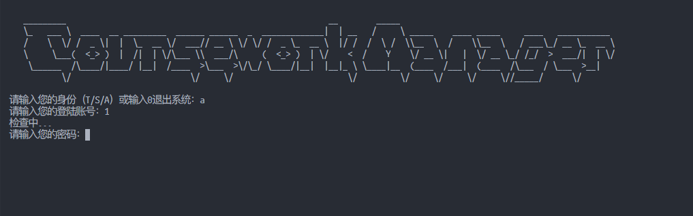

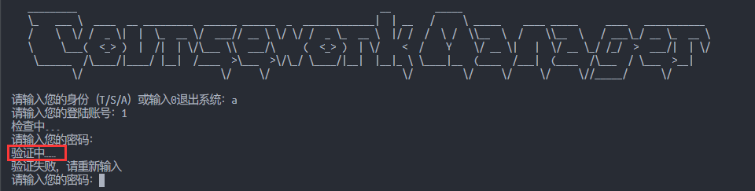

登录成功界面的Banner以及有颜色的返回上一级信息

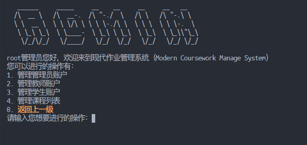

管理界面需管理信息的高亮显示以及任意键继续功能

添加新的管理员账户测试（以及登录测试）

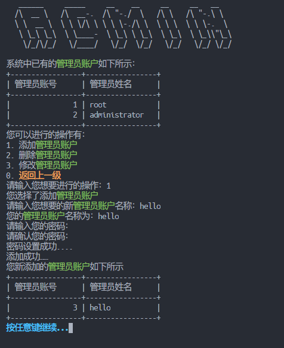

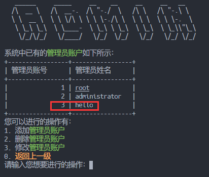

测试后可以用新添加的账号重新登陆

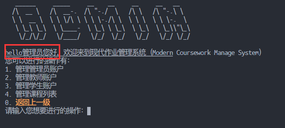

课程教师管理功能测试

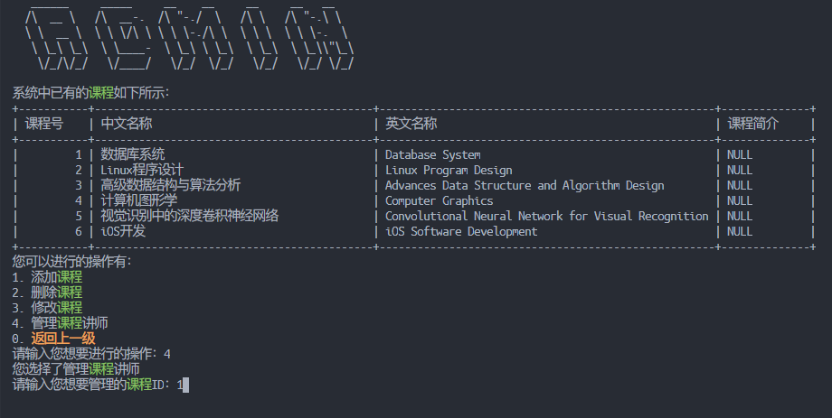

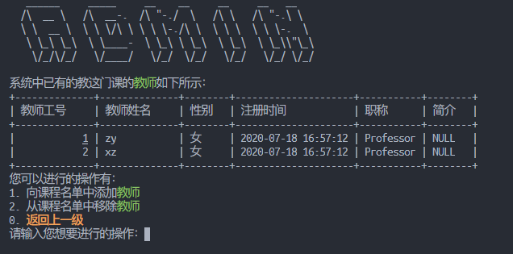

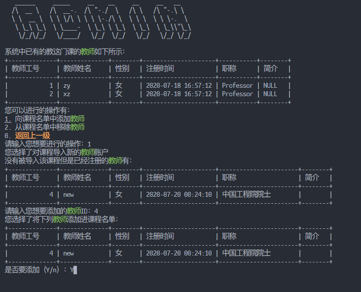

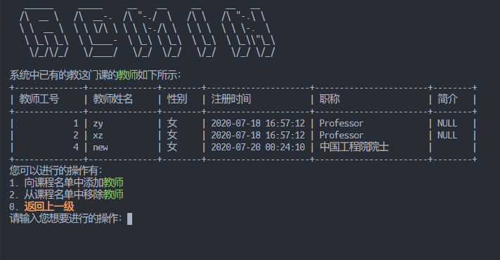

教师管理界面中可以看到刚刚添加的新老师

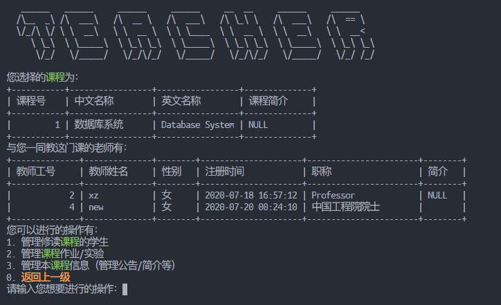

作业完成情况统计与检查

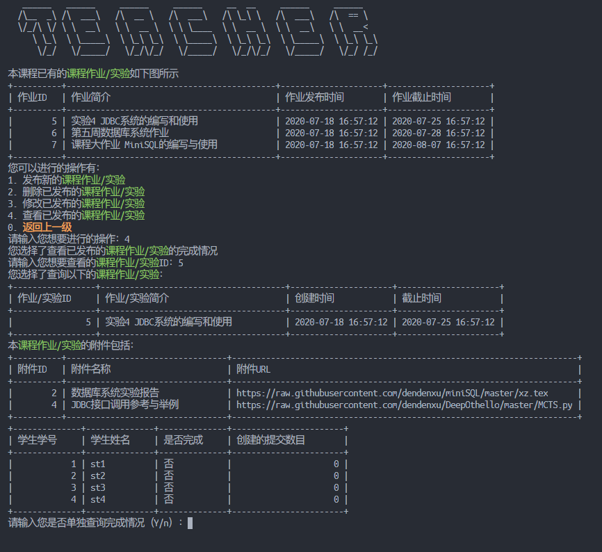

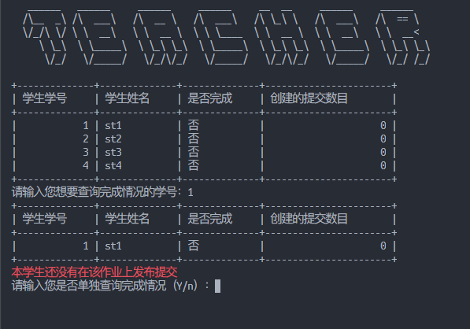

SQL注入攻击防护能力测试

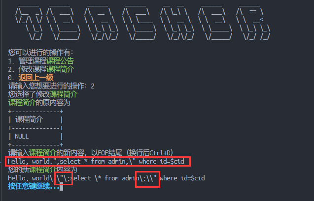

学生管理界面

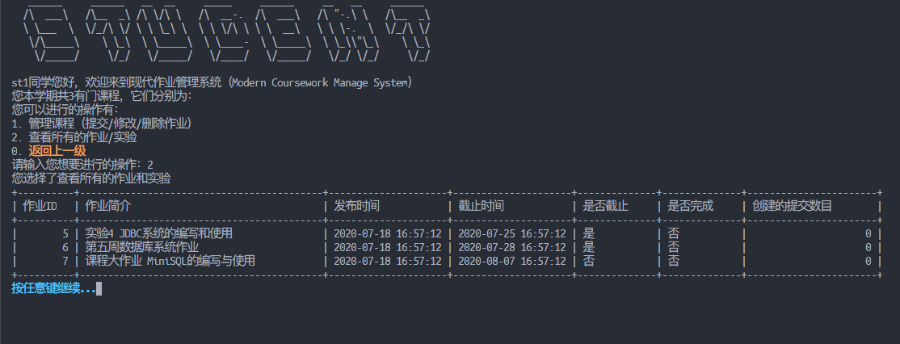

发布作业提交功能测试

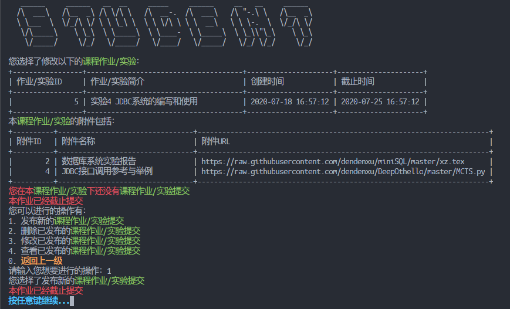

退出后界面


## 附录

### 完整源码

#### Bash

```bash
#!/bin/bash
# CourseworkInfoSys
# Author: Xu Zhen 徐震 3180105504
# shellcheck disable=SC2076
# 这是一个现代教务管理系统，主要面向作业管理
# 我们通过编写Shell程序，调用MySQL数据库来管理作业系统
# ! 您的MySQL版本要至少为5.7
# ! 您的运行环境最好要有至少150列的字符宽度，因为我们使用了ASCII ART，且很多查询语句的宽度会较大
# 5.6.* 版本的MySQL会在执行tables.sql中的语句时出现问题
# * 由于许多管理逻辑都是重复的，但将代码集合为一个函数又会显得过于刻意/不灵活，我们会将注释主要写在第一次遇到相关逻辑的部分
# * 阅读源码的最好方式是从头开始，因为我们将主要函数都放在了开头(StudentUI, StudentManageSubmission)

function DefineColor() {
    # 我们使用tput命令来定义颜色信息
    # 各类颜色常数，通过echo调用可以改变Shell的输出样式
    # 例如echo "${Red}Hello${NoColor}, world."会打印红色的Hello和原色的World
    # 上述例子会展开成echo "$(tput setaf 1)Hello$(tput sgr0), world."
    # ! consider more about this colorization
    Red=$(tput setaf 1)
    Green=$(tput setaf 2)
    Yellow=$(tput setaf 3)
    Blue=$(tput setaf 4)
    Magenta=$(tput setaf 5)
    Cyan=$(tput setaf 6)
    Bold=$(tput bold)
    NoColor=$(tput sgr0)
    ReturnPrev="${Yellow}${Bold}返回上一级${NoColor}"
}

function DefineMySQL() {
    # 我们通过mysql命令来直接执行数据库操作，这也是本实验的核心内容
    # 我们通过设置文件的方式使得MySQL不会抱怨直接在命令行输入密码不安全：
    # mysql: [Warning] Using a password on the command line interface can be insecure.
    # * 注意：您可以修改程序运行目录下的.mysql.cnf文件来设置自己的数据库登陆信息

    # ! 第一次使用本软件时请运行当前目录下的table.sql来初始化数据库中的表
    # 必须运行的部分是所有的create table
    # 后面的insert内容是可选的，但是至少要有一个管理员账户，否则本软件没有什么意义
    # 样例初始化语句（假设您知道root密码）：mysql -uroot -p < tables.sql

    # ! 请保证MySQL已经在本机正确安装，且.mysql.cnf已经被正确配置
    # 您需要在.mysql.cnf中设置您的登录名/密码/服务器，并设置数据库名称(和您在MySQL中使用的相同)
    # 例如您在MySQL中创建了ShellDesigner这个用户，密码为ShellDesigner，并打算使用ShellDesign这个数据库来管理本软件涉及到的内容

    # 登陆root用户后，可使用如下操作修改密码
    # ALTER USER 'user'@'hostname' IDENTIFIED BY 'newPass';
    # 可以通过如下操作创建新用户
    # create user ShellDesigner identified by 'ShellDesigner';
    # create database ShellDesign;
    # grant all on ShellDesign.* to ShellDesigner;

    # .mysql.cnf就将有类似如下的内容
    # [client]
    # user=ShellDesigner
    # password=ShellDesigner
    # host=localhost
    # database=ShellDesign

    # 下列是我们默认的一些设置
    mysql_u_default="ShellDesigner"
    mysql_p_default="ShellDesigner"
    mysql_h_default="localhost"
    mysql_d_default="ShellDesign"
    mysql_f=".mysql.cnf"

    # 若.mysql.cnf在当前目录不存在，我们会创建一个并将默认内容写入
    if [ ! -f "$mysql_f" ]; then
        echo "Automatically generating configuration file..." >&2
        echo "[client]" >$mysql_f
        echo "user=$mysql_u_default" >>$mysql_f
        echo "password=$mysql_p_default" >>$mysql_f
        echo "host=$mysql_h_default" >>$mysql_f
        echo "database=$mysql_d_default" >>$mysql_f
    fi

    # 类似调用alias，我们在下面的Shell语句中执行MySQL调用时都会使用$mysql_prefix来开头
    mysql_prefix="mysql --defaults-extra-file=$mysql_f"
}

# 初始界面登陆逻辑
function LoginInUI() {
    while :; do
        PrintBanner # 打印一个好看的小Banner: CourseworkManger

        # 获取用户的身份/因为我们使用了有可能会重复的ID
        # todo: 可以通过构建一个Dummy Table来储存所有用户的相关信息来提供统一认证接口
        # 当然，这种方式给了用户手动退出系统的接口，否则我们很难定义一个什么特殊值来表示用户希望退出系统
        while :; do
            read -rp "请输入您的身份（T/S/A）或输入0退出系统：" identity
            case $identity in
            [Tt])
                identity="teacher"
                break
                ;;
            [Ss])
                identity="student"
                break
                ;;
            [Aa])
                identity="admin"
                break
                ;;
            0)
                echo "Bye"
                return 0
                ;;
            *) echo "请输入T, S, A或0" ;;
            esac
        done

        # 我们会在密码判断前进行账号检测
        while :; do
            read -rp "请输入您的登陆账号：" user_id
            echo "检查中..."
            sleep 0.1s # 防止暴力登录攻击，100ms的惩罚时间

            # * 防止SQL注入攻击，转义危险字符，详见StudentManageSubmission逻辑
            user_id=$(RemoveDanger "$user_id")

            # * MySQL调用方式详见StudentUI逻辑
            query_all_hash="select id, name, password_hash from $identity"
            query_right_hash="select password_hash from ($query_all_hash) all_hash where id=\"$user_id\""
            right_hash=$($mysql_prefix -se "$query_right_hash;")
            [ -z "$right_hash" ] || break
            echo "用户不存在，请重新输入"
        done

        # 我们不会在数据库中储存明文密码
        # 我们将用户密码进行sha256 hash后储存
        # 并在登陆时将用户输入的内容进行sha256 hash，与数据库内部的hash值进行比较，若相等则认为密码正确
        # * 这种方式可以提高系统的安全性
        # 即使数据库内容被泄露，sha256的加密也会让数据偷盗者很难猜出正确的密码
        # https://www.youtube.com/watch?v=7U-RbOKanYs
        while :; do
            # todo: 使用cat命令可以清楚密码变量，提高安全性，但是我们还没发现该如何换行
            # 所以暂时使用了变量来存储密码
            read -rp "请输入您的密码：" -s password
            echo ""


            password_hash=$(echo "$password" | sha256sum - | tr -d " -")
            echo "验证中……"
            sleep 0.1s # 防止暴力登录攻击，100ms的惩罚时间
            [ "$password_hash" = "$right_hash" ] && break
            sleep 1s # 为了防止暴力登录攻击，每次密码错误都要得到1s的时间惩罚
            echo "验证失败，请重新输入"
        done
        echo "验证成功"
        query_name="select name from $identity where id=$user_id"
        name=$($mysql_prefix -se "$query_name")
        case $identity in
        "teacher")
            TeacherUI "$user_id" "$name"
            # 这里没有选项循环，因此不需要调用break命令
            # * 详见StudentUI中的逻辑描述
            ;;
        "student")
            StudentUI "$user_id" "$name"
            ;;
        "admin")
            AdminUI "$user_id" "$name"
            ;;

        esac
    done
}

function RemoveDanger() {
    danger_set=${2:-"[\"'\.\*;%]"}
    danger=$1
    safe=""
    for i in $(seq ${#danger}); do
        thechar="${danger:$i-1:1}"
        if [[ "$thechar" =~ $danger_set ]]; then
            # echo "$thechar"
            safe="$safe""\\""$thechar"
        else
            safe="$safe$thechar"
        fi
    done
    echo "$safe"
}

# 以下几个Print函数都是用于打印ASCII Art的
# 同时，它们通过调用clear函数来进行假GUI的页面模拟功能
# 我们使用ASCII Art的初衷是让用户能在程序的不同Section中更快的找到自己想要的信息
# 后来我们发现通过调用clear函数可以达到模拟GUI的功能
function PrintBanner() {
    # 程序的主横幅：CourseworkManger
    # 会在初始登陆界面打印
    clear
    cat <<"EOF"
   _________                                                       __        _____                                                  
   \_   ___ \  ____  __ _________  ______ ______  _  _____________|  | __   /     \ _____    ____ _____     ____   ___________      
   /    \  \/ /  _ \|  |  \_  __ \/  ___// __ \ \/ \/ /  _ \_  __ \  |/ /  /  \ /  \\__  \  /    \\__  \   / ___\_/ __ \_  __ \     
   \     \___(  <_> )  |  /|  | \/\___ \\  ___/\     (  <_> )  | \/    <  /    Y    \/ __ \|   |  \/ __ \_/ /_/  >  ___/|  | \/     
    \______  /\____/|____/ |__|  /____  >\___  >\/\_/ \____/|__|  |__|_ \ \____|__  (____  /___|  (____  /\___  / \___  >__|        
           \/                         \/     \/                        \/         \/     \/     \/     \//_____/      \/            
                                                                                                                                    
EOF
}

function PrintDelimiter() {
    # SECTION分隔符，会在无法确定用户身份但需要分隔的位置打印
    clear
    cat <<"EOF"
   ______     ______     ______     ______   __     ______     __   __     
  /\  ___\   /\  ___\   /\  ___\   /\__  _\ /\ \   /\  __ \   /\ "-.\ \    
  \ \___  \  \ \  __\   \ \ \____  \/_/\ \/ \ \ \  \ \ \/\ \  \ \ \-.  \   
   \/\_____\  \ \_____\  \ \_____\    \ \_\  \ \_\  \ \_____\  \ \_\\"\_\  
    \/_____/   \/_____/   \/_____/     \/_/   \/_/   \/_____/   \/_/ \/_/  
                                                                           
EOF
}

function PrintTeacher() {
    # TEACHER分隔符，会在老师登陆后的管理界面打印
    clear
    cat <<"EOF"
   ______   ______     ______     ______     __  __     ______     ______    
  /\__  _\ /\  ___\   /\  __ \   /\  ___\   /\ \_\ \   /\  ___\   /\  == \   
  \/_/\ \/ \ \  __\   \ \  __ \  \ \ \____  \ \  __ \  \ \  __\   \ \  __<   
     \ \_\  \ \_____\  \ \_\ \_\  \ \_____\  \ \_\ \_\  \ \_____\  \ \_\ \_\ 
      \/_/   \/_____/   \/_/\/_/   \/_____/   \/_/\/_/   \/_____/   \/_/ /_/ 
                                                                             
EOF
}

function PrintStudent() {
    # STUDENT分隔符，会在学生登陆后的管理界面打印
    clear
    cat <<"EOF"
   ______     ______   __  __     _____     ______     __   __     ______  
  /\  ___\   /\__  _\ /\ \/\ \   /\  __-.  /\  ___\   /\ "-.\ \   /\__  _\ 
  \ \___  \  \/_/\ \/ \ \ \_\ \  \ \ \/\ \ \ \  __\   \ \ \-.  \  \/_/\ \/ 
   \/\_____\    \ \_\  \ \_____\  \ \____-  \ \_____\  \ \_\\"\_\    \ \_\ 
    \/_____/     \/_/   \/_____/   \/____/   \/_____/   \/_/ \/_/     \/_/ 
                                                                           
EOF
}

function PrintAdmin() {
    # ADMIN分隔符，会在管理员登陆后的管理界面打印
    clear
    cat <<"EOF"
   ______     _____     __    __     __     __   __    
  /\  __ \   /\  __-.  /\ "-./  \   /\ \   /\ "-.\ \   
  \ \  __ \  \ \ \/\ \ \ \ \-./\ \  \ \ \  \ \ \-.  \  
   \ \_\ \_\  \ \____-  \ \_\ \ \_\  \ \_\  \ \_\\"\_\ 
    \/_/\/_/   \/____/   \/_/  \/_/   \/_/   \/_/ \/_/ 
                                                       
EOF
}

function ContinueWithKey() {
    # 按任意键继续...
    # 有的时候我们会在清空屏幕之前打印一些信息，我们决定给用户一些时间来看看这些信息是什么
    read -n 1 -rp "${Blue}${Bold}按任意键继续...${NoColor}" -s
}

function StudentUI() {
    # 学生UI主界面，为了方便测试我们为sid, name变量加入了默认值
    sid=${1:-"1"}
    name=${2:-"st1"}
    while :; do      # 学生主界面UI循环
        PrintStudent # 打印Banner

        # 无内容提示信息
        no_publication="${Red}您本学期没有课程${NoColor}"

        # 为了方便复用和嵌套，我们将所有的SQL查询语句存储在字符串变量中（容易遭到SQL Injection攻击，后面会提到如何防御）
        # 注意在每一次事件循环后我们都会尽量更新一次查询语句的变量内容（除非此语句是固定的）。
        query_id="select cid from take where sid=$sid"
        query_course="select id 课程号, name_zh 中文名称, name_en 英文名称 from course where id in ($query_id)"

        # 第一层括号将返回结果当作数组处理，第二层$()是执行了一个Bash语句，在此是执行了一个MySQL查询
        # ! 在本程序中，我们将结果存入变量时基本都会采用这种调用MySQL的方式，我们会使用-se选项，其中-e代表执行，-s --slient，安静模式，在此的效果是去除列名
        # ! 在直接执行MySQL并原封不动的打印信息时，我们会使用-e选项，代表执行

        # * 值得注意的是，在命令行直接调用MySQL时，会打印列分隔符，而将结果存入变量则不会打印（列分隔符自动会得到删除）

        # 重定向标准输出的到文件并打印文件
        #  xuzh@ubuntu  ~/Projects/ShellDesign   master ●  mysql -uShellDesigner -pShellDesigner ShellDesign -e "select * from admin;" > temp.txt; cat temp.txt
        # mysql: [Warning] Using a password on the command line interface can be insecure.
        # name    id      password_hash
        # root    1       53175bcc0524f37b47062fafdda28e3f8eb91d519ca0a184ca71bbebe72f969a
        # admin   2       fc8252c8dc55839967c58b9ad755a59b61b67c13227ddae4bd3f78a38bf394f7

        # 直接执行语句，打印到标准输出
        #  xuzh@ubuntu  ~/Projects/ShellDesign   master ●  mysql -uShellDesigner -pShellDesigner ShellDesign -e "select * from admin;"
        # mysql: [Warning] Using a password on the command line interface can be insecure.
        # +-------+----+------------------------------------------------------------------+
        # | name  | id | password_hash                                                    |
        # +-------+----+------------------------------------------------------------------+
        # | root  |  1 | 53175bcc0524f37b47062fafdda28e3f8eb91d519ca0a184ca71bbebe72f969a |
        # | admin |  2 | fc8252c8dc55839967c58b9ad755a59b61b67c13227ddae4bd3f78a38bf394f7 |
        # +-------+----+------------------------------------------------------------------+

        # 将标准输出重定向到Terminal标准输出
        #  xuzh@ubuntu  ~/Projects/ShellDesign   master ●  mysql -uShellDesigner -pShellDesigner ShellDesign -e "select * from admin;" > /dev/tty
        # mysql: [Warning] Using a password on the command line interface can be insecure.
        # +-------+----+------------------------------------------------------------------+
        # | name  | id | password_hash                                                    |
        # +-------+----+------------------------------------------------------------------+
        # | root  |  1 | 53175bcc0524f37b47062fafdda28e3f8eb91d519ca0a184ca71bbebe72f969a |
        # | admin |  2 | fc8252c8dc55839967c58b9ad755a59b61b67c13227ddae4bd3f78a38bf394f7 |
        # +-------+----+------------------------------------------------------------------+

        # 重定向到变量并打印标准输出
        #  xuzh@ubuntu  ~/Projects/ShellDesign   master ●  temp=$(mysql -uShellDesigner -pShellDesigner ShellDesign -e "select * from admin;");echo "$temp"
        # mysql: [Warning] Using a password on the command line interface can be insecure.
        # name    id      password_hash
        # root    1       53175bcc0524f37b47062fafdda28e3f8eb91d519ca0a184ca71bbebe72f969a
        # admin   2       fc8252c8dc55839967c58b9ad755a59b61b67c13227ddae4bd3f78a38bf394f7

        # * 因此当我们想要让此变量获取打印的信息时，我们应直接将返回信息赋值到变量中
        # * 当我们想直接使用MySQL的格式化功能时，我们应直接使用命令将输出导入到/dev/tty
        cids=($($mysql_prefix -se "$query_id;"))

        echo "$name同学您好，欢迎来到现代作业管理系统（Modern Coursework Manage System）"
        if [ ${#cids[@]} -eq 0 ]; then
            echo "$no_publication"
        else
            echo "您本学期共${#cids[@]}有门课程，它们分别为："
        fi
        echo "您可以进行的操作有："
        echo "1. 管理课程（提交/修改/删除作业）"
        echo "2. 查看所有的作业/实验"
        echo "0. ${ReturnPrev}"
        while :; do # 操作循环UI，直到获得正确的输入
            read -rp "请输入您想要进行的操作：" op
            case $op in
            1)
                echo "您选择了管理课程"
                if [ ${#cids[@]} -eq 0 ]; then
                    echo "$no_publication"
                    ContinueWithKey
                    break
                fi
                # 直接调用MySQL并输出到/dev/tty可以使MySQL用分割线打印各种信息
                $mysql_prefix -e "$query_course;"
                while :; do
                    read -rp "请输入您想要管理的课程号：" cid

                    # 注意到我们使用正则表达式展开数组来进行元素检查
                    # 因此表达式右侧的值应用引号括起以保证完全匹配
                    # 我们使用了ShellCheck工具，而此工具会对=~右侧的表达式报错，因此我们使用了
                    # shellcheck disable=SC2076
                    # 来关闭这一报错
                    [[ "${cids[*]}" =~ "${cid}" ]] && break
                    echo "您输入的课程号$cid有误，请输入上表中列举出的某个课程号"
                done

                # 每次调用新的函数代表我们将要进入一个新的页面，我们不想让用户在下一页面刷新时每次都重复选择某一门课程的过程
                # 因此我们将选择好的课程号存储到cid变量中，隐式传递到函数StudentOPCourse中
                StudentOPCourse
                break
                ;;
            2)
                # 查看所有作业及其完成情况
                # 这波，这波是个SQL题，这种长长的还不能格式化的SQL Query也是让人头大
                # 我们调用了许多MySQL内置功能，例如UNIX_TIMESTAMP还有IF语句等，还嵌套了Linux的命令以及变量
                # 值得注意的是，对于双引号需要加上转移符号，防止Bash解释它们
                echo "您选择了查看所有的作业和实验"
                query_all_hw="select sub.hid 作业ID, sub.intro 作业简介, sub.creation_time 发布时间, sub.end_time 截止时间,if(unix_timestamp(sub.end_time)<$(date +%s),\"是\",\"否\") 是否截止, if(count(sub.id)>0,\"是\",\"否\") 是否完成, count(sub.id) 创建的提交数目 from (select S.sid, S.id, H.id hid, H.intro, H.creation_time, H.end_time from (select * from submission where sid=$sid) S right join homework H on S.hid=H.id where H.cid in (select cid from take where sid=$sid)) sub group by sub.hid"

                $mysql_prefix -e "$query_all_hw;"

                # 我们打印了一些信息，让用户确认一下
                ContinueWithKey
                break
                ;;
            0)
                echo "您选择了${ReturnPrev}"
                return 0
                ;;
            *)
                echo "您输入的操作$op有误，请输入上面列出的操作"
                # 此时不进行Break而是继续请求用户的操作选择
                ;;
            esac
        done
    done
}

function StudentOPCourse() {
    while :; do
        # 打印STUDENT Banner
        PrintStudent

        # target代指我们想要管理的内容的字符串，可以是课程或课程实验/作业。用于格式化打印
        # 每次刷新页面时都要清空
        target="${Green}课程实验/作业${NoColor}"
        # 内容未发布提示信息
        no_publication="${Red}本课程还没有已发布的${NoColor}${target}"

        # 课程教师查询语句
        query_tid="select tid from teach where cid=$cid"
        query_teacher="select id 教师工号, name 教师姓名, if(gender='F', \"女\", \"男\") 性别, registration_time 注册时间, title 职称, brief 简介 from teacher where id in ($query_tid)"

        # 课程信息查询语句
        query_course="select id 课程号, name_zh 中文名称, name_en 英文名称, brief 课程简介 from course where id=$cid"

        echo "您选择的课程为："
        $mysql_prefix -e "$query_course;"

        echo "教这门课的老师有："
        $mysql_prefix -e "$query_teacher;"

        # 相关作业/实验查询
        query_hid="select id from homework where cid=$cid"
        query_hw="select id 作业ID, intro 作业简介, creation_time 作业发布时间, end_time 作业截止时间 from homework where cid=$cid"

        # 以数组形式存入变量
        hids=($($mysql_prefix -e "$query_hid;"))

        # 根据数量显示不同的提示
        if [ ${#hids[@]} -gt 0 ]; then
            echo "本课程已有的${target}如下图所示"
            $mysql_prefix -e "$query_hw;"
        else
            echo "$no_publication"
        fi

        echo "您可以进行的操作有："
        echo "1. 管理${target}"
        echo "0. ${ReturnPrev}"
        while :; do
            read -rp "请输入您想要进行的操作：" op
            case $op in
            1)
                echo "您选择了管理本课程的${target}"
                # 根据数量显示不同的提示
                if [ ${#hids[@]} -eq 0 ]; then
                    echo "$no_publication"
                    ContinueWithKey
                    break
                fi
                while :; do
                    read -rp "请输入您想要管理的${target}ID：" hid
                    [[ "${hids[*]}" =~ "${hid}" ]] && break
                    echo "您输入的${target}ID$hid有误，请输入上表中列举出的某个${target}ID"
                done
                # 每次调用新的函数代表我们将要进入一个新的页面，我们不想让用户在下一页面刷新时每次都重复选择某一项课程作业/实验
                # 因此我们将选择好的课程号存储到hid变量中，隐式传递到函数中
                StudentManageSubmission

                break
                ;;
            0)
                echo "您选择了${ReturnPrev}"
                return 0
                ;;
            *)
                echo "您输入的操作$op有误，请输入上面列出的操作"
                ;;
            esac
        done
    done
}

function PrintAttachment() {
    # 用于打印附件信息的小函数，可以提高代码可读性
    # 这个函数认为：
    # 1. $attachment_count可以用于判断是否有附件需要打印（不一定要是精确的附件数目
    # 2. $target是目标内容的字符串描述，例如"课程作业/实验"
    # 3. $mysql_prefix可以正确执行MySQL命令，$query_attachment可以正确打印相关附件
    if [ "$attachment_count" -gt 0 ]; then
        echo "本${target}的附件包括："
        $mysql_prefix -e "$query_attachment;"
    else
        # 我们是用红色显示来让用户快速定位这一提示
        echo "${Red}本${target}${Red}还没有附件${NoColor}"
    fi
}

function StudentManageSubmission() {
    while :; do # 管理作业提交的UI界面主循环，每次重新运行这一循环都会清空界面，退出循环后会回到上一级
        PrintStudent

        # "提交"的上一级为："课程作业/实验"
        upper="${Green}课程作业/实验${NoColor}"
        target="$upper${Green}提交${NoColor}"

        # 用红色显示的没有提交的信息，方便用户定位
        no_publication="${Red}您在本${NoColor}$upper${Red}下还没有${NoColor}${target}"

        echo "您选择了修改以下的$upper："
        query_course_homework="select id \`作业/实验ID\`, intro \`作业/实验简介\`, creation_time 创建时间, end_time 截止时间 from homework where id=$hid"
        query_attachment="select A.id 附件ID, A.name 附件名称, A.url 附件URL from attachment A join attach_to T on A.id=T.aid where T.uid=$hid"
        query_count_attachment="select count(1) from attachment join attach_to on id=aid where uid=$hid"
        $mysql_prefix -e "$query_course_homework;"

        # 我们通过MySQL Query直接确定相关附件数量的值
        attachment_count=$($mysql_prefix -se "$query_count_attachment")

        # 暂时替换$target和$upper
        temp=${target}
        target=$upper
        PrintAttachment # 这里我们打印的是upper的附件，但PrintAttachment会通过$target打印名称
        target=$temp

        # subid: submission_id：提交ID
        query_subids="select id from submission where sid=$sid and hid=$hid"
        query_subs="select id 提交ID, submission_text 提交内容, creation_time 创建时间, latest_modification_time 最近修改时间 from submission where id in ($query_subids)"

        subids=($($mysql_prefix -se "$query_subids;"))
        if [ ${#subids[@]} -gt 0 ]; then
            echo "您在本$upper创建的${target}如下所示"
            $mysql_prefix -e "$query_subs;"
        else
            echo "$no_publication"
            # 这里不可调用break，会直接退出此界面
        fi

        query_end_time="select unix_timestamp(end_time) from homework where id=$hid"
        end_time=$($mysql_prefix -se "$query_end_time;")
        if [ "$end_time" -lt "$(date +%s)" ]; then
            echo "${Red}本作业已经截止提交${NoColor}"
            # ContinueWithKey
            # break
        fi

        echo "您可以进行的操作有："
        echo "1. 发布新的${target}"
        echo "2. 删除已发布的${target}"
        echo "3. 修改已发布的${target}"
        echo "4. 查看已发布的${target}"
        echo "0. ${ReturnPrev}"
        while :; do # 操作循环
            read -rp "请输入您想要进行的操作：" op
            case $op in
            1)
                echo "您选择了发布新的${target}"
                if [ "$end_time" -lt "$(date +%s)" ]; then
                    echo "${Red}本作业已经截止提交${NoColor}"
                    ContinueWithKey
                    break
                fi
                echo "请输入${target}的简介内容，以EOF结尾（换行后Ctrl+D）"

                # 我们通过连续读取内容直到遇到EOF，也就是Ctrl+D来获取可换行的简介/描述
                # 注意EOF必须在NewLine后直接输入才有效
                # 注意到read函数只会读入除了换行符以外的部分，因此换行符需要手动加入
                # read在遇到EOF后会返回非True值
                full_string=""
                while read -r temp; do
                    full_string+="$temp"$'\n'
                done

                # 我们设计了RemoveDanger函数来减少受到SQL注入攻击的可能性
                # 简单来讲这一函数的作用就是找到可疑的字符，例如.;*"'等，并对他们进行手动转义
                # MySQL在处理Query时候会重新解释读入的字符串，原本已经被转义的字符在重新解释后很可能不再得到转义，也就给了不法分子可乘之机。
                full_string=$(RemoveDanger "$full_string")

                echo -e "您的${target}的简介内容为\n$full_string"

                # 由于我们需要保证在Content中与其他具体类型中的标号相同，我们使用数据库的Transaction功能
                # 通过构建事务，我们保证在Content中添加内容后，submission会获取到相同的ID值，以保证数据完整性和对应性
                query_insert_content="insert into content value ()"
                query_insert_submission="insert into submission value (last_insert_id(), $sid, $hid, \"$full_string\", now(), now())"

                # 我们可以通过;串联SQL语句来让它们在同一个MySQL Connection中执行
                # 注意到我们调用了select last_insert_id()这一语句，这也是这一连串执行中唯一有打印内容的一个（返回上次插入的信息）
                subid=$($mysql_prefix -se "set autocommit=0;$query_insert_content;select last_insert_id();$query_insert_submission;commit;set autocommit=1;")

                echo "您刚刚添加的${target}ID为：$subid"

                # 这里我们通过Bash内部计数来减少一次MySQL链接
                attachment_count=0
                while :; do
                    # 我们根据用户回答来修改程序运行流程
                    # 用户无需提前知道需要添加的附件数量
                    # 他/她只需要不断输入Y并添加内容
                    read -rp "请输入您是否需要为${target}添加附件（Y/n）：" need_attach
                    if [[ $need_attach =~ ^[1Yy] ]]; then # 正则表达式匹配
                        attachment_count+=1

                        echo "您选择了添加附件"
                        read -rp "请输入您想要添加的附件名称：" attach_name
                        attach_name=$(RemoveDanger "$attach_name") # 可能包含危险字符
                        echo "您的附件名称为：$attach_name"

                        read -rp "请输入您想要添加的附件URL：" attach_url
                        # 对于URL，我们使用不同的转义策略
                        attach_url=$(RemoveDanger "$attach_url" "[\"'\.\*;]")
                        echo "您的附件URL为：$attach_url"

                        # 添加附件到附件相关表，并修改attach_to表来对应附件和Content的关系
                        # 我们暂时只使用了attach_to表格的一部分功能，在日后的开发中我们可以将一个附件分配给多个不同的Content
                        # todo: 可以重用已经上传过的附件，建立多对多的附加/带附件内容的对应
                        query_insert_attach="insert into attachment(name, url) value (\"$attach_name\", \"$attach_url\")"
                        query_insert_attach_to="insert into attach_to(aid, uid) value (last_insert_id(), $subid)"

                        # 同样的，我们利用了Transaction功能
                        attach_id=$($mysql_prefix -se "set autocommit=0;$query_insert_attach;select last_insert_id();$query_insert_attach_to;commit;set autocommit=1;")

                        echo "您刚刚添加的附件ID为：$attach_id"
                    else
                        break
                    fi
                done

                # 打印一些信息，让用户得到应有的反馈
                echo "您刚刚对课程号为$cid的课程的ID为$hid的$upper发布了如下的${target}："
                query_course_submission="select id 提交ID, submission_text 提交内容, creation_time 创建时间, latest_modification_time 最近修改时间 from submission where id=$subid"
                query_attachment="select A.id 附件ID, A.name 附件名称, A.url 附件URL from attachment A join attach_to T on A.id=T.aid where T.uid=$subid"
                $mysql_prefix -e "$query_course_submission;"
                PrintAttachment

                # 下面调用break后就会清空屏幕，因此我们给用户一个回顾当下的机会
                ContinueWithKey
                # 清空屏幕
                break
                ;;
            2)
                echo "您选择了删除已发布的${target}"
                if [ "$end_time" -lt "$(date +%s)" ]; then
                    echo "${Red}本作业已经截止提交${NoColor}"
                    ContinueWithKey
                    break
                fi
                # 若根本没有发布内容，删除就是完全无用的
                if [ ${#subids[@]} -eq 0 ]; then
                    echo "$no_publication"
                    ContinueWithKey
                    break
                fi

                # 逻辑同上述的while read 循环
                while :; do
                    read -rp "请输入您想要删除的${target}ID：" subid
                    [[ "${subids[*]}" =~ "${subid}" ]] && break
                    echo "您输入的${target}ID$subid有误，请输入上表中列举出的某个${target}ID"
                done

                # 我们对各类Foreign Key使用了on update cascade on delete cascade 功能，就无需显式的删除其他有可能引用到相关内容的东西
                query_delete_content="delete from content where id=$subid"
                $mysql_prefix -e "$query_delete_content;"

                break
                ;;
            3)
                echo "您选择了修改已发布的${target}"
                if [ "$end_time" -lt "$(date +%s)" ]; then
                    echo "${Red}本作业已经截止提交${NoColor}"
                    ContinueWithKey
                    break
                fi
                # 若根本没有发布内容，修改就是完全无用的
                if [ ${#subids[@]} -eq 0 ]; then
                    echo "$no_publication"
                    ContinueWithKey
                    break
                fi

                # 逻辑同上述的while read 循环
                while :; do
                    read -rp "请输入您想要修改的${target}ID：" subid
                    [[ "${subids[*]}" =~ "${subid}" ]] && break
                    echo "您输入的${target}ID$subid有误，请输入上表中列举出的某个${target}ID"
                done

                echo "您选择修改的${target}为："

                # 让用户观察自己选择修改的内容
                query_course_submission="select id 提交ID, submission_text 提交内容, creation_time 创建时间, latest_modification_time 最近修改时间 from submission where id=$subid"
                query_attachment="select A.id 附件ID, A.name 附件名称, A.url 附件URL from attachment A join attach_to T on A.id=T.aid where T.uid=$subid"
                $mysql_prefix -e "$query_course_submission;"
                query_count_attachment="select count(1) from attachment join attach_to on id=aid where uid=$subid"
                attachment_count=$($mysql_prefix -se "$query_count_attachment")
                PrintAttachment

                # 对于full_string的处理同上
                echo "请输入${target}的简介内容，以EOF结尾（换行后Ctrl+D）"
                full_string=""
                while read -r temp; do
                    full_string+="$temp"$'\n'
                done
                full_string=$(RemoveDanger "$full_string")
                echo -e "您的${target}的简介内容为\n$full_string"

                # 同上
                query_modify_submission="update submission set submission_text=\"$full_string\", latest_modification_time=now() where id=$subid"
                $mysql_prefix -e "$query_modify_submission;"
                echo "您刚刚修改的${target}ID为：$subid"
                while :; do
                    read -rp "请输入您是否需要为${target}添加附件（Y/n）：" need_attach
                    if [[ $need_attach =~ ^[1Yy] ]]; then
                        echo "您选择了添加附件"
                        read -rp "请输入您想要添加的附件名称：" attach_name
                        attach_name=$(RemoveDanger "$attach_name")
                        echo "您的附件名称为：$attach_name"
                        read -rp "请输入您想要添加的附件URL：" attach_url
                        # 对于URL，我们使用不同的转义策略
                        attach_url=$(RemoveDanger "$attach_url" "[\"'\.\*;]")
                        echo "您的附件URL为：$attach_url"
                        query_insert_attach="insert into attachment(name, url) value (\"$attach_name\", \"$attach_url\")"
                        query_insert_attach_to="insert into attach_to(aid, uid) value (last_insert_id(), $subid)"
                        attach_id=$($mysql_prefix -se "set autocommit=0;$query_insert_attach;select last_insert_id();$query_insert_attach_to;commit;set autocommit=1;")
                        echo "您刚刚添加的附件ID为：$attach_id"
                    else
                        break
                    fi
                done

                echo "您刚刚对课程号为$cid的课程的ID为$hid的$upper修改了如下的${target}："
                $mysql_prefix -e "$query_course_submission;"

                attachment_count=$($mysql_prefix -se "$query_count_attachment")
                PrintAttachment
                ContinueWithKey
                break
                ;;
            4)
                echo "您选择了查询已发布的${target}"

                # 几乎相同的逻辑
                if [ ${#subids[@]} -eq 0 ]; then
                    echo "$no_publication"
                    ContinueWithKey
                    break
                fi

                while :; do
                    read -rp "请输入您想要查询的作业/实验提交ID：" subid
                    [[ "${subids[*]}" =~ "${subid}" ]] && break
                    echo "您输入的提交ID$subid有误，请输入上表中列举出的某个提交ID"
                done

                echo "您选择查询的提交为："
                query_course_submission="select id 提交ID, submission_text 提交内容, creation_time 创建时间, latest_modification_time 最近修改时间 from submission where id=$subid"
                query_attachment="select A.id 附件ID, A.name 附件名称, A.url 附件URL from attachment A join attach_to T on A.id=T.aid where T.uid=$subid"
                $mysql_prefix -e "$query_course_submission;"

                # 没有了添加附件的过程，我们通过调用MySQL接口来进行手动计数
                query_count_attachment="select count(1) from attachment join attach_to on id=aid where uid=$subid"
                attachment_count=$($mysql_prefix -se "$query_count_attachment")
                PrintAttachment

                # 同样的，打印信息后不直接返回而是继续进行调用
                ContinueWithKey

                # 这里使用了break，因为我们有一个检测命令是否正确的指令
                break
                ;;
            0)
                echo "您选择了${ReturnPrev}"
                return 0
                ;;
            *)
                echo "您输入的操作$op有误，请输入上面列出的操作"
                ;;
            esac
        done
    done
}

function TeacherUI() {
    # 同样的，我们使用默认值以方便调试
    tid=${1:-"1"}
    name=${2:-"zy"}

    while :; do      # 页面主循环
        PrintTeacher # 打印TEACHER BANNER提示用户

        no_publication="${Red}您本学期没有课程${NoColor}"
        query_id="select cid from teach where tid=$tid"
        query_course="select id 课程号, name_zh 中文名称, name_en 英文名称 from course where id in ($query_id)"

        # 所有课程数目
        cids=($($mysql_prefix -se "$query_id;"))

        echo "$name老师您好，欢迎来到现代作业管理系统（Modern Coursework Manage System）"
        if [ ${#cids[@]} -eq 0 ]; then
            echo "您本学期没有课程"
        else
            echo "您本学期共${#cids[@]}有门课程，它们分别为："
            $mysql_prefix -e "$query_course;"
        fi

        # 虽然只有一个有效选项，但这样处理可以让用户有返回上一级的机会
        echo "您可以进行的操作有："
        echo "1. 管理课程"
        echo "0. ${ReturnPrev}"
        while :; do # 错误输入的处理循环，这里只能输入0或者1
            read -rp "请输入您想要进行的操作：" op
            case $op in
            1)
                echo "您选择了管理课程"
                if [ ${#cids[@]} -eq 0 ]; then
                    echo "您本学期没有课程"
                    ContinueWithKey
                    break
                fi
                while :; do
                    read -rp "请输入您想要管理的课程号：" cid
                    [[ "${cids[*]}" =~ "${cid}" ]] && break
                    echo "您输入的课程号$cid有误，请输入上表中列举出的某个课程号"
                done

                TeacherOPCourse
                # 若操作过程中没有显式的打印+清屏操作，我们不会让用户按任意键继续
                break
                ;;
            0)
                echo "您选择了${ReturnPrev}"
                return 0
                ;;
            *)
                echo "您输入的操作$op有误，请输入上面列出的操作"
                ;;
            esac
        done
    done
}

function TeacherOPCourse() {
    while :; do      # 课程操作UI主循环
        PrintTeacher # 打印Banner

        target="${Green}课程${NoColor}" # 此时的目标字符串为：课程，用绿色显示以方便辨认
        query_tid="select tid from teach where cid=$cid"
        query_teacher="select id 教师工号, name 教师姓名, if(gender='F', \"女\", \"男\") 性别, registration_time 注册时间, title 职称, brief 简介 from teacher where id in ($query_tid)"

        echo "您选择的${target}为："

        # 此时我们打印课程简介信息，方便用户在后续使用过程中决定是否要修改课程简介信息
        $mysql_prefix -e "select id 课程号, name_zh 中文名称, name_en 英文名称, brief 课程简介 from course where id=$cid;"

        # 打印除了当前老师外一同教这门课的老师一共用户参考
        tids=($($mysql_prefix -e "$query_tid and tid <> $tid;"))
        if [ ${#tids[@]} -gt 0 ]; then
            echo "与您一同教这门课的老师有："
            $mysql_prefix -e "$query_teacher and id <> $tid;"
        else
            echo "这门${target}只有您自己在教"
        fi

        echo "您可以进行的操作有："
        echo "1. 管理修读${target}的学生"
        echo "2. 管理${target}作业/实验"
        echo "3. 管理本${target}信息（管理公告/简介等）"
        echo "0. ${ReturnPrev}"
        while :; do
            # 输入处理循环，这里比较tidy，因为我们将三个子操作都封装成了函数
            # 且这里无论选择那种操作都没有直接清屏返回的必要
            read -rp "请输入您想要进行的操作：" op
            case $op in
            1)
                echo "您选择了管理修读该${target}的学生"
                TeacherManageStudent
                break
                ;;
            2)
                echo "您选择了管理本${target}的实验和作业"
                TeacherManageHomework
                break
                ;;
            3)
                echo "您选择了管理本${target}的公告/信息"
                TeacherManageCourse
                break
                ;;
            0)
                echo "您选择了${ReturnPrev}"
                return 0
                ;;
            *)
                echo "您输入的操作$op有误，请输入上面列出的操作"
                ;;
            esac
        done
    done
}

function TeacherManageCourse() {
    # 和上一个函数有些类似，基本不涉及MySQL操作，因此只是嵌套了一层子菜单
    while :; do
        PrintTeacher

        target1="${Green}课程公告${NoColor}"
        target2="${Green}课程简介${NoColor}"
        echo "您可以进行的操作有："
        echo "1. 管理课程$target1"
        echo "2. 修改课程$target2"
        echo "0. ${ReturnPrev}"
        while :; do
            read -rp "请输入您想要进行的操作：" op
            case $op in
            1)
                echo "您选择了管理$target1"
                TeacherManageCourseInfo
                break
                ;;
            2)
                echo "您选择了修改$target2"
                TeacherManageCourseBrief
                break
                ;;
            0)
                echo "您选择了${ReturnPrev}"
                return 0
                ;;
            *)
                echo "您输入的操作$op有误，请输入上面列出的操作"
                ;;
            esac
        done
    done
}

function TeacherManageCourseBrief() {
    # 管理课程简介内容
    # 因为课程简介只有一个，用户进入这一阶段就一定是为了修改它，因此这一界面没有任何重复性的提示信息
    target="${Green}课程简介${NoColor}"
    echo "${target}的原内容为"
    $mysql_prefix -e "select brief 课程简介 from course where id=$cid"

    # 类似的，我们会通过转义危险字符来减少受到MySQL攻击的可能性
    echo "请输入${target}的新内容，以EOF结尾（换行后Ctrl+D）"
    # 这种读取方式在前面已经介绍过
    full_string=""
    while read -r temp; do
        full_string+="$temp"$'\n'
    done
    full_string=$(RemoveDanger "$full_string")

    echo -e "您的新${target}内容为\n$full_string"
    query_brief_update="update course set brief = \"$full_string\" where id=$cid"
    # 我们增加了字符串处理函数以减少受到SQL注入攻击的可能性。
    # we can easily perfomr SQL injection if the string is not carefully treated
    # update course set brief = "Hello, world.";select * from admin;\" where id=$cid
    $mysql_prefix -e "$query_brief_update;"

    # 但值得注意的是，课程简介的管理会打印信息，且函数返回后将直接清屏，我们会让用户有机会再看一眼
    ContinueWithKey
}

function TeacherManageCourseInfo() {
    # 管理公告的逻辑和学生管理作业提交的逻辑十分类似
    # 但细节处又有不少不一样的地方，提取为一个单独的General Purpose函数会显得很Messy
    while :; do
        PrintTeacher

        target="${Green}课程公告${NoColor}"
        no_publication="${Red}本课程没有已发布的${NoColor}${target}"

        query_iid="select id from info where cid=$cid"
        query_info="select id 公告ID, release_time 公告发布时间, content 公告内容 from info where cid=$cid"

        iids=($($mysql_prefix -e "$query_iid;"))

        # 惯例：打印一下已有的公告来供用户参考
        if [ ${#iids[@]} -gt 0 ]; then
            echo "本课程已有的${target}如下图所示"
            $mysql_prefix -e "$query_info;"
        else
            echo "$no_publication"
        fi

        echo "您可以进行的操作有："
        echo "1. 发布新的${target}"
        echo "2. 删除已发布的${target}"
        echo "3. 修改已发布的${target}"
        echo "4. 查询已发布的${target}"
        echo "0. ${ReturnPrev}"

        while :; do
            read -rp "请输入您想要进行的操作：" op
            case $op in
            1)
                echo "您选择了发布新的${target}"

                # todo: 这一段操作可以考虑封装成函数
                echo "请输入${target}的新内容，以EOF结尾（换行后Ctrl+D）"
                full_string=""
                while read -r temp; do
                    full_string+="$temp"$'\n'
                done
                full_string=$(RemoveDanger "$full_string")
                echo -e "您的新${target}内容为\n$full_string"

                # 这里的逻辑在上面也有体现
                # 由于我们需要保证在Content中与其他具体类型中的标号相同，我们使用Commit
                query_insert_content="insert into content value ()"
                query_insert_info="insert into info(id, content, cid, release_time) value (last_insert_id(), \"$full_string\", $cid, now())"

                iid=$($mysql_prefix -se "set autocommit=0;$query_insert_content;select last_insert_id();$query_insert_info;commit;set autocommit=1;")

                echo "您刚刚发布的${target}ID为：$iid"
                attachment_count=0
                while :; do
                    read -rp "请输入您是否需要为${target}添加附件（Y/n）：" need_attach
                    if [[ $need_attach =~ ^[1Yy] ]]; then
                        attachment_count+=1
                        echo "您选择了添加附件"
                        read -rp "请输入您想要添加的附件名称：" attach_name
                        attach_name=$(RemoveDanger "$attach_name")
                        echo "您的附件名称为：$attach_name"
                        read -rp "请输入您想要添加的附件URL：" attach_url
                        # 对于URL，我们使用不同的转义策略
                        attach_url=$(RemoveDanger "$attach_url" "[\"'\.\*;]")
                        echo "您的附件URL为：$attach_url"
                        query_insert_attach="insert into attachment(name, url) value (\"$attach_name\", \"$attach_url\")"
                        query_insert_attach_to="insert into attach_to(aid, uid) value (last_insert_id(), $iid)"
                        attach_id=$($mysql_prefix -se "set autocommit=0;$query_insert_attach;select last_insert_id();$query_insert_attach_to;commit;set autocommit=1;")
                        echo "您刚刚添加的附件ID为：$attach_id"
                    else
                        break
                    fi
                done

                echo "您刚刚对课程号为$cid的课程发布了如下的${target}："
                query_course_info="select I.id 公告ID, I.content 公告内容, I.release_time 公告发布时间 from (info I join course C on I.cid=C.id) where I.id=$iid;"
                query_attachment="select A.id 附件ID, A.name 附件名称, A.url 附件URL from attachment A join attach_to T on A.id=T.aid where T.uid=$iid"
                $mysql_prefix -e "$query_course_info;"

                PrintAttachment
                ContinueWithKey

                break
                ;;
            2)
                # 完全类似的逻辑
                echo "您选择了删除已发布的${target}"
                if [ ${#iids[@]} -eq 0 ]; then
                    echo "$no_publication"
                    ContinueWithKey
                    break
                fi
                while :; do
                    read -rp "请输入您想要删除的${target}ID：" iid
                    [[ "${iids[*]}" =~ "${iid}" ]] && break
                    echo "您输入的${target}ID$iid有误，请输入上表中列举出的某个${target}ID"
                done
                query_delete_content="delete from content where id=$iid"
                $mysql_prefix -e "$query_delete_content;"
                break
                ;;
            3)
                # 同上
                echo "您选择了修改已发布的${target}"
                if [ ${#iids[@]} -eq 0 ]; then
                    echo "$no_publication"
                    ContinueWithKey
                    break
                fi
                while :; do
                    read -rp "请输入您想要修改的${target}ID：" iid
                    [[ "${iids[*]}" =~ "${iid}" ]] && break
                    echo "您输入的${target}ID$iid有误，请输入上表中列举出的某个${target}ID"
                done

                # 修改内容前让用户有确认的机会
                echo "您选择了修改以下的${target}："
                query_course_info="select I.id 公告ID, I.content 公告内容, I.release_time 公告发布时间 from (info I join course C on I.cid=C.id) where I.id=$iid;"
                query_attachment="select A.id 附件ID, A.name 附件名称, A.url 附件URL from attachment A join attach_to T on A.id=T.aid where T.uid=$iid"
                query_count_attachment="select count(1) from attachment join attach_to on id=aid where uid=$iid"
                $mysql_prefix -e "$query_course_info;"
                attachment_count=$($mysql_prefix -se "$query_count_attachment")
                PrintAttachment

                # 同上
                echo "请输入${target}的新内容，以EOF结尾（换行后Ctrl+D）"
                full_string=""
                while read -r temp; do
                    full_string+="$temp"$'\n'
                done
                full_string=$(RemoveDanger "$full_string")
                echo -e "您的新${target}内容为\n$full_string"

                query_insert_info="update info set content=\"$full_string\" where id=$iid"

                $mysql_prefix -se "$query_insert_info;"

                echo "您刚刚修改的${target}ID为：$iid"

                # 同上
                while :; do
                    read -rp "请输入您是否需要为${target}添加新的附件（Y/n）：" need_attach
                    if [[ $need_attach =~ ^[1Yy] ]]; then
                        echo "您选择了添加附件"
                        read -rp "请输入您想要添加的附件名称：" attach_name
                        attach_name=$(RemoveDanger "$attach_name")
                        echo "您的附件名称为：$attach_name"
                        read -rp "请输入您想要添加的附件URL：" attach_url
                        # 对于URL，我们使用不同的转义策略
                        attach_url=$(RemoveDanger "$attach_url" "[\"'\.\*;]")
                        echo "您的附件URL为：$attach_url"
                        query_insert_attach="insert into attachment(name, url) value (\"$attach_name\", \"$attach_url\")"
                        query_insert_attach_to="insert into attach_to(aid, uid) value (last_insert_id(), $iid)"
                        attach_id=$($mysql_prefix -se "set autocommit=0;$query_insert_attach;select last_insert_id();$query_insert_attach_to;commit;set autocommit=1;")
                        echo "您刚刚添加的附件ID为：$attach_id"
                    else
                        break
                    fi
                done

                echo "您刚刚对课程号为$cid的课程发布了如下的${target}："
                $mysql_prefix -e "$query_course_info;"

                attachment_count=$($mysql_prefix -se "$query_count_attachment")
                PrintAttachment
                ContinueWithKey

                break
                ;;
            4)
                echo "您选择了查询已发布的${target}"
                if [ ${#iids[@]} -eq 0 ]; then
                    echo "$no_publication"
                    ContinueWithKey
                    break
                fi
                while :; do
                    read -rp "请输入您想要查询的${target}ID：" iid
                    [[ "${iids[*]}" =~ "${iid}" ]] && break
                    echo "您输入的${target}ID$iid有误，请输入上表中列举出的某个${target}ID"
                done
                echo "您选择了查询以下的${target}："
                query_course_info="select I.id 公告ID, I.content 公告内容, I.release_time 公告发布时间 from (info I join course C on I.cid=C.id) where I.id=$iid;"
                query_attachment="select A.id 附件ID, A.name 附件名称, A.url 附件URL from attachment A join attach_to T on A.id=T.aid where T.uid=$iid"
                query_count_attachment="select count(1) from attachment join attach_to on id=aid where uid=$iid"
                $mysql_prefix -e "$query_course_info;"
                attachment_count=$($mysql_prefix -se "$query_count_attachment")
                PrintAttachment
                ContinueWithKey
                break
                ;;
            0)
                echo "您选择了${ReturnPrev}"
                return 0
                ;;
            *)
                echo "您输入的操作$op有误，请输入上面列出的操作"
                ;;
            esac
        done
    done
}

function TeacherManageStudent() {
    # 老师管理学生账户
    # 添加/删除到课程等
    while :; do
        PrintTeacher # 打印Banner
        target="${Green}学生${NoColor}"
        no_publication="${Red}没有${NoColor}$target${Red}选上这门课${NoColor}"

        # 查询已经选上课的同学们
        query_sid="select sid from take where cid=$cid"
        query_student="select id 学生学号, name 学生姓名 from student where id in ($query_sid)"
        sids=($($mysql_prefix -e "$query_sid;"))
        if [ ${#sids[@]} -gt 0 ]; then
            echo "选上这门课的$target们有："
            $mysql_prefix -e "$query_student;"
        else
            echo "$no_publication"
        fi

        # 操作
        echo "您可以进行的操作有："
        echo "1. 向课程名单中添加$target"
        echo "2. 从课程名单中移除$target"
        echo "0. ${ReturnPrev}"
        while :; do
            read -rp "请输入您想要进行的操作：" op
            case $op in
            1)
                echo "您选择了对课程导入新的$target账户"

                # 列举没有导入到课程下，但是已经在管理系统注册了账户的学生方便老师导入
                query_all_sids="select id from student where id not in ($query_sid)"
                query_all_students="select id 学号, name 姓名 from student where id not in ($query_sid)"
                all_sids=($($mysql_prefix -se "$query_all_sids;"))
                echo "没有被导入该课程但是已经注册的$target有："
                $mysql_prefix -e "$query_all_students;"
                while :; do
                    read -rp "请输入您想要添加的$target学号：" sid
                    [[ "${all_sids[*]}" =~ "${sid}" ]] && break
                    echo "您输入的学号$sid有误，请输入上表中列举出的某个$target的学号"
                done

                # 打印下老师选择的同学
                echo "您选择了将下列$target添加进课程名单："
                query_student_info="select id 学号, name 姓名 from student where id=$sid"
                $mysql_prefix -e "$query_student_info;"

                # 给老师一个确认是否添加的机会
                read -rp "是否要添加（Y/n）：" need_insert_student_course
                if [[ $need_insert_student_course =~ ^[1Yy] ]]; then
                    query_insert_student_course="insert into take(sid, cid) value ($sid, $cid)"
                    $mysql_prefix -e "$query_insert_student_course;"
                fi
                break
                ;;
            2)
                echo "您选择了从课程名单中移除$target"
                if [ ${#sids[@]} -eq 0 ]; then
                    echo "$no_publication"
                    ContinueWithKey
                    break
                fi
                while :; do
                    read -rp "请输入您想要删除的$target学号：" sid
                    [[ "${sids[*]}" =~ "${sid}" ]] && break
                    echo "您输入的学号$sid有误，请输入上表中列举出的某个$target的学号"
                done
                echo "您选择了将下列$target从课程名单中移除："
                query_student_info="select id 学号, name 姓名 from student where id=$sid"
                $mysql_prefix -e "$query_student_info;"

                # 类似的，给老师一个确认的机会
                read -rp "是否要移除（Y/n）：" need_delete_student_course

                if [[ $need_delete_student_course =~ ^[1Yy] ]]; then

                    # * 值得注意的是，虽然我们已经使用了on delete cascade功能来方便MySQL中的外键管理，但此时的删除并不是删除整个学生账户
                    # * 而是调整账户使其不再在课程内
                    # 这里如果处理不当会出现数据不一致的错误
                    # todo: 想出一种可以从设计上避免数据不一致的数据库定义范式
                    # ! 但这里有一个Paradox：若一个学生被移出课程名单，是否需要清除其已有的提交呢？
                    # * 我们现在选择的是移除，也就是说若学生曾经提交过作业，但老师将其从名单中移除了，后又添加回来了，他的所有提交都会消失
                    query_delete_student_course="delete from take where sid=$sid and cid=$cid"
                    query_delete_student_attach_to="delete from attach_to where uid in (select id from submission where sid=$sid and hid in (select id from homework where cid=$cid))"
                    query_delete_student_submission="delete from submission where sid=$sid and hid in (select id from homework where cid=$cid)"

                    # 我们使用了commit来尽量保证操作的完整性
                    $mysql_prefix -e "set autocommit=0;$query_delete_student_course;$query_delete_student_attach_to;$query_delete_student_submission;commit;set autocommit=1;"
                fi
                break
                ;;
            0)
                echo "您选择了${ReturnPrev}"
                return 0
                ;;
            *)
                echo "您输入的操作$op有误，请输入上面列出的操作"
                ;;
            esac
        done
    done
}

function TeacherManageHomework() {
    # * 老师管理作业的逻辑和学生管理作业提交的逻辑十分相似
    # 详细注释内容请参考：StudentManageSubmission函数
    while :; do
        PrintTeacher

        target="${Green}课程作业/实验${NoColor}"
        no_publication="${Red}本课程还没有已发布的${NoColor}$target"

        query_hid="select id from homework where cid=$cid"
        query_hw="select id 作业ID, intro 作业简介, creation_time 作业发布时间, end_time 作业截止时间 from homework where cid=$cid"

        hids=($($mysql_prefix -e "$query_hid;"))
        if [ ${#hids[@]} -gt 0 ]; then
            echo "本课程已有的${target}如下图所示"
            $mysql_prefix -e "$query_hw;"
        else
            echo "$no_publication"
        fi

        echo "您可以进行的操作有："
        echo "1. 发布新的${target}"
        echo "2. 删除已发布的${target}"
        echo "3. 修改已发布的${target}"
        echo "4. 查看已发布的${target}"
        echo "0. ${ReturnPrev}"

        while :; do
            read -rp "请输入您想要进行的操作：" op
            case $op in
            1)
                echo "您选择了发布新的${target}"
                echo "请输入课程实验的简介内容，以EOF结尾（换行后Ctrl+D）"
                full_string=""
                while read -r temp; do
                    full_string+="$temp"$'\n'
                done

                full_string=$(RemoveDanger "$full_string")

                echo -e "您的${target}的简介内容为\n$full_string"

                read -rp "请输入您想要创建的是作业还是实验（H/E）：" h_or_e
                [[ $h_or_e =~ ^[Hh] ]] && h_or_e="H" || h_or_e="E"

                while :; do
                    read -rp "请输入作业的持续时间（天）：" days
                    [[ $days =~ ^[0-9]+$ ]] && break || echo "请输入整数"
                done

                # 由于我们需要保证在Content中与其他具体类型中的标号相同，我们使用Commit
                # 一天有86400秒
                # 数学运算需要用符号$(())进行，且运算内部的变量不需要使用$符号，*等也不需要转义
                # 当然，我们也可以通过调用expr来进行数学运算，不同于上面描述的是，使用expr需要转义和$
                query_insert_content="insert into content value ()"
                query_insert_hw="insert into homework(id, cid,tid,intro,creation_time,end_time) value (last_insert_id(),$cid,$tid,\"$full_string\",now(),from_unixtime($(($(date +%s) + days * 86400))))"

                hid=$($mysql_prefix -se "set autocommit=0;$query_insert_content;select last_insert_id();$query_insert_hw;commit;set autocommit=1;")

                echo "您刚刚添加的${target}ID为：$hid"
                attachment_count=0
                while :; do
                    read -rp "请输入您是否需要为${target}添加附件（Y/n）：" need_attach
                    if [[ $need_attach =~ ^[1Yy] ]]; then
                        attachment_count+=1
                        echo "您选择了添加附件"
                        read -rp "请输入您想要添加的附件名称：" attach_name
                        attach_name=$(RemoveDanger "$attach_name")
                        echo "您的附件名称为：$attach_name"
                        read -rp "请输入您想要添加的附件URL：" attach_url
                        # 对于URL，我们使用不同的转义策略（对百分号需要进行特殊处理）
                        attach_url=$(RemoveDanger "$attach_url" "[\"'\.\*;]")
                        echo "您的附件URL为：$attach_url"
                        query_insert_attach="insert into attachment(name, url) value (\"$attach_name\", \"$attach_url\")"
                        query_insert_attach_to="insert into attach_to(aid, uid) value (last_insert_id(), $hid)"
                        attach_id=$($mysql_prefix -se "set autocommit=0;$query_insert_attach;select last_insert_id();$query_insert_attach_to;commit;set autocommit=1;")
                        echo "您刚刚添加的附件ID为：$attach_id"
                    else
                        break
                    fi
                done

                # 打印全部信息
                echo "您刚刚对课程号为$cid的课程发布了如下的${target}："
                query_course_homework="select H.id \`作业/实验ID\`, H.intro \`作业/实验简介\`, H.creation_time 创建时间, H.end_time 结束时间 from homework H where H.id=$hid"
                query_attachment="select A.id 附件ID, A.name 附件名称, A.url 附件URL from attachment A join attach_to T on A.id=T.aid where T.uid=$hid"
                $mysql_prefix -e "$query_course_homework;"
                PrintAttachment

                ContinueWithKey

                break
                ;;
            2)
                # 同上
                echo "您选择了删除已发布的${target}"
                if [ ${#hids[@]} -eq 0 ]; then
                    echo "$no_publication"
                    ContinueWithKey
                    break
                fi
                while :; do
                    read -rp "请输入您想要删除的${target}ID：" hid
                    [[ "${hids[*]}" =~ "${hid}" ]] && break
                    echo "您输入的${target}ID$hid有误，请输入上表中列举出的某个${target}ID"
                done
                query_delete_content="delete from content where id=$hid"
                $mysql_prefix -e "$query_delete_content;"

                break
                ;;
            3)
                # 同上
                echo "您选择了修改已发布的${target}"
                if [ ${#hids[@]} -eq 0 ]; then
                    echo "$no_publication"
                    ContinueWithKey
                    break
                fi
                while :; do
                    read -rp "请输入您想要修改的${target}ID：" hid
                    [[ "${hids[*]}" =~ "${hid}" ]] && break
                    echo "您输入的${target}ID$hid有误，请输入上表中列举出的某个${target}ID"
                done

                echo "您选择了修改以下的${target}："
                query_course_homework="select id \`作业/实验ID\`, intro \`作业/实验简介\`, creation_time 创建时间, end_time 截止时间 from homework where id=$hid"
                query_attachment="select A.id 附件ID, A.name 附件名称, A.url 附件URL from attachment A join attach_to T on A.id=T.aid where T.uid=$hid"
                query_count_attachment="select count(1) from attachment join attach_to on id=aid where uid=$hid"
                $mysql_prefix -e "$query_course_homework;"
                attachment_count=$($mysql_prefix -se "$query_count_attachment")
                PrintAttachment

                echo "请输入${target}简介的新内容，以EOF结尾（换行后Ctrl+D）"
                full_string=""
                while read -r temp; do
                    full_string+="$temp"$'\n'
                done

                full_string=$(RemoveDanger "$full_string")

                echo -e "您的新${target}简介内容为\n$full_string"

                query_insert_homework="update homework set intro=\"$full_string\" where id=$hid"

                $mysql_prefix -se "$query_insert_homework;"

                while :; do
                    read -rp "请输入作业的持续时间（天）：" days
                    [[ $days =~ ^[0-9]+$ ]] && break || echo "请输入整数"
                done

                query_get_start_time="select unix_timestamp(creation_time) from homework where id=$hid"
                creation_time=$($mysql_prefix -se "$query_get_start_time;")
                query_update_end_time="update homework set end_time=from_unixtime($((creation_time + days * 86400))) where id=$hid"
                $mysql_prefix -e "$query_update_end_time;"

                echo "您刚刚修改的课程${target}ID为：$hid"
                attachment_count=$($mysql_prefix -se "$query_count_attachment")
                while :; do
                    read -rp "请输入您是否需要为课程${target}添加新的附件（Y/n）：" need_attach
                    if [[ $need_attach =~ ^[1Yy] ]]; then
                        echo "您选择了添加附件"
                        read -rp "请输入您想要添加的附件名称：" attach_name
                        attach_name=$(RemoveDanger "$attach_name")
                        echo "您的附件名称为：$attach_name"
                        read -rp "请输入您想要添加的附件URL：" attach_url
                        # 对于URL，我们使用不同的转义策略
                        attach_url=$(RemoveDanger "$attach_url" "[\"'\.\*;]")
                        echo "您的附件URL为：$attach_url"
                        query_insert_attach="insert into attachment(name, url) value (\"$attach_name\", \"$attach_url\")"
                        query_insert_attach_to="insert into attach_to(aid, uid) value (last_insert_id(), $hid)"
                        attach_id=$($mysql_prefix -se "set autocommit=0;$query_insert_attach;select last_insert_id();$query_insert_attach_to;commit;set autocommit=1;")
                        echo "您刚刚添加的附件ID为：$attach_id"
                    else
                        break
                    fi
                done

                echo "您刚刚对课程号为$cid的课程发布了如下的课程${target}："
                $mysql_prefix -e "$query_course_homework;"
                PrintAttachment
                ContinueWithKey

                break
                ;;
            4)
                echo "您选择了查看已发布的${target}的完成情况"
                if [ ${#hids[@]} -eq 0 ]; then
                    echo "$no_publication"
                    ContinueWithKey
                    break
                fi
                while :; do
                    read -rp "请输入您想要查看的${target}ID：" hid
                    [[ "${hids[*]}" =~ "${hid}" ]] && break
                    echo "您输入的${target}ID$hid有误，请输入上表中列举出的某个${target}ID"
                done

                echo "您选择了查询以下的${target}："
                query_course_homework="select id \`作业/实验ID\`, intro \`作业/实验简介\`, creation_time 创建时间, end_time 截止时间 from homework where id=$hid"
                query_attachment="select A.id 附件ID, A.name 附件名称, A.url 附件URL from attachment A join attach_to T on A.id=T.aid where T.uid=$hid"
                query_count_attachment="select count(1) from attachment join attach_to on id=aid where uid=$hid"
                $mysql_prefix -e "$query_course_homework;"
                attachment_count=$($mysql_prefix -se "$query_count_attachment")
                PrintAttachment

                query_sid="select sid from take where cid=$cid"
                query_finish="select stu.id 学生学号, stu.name 学生姓名, if(count(sub.id)>0,\"是\",\"否\") 是否完成, count(sub.id) 创建的提交数目 from (select * from submission where hid=$hid) sub right join (select * from student where id in ($query_sid)) stu on sub.sid=stu.id group by stu.id"

                $mysql_prefix -e "$query_finish"
                read -rp "请输入您是否单独查询完成情况（Y/n）：" check_finish
                if [[ $check_finish =~ ^[1Yy] ]]; then
                    CheckFinishYet
                fi
                break
                ;;
            0)
                echo "您选择了${ReturnPrev}"
                return 0
                ;;
            *)
                echo "您输入的操作$op有误，请输入上面列出的操作"
                ;;
            esac
        done
    done
}

function CheckFinishYet() {
    # 当学习某门课的学生过多，我们可以单独检查他们的作业完成情况
    while :; do
        PrintTeacher
        query_sid="select sid from take where cid=$cid"
        query_finish="select stu.id 学生学号, stu.name 学生姓名, if(count(sub.id)>0,\"是\",\"否\") 是否完成, count(sub.id) 创建的提交数目 from (select * from submission where hid=$hid) sub right join (select * from student where id in ($query_sid)) stu on sub.sid=stu.id group by stu.id"
        sids=($($mysql_prefix -se "$query_sid;"))
        $mysql_prefix -e "$query_finish"
        while :; do
            if [[ $check_finish =~ ^[1Yy] ]]; then
                while :; do
                    read -rp "请输入您想要查询完成情况的学号：" sid
                    [[ "${sids[*]}" =~ "${sid}" ]] && break
                    echo "您输入的学号$sid有误，请输入上表中列举出的某个$target的学号"
                done
                query_finish_sid="$query_finish having stu.id=$sid"
                $mysql_prefix -e "$query_finish_sid"

                # subid: submission_id：提交ID
                query_subids="select id from submission where sid=$sid and hid=$hid"
                query_subs="select id 提交ID, submission_text 提交内容, creation_time 创建时间, latest_modification_time 最近修改时间 from submission where id in ($query_subids)"

                subids=($($mysql_prefix -se "$query_subids;"))
                if [ ${#subids[@]} -gt 0 ]; then
                    echo "本学生在本作业/实验下创建的提交如下所示"
                    $mysql_prefix -e "$query_subs;"
                else
                    echo "${Red}本学生还没有在该作业上发布提交${NoColor}"
                    read -rp "请输入您是否单独查询完成情况（Y/n）：" check_finish
                    break
                    # 这里不可调用break，会直接退出此界面
                fi

                while :; do
                    read -rp "请输入您想要查询的作业/实验提交ID：" subid
                    [[ "${subids[*]}" =~ "${subid}" ]] && break
                    echo "您输入的提交ID$subid有误，请输入上表中列举出的某个提交ID"
                done

                echo "您选择查询的提交为："
                query_course_submission="select id 提交ID, submission_text 提交内容, creation_time 创建时间, latest_modification_time 最近修改时间 from submission where id=$subid"
                query_attachment="select A.id 附件ID, A.name 附件名称, A.url 附件URL from attachment A join attach_to T on A.id=T.aid where T.uid=$subid"
                $mysql_prefix -e "$query_course_submission;"

                # 没有了添加附件的过程，我们通过调用MySQL接口来进行手动计数
                query_count_attachment="select count(1) from attachment join attach_to on id=aid where uid=$subid"
                attachment_count=$($mysql_prefix -se "$query_count_attachment")
                PrintAttachment
            else
                return 0
            fi

            read -rp "请输入您是否单独查询完成情况（Y/n）：" check_finish
            break
        done
    done
}

function AdminUI() {
    # 同样的，我们使用默认值以方便调试
    # me_admin_id=${1:-"1"}
    name=${2:-"root"}

    while :; do    # 页面主循环
        PrintAdmin # 打印ADMIN BANNER提示用户

        echo "$name管理员您好，欢迎来到现代作业管理系统（Modern Coursework Manage System）"

        # 此处仅仅是一个菜单
        # 为了方便查询和利用屏幕空间，我们仅仅在选定操作类型后才打印相关信息
        echo "您可以进行的操作有："
        echo "1. 管理管理员账户"
        echo "2. 管理教师账户"
        echo "3. 管理学生账户"
        echo "4. 管理课程列表"
        echo "0. ${ReturnPrev}"
        while :; do # 错误输入的处理循环，这里只能输入0或者1
            read -rp "请输入您想要进行的操作：" op
            case $op in
            1)
                echo "您选择了管理管理员账户"
                AdminManageAdmin
                break
                ;;
            2)
                echo "您选择了管理教师账户"
                AdminManageTeacher
                break
                ;;
            3)
                echo "您选择了管理学生账户"
                AdminManageStudent
                break
                ;;
            4)
                echo "您选择了管理课程列表"
                AdminManageCourse
                break
                ;;
            0)
                echo "您选择了${ReturnPrev}"
                return 0
                ;;
            *)
                echo "您输入的操作$op有误，请输入上面列出的操作"
                ;;
            esac
        done
    done
}

function AdminManageCourse() {
    # 课程管理逻辑
    # 很多操作已经在前面详细描述过了
    # * 我们意识到，很多逻辑都是重复的，但又有很多小细节难以抹平
    # * 我们考虑过将许多大量重复的小段代码抽象成单独函数，但这些小代码中往往有break等控制逻辑，很难实现
    # * 我们也考虑过直接抽象所有管理逻辑到一个函数中，但那样要处理的细节过多，难以调试，很难定位到底是哪里出错
    # 因此现在采用了较为直接的方法，每种逻辑都使用了不同的函数以方便排查错误和提供模块化功能（一个模块宕机其他模块也能暂时正常使用）
    # todo: 重构重复性高的内容到一个大函数中
    # mark: 没有C++等语言的面向对象特性，这种复杂逻辑的设计其实是极为困难的，或许Shell语言的目的本身就不是如此吧
    while :; do
        PrintAdmin
        target="${Green}课程${NoColor}"
        no_course="${Red}系统中没有课程${NoColor}"
        query_cid="select id from course"
        query_course="select id 课程号, name_zh 中文名称, name_en 英文名称, brief 课程简介 from course"
        cids=($($mysql_prefix -se "$query_cid;"))

        # 打印已有的课程信息
        if [ ${#cids[@]} -gt 0 ]; then
            echo "系统中已有的${target}如下所示："
            $mysql_prefix -e "$query_course;"
        else
            echo "$no_course"
        fi
        echo "您可以进行的操作有："
        echo "1. 添加${target}"
        echo "2. 删除${target}"
        echo "3. 修改${target}"
        echo "4. 管理${target}讲师" # 就是管理哪个老师可以讲什么课的逻辑
        echo "0. ${ReturnPrev}"
        while :; do
            read -rp "请输入您想要进行的操作：" op
            case $op in
            1)
                echo "您选择了添加${target}"

                # 值得注意的是，我们没有对用户输入的是中文还是英文作出严格的判断
                # 因此用户可以根据自己的喜好来调整名称的结果，中文名称中也可以有拉丁字母出现
                # 获取并确认中文内容
                read -rp "请输入您想要的新${target}中文名称：" c_name_zh
                c_name_zh=$(RemoveDanger "$c_name_zh")
                echo "您的${target}名称为：$c_name_zh"

                # 获取并确认英文内容
                read -rp "请输入您想要的新${target}英文名称：" c_name_en
                c_name_en=$(RemoveDanger "$c_name_en")
                echo "您的${target}名称为：$c_name_en"

                # 获取并确认简介内容
                echo "请输入${target}的简介内容，以EOF结尾（换行后Ctrl+D）"
                full_string=""
                while read -r temp; do
                    full_string+="$temp"$'\n'
                done
                full_string=$(RemoveDanger "$full_string")
                echo -e "您的${target}的简介内容为\n$full_string"

                query_insert_course="insert into course(name_zh, name_en, brief) value (\"$c_name_zh\",\"$c_name_en\",\"$full_string\")"
                query_last_insert_id="select last_insert_id()"

                cid=$($mysql_prefix -se "$query_insert_course;$query_last_insert_id;")
                echo "添加成功……"
                query_course_new="$query_course where id=$cid"
                echo "您新添加的$target如下所示"
                $mysql_prefix -e "$query_course_new;"
                ContinueWithKey
                break
                ;;
            2)
                echo "您选择了删除${target}"
                if [ ${#cids[@]} -eq 0 ]; then
                    echo "$no_course"
                    ContinueWithKey
                    break
                fi
                while :; do
                    read -rp "请输入您想要删除的${target}ID：" cid
                    [[ "${cids[*]}" =~ "${cid}" ]] && break
                    echo "您输入的${target}ID$cid有误，请输入上表中列举出的某个${target}ID"
                done
                echo "您选择了将下列$target从课程名单中移除，${Red}注意：其所有相关信息都会丢失：${NoColor}："
                query_course_info="$query_course where id=$cid"
                $mysql_prefix -e "$query_course_info;"

                # 类似的，给老师一个确认的机会
                read -rp "是否要移除（Y/n）：" need_delete
                if [[ $need_delete =~ ^[1Yy] ]]; then
                    query_delete_course="delete from course where id=$cid"
                    $mysql_prefix -e "$query_delete_course"
                fi
                break
                ;;
            3)
                echo "您选择了修改${target}"
                if [ ${#cids[@]} -eq 0 ]; then
                    echo "$no_course"
                    ContinueWithKey
                    break
                fi
                while :; do
                    read -rp "请输入您想要修改的${target}ID：" cid
                    [[ "${cids[*]}" =~ "${cid}" ]] && break
                    echo "您输入的${target}ID$cid有误，请输入上表中列举出的某个${target}ID"
                done

                read -rp "请输入您想要的新${target}中文名称：" c_name_zh
                c_name_zh=$(RemoveDanger "$c_name_zh")
                echo "您的${target}名称为：$c_name_zh"

                read -rp "请输入您想要的新${target}英文名称：" c_name_en
                c_name_en=$(RemoveDanger "$c_name_en")
                echo "您的${target}名称为：$c_name_en"

                echo "请输入${target}的简介内容，以EOF结尾（换行后Ctrl+D）"
                full_string=""
                while read -r temp; do
                    full_string+="$temp"$'\n'
                done
                full_string=$(RemoveDanger "$full_string")
                echo -e "您的${target}的简介内容为\n$full_string"

                query_change_course="update course set name_zh=\"$c_name_zh\", name_en=\"$c_name_en\", brief=\"$full_string\" where id=$cid"

                $mysql_prefix -e "$query_change_course;"

                echo "$target修改成功..."
                query_course_new="$query_course where id=$cid"
                echo "您新添加的$target如下所示"
                $mysql_prefix -e "$query_course_new;"
                ContinueWithKey

                break
                ;;
            4)
                echo "您选择了管理${target}讲师"
                if [ ${#cids[@]} -eq 0 ]; then
                    echo "$no_course"
                    ContinueWithKey
                    break
                fi
                while :; do
                    read -rp "请输入您想要管理的${target}ID：" cid
                    [[ "${cids[*]}" =~ "${cid}" ]] && break
                    echo "您输入的${target}ID$cid有误，请输入上表中列举出的某个${target}ID"
                done

                AdminManageTeaching
                break
                ;;

            0)
                echo "您选择了${ReturnPrev}"
                return 0
                ;;
            *)
                echo "您输入的操作$op有误，请输入上面列出的操作"
                ;;
            esac
        done
    done
}

function AdminManageTeaching() {
    while :; do
        PrintAdmin
        target="${Green}教师${NoColor}"
        no_teacher="${Red}没有教师教授这门课${NoColor}"

        query_tid="select tid from teach where cid=$cid"
        query_teacher_basic="select id 教师工号, name 教师姓名, if(gender='F', \"女\", \"男\") 性别, registration_time 注册时间, title 职称, brief 简介 from teacher"
        query_teacher="$query_teacher_basic where id in ($query_tid)"
        tids=($($mysql_prefix -se "$query_tid;"))

        if [ ${#tids[@]} -gt 0 ]; then
            echo "系统中已有的教这门课的${target}如下所示："
            $mysql_prefix -e "$query_teacher;"
        else
            echo "$no_teacher"
        fi
        # 操作
        echo "您可以进行的操作有："
        echo "1. 向课程名单中添加$target"
        echo "2. 从课程名单中移除$target"
        echo "0. ${ReturnPrev}"
        while :; do
            read -rp "请输入您想要进行的操作：" op
            case $op in
            1)
                echo "您选择了对课程导入新的$target账户"

                # 列举没有导入到课程下，但是已经在管理系统注册了账户的学生方便老师导入
                query_all_tids="select id from teacher where id not in ($query_tid)"
                query_all_teachers="$query_teacher_basic where id not in ($query_tid)"
                all_tids=($($mysql_prefix -se "$query_all_tids;"))
                echo "没有被导入该课程但是已经注册的$target有："
                $mysql_prefix -e "$query_all_teachers;"
                while :; do
                    read -rp "请输入您想要添加的${target}ID：" tid
                    [[ "${all_tids[*]}" =~ "${tid}" ]] && break
                    echo "您输入的ID$tid有误，请输入上表中列举出的某个$target的ID"
                done

                # 打印下老师选择的同学
                echo "您选择了将下列$target添加进课程名单："
                query_teacher_info="$query_teacher_basic where id=$tid"
                $mysql_prefix -e "$query_teacher_info;"

                # 给老师一个确认是否添加的机会
                read -rp "是否要添加（Y/n）：" need_insert_teacher_course
                if [[ $need_insert_teacher_course =~ ^[1Yy] ]]; then
                    query_insert_teacher_course="insert into teach(tid, cid) value ($tid, $cid)"
                    $mysql_prefix -e "$query_insert_teacher_course;"
                fi
                break
                ;;
            2)
                echo "您选择了从课程名单中移除$target"
                if [ ${#tids[@]} -eq 0 ]; then
                    echo "$no_teacher"
                    ContinueWithKey
                    break
                fi
                while :; do
                    read -rp "请输入您想要移除的${target}ID：" tid
                    [[ "${all_tids[*]}" =~ "${tid}" ]] && break
                    echo "您输入的ID$tid有误，请输入上表中列举出的某个$target的ID"
                done
                echo "您选择了将下列$target从课程名单中移除"
                query_teacher_info="$query_teacher_basic where id=$tid"
                $mysql_prefix -e "$query_teacher_info;"

                # 类似的，给老师一个确认的机会
                read -rp "是否要移除（Y/n）：" need_delete_teacher_course

                if [[ $need_delete_teacher_course =~ ^[1Yy] ]]; then
                    # * 我们现在选择的是移除，也就是说若老师曾经发布过作业，但管理员将其从名单中移除了，后又添加回来了，他的所有作业都会消失
                    # * 类似的，对应作业的提交也会消失，对应提交的附件关系也会消失
                    # todo: 实现附件attachment和带附件内容content的多对多管理能力
                    query_delete_teacher_course="delete from teach where tid=$tid and cid=$cid"
                    query_delete_teacher_hw="delete from homework where tid=$tid"

                    # 我们使用了commit来尽量保证操作的完整性
                    $mysql_prefix -e "set autocommit=0;$query_delete_teacher_course;$query_delete_teacher_hw;commit;set autocommit=1;"
                fi
                break
                ;;
            0)
                echo "您选择了${ReturnPrev}"
                return 0
                ;;
            *)
                echo "您输入的操作$op有误，请输入上面列出的操作"
                ;;
            esac
        done
    done
}

function AdminManageStudent() {
    # 和课程管理逻辑十分相似
    while :; do
        PrintAdmin
        target="${Green}学生账户${NoColor}"
        no_student="${Red}系统中没有学生${NoColor}"
        query_sid="select id from student"
        query_student="select id 学生学号, name 学生姓名, if(gender='F', \"女\", \"男\") 性别, enroll_time 录取时间, brief 简介 from student"
        sids=($($mysql_prefix -se "$query_sid;"))

        if [ ${#sids[@]} -gt 0 ]; then
            echo "系统中已有的${target}如下所示："
            $mysql_prefix -e "$query_student;"
        else
            echo "$no_student"
        fi
        echo "您可以进行的操作有："
        echo "1. 添加${target}"
        echo "2. 删除${target}"
        echo "3. 修改${target}"
        echo "0. ${ReturnPrev}"
        while :; do
            read -rp "请输入您想要进行的操作：" op
            case $op in
            1)
                echo "您选择了添加${target}"

                read -rp "请输入您想要的新${target}名称：" s_name
                s_name=$(RemoveDanger "$s_name")
                echo "您的${target}名称为：$s_name"

                # 为了表示对女性的尊重，我们将无法判断为男性的任何情况都设定为女性教师/学生
                read -rp "请输入新的${target}对应的性别（M/F）：" s_gender
                [[ $s_gender =~ ^[Mm] ]] && s_gender="M" || s_gender="F"
                echo "您选择的性别为：$s_gender"

                echo "请输入${target}的简介内容，以EOF结尾（换行后Ctrl+D）"
                full_string=""
                while read -r temp; do
                    full_string+="$temp"$'\n'
                done

                full_string=$(RemoveDanger "$full_string")

                echo -e "您的${target}的简介内容为\n$full_string"

                while :; do
                    read -rp "请输入您的密码：" -s password
                    echo ""
                    password_hash_ori=$(echo "$password" | sha256sum - | tr -d " -")
                    read -rp "请确认您的密码：" -s password
                    echo ""
                    password_hash_fi=$(echo "$password" | sha256sum - | tr -d " -")
                    if [ "$password_hash_ori" = "$password_hash_fi" ]; then
                        echo "密码设置成功...."
                        break
                    fi
                    echo "您两次输入的密码不一致，请重新输入"
                done
                query_insert_student="insert into student(name, brief, gender, password_hash, enroll_time) value (\"$s_name\",\"$full_string\",\"$s_gender\", \"$password_hash_ori\", now())"
                query_last_insert_id="select last_insert_id()"

                sid=$($mysql_prefix -se "$query_insert_student;$query_last_insert_id;")

                query_student_new="$query_student where id=$sid"
                echo "添加成功……"

                echo "您新添加的$target如下所示"
                $mysql_prefix -e "$query_student_new;"
                ContinueWithKey
                break
                ;;
            2)
                echo "您选择了删除${target}"
                if [ ${#sids[@]} -eq 0 ]; then
                    echo "$no_student"
                    ContinueWithKey
                    break
                fi
                while :; do
                    read -rp "请输入您想要删除的${target}ID：" sid
                    [[ "${sids[*]}" =~ "${sid}" ]] && break
                    echo "您输入的${target}ID$sid有误，请输入上表中列举出的某个${target}ID"
                done
                echo "您选择了将下列$target从系统中中移除，${Red}注意：其所有相关信息都会丢失：${NoColor}"
                query_student_info="$query_student where id=$sid"
                $mysql_prefix -e "$query_student_info;"

                # 类似的，给老师一个确认的机会
                read -rp "是否要移除（Y/n）：" need_delete
                if [[ $need_delete =~ ^[1Yy] ]]; then
                    query_delete_student="delete from student where id=$sid"
                    $mysql_prefix -e "$query_delete_student"
                fi
                break
                ;;
            3)
                echo "您选择了修改${target}"
                if [ ${#sids[@]} -eq 0 ]; then
                    echo "$no_student"
                    ContinueWithKey
                    break
                fi
                while :; do
                    read -rp "请输入您想要修改的${target}ID：" sid
                    [[ "${sids[*]}" =~ "${sid}" ]] && break
                    echo "您输入的${target}ID$sid有误，请输入上表中列举出的某个${target}ID"
                done

                read -rp "请输入您想要的新${target}名称：" s_name
                s_name=$(RemoveDanger "$s_name")
                echo "您的${target}名称为：$s_name"

                read -rp "请输入新的${target}对应的性别（M/F）：" s_gender
                [[ $s_gender =~ ^[Mm] ]] && s_gender="M" || s_gender="F"
                echo "您选择的性别为：$s_gender"

                echo "请输入${target}的简介内容，以EOF结尾（换行后Ctrl+D）"
                full_string=""
                while read -r temp; do
                    full_string+="$temp"$'\n'
                done

                full_string=$(RemoveDanger "$full_string")

                echo -e "您的${target}的简介内容为\n$full_string"

                # 由于密码比较敏感，我们会首先询问用户是否需要真的修改
                # 这里我们与先前提到的内容对应，使用sha256sum来储存密码以提高安全性
                # 即使数据库遭到泄露，用户也无法直接获得密码
                read -rp "是否要修改${target}密码（Y/n）：" need_change_pw
                if [[ $need_change_pw =~ ^[1Yy] ]]; then
                    while :; do
                        read -rp "请输入您的密码：" -s password
                        echo ""
                        password_hash_ori=$(echo "$password" | sha256sum - | tr -d " -")
                        read -rp "请确认您的密码：" -s password
                        echo ""
                        password_hash_fi=$(echo "$password" | sha256sum - | tr -d " -")
                        if [ "$password_hash_ori" = "$password_hash_fi" ]; then
                            query_change_pw="update student set password_hash=\"$password_hash_ori\" where id=$sid"
                            $mysql_prefix -e "$query_change_pw;"
                            echo "密码修改成功..."
                            break
                        fi
                        echo "您两次输入的密码不一致，请重新输入"
                    done
                fi

                query_change_student="update student set name=\"$s_name\", brief=\"$full_string\", gender=\"$s_gender\" where id=$sid"

                $mysql_prefix -e "$query_change_student;"

                echo "修改成功..."
                query_student_new="$query_student where id=$sid"
                echo "您新添加的$target如下所示"
                $mysql_prefix -e "$query_student_new;"
                ContinueWithKey

                break
                ;;
            0)
                echo "您选择了${ReturnPrev}"
                return 0
                ;;
            *)
                echo "您输入的操作$op有误，请输入上面列出的操作"
                ;;
            esac
        done
    done
}

function AdminManageTeacher() {
    # 与管理同学的逻辑十分相似
    while :; do
        PrintAdmin
        target="${Green}教师账户${NoColor}"
        no_teacher="${Red}系统中没有教师${NoColor}"

        query_tid="select id from teacher"
        query_teacher="select id 教师工号, name 教师姓名, if(gender='F', \"女\", \"男\") 性别, registration_time 注册时间, title 职称, brief 简介 from teacher"
        tids=($($mysql_prefix -se "$query_tid;"))

        if [ ${#tids[@]} -gt 0 ]; then
            echo "系统中已有的${target}如下所示："
            $mysql_prefix -e "$query_teacher;"
        else
            echo "$no_teacher"
        fi
        echo "您可以进行的操作有："
        echo "1. 添加${target}"
        echo "2. 删除${target}"
        echo "3. 修改${target}"
        echo "0. ${ReturnPrev}"
        while :; do
            read -rp "请输入您想要进行的操作：" op
            case $op in
            1)
                echo "您选择了添加${target}"

                read -rp "请输入您想要的新${target}名称：" t_name
                t_name=$(RemoveDanger "$t_name")
                echo "您的${target}名称为：$t_name"

                read -rp "请输入新的${target}对应的性别（M/F）：" t_gender
                [[ $t_gender =~ ^[Mm] ]] && t_gender="M" || t_gender="F"
                echo "您选择的性别为：$t_gender"

                read -rp "请输入您的${target}的职称：" t_title
                t_title=$(RemoveDanger "$t_title")
                echo "您的${target}职称为：$t_title"

                echo "请输入${target}的简介内容，以EOF结尾（换行后Ctrl+D）"
                full_string=""
                while read -r temp; do
                    full_string+="$temp"$'\n'
                done

                full_string=$(RemoveDanger "$full_string")

                echo -e "您的${target}的简介内容为\n$full_string"

                while :; do
                    read -rp "请输入您的密码：" -s password
                    echo ""
                    password_hash_ori=$(echo "$password" | sha256sum - | tr -d " -")
                    read -rp "请确认您的密码：" -s password
                    echo ""
                    password_hash_fi=$(echo "$password" | sha256sum - | tr -d " -")
                    if [ "$password_hash_ori" = "$password_hash_fi" ]; then
                        echo "密码设置成功...."
                        break
                    fi
                    echo "您两次输入的密码不一致，请重新输入"
                done
                query_insert_teacher="insert into teacher(name, brief, title, gender, password_hash, registration_time) value (\"$t_name\",\"$full_string\",\"$t_title\",\"$t_gender\", \"$password_hash\", now())"
                query_last_insert_id="select last_insert_id()"

                tid=$($mysql_prefix -se "$query_insert_teacher;$query_last_insert_id;")
                echo "添加成功……"

                query_teacher_new="$query_teacher where id=$tid"
                echo "您新添加的$target如下所示"
                $mysql_prefix -e "$query_teacher_new;"
                ContinueWithKey
                break
                ;;
            2)
                echo "您选择了删除${target}"
                if [ ${#tids[@]} -eq 0 ]; then
                    echo "$no_teacher"
                    ContinueWithKey
                    break
                fi
                while :; do
                    read -rp "请输入您想要删除的${target}ID：" tid
                    [[ "${tids[*]}" =~ "${tid}" ]] && break
                    echo "您输入的${target}ID$tid有误，请输入上表中列举出的某个${target}ID"
                done
                echo "您选择了将下列$target从课程名单中移除，${Red}注意：其所有相关信息都会丢失：${NoColor}："
                query_teacher_info="$query_teacher where id=$tid"
                $mysql_prefix -e "$query_teacher_info;"

                # 类似的，给老师一个确认的机会
                read -rp "是否要移除（Y/n）：" need_delete
                if [[ $need_delete =~ ^[1Yy] ]]; then
                    query_delete_teacher="delete from teacher where id=$tid"
                    $mysql_prefix -e "$query_delete_teacher"
                fi
                break
                ;;
            3)
                echo "您选择了修改${target}"
                if [ ${#tids[@]} -eq 0 ]; then
                    echo "$no_teacher"
                    ContinueWithKey
                    break
                fi
                while :; do
                    read -rp "请输入您想要修改的${target}ID：" tid
                    [[ "${tids[*]}" =~ "${tid}" ]] && break
                    echo "您输入的${target}ID$tid有误，请输入上表中列举出的某个${target}ID"
                done

                read -rp "请输入您想要的新${target}名称：" t_name
                t_name=$(RemoveDanger "$t_name")
                echo "您的${target}名称为：$t_name"

                # 为了表示对女性的尊重，我们将无法判断为男性的任何情况都设定为女性教师/学生
                read -rp "请输入新的${target}对应的性别（M/F）：" t_gender
                [[ $t_gender =~ ^[Mm] ]] && t_gender="M" || t_gender="F"
                echo "您选择的性别为：$t_gender"

                read -rp "请输入您的${target}的职称：" t_title
                t_title=$(RemoveDanger "$t_title")
                echo "您的${target}职称为：$t_title"

                echo "请输入${target}的简介内容，以EOF结尾（换行后Ctrl+D）"
                full_string=""
                while read -r temp; do
                    full_string+="$temp"$'\n'
                done

                full_string=$(RemoveDanger "$full_string")

                echo -e "您的${target}的简介内容为\n$full_string"

                read -rp "是否要修改${target}密码（Y/n）：" need_change_pw
                if [[ $need_change_pw =~ ^[1Yy] ]]; then
                    while :; do
                        read -rp "请输入您的密码：" -s password
                        echo ""
                        password_hash_ori=$(echo "$password" | sha256sum - | tr -d " -")
                        read -rp "请确认您的密码：" -s password
                        echo ""
                        password_hash_fi=$(echo "$password" | sha256sum - | tr -d " -")
                        if [ "$password_hash_ori" = "$password_hash_fi" ]; then
                            query_change_pw="update teacher set password_hash=\"$password_hash_ori\" where id=$tid"
                            $mysql_prefix -e "$query_change_pw;"
                            echo "密码修改成功..."
                            break
                        fi
                        echo "您两次输入的密码不一致，请重新输入"
                    done
                fi

                query_change_teacher="update teacher set name=\"$t_name\", brief=\"$full_string\", gender=\"$t_gender\", title=\"$t_title\" where id=$tid"

                $mysql_prefix -e "$query_change_teacher;"

                echo "教师账户修改成功..."
                query_teacher_new="$query_teacher where id=$tid"
                echo "您新添加的$target如下所示"
                $mysql_prefix -e "$query_teacher_new;"
                ContinueWithKey

                break
                ;;
            0)
                echo "您选择了${ReturnPrev}"
                return 0
                ;;
            *)
                echo "您输入的操作$op有误，请输入上面列出的操作"
                ;;
            esac
        done
    done
}

function AdminManageAdmin() {
    while :; do
        PrintAdmin
        target="${Green}管理员账户${NoColor}"
        no_admin="${Red}系统中没有管理员${NoColor}"

        query_admid="select id from admin"
        query_admin="select id 管理员账号, name 管理员姓名 from admin"
        admids=($($mysql_prefix -se "$query_admid;"))

        if [ ${#admids[@]} -gt 0 ]; then
            echo "系统中已有的${target}如下所示："
            $mysql_prefix -e "$query_admin;"
        else
            echo "$no_admin"
        fi
        echo "您可以进行的操作有："
        echo "1. 添加${target}"
        echo "2. 删除${target}"
        echo "3. 修改${target}"
        echo "0. ${ReturnPrev}"
        while :; do
            read -rp "请输入您想要进行的操作：" op
            case $op in
            1)
                echo "您选择了添加${target}"

                read -rp "请输入您想要的新${target}名称：" admin_name
                admin_name=$(RemoveDanger "$admin_name")
                echo "您的${target}名称为：$admin_name"

                while :; do
                    read -rp "请输入您的密码：" -s password
                    echo ""
                    password_hash_ori=$(echo "$password" | sha256sum - | tr -d " -")
                    read -rp "请确认您的密码：" -s password
                    echo ""
                    password_hash_fi=$(echo "$password" | sha256sum - | tr -d " -")
                    if [ "$password_hash_ori" = "$password_hash_fi" ]; then
                        echo "密码设置成功...."
                        break
                    fi
                    echo "您两次输入的密码不一致，请重新输入"
                done
                query_insert_admin="insert into admin(name, password_hash) value (\"$admin_name\", \"$password_hash\")"
                query_last_insert_id="select last_insert_id()"
                admid=$($mysql_prefix -se "$query_insert_admin;$query_last_insert_id;")

                echo "添加成功……"

                query_admin_new="select id 管理员账号, name 管理员姓名 from admin where id=$admid"
                echo "您新添加的$target如下所示"
                $mysql_prefix -e "$query_admin_new;"
                ContinueWithKey
                break
                ;;
            2)
                # 各类小操作的逻辑都十分相似
                echo "您选择了删除${target}"
                if [ ${#admids[@]} -eq 0 ]; then
                    echo "$no_admin"
                    ContinueWithKey
                    break
                fi
                while :; do
                    read -rp "请输入您想要删除的${target}ID：" admid
                    [[ "${admids[*]}" =~ "${admid}" ]] && break
                    echo "您输入的${target}ID$admid有误，请输入上表中列举出的某个${target}ID"
                done
                echo "您选择了将下列$target从课程名单中移除："
                query_admin_info="select id 管理员账号, name 管理员姓名 from admin where id=$admid"
                $mysql_prefix -e "$query_admin_info;"

                # 类似的，给老师一个确认的机会
                read -rp "是否要移除（Y/n）：" need_delete
                if [[ $need_delete =~ ^[1Yy] ]]; then
                    query_delete_admin="delete from admin where id=$admid"
                    $mysql_prefix -e "$query_delete_admin"
                fi
                break
                ;;
            3)
                echo "您选择了修改${target}"
                if [ ${#admids[@]} -eq 0 ]; then
                    echo "$no_admin"
                    ContinueWithKey
                    break
                fi
                while :; do
                    read -rp "请输入您想要修改的${target}ID：" admid
                    [[ "${admids[*]}" =~ "${admid}" ]] && break
                    echo "您输入的${target}ID$admid有误，请输入上表中列举出的某个${target}ID"
                done

                read -rp "请输入您想要的新${target}名称：" admin_name
                admin_name=$(RemoveDanger "$admin_name")
                echo "您的${target}名称为：$admin_name"

                query_change_admin_name="update admin set name=\"$admin_name\" where id=$admid"
                $mysql_prefix -e "$query_change_admin_name;"

                read -rp "是否要修改${target}密码（Y/n）：" need_change_pw
                if [[ $need_change_pw =~ ^[1Yy] ]]; then
                    while :; do
                        read -rp "请输入您的密码：" -s password
                        echo ""
                        password_hash_ori=$(echo "$password" | sha256sum - | tr -d " -")
                        read -rp "请确认您的密码：" -s password
                        echo ""
                        password_hash_fi=$(echo "$password" | sha256sum - | tr -d " -")
                        if [ "$password_hash_ori" = "$password_hash_fi" ]; then
                            query_change_pw="update admin set password_hash=\"$password_hash_ori\" where id=$admid"
                            $mysql_prefix -e "$query_change_pw;"
                            echo "密码修改成功...."
                            break
                        fi
                        echo "您两次输入的密码不一致，请重新输入"
                    done
                fi
                echo "管理员账户修改成功...."
                query_admin_new="select id 管理员账号, name 管理员姓名 from admin where id=$admid"
                echo "您新修改的$target如下所示"
                $mysql_prefix -e "$query_admin_new;"
                ContinueWithKey

                break
                ;;
            0)
                echo "您选择了${ReturnPrev}"
                return 0
                ;;
            *)
                echo "您输入的操作$op有误，请输入上面列出的操作"
                ;;
            esac
        done
    done
}

# ! 我们通过函数来设计程序：原因是Bash会在读入整个函数的所有内容后运行，这意味着修改脚本的同时运行脚本是可以进行的（原函数已经在内存中了）
# https://www.shellscript.sh/tips/change-running-script/
# 主程序从这里开始，上面定义的都是可供调用的函数
# 请查看对程序的注释来理解本软件的工作原理
DefineColor
DefineMySQL
LoginInUI
```

#### MySQL

```sql
# note: we should define the default charset of the database before creating the tables without explicitly
# defining charset

drop database if exists ShellDesign;
drop user if exists ShellDesigner;
create user ShellDesigner identified by 'ShellDesigner';
create database ShellDesign;
grant all on ShellDesign.* to ShellDesigner;
alter database ShellDesign character set utf8mb4 collate utf8mb4_unicode_ci;
use ShellDesign;

drop table if exists `take`;
drop table if exists `info`;
drop table if exists `teach`;
drop table if exists `attach_to`;
drop table if exists `attachment`;
drop table if exists `submission`;
drop table if exists `homework`;
drop table if exists `content`;
drop table if exists `teacher`;
drop table if exists `student`;
drop table if exists `admin`;
drop table if exists `course`;

create table `teacher`
(
    name              varchar(100),
    id                bigint primary key auto_increment,
    brief             varchar(2000),
    gender            enum ('F', 'M') default 'F', # F for female and M for male
    registration_time datetime,
    title             varchar(500)    default 'Professor',
    password_hash     varchar(64)
);

create table `student`
(
    name          varchar(100),
    id            bigint primary key auto_increment,
    brief         varchar(2000),
    gender        enum ('F', 'M') default 'F', # F for female and M for male
    enroll_time   datetime,
    password_hash char(64)
);

create table `admin`
(
    name          varchar(100),
    id            bigint primary key auto_increment,
    password_hash char(64)
);

create table `course`
(
    name_zh  varchar(100),
    name_en  varchar(100),
    brief    varchar(2000),
    syllabus varchar(4000),
    id       bigint primary key auto_increment
);

create table `teach`
(
    tid bigint,
    cid bigint,
    foreign key (`tid`) references teacher (`id`) on delete cascade on update cascade,
    foreign key (`cid`) references course (`id`) on delete cascade on update cascade
);

create table `take`
(
    cid bigint,
    sid bigint,
    foreign key (`sid`) references student (`id`) on delete cascade on update cascade,
    foreign key (`cid`) references course (`id`) on delete cascade on update cascade
);

# this is a dummy class so that we can ensure foreign key references from attachments to both submissions and homework
create table `content`
(
    id bigint primary key auto_increment
);

create table `info`
(
    id           bigint primary key,
    content      varchar(2000),
    cid          bigint,
    release_time datetime,
    foreign key (`cid`) references course (`id`) on delete cascade on update cascade,
    foreign key (`id`) references content (`id`) on delete cascade on update cascade
);

create table `homework`
(
    id            bigint primary key auto_increment,
    cid           bigint,
    tid           bigint,
    intro         varchar(2000),
    creation_time datetime,
    end_time      datetime,
    type          enum ('H', 'E') default 'H', # H for homework and e for experiment
    foreign key (`id`) references content (`id`) on delete cascade on update cascade,
    foreign key (`tid`) references teacher (`id`) on delete cascade on update cascade,
    foreign key (`cid`) references course (`id`) on delete cascade on update cascade
);

create table `submission`
(
    id                       bigint primary key auto_increment,
    sid                      bigint,
    hid                      bigint,
    submission_text          varchar(2000),
    creation_time            datetime,
    latest_modification_time datetime,
    foreign key (`id`) references content (`id`) on delete cascade on update cascade,
    foreign key (`sid`) references student (`id`) on delete cascade on update cascade,
    foreign key (`hid`) references homework (`id`) on delete cascade on update cascade
);

create table `attachment`
(
    id    bigint primary key auto_increment,
    name  varchar(100),
    url   varchar(800),
    brief varchar(2000)
);

create table `attach_to`
(
    aid bigint,
    uid bigint,
    foreign key (`aid`) references attachment (`id`) on delete cascade on update cascade,
    foreign key (`uid`) references content (`id`) on delete cascade on update cascade
);

insert into `course`(id, name_zh, name_en)
values (1, '数据库系统', 'Database System'),
       (2, 'Linux程序设计', 'Linux Program Design'),
       (3, '高级数据结构与算法分析', 'Advances Data Structure and Algorithm Design'),
       (4, '计算机图形学', 'Computer Graphics'),
       (5, '视觉识别中的深度卷积神经网络', 'Convolutional Neural Network for Visual Recognition'),
       (6, 'iOS开发', 'iOS Software Development');

insert into `teacher`(id, name, password_hash, registration_time)
values (1, 'zy', '49aabdaa1b0f6c3506f54521ef81fe5b5fe835d268f1f86e1021a342b59d43bc', now()), # password is zy
       (2, 'xz', 'b44f7d6b5283a44ee5f2bd98f84087a04810092122d75e8fbf8ad85f8f2981f1', now()); # password is xz

insert into `admin`(id, name, password_hash)
values (1, 'root', '53175bcc0524f37b47062fafdda28e3f8eb91d519ca0a184ca71bbebe72f969a'), # password is root
       (2, 'admin', 'fc8252c8dc55839967c58b9ad755a59b61b67c13227ddae4bd3f78a38bf394f7'); # password is admin

insert into `student`(id, name, password_hash, enroll_time)
values (1, 'st1', '2238ead9c048f351712c34d22b41f6eec218ea9a9e03e48fad829986b0dafc11', now()), # password is same as name
       (2, 'st2', '5e61d026a7889d9fc72e17f1b25f4d6d48bfe17046fea845aa8c5651ec89c333', now()),
       (3, 'st3', 'bbb977f8e93feb5dbd79e0688b822115b5acf774dd8a1fe6964e03d6b9579384', now()),
       (4, 'st4', '6133396ebcd382b137088d2ea91d60637744e404b4376e4635b45784b718db72', now()),
       (5, 'st5', 'd691a62aa63f1be970582902d0ff78df29899f09c5dd540b1447cdd051dcfc8d', now()),
       (6, 'st6', 'a7a287ffc9cb27131b9dc54199ba96cef87e753968bc620d714af212ef0f7a8c', now()),
       (7, 'st7', '73d0daf13c6159a1fbdeb37b6972325b6e29c312371a0f3d427bd35c0c87b928', now()),
       (8, 'st8', '4ce70fc1eef7303879a2ef33996db2f85058ae06e8590521267ae8d46ec59793', now());

insert into `teach`(cid, tid)
values (1, 1),
       (1, 2),
       (2, 1),
       (3, 1),
       (4, 2),
       (5, 2);

insert into `take`(cid, sid)
values (1, 1),
       (1, 2),
       (1, 3),
       (1, 4),
       (2, 3),
       (2, 4),
       (2, 5),
       (2, 6),
       (3, 7),
       (3, 8),
       (4, 1),
       (4, 3),
       (4, 5),
       (5, 2),
       (5, 4),
       (5, 6),
       (5, 8),
       (6, 1),
       (6, 7),
       (6, 8);


insert into content(id)
values (1),
       (2),
       (3),
       (4),
       (5),
       (6),
       (7);

insert into homework(id, cid, tid, intro, creation_time, end_time, type)
values (5, 1, 1, '实验4 JDBC系统的编写和使用', now(), now() + interval 7 day, 'E'),
       (6, 1, 1, '第五周数据库系统作业', now(), now() + interval 10 day, 'H'),
       (7, 1, 2, '课程大作业 MiniSQL的编写与使用', now(), now() + interval 20 day, 'H');

insert into attachment(id, name, url)
values (1, 'Linux Shell Program Design 3rd Edition.pdf',
        'https://raw.githubusercontent.com/dendenxu/miniSQL/master/miniSQL.tex'),
       (2, '数据库系统实验报告', 'https://raw.githubusercontent.com/dendenxu/miniSQL/master/xz.tex'),
       (3, '蒙特卡洛树搜索实现', 'https://raw.githubusercontent.com/dendenxu/DeepOthello/master/MCTS.py'),
       (4, 'JDBC接口调用参考与举例', 'https://raw.githubusercontent.com/dendenxu/DeepOthello/master/MCTS.py');

insert into info(id, content, cid, release_time)
values (1, '作业1的提交就要截止啦！请大家及时关注。', 1, NOW()),
       (2, '实验5的验收将在本周六下午4点开始，请需要验收的组长搜索"数据库系统"钉钉群并加入，钉钉群二维码详见附件', 1, NOW()),
       (3, 'ADS考试将在6月24日以线上/机房同时考试的形式进行，YDS老师的复习视频已上传到学在浙大系统，详见附件', 3, NOW()),
       (4, '明天的实验内容为样条插值（Spline）以及贝塞尔曲线的拟合（Bezier Path），请同学们提前预习相关内容，PPT已上传附件并开放下载', 4, NOW());

insert into attach_to(aid, uid)
values (1, 1),
       (1, 2),
       (1, 3),
       (2, 1),
       (2, 5),
       (2, 6),
       (4, 5),
       (3, 1);
```

