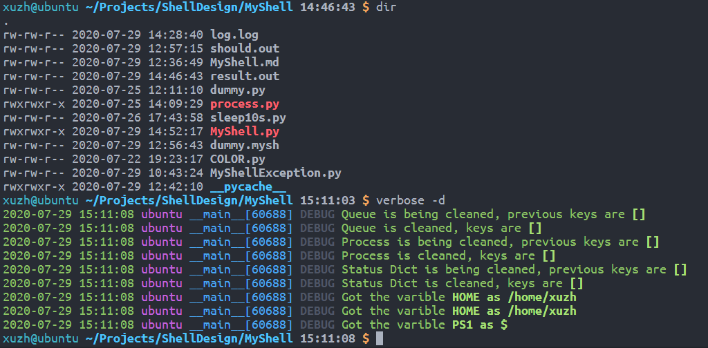
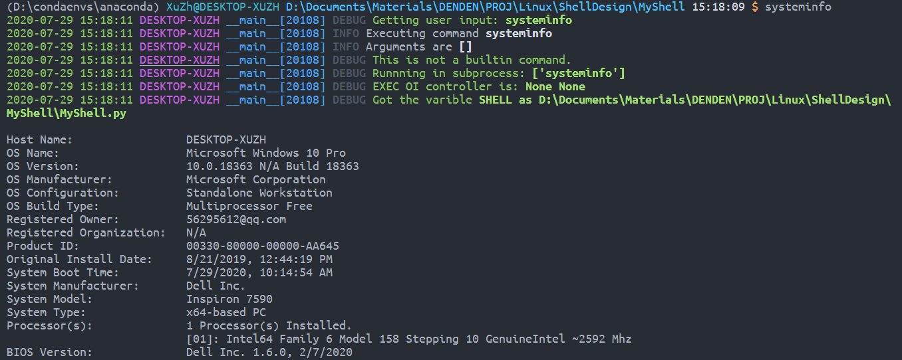
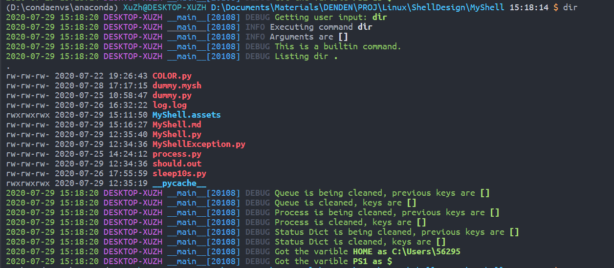

# MyShell：跨平台简单Shell程序

## 基本信息

- 课程名称：Linux程序设计

- 实验项目名称：Shell命令

- 学生姓名：徐震

- 学号：3180105504

- 专业：计算机科学与技术

- 电子邮件地址：[3180105504@zju.edu.cn](mailto:3180105504@zju.edu.cn)

- 实验日期：2020.07.28

## 实验环境

### 硬件配置

- CPU: `2.6 GHz 6-Core Intel Core i7-9750H`
- GPU: `NVIDIA® GeForce® GTX 1650 and Intel(R) UHD Graphics 630`
- Memory: `16 GB 2666 MHz DDR4`
- Disk: `500 GB Solid State PCI-Express Drive * 2`

### 软件环境

- System: `Microsoft Windows 10, macOS Catalina 10.15.5 dual booting`

- Linux: `WSL2 on Windows 10, VMWare Virtual Machine Ubuntu 18.04, Manjaro USB Boot Disk, Ali Cloud ECS Server CentOS 7`

- 注意：我们会==在VMWare Virtual Machine Ubuntu 18.04上进行绝大多数实验操作（Host: Windows 10）==，如实验过程中使用了其他系统我们会注明。

- 主要实验环境详细配置：

  - 系统内核：`Linux ubuntu 5.3.0-43-generic #36~18.04.2-Ubuntu SMP Thu Mar 19 16:03:35 UTC 2020 x86_64 x86_64 x86_64 GNU/Linux`
  - CPU：`Intel(R) Core(TM) i7-9750H CPU @ 2.60GHz`
  - Memory：`MemTotal 6060516 kB`
  
- Python 3: 我们使用Python 3来实现MyShell，模拟Shell的简单功能

  - 经过测试的有：

    - `Python 3.8.2`
    - `Python 3.7.6`
    - `Python 3.6.9`
- 经过测试的系统有：
  
  - `Linux ubuntu 5.4.0-42-generic #46~18.04.1-Ubuntu SMP Fri Jul 10 07:21:24 UTC 2020 x86_64 x86_64 x86_64 GNU/Linux`
  - `Linux aliecs 3.10.0-1127.13.1.el7.x86_64 #1 SMP Tue Jun 23 15:46:38 UTC 2020 x86_64 x86_64 x86_64 GNU/Linux`
  - [ ] ==添加MacOS系统信息==
  - 系统命令有很大不同，但Shell可以基本正常运行的系统有：
  - `DESKTOP-XUZH Microsoft Windows 10 Pro 10.0.18363 N/A Build 18363`
  - 遗憾的是，我们没有经历测试全部的Python版本和所有可能的系统环境，但我们合理推断，在一般的`*nix`环境和`Python 3`下，MyShell都可以正常运行。在Windows环境下，MyShell的基本功能也可正常工作。

## 需求描述

### 设计文档

shell 或者命令行解释器是操作系统中最基本的用户接口。我们实现了一个跨平台的简单的shell 程序——**MyShell**，它具有以下属性：

1. 支持的内部指令集：`cd, clr, pwd, dir, echo, exit, quit, jobs, fg, bg, term, environ, set, unset, umask, printio, exec, shift, test, sleep, time, help, verbose`

   - `cd`

     更改工作目录

     `cd [target]`

     - 无参数调用时会打印当前工作目录
     - 传入一个参数调用时会尝试进入参数所示的目录
     - 在各平台上都可正常使用
     - 无法进入不存在的目录/或根本不是目录的路径/没有权限进入的路径

   - `clr`

     清空屏幕

     `clr`

     - 本指令没有参数
     - 本指令需要调用系统相关命令以管理终端屏幕

   - `pwd`

     打印当前工作目录

     `pwd [-a]`

     - 无参数调用时会打印当前工作目录，用户根目录以`~`显示
     - 传入参数`-a`调用时会打印当前工作目录完整路径

   - `dir`

     列举文件夹内容

     `dir [target [target ...]]`

     - 无参数调用时会显示当前目录下的文件列表
     - 传入多个目录时会依次显示目录的列举结果，结果中多个目录间以空行分隔
     - 对于每个目录，结果的第一行是下面将要现实的目录路径
     - 普通文件加粗显示，可执行文件以红色粗体显示，目录以蓝色粗体显示
     - 目录中的文件列表前以`rwxrwxrwx`格式显示文件/目录权限
     - 目录中的文件列表前显示的时间是最近修改时间
     - 若用户参数中有无法显示的目录（不存在/非目录/无权限等），会导致程序运行错误，此时将无法使用管道，但我们会打印出可以显示的那些目录的内容。

   - `echo`

     打印内容

     `echo [-r] [content [content ...]]`

     - 无参数调用时会打印空字符串
     - 传入多个参数（除了开头的`-r`）时会用空格分隔它们，并打印
     - 传入的参数可以通过双引号包裹，被包裹的内容被视为一个整体
     - 参数中可以包含`~`字符，会被替换为用户的根目录
     - 参数中可以包含`$...`代表的变量，会被替换为相应的变量值，变量不存在时替换为空字符串
     - 引号可以用于区分变量和普通内容，例如`echo PATH_TO_SHELL"$SHELL"SOME_STRING`只有一个参数，但是变量`$SHELL`会被正确处理
     - 若要打印`$`符号，请输入`\$`以转义
     - 若要打印`~`符号，请输入`\~`以转义
     - 不采用`-r`开关时，会尝试转义传入字符中的可转义内容，例如调用`echo "\033[1m\033[31mHello, world.\033[0m"`会以红色粗体打印`Hello, world.`
     - 加入`-r`参数后，上面的命令会以普通字体打印`\033[1m\033[31mHello, world.\033[0m`

   - `exit`

     退出MyShell

     `exit`

     - 我们不会处理任何参数，因为MyShell是一个Python Object，所以没有系统返回值的概念
     - 通过调用`exit/quit/EOF`退出是最安全的退出方式，因为这种情况下MyShell会有机会清空还没有结束的后台工作

   - `quit`

     同`exit`

   - `jobs`

     打印当前任务信息

     `jobs`

     - 我们不会处理任何参数
     - 后台任务的格式为`[i] status env command`例如`[0] suspended env dummy &`
     - 已经被清除/已经完成的任务不会被显示
     - 尝试读取内容的外部后台程序会直接获得EOF
     - 任务信息是管理性质的信息，所以我们会忽略`exec`命令的设置，将任务管理结果直接打印到屏幕上

   - `fg`

     将后台任务提到前台执行

     `fg job_number`

     - 只接受一个参数
     - 对于正在执行的后台任务，提到前台运行
     - 通过外部命令的刷出的后台任务仍然不能获取输入，尝试读取内容的外部后台程序会直接获得EOF
     - 对于因为获取输入而暂停执行的命令，继续命令的执行并阻塞前台主线程

   - `bg`

     继续后台程序的执行

     `bg [job_number [job_number ...]]`

     - 由于所有的暂停的后台任务都是因为尝试获取用户输入，继续在后台执行它们只会得到继续暂停的结果
     - MyShell没有对快捷键操作进行处理，因此没有暂停正在运行的外部命令的功能

   - `term`

     终止后台任务的执行

     `term [job_number [job_number ...]]`

     - 对于后台任务进程（`multiprocessing.Process`），发出`SIGTERM`信号以终止运行；后台任务会自动处理信号并终止自身运行
     - 若后台任务不是内部命令，会对其子进程发出`SIGKILL`信号以尝试终止运行

   - `environ`

     打印MyShell全部内部变量

     `environ`

     - MyShell使用了内部的变量处理机制，在系统环境变量上加了一层额外的接口用以满足更严苛的测试环境。
     - `0, 1, 2, 3, 4, 5, 6, 7, 8, 9`是MyShell的保留变量，不能被修改和删除
     
   - `set`

     修改环境变量/设置新的环境变量

     `set key=value [key=value ...]`

     - 键值对以等于号配对，等于号的周围不允许出现空格，否则无法正常赋值
     - `0, 1, 2, 3, 4, 5, 6, 7, 8, 9`是MyShell的保留变量，不能被修改（它们实际上也不存在）
     - 修改`PS1`变量会导致命令提示符的提示符号被修改，其默认值为`$`美元符号
     - 修改`PWD`等不会导致当前目录发生改变，但调用`cd`命令进入别的命令后`PWD`变量就会被修改到目录改变后的地址下
     - 修改`HOME`变量会导致程序处理`~`的方式发生改变
     - 修改`USER`等变量不会对命令提示符样式有影响，但可能会对其他使用到这些变量的程序有影响
     - 修改`PATH`可以改变程序搜索可执行文件的路径

   - `unset`

     删除环境变量

     `unset key [key ...]`

     - `0, 1, 2, 3, 4, 5, 6, 7, 8, 9`是MyShell的保留变量，不能被删除（它们实际上也不存在）
     - 删除`PS1`变量会导致命令提示符采用默认值`$`
     - 删除`HOME`变量会导致程序无法正确处理`~`
     - 删除`USER`等变量不会对命令提示符样式有影响，但可能会对其他使用到这些变量的程序有影响

   - `umask`

     修改程序的`umask`值

     `umask [value]`

     - 在Windows上修改`umask`的效果较为奇怪
     - 不传入参数的时候会显示当前的`umask`
     - 传入新的`umask`会被尝试以八进制解释，并设置为新的`umask`值
     - Linux上普通文本文件的默认权限是`0o666`，可执行文件为`0o777`
     - 在MyShell修改的`umask`值会影响其后的文件创建

   - `printio`

     打印当前的输入输出重定向目标

     `printio`

     - 本命令没有参数

     - 本命令会打印当前MyShell的`exec`指令重定向目标

     - 例如执行`exec < dummy.mysh > result.out`后调用`printio`会打印

       ```shell
       FILE NUMBER OF INPUT FILE: 3, redirecting MyShell input to <_io.TextIOWrapper name='dummy.mysh' mode='r' encoding='utf-8'>
       FILE NUMBER OF INPUT FILE: 4, redirecting MyShell output to <_io.TextIOWrapper name='result.out' mode='w' encoding='utf-8'>
       ```

     - 由于`printio`的意义就在于查看当前的重定向路径，我们不会将其输入输出重定向，而是直接打印到屏幕上

   - `exec`

   - `shift`

     管理特殊环境变量`1...9`，移动变量的位置（管理命令行参数）

     `shift [shamt]`

     - 通过`$0...$9`可以访问脚本/程序执行时候的命令行参数
     - `$0`存储的是当前脚本的路径（脚本模式）/当前MyShell的路径（交互模式）
     - `$0...$9`不可以被修改/删除（他们实际上也不存在于环境变量中）
     - 不带参数时，本命令可以让`$1...$9`获取下一个命令行参数，例如`$1`会获取`$2`的旧值
     - 带参数时，移动一定的数量，例如传入参数1的效果与不传入相同，传入2会使得`$1`获得`$3`的原始值
     - 调用`shift`命令不会修改`$0`的值
     - 用户的参数必须要能够转换成整数类型

   - `test`

     测试表达式结果是否为真或假

     `test expression`

     - 支持的表达式：

       `-o`：双目，逻辑或，参数为布尔值

       `-a`：双目，逻辑与，参数为布尔值

       `!`：单目，逻辑反，参数为布尔值

       `-z`：单目，字符串长度零检查，参数为字符串

       `-n`：单目，字符串长度非零检查，参数为字符串

       `==`：双目，字符串相等性检擦，参数为字符串

       `!=`：双目，字符出不等性检查，参数为字符串

       `-eq`：双目，数值相等性检查，参数为浮点数/整数

       `-ne`：双目，数值不等性检查，参数为浮点数/整数

       `-gt`：双目，数值大于性检查`lhs > rhs`，参数为浮点数/整数

       `-lt`：双目，数值小于性检查`lhs < rhs`，参数为浮点数/整数

       `-ge`：双目，数值大于等于检查`lhs >= rhs`，参数为浮点数/整数

       `-le`：双目，数值小于等于检查`lhs <= rhs`，参数为浮点数/整数

       `(`：左括号：被括号包裹的内容会被当成一个表达式来解释，返回布尔值

       `)`：右括号：被括号包裹的内容会被当成一个表达式来解释，返回布尔值

     - 表达式和运算子必须用空白符分隔开

     - 支持复杂的嵌套表达式，括号/单目运算符/双目运算符皆可嵌套执行

       ```shell
       test ! -z "" -a ( -n "1" -o 1 -ge 1 ) -o 2 -ne 1 # False, -a -o from right to left
       test ( ! -z "" -a ( -n "1" -o 1 -ge 1 ) ) -o 2 -ne 1 # True
       ```

     - `-a, -o`从右向左结合，但用户可以通过括号来定制它们的运算顺序

     - 用户需要保证输入的内容是合理的可匹配的表达式

       - 括号需匹配完整
       - 运算符能处理的数据类型需要进行合理判断。所有经过运算的表达式结果：布尔值

   - `sleep`

     等待一定时间

     `sleep amount`

     - 在*nix系统下，会尝试调用系统`sleep`指令，能够识别很多不同类型的睡眠时长
     - 在Windows下，会尝试调用Python 3的`time.sleep`，支持以秒为单位的睡眠请求

   - `time`

     获取当前系统时间

     `time`

     - 以格式`"%Y-%m-%d %H:%M:%S.%f"`打印时间

   - `help`

     获取在线帮助信息，通过`more`指令过滤

     `help [command]`

     - 无参数时，打印MyShell用户文档
     - 有参数时，打印相关指令的帮助文档，找不到MyShell内部文档时候会尝试调用系统的`man`指令

   - `verbose`

     调整MyShell的调试信息等级

     `verbose [-e|-w|-i|-d]`

     - MyShell的默认调试等级为：`DEBUG`，会打印程序运行和指令执行中的最详细信息
     - 推荐的日常运行等级为：`WARNING`，也就是调用`-w`后的结果
     - 无参数调用时会打印当前调试等级
     - 有参数调用时会尝试切换调试等级
     - 也可以在启动MyShell时传入类似格式的命令行参数来修改调试信息等级

2. 开发者调试指令集：`dummy, check_zombie, queues`，用户一般不需要调用这些指令

   - `dummy`

     输入输出测试程序

     `dummy`

     - 用于检查输入请求下的后台程序暂停是否被正常实现
     - 用户可以调用一下这个指令，看看是作什么用的

   - `check_zombie`

     检查僵尸线程状态，打印`daemon`下等待主进程退出的进程

     `check_zombie`

     - 正常情况下，被手动终止的后台任务会出现在这里

     - 类似的，这类任务管理指令会被直接输出到`sys.__stdout__`

   - `queues`

     检查程序内部任务管理器的输入队列状态

     `queues`

     - 打印当前的后台任务输入队列生存状态
     - 是开发者用于检查内存泄露的方式之一

3. MyShell在开始执行后会将环境变量`SHELL`设置为`MyShell`的运行位置

4. 其他的命令行输入被解释为程序调用，MyShell创建并执行这个程序，并作为自己的子进程。程序的执行的环境变量包含一下条目：

    `PARENT=<pathname>/MyShell.py`（也就是MyShell中`SHELL`变量的内容）。

5. MyShell能够从文件中提取命令行输入，例如shell 使用以下命令行被调用：

    ```shell
    ./MyShell.py dummy.mysh
    ```

    这个批处理文件应该包含一组命令集，当到达文件结尾时MyShell退出。很明显，如果MyShell被调用时没有使用参数，它会在屏幕上显示提示符请求用户输入。

6. MyShell除了上述的脚本执行，还支持其他运行时命令行参数：

    用户可以调用`./MyShell.py -h`查看相关内容

    ```shell
    usage: MyShell.py [-h] [-a [A [A ...]]] [-e] [-w] [-i] [-d] [F]
    
    MyShell by xudenden@gmail.com
    
    positional arguments:
      F               the batch file to be executed
    
    optional arguments:
      -h, --help      show this help message and exit
      -a [A [A ...]]  command line arguments to batch file
      -e              enable error level debugging info log
      -w              enable warning level debugging info log
      -i              enable info level debugging info log
      -d              enable debug(verbose) level debugging info log
    ```

    MyShell的调用举例：

    ```shell
    ./MyShell.py -w dummy.mysh -a foo bar foobar hello world linux linus PyTorch CS231n
    ```

7. MyShell支持I/O 重定向，stdin 和stdout，或者其中之一，例如命令行为：

    ```shell
    programname arg1 arg2 < inputfile > outputfile
    ```

    使用`arg1`和`arg2`执行程序`programname`，输入文件流被替换为`inputfile`，输出文件流被替换为`outputfile`。

    `stdout` 重定向应该支持除了在上面注明需要打印信息（后台任务管理，输入输出重定向查看等）的所有内部指令。

    使用输出重定向时，如果重定向字符是`>`，则创建输出文件，如果存在则覆盖之；如果重定向字符为`>>`，也会创建输出文件，如果存在则添加到文件尾。

    对于`exec`指令，使用重定向符号会导致MyShell的输入输出被调整到指定的文件

8. MyShell支持后台程序执行。如果在命令行后添加`&`字符，在加载完程序后需要立刻返回命令行提示符。

    后台程序的主要管理接口为`jobs, term, fg, bg`

    值得注意的是，通过`subprocess`调用的外部后台程序的输入端口是关闭的

    内部指令的输入请求会触发后台任务的暂停操作

    MyShell退出时会尝试清空所有正在运行的后台任务

9. MyShell支持管道（“|”）操作。

    管道操作可以和输出重定向同时使用而不冲突

    但输入管道和输入重定向不可同时使用

    使用管道的指令举例（请保证`sha256sum`指令是可用的）：

    ```shell
    cat < dummy.mysh | wc > /dev/tty | echo "zy" > result.out | sha256sum | tr -d " -" >> result.out | wc | cat result.out | wc | cat result.out
    ```

    应该会打印类似如下的内容

    ```shell
        159     561    2940
    zy
    49aabdaa1b0f6c3506f54521ef81fe5b5fe835d268f1f86e1021a342b59d43bc
    ```

10. MyShell的命令提示符包含以下内容：

    ```shell
    ($CONDA_DEFAULT_ENV) $USER@location $PWD time("%H:%M:%S") $PS1
    ```

    分别为：

    - 括号内的Anaconda环境

    - 用户名和登陆位置名
    - 当前路径（用~替换`$HOME`的内容）
    - 当前时间（时:分:秒）
    - 命令提示符符号

11. MyShell支持详细的调试信息打印，详见`verbose`命令的帮助手册

     一般来说我们有四种类型的信息打印：

     1. `DEBUG`调试信息：非开发者可以忽略的调试信息，用于监测MyShell内部运行状态
     2. `INFO`一般信息：一般性的记录信息，大部分情况下可以忽略
     3. `WARNING`警告信息：一般在警告中出现，子进程非零退出，进程管理以及找不到的环境变量等
     4. `ERROR`错误信息：指令格式/运行时错误

     可以在开启MyShell时通过传入命令行参数开关`-e, -w, -i, -d`来调整等级。

     也可以在MyShell运行时通过调用`verbose`指令来实现

12. MyShell支持颜色/字体调整，我们会调整输出颜色等，使其尽量容易辨识，做到用户友好

     例如在命令提示符中，我们会用不同的颜色/字体区分提示符的不同部分

     值得注意的是，用户的终端需要支持颜色输出才能正常显示相关字符，否则会有难以预料的输出错误

     我们的测试基本都是在Visual Studio Code通过SSH连接Ubuntu下执行的颜色信息的显示较为友好

     

13. MyShell支持定制化指令：我们使用Python实现MyShell。并在内部指令中做了统一的接口

     ```python
     def builtin_foo(self, pipe="", args=[]):
         # do something
         # print things that doesn't go to pipe
         # print to sys.__stdout__ to always print to STDOUT
         # return strings that go into the pipe
         return result
     ```

     用户只需要定义新的以`builtin_`（注意下划线）开头的MyShell方法（包含`pipe`和`args`参数）即可添加内部指令，并无缝融入程序的运行中。

     例如：

     ```python
     def builtin_dummy(self, pipe="", args=[]):
         # 一个内置的dummy命令，用于测试是否可以正常触发suspension
         print("builtin_dummy: before any input requirements")
         print(input("dummy1> "))
         print(input("dummy2> "))
         print(input("dummy3> "))
         print(input("dummyend> "))
         result = input("dummy_content> ")
         return result
     ```

14. MyShell本体可以跨平台运行，后台任务的主体功能也可以在Windows上运行。

     可以运行的环境信息在本报告的前半部分已经列举过

     在第一次运行时Python 3或许会抱怨有一些包找不到，此时请通过`pip`来安装相关缺失的内容

     若`pip`速度过慢，用户可以使用[清华源](https://mirrors.tuna.tsinghua.edu.cn/help/pypi/)来提速。

     

     

### 用户手册


## 设计思想


## 功能模块


## 运行结果


## 附录

### 完整源码