# MyShell：跨平台简单Shell程序

## 基本信息

- 课程名称：Linux程序设计

- 实验项目名称：Shell命令

- 学生姓名：徐震

- 学号：3180105504

- 专业：计算机科学与技术

- 电子邮件地址：[3180105504@zju.edu.cn](mailto:3180105504@zju.edu.cn)

- 实验日期：2020.07.28

## 实验环境

### 硬件配置

- CPU: `2.6 GHz 6-Core Intel Core i7-9750H`
- GPU: `NVIDIA® GeForce® GTX 1650 and Intel(R) UHD Graphics 630`
- Memory: `16 GB 2666 MHz DDR4`
- Disk: `500 GB Solid State PCI-Express Drive * 2`

### 软件环境

- System: `Microsoft Windows 10, macOS Catalina 10.15.5 dual booting`

- Linux: `WSL2 on Windows 10, VMWare Virtual Machine Ubuntu 18.04, Manjaro USB Boot Disk, Ali Cloud ECS Server CentOS 7`

- 注意：我们会==在VMWare Virtual Machine Ubuntu 18.04上进行绝大多数实验操作（Host: Windows 10）==，如实验过程中使用了其他系统我们会注明。

- 主要实验环境详细配置：

  - 系统内核：`Linux ubuntu 5.3.0-43-generic #36~18.04.2-Ubuntu SMP Thu Mar 19 16:03:35 UTC 2020 x86_64 x86_64 x86_64 GNU/Linux`
  - CPU：`Intel(R) Core(TM) i7-9750H CPU @ 2.60GHz`
  - Memory：`MemTotal 6060516 kB`
  
- Python 3: 我们使用Python 3来实现MyShell，模拟Shell的简单功能

  - 经过测试的有：

    - `Python 3.8.2`
    - `Python 3.7.6`
    - `Python 3.6.9`
- 经过测试的系统有：
  
  - `Linux ubuntu 5.4.0-42-generic #46~18.04.1-Ubuntu SMP Fri Jul 10 07:21:24 UTC 2020 x86_64 x86_64 x86_64 GNU/Linux`
  - `Linux aliecs 3.10.0-1127.13.1.el7.x86_64 #1 SMP Tue Jun 23 15:46:38 UTC 2020 x86_64 x86_64 x86_64 GNU/Linux`
  - [ ] ==添加MacOS系统信息==
  - 系统命令有很大不同，但Shell可以基本正常运行的系统有：
  - `DESKTOP-XUZH Microsoft Windows 10 Pro 10.0.18363 N/A Build 18363`
  - 遗憾的是，我们没有经历测试全部的Python版本和所有可能的系统环境，但我们合理推断，在一般的`*nix`环境和`Python 3`下，MyShell都可以正常运行。在Windows环境下，MyShell的基本功能也可正常工作。

## 需求描述

### 设计文档

shell 或者命令行解释器是操作系统中最基本的用户接口。我们实现了一个跨平台的简单的shell 程序——**MyShell**，它具有以下属性：

1. 支持的内部指令集：`cd, clr, pwd, dir, echo, exit, quit, jobs, fg, bg, term, environ, set, unset, umask, printio, exec, shift, test, sleep, time, help, verbose`

   - `cd`

     更改工作目录

     `cd [target]`

     - 无参数调用时会打印当前工作目录
     - 传入一个参数调用时会尝试进入参数所示的目录
     - 在各平台上都可正常使用
     - 无法进入不存在的目录/或根本不是目录的路径/没有权限进入的路径

   - `clr`

     清空屏幕

     `clr`

     - 本指令没有参数
     - 本指令需要调用系统相关命令以管理终端屏幕

   - `pwd`

     打印当前工作目录

     `pwd [-a]`

     - 无参数调用时会打印当前工作目录，用户根目录以`~`显示
     - 传入参数`-a`调用时会打印当前工作目录完整路径

   - `dir`

     列举文件夹内容

     `dir [target [target ...]]`

     - 无参数调用时会显示当前目录下的文件列表
     - 传入多个目录时会依次显示目录的列举结果，结果中多个目录间以空行分隔
     - 对于每个目录，结果的第一行是下面将要现实的目录路径
     - 普通文件加粗显示，可执行文件以红色粗体显示，目录以蓝色粗体显示
     - 目录中的文件列表前以`rwxrwxrwx`格式显示文件/目录权限
     - 目录中的文件列表前显示的时间是最近修改时间
     - 若用户参数中有无法显示的目录（不存在/非目录/无权限等），会导致程序运行错误，此时将无法使用管道，但我们会打印出可以显示的那些目录的内容。

   - `echo`

     打印内容

     `echo [-r] [content [content ...]]`

     - 无参数调用时会打印空字符串
     - 传入多个参数（除了开头的`-r`）时会用空格分隔它们，并打印
     - 传入的参数可以通过双引号包裹，被包裹的内容被视为一个整体
     - 参数中可以包含`~`字符，会被替换为用户的根目录
     - 参数中可以包含`$...`代表的变量，会被替换为相应的变量值，变量不存在时替换为空字符串
     - 引号可以用于区分变量和普通内容，例如`echo PATH_TO_SHELL"$SHELL"SOME_STRING`只有一个参数，但是变量`$SHELL`会被正确处理
     - 若要打印`$`符号，请输入`\$`以转义
     - 若要打印`~`符号，请输入`\~`以转义
     - 不采用`-r`开关时，会尝试转义传入字符中的可转义内容，例如调用`echo "\033[1m\033[31mHello, world.\033[0m"`会以红色粗体打印`Hello, world.`
     - 加入`-r`参数后，上面的命令会以普通字体打印`\033[1m\033[31mHello, world.\033[0m`

   - `exit`

     退出MyShell

     `exit`

     - 我们不会处理任何参数，因为MyShell是一个Python Object，所以没有系统返回值的概念
     - 通过调用`exit/quit/EOF`退出是最安全的退出方式，因为这种情况下MyShell会有机会清空还没有结束的后台工作

   - `quit`

     同`exit`

   - `jobs`

     打印当前任务信息

     `jobs`

     - 我们不会处理任何参数
     - 后台任务的格式为`[i] status env command`例如`[0] suspended env dummy &`
     - 已经被清除/已经完成的任务不会被显示
     - 尝试读取内容的外部后台程序会直接获得EOF
     - 任务信息是管理性质的信息，所以我们会忽略`exec`命令的设置，将任务管理结果直接打印到屏幕上

   - `fg`

     将后台任务提到前台执行

     `fg job_number`

     - 只接受一个参数
     - 对于正在执行的后台任务，提到前台运行
     - 通过外部命令的刷出的后台任务仍然不能获取输入，尝试读取内容的外部后台程序会直接获得EOF
     - 对于因为获取输入而暂停执行的命令，继续命令的执行并阻塞前台主线程

   - `bg`

     继续后台程序的执行

     `bg [job_number [job_number ...]]`

     - 由于所有的暂停的后台任务都是因为尝试获取用户输入，继续在后台执行它们只会得到继续暂停的结果
     - MyShell没有对快捷键操作进行处理，因此没有暂停正在运行的外部命令的功能

   - `term`

     终止后台任务的执行

     `term [job_number [job_number ...]]`

     - 对于后台任务进程（`multiprocessing.Process`），发出`SIGTERM`信号以终止运行；后台任务会自动处理信号并终止自身运行
     - 若后台任务不是内部命令，会对其子进程发出`SIGKILL`信号以尝试终止运行

   - `environ`

     打印MyShell全部内部变量

     `environ`

     - MyShell使用了内部的变量处理机制，在系统环境变量上加了一层额外的接口用以满足更严苛的测试环境。
     - `0, 1, 2, 3, 4, 5, 6, 7, 8, 9`是MyShell的保留变量，不能被修改和删除
     
   - `set`

     修改环境变量/设置新的环境变量

     `set key=value [key=value ...]`

     - 键值对以等于号配对，等于号的周围不允许出现空格，否则无法正常赋值
     - `0, 1, 2, 3, 4, 5, 6, 7, 8, 9`是MyShell的保留变量，不能被修改（它们实际上也不存在）
     - 修改`PS1`变量会导致命令提示符的提示符号被修改，其默认值为`$`美元符号
     - 修改`PWD`等不会导致当前目录发生改变，但调用`cd`命令进入别的命令后`PWD`变量就会被修改到目录改变后的地址下
     - 修改`HOME`变量会导致程序处理`~`的方式发生改变
     - 修改`USER`等变量不会对命令提示符样式有影响，但可能会对其他使用到这些变量的程序有影响
     - 修改`PATH`可以改变程序搜索可执行文件的路径

   - `unset`

     删除环境变量

     `unset key [key ...]`

     - `0, 1, 2, 3, 4, 5, 6, 7, 8, 9`是MyShell的保留变量，不能被删除（它们实际上也不存在）
     - 删除`PS1`变量会导致命令提示符采用默认值`$`
     - 删除`HOME`变量会导致程序无法正确处理`~`
     - 删除`USER`等变量不会对命令提示符样式有影响，但可能会对其他使用到这些变量的程序有影响

   - `umask`

     修改程序的`umask`值

     `umask [value]`

     - 在Windows上修改`umask`的效果较为奇怪
     - 不传入参数的时候会显示当前的`umask`
     - 传入新的`umask`会被尝试以八进制解释，并设置为新的`umask`值
     - Linux上普通文本文件的默认权限是`0o666`，可执行文件为`0o777`
     - 在MyShell修改的`umask`值会影响其后的文件创建

   - `printio`

     打印当前的输入输出重定向目标

     `printio`

     - 本命令没有参数

     - 本命令会打印当前MyShell的`exec`指令重定向目标

     - 例如执行`exec < dummy.mysh > result.out`后调用`printio`会打印

       ```shell
       FILE NUMBER OF INPUT FILE: 3, redirecting MyShell input to <_io.TextIOWrapper name='dummy.mysh' mode='r' encoding='utf-8'>
       FILE NUMBER OF INPUT FILE: 4, redirecting MyShell output to <_io.TextIOWrapper name='result.out' mode='w' encoding='utf-8'>
       ```

     - 由于`printio`的意义就在于查看当前的重定向路径，我们不会将其输入输出重定向，而是直接打印到屏幕上

   - `exec`

     调整Shell的默认输入输出源

     `exec [< input] [> output | >> output]`

     - 调用本函数的效果是：若`exec < input > output`类似于在下面执行的每一条指令后都调用`programname < input > output`。但对于输出文件，输出的内容会被累积，而非像调用`> output`那样完全覆盖

     - 单独调用`exec`不会对输入输出产生任何影响，仅仅会调用`printio`检测当前IO状态
     - 若在某次调用中只有使用`[< input] [> output]`的其中之一，另一个不会被改变
     - 用户可以通过`< ""`（传入空字符串）来清空输入源头，同样的，也可以用此方法清空输出源
     - 值得注意的是，在手册中标注不会受到`exec`影响（保证打印到`sys.__stdout__`）的程序总是会打印到`sys.__stdout__`，例如任务管理工作`jobs`或者`exec, printio`本身等。
     - 若使用的是`>>`符号，则会在原有的文件内容基础上添加新的输出内容。

   - `shift`

     管理特殊环境变量`1...9`，移动变量的位置（管理命令行参数）

     `shift [shamt]`

     - 通过`$0...$9`可以访问脚本/程序执行时候的命令行参数
     - `$0`存储的是当前脚本的路径（脚本模式）/当前MyShell的路径（交互模式）
     - `$0...$9`不可以被修改/删除（他们实际上也不存在于环境变量中）
     - 不带参数时，本命令可以让`$1...$9`获取下一个命令行参数，例如`$1`会获取`$2`的旧值
     - 带参数时，移动一定的数量，例如传入参数1的效果与不传入相同，传入2会使得`$1`获得`$3`的原始值
     - 调用`shift`命令不会修改`$0`的值
     - 用户的参数必须要能够转换成整数类型

   - `test`

     测试表达式结果是否为真或假

     `test expression`

     - 支持的表达式：

       `-o`：双目，逻辑或，参数为布尔值

       `-a`：双目，逻辑与，参数为布尔值

       `!`：单目，逻辑反，参数为布尔值

       `-z`：单目，字符串长度零检查，参数为字符串

       `-n`：单目，字符串长度非零检查，参数为字符串

       `==`：双目，字符串相等性检擦，参数为字符串

       `!=`：双目，字符出不等性检查，参数为字符串

       `-eq`：双目，数值相等性检查，参数为浮点数/整数

       `-ne`：双目，数值不等性检查，参数为浮点数/整数

       `-gt`：双目，数值大于性检查`lhs > rhs`，参数为浮点数/整数

       `-lt`：双目，数值小于性检查`lhs < rhs`，参数为浮点数/整数

       `-ge`：双目，数值大于等于检查`lhs >= rhs`，参数为浮点数/整数

       `-le`：双目，数值小于等于检查`lhs <= rhs`，参数为浮点数/整数

       `(`：左括号：被括号包裹的内容会被当成一个表达式来解释，返回布尔值

       `)`：右括号：被括号包裹的内容会被当成一个表达式来解释，返回布尔值

     - 表达式和运算子必须用空白符分隔开

     - 支持复杂的嵌套表达式，括号/单目运算符/双目运算符皆可嵌套执行

       ```shell
       test ! -z "" -a ( -n "1" -o 1 -ge 1 ) -o 2 -ne 1 # False, -a -o from right to left
       test ( ! -z "" -a ( -n "1" -o 1 -ge 1 ) ) -o 2 -ne 1 # True
       ```

     - `-a, -o`从右向左结合，但用户可以通过括号来定制它们的运算顺序

     - 用户需要保证输入的内容是合理的可匹配的表达式

       - 括号需匹配完整
       - 运算符能处理的数据类型需要进行合理判断。所有经过运算的表达式结果：布尔值

   - `sleep`

     等待一定时间

     `sleep amount`

     - 在*nix系统下，会尝试调用系统`sleep`指令，能够识别很多不同类型的睡眠时长
     - 在Windows下，会尝试调用Python 3的`time.sleep`，支持以秒为单位的睡眠请求

   - `time`

     获取当前系统时间

     `time`

     - 以格式`"%Y-%m-%d %H:%M:%S.%f"`打印时间

   - `help`

     获取在线帮助信息，通过`more`指令过滤

     `help [command]`

     - 无参数时，打印MyShell用户文档
     - 有参数时，打印相关指令的帮助文档，找不到MyShell内部文档时候会尝试调用系统的`man`指令

   - `verbose`

     调整MyShell的调试信息等级

     `verbose [-e|-w|-i|-d]`

     - MyShell的默认调试等级为：`DEBUG`，会打印程序运行和指令执行中的最详细信息
     - 推荐的日常运行等级为：`WARNING`，也就是调用`-w`后的结果
     - 无参数调用时会打印当前调试等级
     - 有参数调用时会尝试切换调试等级
     - 也可以在启动MyShell时传入类似格式的命令行参数来修改调试信息等级

2. 开发者调试指令集：`dummy, check_zombie, queues`，用户一般不需要调用这些指令

   - `dummy`

     输入输出测试程序

     `dummy`

     - 用于检查输入请求下的后台程序暂停是否被正常实现
     - 用户可以调用一下这个指令，看看是作什么用的

   - `check_zombie`

     检查僵尸线程状态，打印`daemon`下等待主进程退出的进程

     `check_zombie`

     - 正常情况下，被手动终止的后台任务会出现在这里

     - 类似的，这类任务管理指令会被直接输出到`sys.__stdout__`

   - `queues`

     检查程序内部任务管理器的输入队列状态

     `queues`

     - 打印当前的后台任务输入队列生存状态
     - 是开发者用于检查内存泄露的方式之一

3. MyShell在开始执行后会将环境变量`SHELL`设置为`MyShell`的运行位置

4. 其他的命令行输入被解释为程序调用，MyShell创建并执行这个程序，并作为自己的子进程。程序的执行的环境变量包含一下条目：

    `PARENT=<pathname>/MyShell.py`（也就是MyShell中`SHELL`变量的内容）。

5. MyShell能够从文件中提取命令行输入，例如shell 使用以下命令行被调用：

    ```shell
    ./MyShell.py dummy.mysh
    ```

    这个批处理文件应该包含一组命令集，当到达文件结尾时MyShell退出。很明显，如果MyShell被调用时没有使用参数，它会在屏幕上显示提示符请求用户输入。

6. MyShell除了上述的脚本执行，还支持其他运行时命令行参数：

    用户可以调用`./MyShell.py -h`查看相关内容

    ```shell
    usage: MyShell.py [-h] [-a [A [A ...]]] [-e] [-w] [-i] [-d] [F]
    
    MyShell by xudenden@gmail.com
    
    positional arguments:
      F               the batch file to be executed
    
    optional arguments:
      -h, --help      show this help message and exit
      -a [A [A ...]]  command line arguments to batch file
      -e              enable error level debugging info log
      -w              enable warning level debugging info log
      -i              enable info level debugging info log
      -d              enable debug(verbose) level debugging info log
    ```

    MyShell的调用举例：

    ```shell
    ./MyShell.py -w dummy.mysh -a foo bar foobar hello world linux linus PyTorch CS231n
    ```

7. MyShell支持I/O 重定向，stdin 和stdout，或者其中之一，例如命令行为：

    ```shell
    programname arg1 arg2 < inputfile > outputfile
    ```

    使用`arg1`和`arg2`执行程序`programname`，输入文件流被替换为`inputfile`，输出文件流被替换为`outputfile`。

    `stdout` 重定向持除了在上面注明需要打印信息（后台任务管理，输入输出重定向查看等）的所有内部指令。

    使用输出重定向时，如果重定向字符是`>`，则创建输出文件，如果存在则覆盖之；如果重定向字符为`>>`，也会创建输出文件，如果存在则添加到文件尾。

    对于`exec`指令，使用重定向符号会导致MyShell的输入输出被调整到指定的文件。

    MyShell在处理外部程序的调用时，为了方便用户观察结果和控制输入输出，会将`stderr`重定向到`stdout`一并打印到屏幕/定义的输出文件流。

8. MyShell支持后台程序执行。如果在命令行后添加`&`字符，在加载完程序后需要立刻返回命令行提示符。

    后台程序的主要管理接口为`jobs, term, fg, bg`

    值得注意的是，通过`subprocess`调用的外部后台程序的输入端口是关闭的

    内部指令的输入请求会触发后台任务的暂停操作

    MyShell退出时会尝试清空所有正在运行的后台任务

9. MyShell支持管道（“|”）操作。

    在MyShell中管道和输出重定向可以同时使用而不冲突

    但输入管道和输入重定向不可同时使用

    使用管道的指令举例（请保证`sha256sum`指令是可用的）：

    ```shell
    cat < dummy.mysh | wc > /dev/tty | echo "zy" > result.out | sha256sum | tr -d " -" >> result.out | wc | cat result.out | wc | cat result.out
    ```

    应该会打印类似如下的内容

    ```shell
        159     561    2940
    zy
    49aabdaa1b0f6c3506f54521ef81fe5b5fe835d268f1f86e1021a342b59d43bc
    ```

10. MyShell的命令提示符包含以下内容：

    ```shell
    ($CONDA_DEFAULT_ENV) $USER@location $PWD time("%H:%M:%S") $PS1
    ```

    分别为：

    - 括号内的Anaconda环境

    - 用户名和登陆位置名
    - 当前路径（用~替换`$HOME`的内容）
    - 当前时间（时:分:秒）
    - 命令提示符符号

11. MyShell支持详细的调试信息打印，详见`verbose`命令的帮助手册

      一般来说我们有四种类型的信息打印：

      1. `DEBUG`调试信息：非开发者可以忽略的调试信息，用于监测MyShell内部运行状态
      2. `INFO`一般信息：一般性的记录信息，大部分情况下可以忽略
      3. `WARNING`警告信息：一般在警告中出现，子进程非零退出，进程管理以及找不到的环境变量等
      4. `ERROR`错误信息：指令格式/运行时错误

      可以在开启MyShell时通过传入命令行参数开关`-e, -w, -i, -d`来调整等级。

      也可以在MyShell运行时通过调用`verbose`指令来实现

12. MyShell支持颜色/字体调整，我们会调整输出颜色等，使其尽量容易辨识，做到用户友好

      例如在命令提示符中，我们会用不同的颜色/字体区分提示符的不同部分

      值得注意的是，用户的终端需要支持颜色输出才能正常显示相关字符，否则会有难以预料的输出错误

      我们的测试基本都是在Visual Studio Code通过SSH连接Ubuntu下执行的颜色信息的显示较为友好

      

13. MyShell支持定制化指令：我们使用Python实现MyShell。并在内部指令中做了统一的接口

      ```python
      def builtin_foo(self, pipe="", args=[]):
          # do something
          # print things that doesn't go to pipe
          # print to sys.__stdout__ to always print to STDOUT
          # return strings that go into the pipe
          return result
      ```

      用户只需要定义新的以`builtin_`（注意下划线）开头的MyShell方法（包含`pipe`和`args`参数）即可添加内部指令，并无缝融入程序的运行中。

      例如：

      ```python
      def builtin_dummy(self, pipe="", args=[]):
          # 一个内置的dummy命令，用于测试是否可以正常触发suspension
          print("builtin_dummy: before any input requirements")
          print(input("dummy1> "))
          print(input("dummy2> "))
          print(input("dummy3> "))
          print(input("dummyend> "))
          result = input("dummy_content> ")
          return result
      ```

14. MyShell本体可以跨平台运行，后台任务的主体功能也可以在Windows上运行。

      可以运行的环境信息在本报告的前半部分已经列举过

      在第一次运行时Python 3或许会抱怨有一些包找不到，此时请通过`pip`来安装相关缺失的内容

      若`pip`速度过慢，用户可以使用[清华源](https://mirrors.tuna.tsinghua.edu.cn/help/pypi/)来提速

     MyShell在Windows上运行的情况：

      

      

15. MyShell有较为完备的内置报错系统

     在用户调用的命令出错时，我们会通过`exception`机制快速定位错误源头，并通过`logging`模块以人性化的方式打印相关信息

     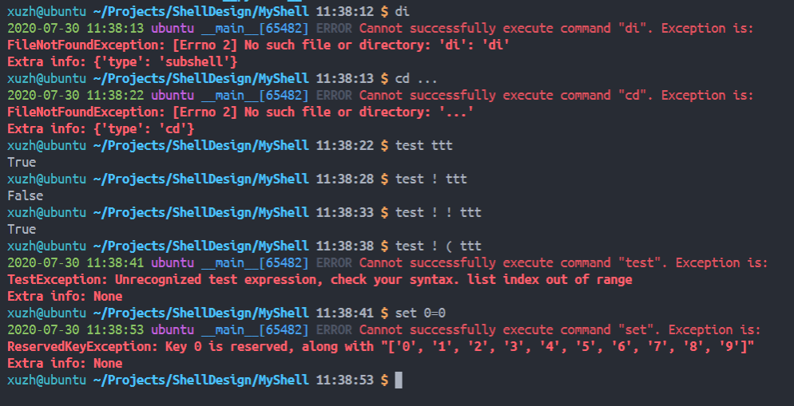
    
16. MyShell支持以`#`开头的注释，注意==注释符号前必须是空白字符==

     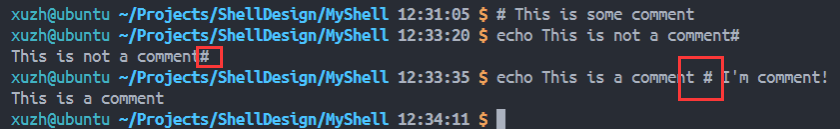

### 用户手册

#### 程序IO重定向

Linux中的命令行程序以输入输出为主要信息交互方式，shell是Linux系列系统的基本接口之一，用户经常需要在各种各样的shell下运行不同的程序，并观察他们的输入输出结果。因此控制输入输出是shell的基本功能之一。

一般情况下，程序会从连接到终端的键盘设备（`stdin: /dev/tty`）读取用户的输入内容，并将输出内容打印到终端的屏幕上（`stdout: /dev/tty`）。

但若用户并不希望某个在shell环境下运行的程序从标准输入中`stdin: /dev/tty`读入内容，它可以通过==输入重定向符号==`<`来改变shell下程序的输入源。类似的，shell也提供==输出重定向==功能。一般的，若程序以`programname args < inputfile > outputfile`的形式被调用，它会从`inputfile`中读取内容，并将标准输出导入到`outputfile`中。

对于输入文件流，不同于通过键盘读取的标准输出，在`inputfile`的内容被读完时，程序将会获得`EOF`信号，而非被停止并等待输入。

对于输出文件流，若使用的重定向符号为`>`，则会创建新的`outputfile`文件/覆盖原有内容。若为`>>`，则在`outputfile`已经存在或有文件内容的情况下，会在保留原有文件的基础上在文件末尾添加新的内容。

#### 程序管道

正如上面所说的，管道其实也是输入输出重定向的一种。

不同于引导输入输出到文件，程序管道直接将上一个程序的输出作为本程序的输入，而本程序的输出会被看作下一个程序的输出。

类似的，输入内容耗尽时会获得`EOF`。

相对于通过文件进行交互，程序管道无需显式地对文件进行操作：这意味着其运行速度会快于通过重定向到文件。

`prog1 | prog2 | prog3`的调用效果相当于：

```shell
prog1 > file1
prog2 < file1 > file2
prog3 < file2
```

#### 程序的运行环境

在操作系统中，程序的运行环境也是控制程序运行方式的一种重要方式。

例如，我们熟悉的`PATH`环境变量就可以指导shell到相应的文件夹中寻找可执行文件来运行。

在一些深度学习环境中，`CUDA`相关环境变量可以控制相应程序对Nvidia CUDA的操作方式。

`HOME`环境变量还控制着shell对`~`符号的解释。

在Linux相关的shell脚本中，这些环境变量还被当作一般的变量来使用。例如我们可以将一些特殊的颜色字符储存到一个环境变量中，在以后调用相关程序需要打印相关颜色时，可以直接使用`$COLOR`

#### 后台程序执行

许多Linux Shell支持基于任务管理的多线程程序执行功能。我们可以通过在程序命令行末尾添加`&`来让程序在后台执行（特别是一些需要较长时间才能完成的程序），而立刻返回到可交互的命令行来输入其他命令。在程序完成后/状态发生改变时在shell中以一定的方式提示用户。

这种方式理论上可以管理无限多的后台程序。用户可以通过`jobs, bg, fg`等命令来查看/管理正在后台执行的程序。

在一些较为完备的shell中，键盘快捷键得到了很好的支持，用户可以通过<kbd>Ctrl+Z</kbd>来暂停/挂起正在执行的程序，并通过`bg`让其在后台恢复运行/`fg`让其恢复运行并提到前台。并且支持根据输入的程序暂停功能：在程序读取输入流时自动挂起。

## 运行结果

1. 复杂重定向和管道操作

   ```shell
   cat < dummy.mysh | wc > /dev/tty | echo "zy" > result.out | sha256sum | tr -d " -" >> result.out | wc | cat result.out | wc | cat result.out
   ```

   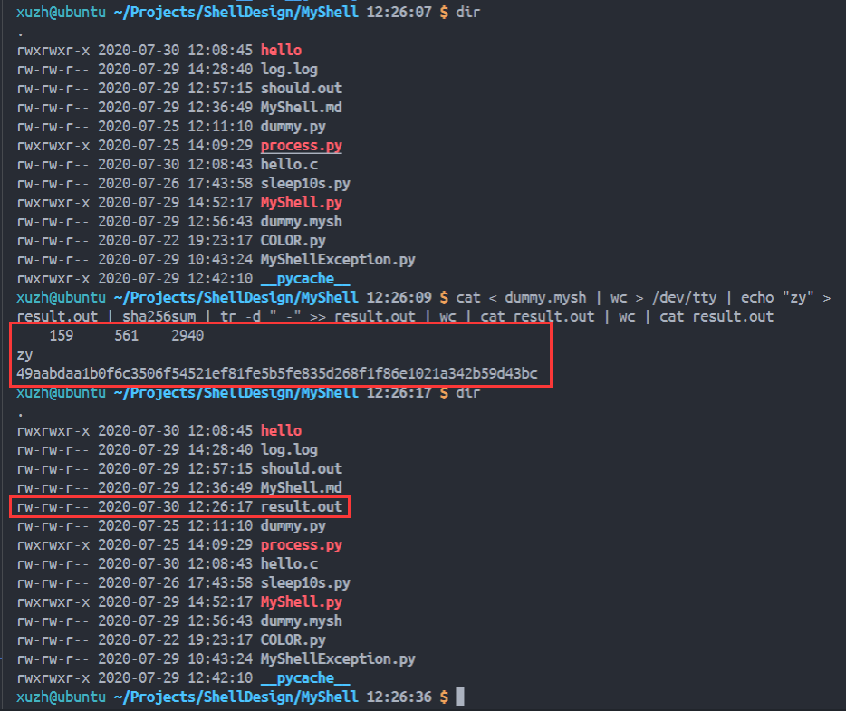

2. 脚本执行

   ```shell
   ./MyShell.py -w dummy.mysh -a foo bar foobar hello world linux linus PyTorch CS231n
   ```

   脚本内容`dummy.mysh`：

   ```shell
   test ! -z ""
   date +%s
   time
   set BOLD="\033[1m"
   set RED="\033[31m"
   set BLUE="\033[34m"
   set RESET="\033[0m"
   
   set LINE="$BOLD$BLUE##############################################################$RESET"
   
   echo $LINE
   
   umask
   echo "Changing UMASK to 0o777"
   umask 777
   umask
   echo "Changing UMASK to 0o002"
   umask 002
   
   echo $LINE
   
   echo "Hello, my name is $SHELL"
   set hello_msg="Hello, my name is"
   echo -r "$hello_msg $USER, and I live in $HOME"
   echo "Should print sha256sum of zy in the next line"
   echo "xz" | sha256sum | tr -d " -"
   echo "Should print 1 1 65 in the following line"
   echo "zy" | sha256sum | tr -d " -" | wc
   
   echo $LINE
   
   dir
   pwd
   unset hello_msg
   echo "Should get empty output"
   echo $hello_msg
   
   echo $LINE
   
   echo "Should print /dev/null"
   ls /dev | grep null
   echo "Should print all files containing 1 in /tmp"
   ls /tmp | grep 1
   
   echo $LINE
   
   echo "Should make a file log.log"
   echo "Hello, I'm your logger." > log.log
   dir
   echo "Should see content of log.log"
   cat < log.log
   echo "Hello, again..." >> log.log
   echo "Should display content of log.log"
   cat log.log
   echo "Should display word count of log.log"
   wc < log.log
   
   echo $LINE
   
   echo "Opening some sleepy jobs"
   echo "And calling command jobs"
   sleep 2s | echo "Sleeping in $0" &
   echo "waiting 0.25s"
   jobs
   sleep 0.25s
   sleep 2s | echo "This is some job management" &
   echo "waiting 0.25s"
   jobs
   sleep 0.25s
   sleep 2s | echo "MyShell is $SHELL" &
   echo "waiting 0.25s"
   jobs
   sleep 0.25s
   sleep 2s &
   echo "waiting 0.25s"
   jobs
   sleep 0.25s
   sleep 2s &
   echo "Getting current runnning jobs..."
   jobs
   
   echo "Getting back to fore ground"
   echo "Waiting for background jobs to terminate"
   echo "At the same time I can still do other things like testing..."
   test "" -o "a"
   test ! -z "a" -a ( -n "1" -o 1 -ge 1 ) -a 2 -ne 1
   test ! -z "" -a ( -n "1" -o 1 -ge 1 ) -o 2 -ne 1 # False, -a -o from right to left
   test ( ! -z "" -a ( -n "1" -o 1 -ge 1 ) ) -o 2 -ne 1 # True
   sleep 2s
   
   echo "Should produce empty content"
   jobs
   
   
   echo "Jobs are done ~"
   
   echo "Spawning dummy built_in job that is trying to read from user (will suspend)"
   
   dummy &
   dummy &
   dummy &
   dummy &
   
   echo "Counting jobs"
   jobs
   
   echo "$RED$BOLD""WE'RE ONLY TERMINATING JOB [0] AND [1], YOU SHOULD SEE WARMING IF -w. NO ZOMBIE""$RESET"
   
   term 0 1
   
   echo $LINE
   
   echo "calling environ..."
   environ
   
   echo "Arg 0 is: $0"
   echo "Arg 1 is: $1"
   echo "Arg 2 is: $2"
   echo "Arg 3 is: $3"
   echo "Arg 4 is: $4"
   echo "Arg 5 is: $5"
   echo "Arg 6 is: $6"
   echo "Arg 7 is: $7"
   echo "Arg 8 is: $8"
   echo "Arg 9 is: $9"
   
   echo "Shifting number 1"
   shift
   echo "Arg 0 is: $0"
   echo "Arg 1 is: $1"
   echo "Arg 2 is: $2"
   echo "Arg 3 is: $3"
   echo "Arg 4 is: $4"
   echo "Arg 5 is: $5"
   echo "Arg 6 is: $6"
   echo "Arg 7 is: $7"
   echo "Arg 8 is: $8"
   echo "Arg 9 is: $9"
   
   
   
   echo "Shifting number 2"
   shift
   echo "Arg 1 is: $1"
   
   echo "Shifting number 3"
   shift
   echo "Arg 1 is: $1"
   
   echo "Shifting number 4"
   shift
   echo "Arg 1 is: $1"
   
   echo "Shifting number 5"
   shift
   echo "Arg 1 is: $1"
   
   
   echo "$BOLD"Bye!"$RESET"
   ```

   执行结果：

   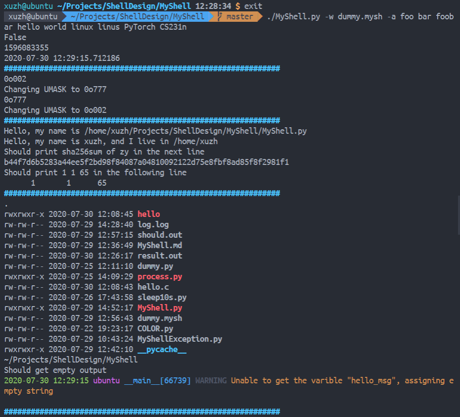

   …

   ```
   False
   1596083355
   2020-07-30 12:29:15.712186
   ##############################################################
   0o002
   Changing UMASK to 0o777
   0o777
   Changing UMASK to 0o002
   ##############################################################
   Hello, my name is /home/xuzh/Projects/ShellDesign/MyShell/MyShell.py
   Hello, my name is xuzh, and I live in /home/xuzh
   Should print sha256sum of zy in the next line
   b44f7d6b5283a44ee5f2bd98f84087a04810092122d75e8fbf8ad85f8f2981f1
   Should print 1 1 65 in the following line
         1       1      65
   ##############################################################
   .
   rwxrwxr-x 2020-07-30 12:08:45 hello
   rw-rw-r-- 2020-07-29 14:28:40 log.log
   rw-rw-r-- 2020-07-29 12:57:15 should.out
   rw-rw-r-- 2020-07-29 12:36:49 MyShell.md
   rw-rw-r-- 2020-07-30 12:26:17 result.out
   rw-rw-r-- 2020-07-25 12:11:10 dummy.py
   rwxrwxr-x 2020-07-25 14:09:29 process.py
   rw-rw-r-- 2020-07-30 12:08:43 hello.c
   rw-rw-r-- 2020-07-26 17:43:58 sleep10s.py
   rwxrwxr-x 2020-07-29 14:52:17 MyShell.py
   rw-rw-r-- 2020-07-29 12:56:43 dummy.mysh
   rw-rw-r-- 2020-07-22 19:23:17 COLOR.py
   rw-rw-r-- 2020-07-29 10:43:24 MyShellException.py
   rwxrwxr-x 2020-07-29 12:42:10 __pycache__
   ~/Projects/ShellDesign/MyShell
   Should get empty output
   2020-07-30 12:29:15 ubuntu __main__[66739] WARNING Unable to get the varible "hello_msg", assigning empty string
   
   ##############################################################
   Should print /dev/null
   null
   Should print all files containing 1 in /tmp
   clr-debug-pipe-64261-7288941-in
   clr-debug-pipe-64261-7288941-out
   dotnet-diagnostic-64261-7288941-socket
   pymp-1yf6wit3
   pymp-i1l0r1ba
   ssh-3Dl1dZ2MVhMN
   ssh-5opVjzIOSY1n
   ssh-F4yJVhHqoOo1
   ssh-ssJdLj12gJhT
   systemd-private-32fa36ac417343a4813881b03c5a5a50-bolt.service-9WJsxv
   systemd-private-32fa36ac417343a4813881b03c5a5a50-colord.service-qxRv3v
   systemd-private-32fa36ac417343a4813881b03c5a5a50-fwupd.service-WNl3wS
   systemd-private-32fa36ac417343a4813881b03c5a5a50-ModemManager.service-w89ayg
   systemd-private-32fa36ac417343a4813881b03c5a5a50-rtkit-daemon.service-ebfv3E
   systemd-private-32fa36ac417343a4813881b03c5a5a50-systemd-resolved.service-G0nqb0
   systemd-private-32fa36ac417343a4813881b03c5a5a50-systemd-timesyncd.service-N7TNbO
   tmp-64015c9VBFgG4O3ca.tpl
   tmp-64015EunG2vwQ362u.tpl
   tmp-64015jJWFioLuj9YL.tpl
   vmware-root_1361-3988687315
   vscode-ipc-0e8469e9-1fc8-467e-b42c-f6a8519ab561.sock
   vscode-ipc-705a4712-c1f7-43b0-9465-99c771a42a1d.sock
   vscode-ipc-76bfc346-b068-4fb1-8340-103432500cbb.sock
   vscode-ipc-77ad59b8-138f-4875-884e-368ed7e31e7d.sock
   vscode-ipc-846c3b8a-cd23-429d-aa84-b71bb5acbe7b.sock
   vscode-ipc-a1c81be6-faa1-49b2-8a12-38a172ae37e9.sock
   vscode-ipc-cb722aa7-90c1-4b82-b595-52d2e62b5d98.sock
   vscode-ipc-e9b20dcd-2866-4d0b-bd69-426b2dc6b153.sock
   vscode-ipc-efde013b-3ec4-4d77-9e0d-b10d25879dda.sock
   vscode-typescript1000
   ##############################################################
   Should make a file log.log
   .
   rwxrwxr-x 2020-07-30 12:08:45 hello
   rw-rw-r-- 2020-07-30 12:29:15 log.log
   rw-rw-r-- 2020-07-29 12:57:15 should.out
   rw-rw-r-- 2020-07-29 12:36:49 MyShell.md
   rw-rw-r-- 2020-07-30 12:26:17 result.out
   rw-rw-r-- 2020-07-25 12:11:10 dummy.py
   rwxrwxr-x 2020-07-25 14:09:29 process.py
   rw-rw-r-- 2020-07-30 12:08:43 hello.c
   rw-rw-r-- 2020-07-26 17:43:58 sleep10s.py
   rwxrwxr-x 2020-07-29 14:52:17 MyShell.py
   rw-rw-r-- 2020-07-29 12:56:43 dummy.mysh
   rw-rw-r-- 2020-07-22 19:23:17 COLOR.py
   rw-rw-r-- 2020-07-29 10:43:24 MyShellException.py
   rwxrwxr-x 2020-07-29 12:42:10 __pycache__
   Should see content of log.log
   Hello, I'm your logger.
   Should display content of log.log
   Hello, I'm your logger.
   Hello, again...
   Should display word count of log.log
         2       6      40
   ##############################################################
   Opening some sleepy jobs
   And calling command jobs
   waiting 0.25s
   [0] running env sleep 2s | echo "Sleeping in $0" &
   waiting 0.25s
   [0] running env sleep 2s | echo "Sleeping in $0" &
   [1] running env sleep 2s | echo "This is some job management" &
   waiting 0.25s
   [0] running env sleep 2s | echo "Sleeping in $0" &
   [1] running env sleep 2s | echo "This is some job management" &
   [2] running env sleep 2s | echo "MyShell is $SHELL" &
   waiting 0.25s
   [0] running env sleep 2s | echo "Sleeping in $0" &
   [1] running env sleep 2s | echo "This is some job management" &
   [2] running env sleep 2s | echo "MyShell is $SHELL" &
   [3] running env sleep 2s &
   Getting current runnning jobs...
   [0] running env sleep 2s | echo "Sleeping in $0" &
   [1] running env sleep 2s | echo "This is some job management" &
   [2] running env sleep 2s | echo "MyShell is $SHELL" &
   [3] running env sleep 2s &
   [4] running env sleep 2s &
   Getting back to fore ground
   Waiting for background jobs to terminate
   At the same time I can still do other things like testing...
   True
   True
   False
   True
   Sleeping in /home/xuzh/Projects/ShellDesign/MyShell/dummy.mysh
   [0] finished env sleep 2s | echo "Sleeping in $0" &
   This is some job management
   [1] finished env sleep 2s | echo "This is some job management" &
   MyShell is /home/xuzh/Projects/ShellDesign/MyShell/MyShell.py
   [2] finished env sleep 2s | echo "MyShell is $SHELL" &
   [3] finished env sleep 2s &
   [4] finished env sleep 2s &
   Should produce empty content
   Jobs are done /home/xuzh
   Spawning dummy built_in job that is trying to read from user (will suspend)
   builtin_dummy: before any input requirements
   [0] suspended env dummy &
   builtin_dummy: before any input requirements
   [1] suspended env dummy &
   builtin_dummy: before any input requirements
   [2] suspended env dummy &
   builtin_dummy: before any input requirements
   [3] suspended env dummy &
   Counting jobs
   [0] suspended env dummy &
   [1] suspended env dummy &
   [2] suspended env dummy &
   [3] suspended env dummy &
   WE'RE ONLY TERMINATING JOB [0] AND [1], YOU SHOULD SEE WARMING IF -w. NO ZOMBIE
   [0] terminated env dummy &
   2020-07-30 12:29:18 ubuntu __main__[66819] WARNING Terminating job [0] handler process by signal...
   [1] terminated env dummy &
   2020-07-30 12:29:18 ubuntu __main__[66823] WARNING Terminating job [1] handler process by signal...
   ##############################################################
   calling environ...
   SSH_CONNECTION=192.168.28.1 12000 192.168.28.146 22
   LANG=en_US.UTF-8
   OLDPWD=/home/xuzh/Projects/ShellDesign/MyShell
   XDG_SESSION_ID=29
   USER=xuzh
   PWD=/home/xuzh/Projects/ShellDesign/MyShell
   HOME=/home/xuzh
   SSH_CLIENT=192.168.28.1 12000 22
   MAIL=/var/mail/xuzh
   SHELL=/home/xuzh/Projects/ShellDesign/MyShell/MyShell.py
   SHLVL=2
   LOGNAME=xuzh
   DBUS_SESSION_BUS_ADDRESS=unix:path=/run/user/1000/bus
   XDG_RUNTIME_DIR=/run/user/1000
   PATH=/home/xuzh/.vscode-server/bin/91899dcef7b8110878ea59626991a18c8a6a1b3e/bin:/usr/local/sbin:/usr/local/bin:/usr/sbin:/usr/bin:/sbin:/bin:/usr/games:/usr/local/games:/home/xuzh/.local/bin
   _=/home/xuzh/Projects/ShellDesign/MyShell/./MyShell.py
   VSCODE_IPC_HOOK_CLI=/tmp/vscode-ipc-a1c81be6-faa1-49b2-8a12-38a172ae37e9.sock
   TERM_PROGRAM=vscode
   TERM_PROGRAM_VERSION=1.47.3
   COLORTERM=truecolor
   VSCODE_GIT_IPC_HANDLE=/run/user/1000/vscode-git-2fbb053fa5.sock
   GIT_ASKPASS=/home/xuzh/.vscode-server/bin/91899dcef7b8110878ea59626991a18c8a6a1b3e/extensions/git/dist/askpass.sh
   VSCODE_GIT_ASKPASS_NODE=/home/xuzh/.vscode-server/bin/91899dcef7b8110878ea59626991a18c8a6a1b3e/node
   VSCODE_GIT_ASKPASS_MAIN=/home/xuzh/.vscode-server/bin/91899dcef7b8110878ea59626991a18c8a6a1b3e/extensions/git/dist/askpass-main.js
   TERM=xterm-256color
   ZSH=/home/xuzh/.oh-my-zsh
   PAGER=less
   LESS=-R
   LSCOLORS=Gxfxcxdxbxegedabagacad
   LS_COLORS=rs=0:di=01;34:ln=01;36:mh=00:pi=40;33:so=01;35:do=01;35:bd=40;33;01:cd=40;33;01:or=40;31;01:mi=00:su=37;41:sg=30;43:ca=30;41:tw=30;42:ow=34;42:st=37;44:ex=01;32:*.tar=01;31:*.tgz=01;31:*.arc=01;31:*.arj=01;31:*.taz=01;31:*.lha=01;31:*.lz4=01;31:*.lzh=01;31:*.lzma=01;31:*.tlz=01;31:*.txz=01;31:*.tzo=01;31:*.t7z=01;31:*.zip=01;31:*.z=01;31:*.Z=01;31:*.dz=01;31:*.gz=01;31:*.lrz=01;31:*.lz=01;31:*.lzo=01;31:*.xz=01;31:*.zst=01;31:*.tzst=01;31:*.bz2=01;31:*.bz=01;31:*.tbz=01;31:*.tbz2=01;31:*.tz=01;31:*.deb=01;31:*.rpm=01;31:*.jar=01;31:*.war=01;31:*.ear=01;31:*.sar=01;31:*.rar=01;31:*.alz=01;31:*.ace=01;31:*.zoo=01;31:*.cpio=01;31:*.7z=01;31:*.rz=01;31:*.cab=01;31:*.wim=01;31:*.swm=01;31:*.dwm=01;31:*.esd=01;31:*.jpg=01;35:*.jpeg=01;35:*.mjpg=01;35:*.mjpeg=01;35:*.gif=01;35:*.bmp=01;35:*.pbm=01;35:*.pgm=01;35:*.ppm=01;35:*.tga=01;35:*.xbm=01;35:*.xpm=01;35:*.tif=01;35:*.tiff=01;35:*.png=01;35:*.svg=01;35:*.svgz=01;35:*.mng=01;35:*.pcx=01;35:*.mov=01;35:*.mpg=01;35:*.mpeg=01;35:*.m2v=01;35:*.mkv=01;35:*.webm=01;35:*.ogm=01;35:*.mp4=01;35:*.m4v=01;35:*.mp4v=01;35:*.vob=01;35:*.qt=01;35:*.nuv=01;35:*.wmv=01;35:*.asf=01;35:*.rm=01;35:*.rmvb=01;35:*.flc=01;35:*.avi=01;35:*.fli=01;35:*.flv=01;35:*.gl=01;35:*.dl=01;35:*.xcf=01;35:*.xwd=01;35:*.yuv=01;35:*.cgm=01;35:*.emf=01;35:*.ogv=01;35:*.ogx=01;35:*.aac=00;36:*.au=00;36:*.flac=00;36:*.m4a=00;36:*.mid=00;36:*.midi=00;36:*.mka=00;36:*.mp3=00;36:*.mpc=00;36:*.ogg=00;36:*.ra=00;36:*.wav=00;36:*.oga=00;36:*.opus=00;36:*.spx=00;36:*.xspf=00;36:
   SSH_AUTH_SOCK=/tmp/ssh-sHY4pYyqIN0I/agent.66323
   SSH_AGENT_PID=66324
   PS1=$
   BOLD=\033[1m
   RED=\033[31m
   BLUE=\033[34m
   RESET=\033[0m
   LINE=\033[1m\033[34m##############################################################\033[0m
   Arg 0 is: /home/xuzh/Projects/ShellDesign/MyShell/dummy.mysh
   Arg 1 is: foo
   Arg 2 is: bar
   Arg 3 is: foobar
   Arg 4 is: hello
   Arg 5 is: world
   Arg 6 is: linux
   Arg 7 is: linus
   Arg 8 is: PyTorch
   Arg 9 is: CS231n
   Shifting number 1
   Arg 0 is: /home/xuzh/Projects/ShellDesign/MyShell/dummy.mysh
   Arg 1 is: bar
   Arg 2 is: foobar
   Arg 3 is: hello
   Arg 4 is: world
   Arg 5 is: linux
   Arg 6 is: linus
   Arg 7 is: PyTorch
   Arg 8 is: CS231n
   2020-07-30 12:29:19 ubuntu __main__[66739] WARNING Unable to get the varible "9", assigning empty string
   Arg 9 is: 
   Shifting number 2
   Arg 1 is: foobar
   Shifting number 3
   Arg 1 is: hello
   Shifting number 4
   Arg 1 is: world
   Shifting number 5
   Arg 1 is: linux
   Bye!
   [2] terminated env dummy &
   [3] terminated env dummy &
   2020-07-30 12:29:19 ubuntu __main__[66827] WARNING Terminating job [2] handler process by signal...
   2020-07-30 12:29:19 ubuntu __main__[66831] WARNING Terminating job [3] handler process by signal...
   ```

3. 复杂`test`命令执行（同时检查注释功能）

   ```shell
   test ! -z "" -a ( -n "1" -o 1 -ge 1 ) -o 2 -ne 1 # False, -a -o from right to left
   test ( ! -z "" -a ( -n "1" -o 1 -ge 1 ) ) -o 2 -ne 1 # True
   ```

   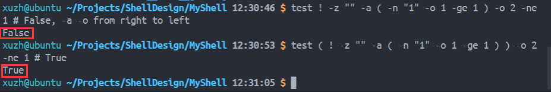

4. `cd`

   ```shell
   cd ..
   cd ..
   cd
   cd DoesntExist
   cd /dev
   cd /var/log
   cd .
   cd ~
   cd /
   cd $HOME
   ```

   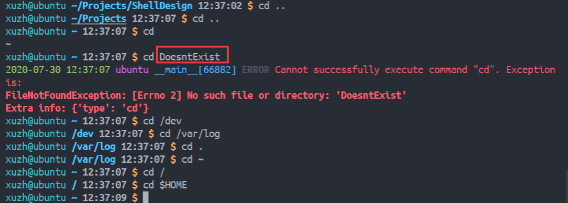

5. `clr`

   ```shell
   clr
   ```

   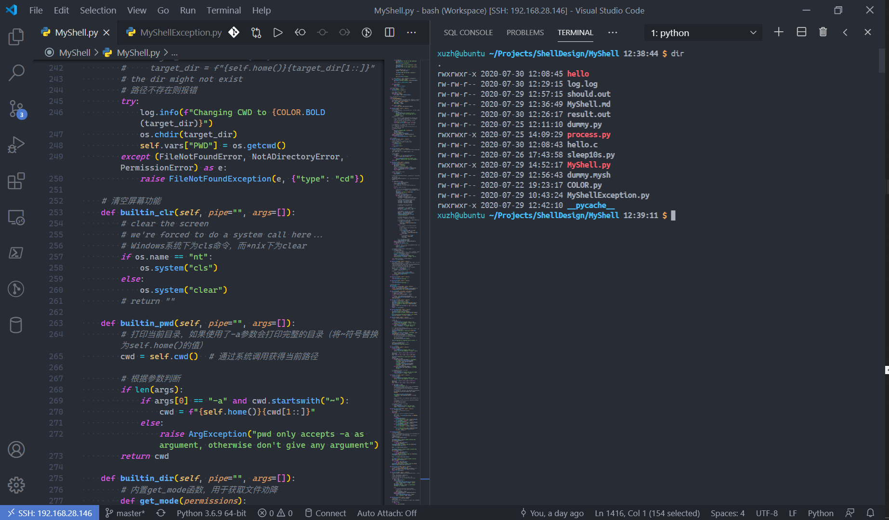

   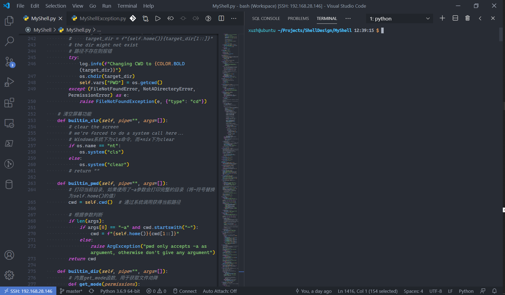

6. `pwd`

   ```shell
   pwd
   pwd -a
   ```

   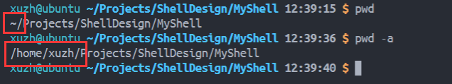

7. `dir`

   ```shell
   dir
   cd ..
   dir MyShell DirSync DoesntExist
   ```

   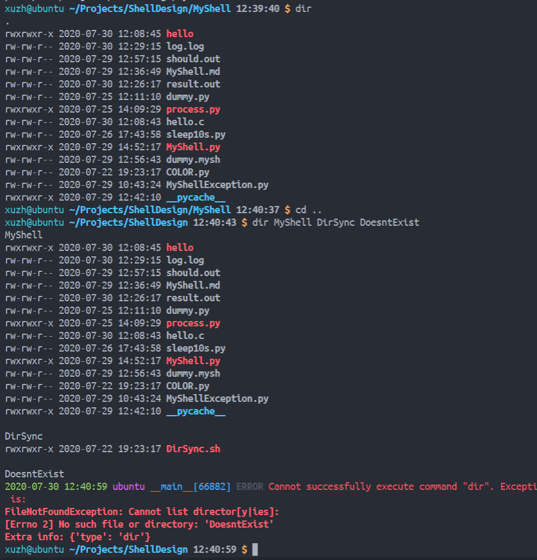

8. `echo`

   ```shell
   echo "\033[1m\033[31mHello, world.\033[0m"
   echo "\033[1m\033[33mMy name is $SHELL\033[0m"
   echo -r "\033[1m\031[31mMy name is $SHELL\033[0m"
   echo without"$SHELL"any"$HOME"space and here come spaces
   echo "中文测试" # 注释测试
   ```

   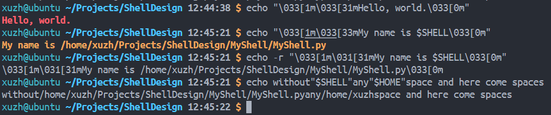

   

9. `exit`

   ```shell
   exit
   ```

   

10. `quit`

    ```shell
    quit
    ```

    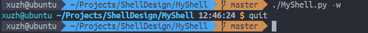

11. `jobs, fg, bg, term, exit`任务管理

    ```shell
    set BOLD="\033[1m"
    set RED="\033[31m"
    set BLUE="\033[34m"
    set RESET="\033[0m"
    
    set LINE="$BOLD$BLUE##############################################################$RESET"
    
    echo $LINE
    
    echo "Opening some sleepy jobs"
    echo "And calling command jobs"
    sleep 2s | echo "Sleeping in $0" &
    echo "waiting 0.25s"
    jobs
    sleep 0.25s
    sleep 2s | echo "This is some job management" &
    echo "waiting 0.25s"
    jobs
    sleep 0.25s
    sleep 2s | echo "MyShell is $SHELL" &
    echo "waiting 0.25s"
    jobs
    sleep 0.25s
    sleep 2s &
    echo "waiting 0.25s"
    jobs
    sleep 0.25s
    sleep 2s &
    echo "Getting current runnning jobs..."
    jobs
    
    echo "Getting back to fore ground"
    echo "Waiting for background jobs to terminate"
    echo "At the same time I can still do other things like testing..."
    test "" -o "a"
    test ! -z "a" -a ( -n "1" -o 1 -ge 1 ) -a 2 -ne 1
    test ! -z "" -a ( -n "1" -o 1 -ge 1 ) -o 2 -ne 1 # False, -a -o from right to left
    test ( ! -z "" -a ( -n "1" -o 1 -ge 1 ) ) -o 2 -ne 1 # True
    sleep 2s
    
    echo "Should produce empty content"
    jobs
    
    
    echo "Jobs are done ~"
    
    echo "Spawning dummy built_in job that is trying to read from user (will suspend)"
    
    dummy &
    dummy &
    dummy &
    dummy &
    
    echo "Counting jobs"
    jobs
    
    echo "$RED$BOLD""WE'RE ONLY TERMINATING JOB [0] AND [1], YOU SHOULD SEE WARMING IF -w. NO ZOMBIE""$RESET"
    
    term 0 1
    
    echo $LINE
    
    exit # should see termination message
    ```

    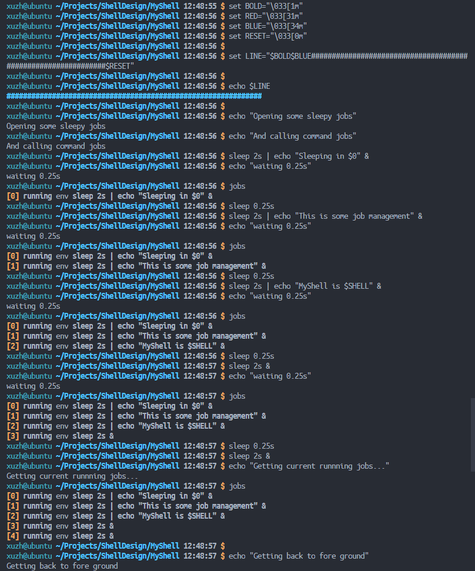

    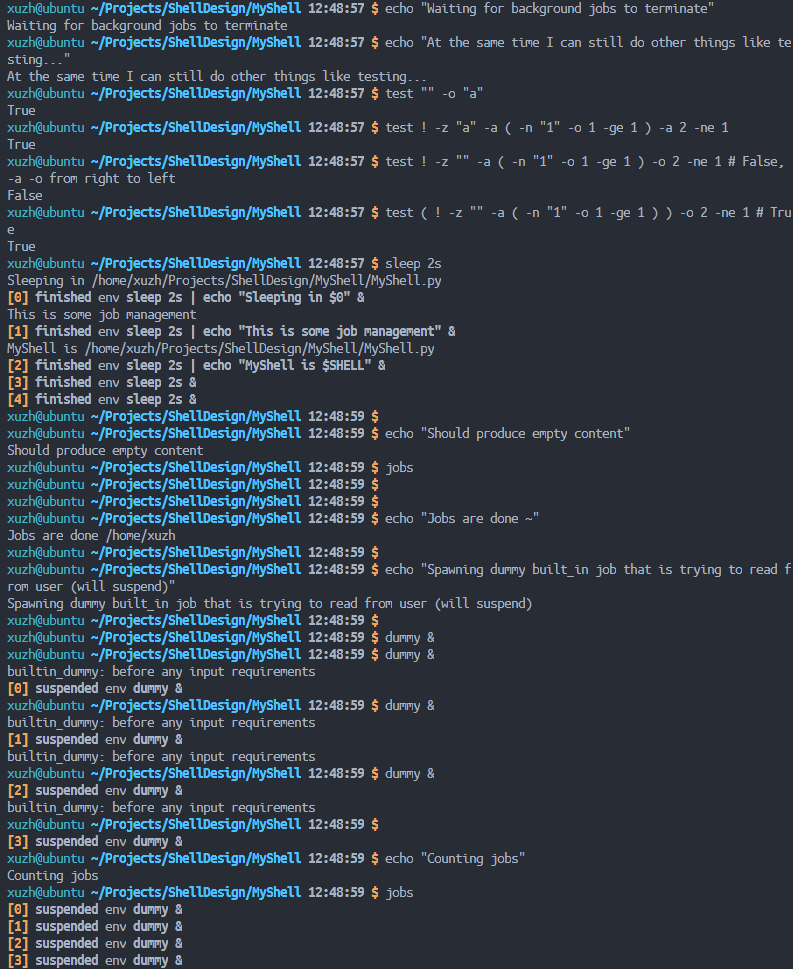

    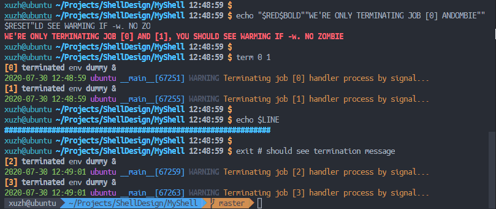

    ```shell
    dummy &
    dummy &
    dummy &
    dummy &
    jobs
    term 0 1
    bg 2 3
    term 2 3
    jobs
    dummy &
    dummy &
    fg 0
    1
    2
    3
    4
    5
    term 1
    jobs
    ```

    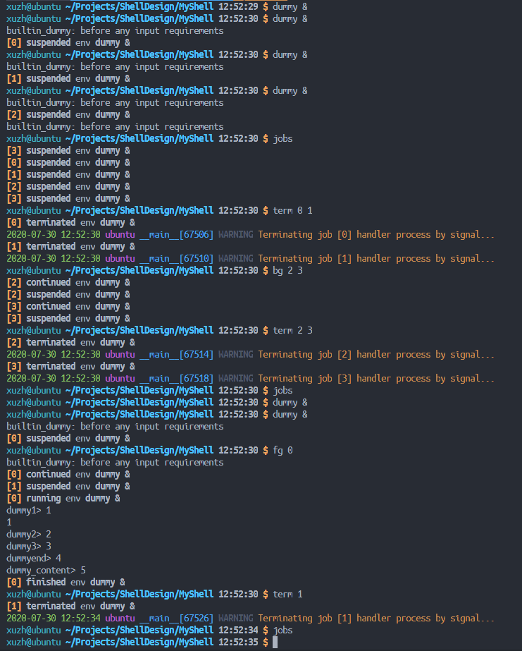

12. `environ, set, unset`变量检查

    ```shell
    echo "Hello, my name is $SHELL"
    set hello_msg="Hello, my name is"
    echo -r "$hello_msg $USER, and I live in $HOME"
    environ | grep hello_msg # should see hello_msg=Hello, my name is
    unset hello_msg
    echo "Should get empty output"
    echo $hello_msg
    environ | grep hello_msg # should see no hello_msg
    ```

    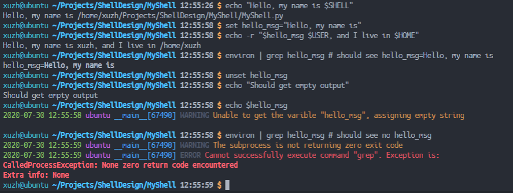

13. `umask`

    ```shell
    umask
    echo "Changing UMASK to 0o077"
    umask 077
    touch text.txt
    gcc hello.c -o hello
    dir | grep -E "hello|text"
    echo "Displaying UMASK"
    umask
    echo "Changing UMASK to 0o002"
    umask 002
    ```

    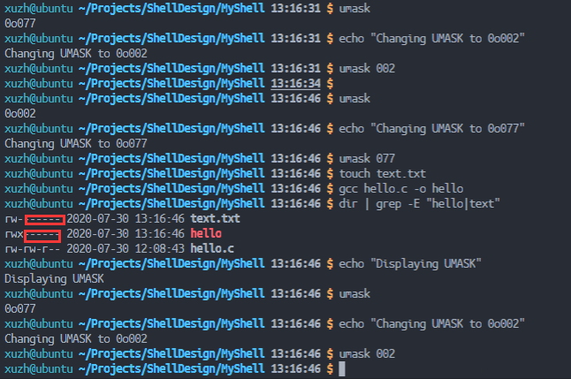

14. `printio, exec`

    ```shell
    printio
    exec < dummy.mysh > result.out
    exec
    printio
    cat
    exec < result.out > ""
    printio
    wc
    exec < "" > ""
    printio
    exec > result.out
    echo "REPLACING"
    exec > ""
    cat result.out
    exec >> result.out
    echo "APPENDING"
    exec > ""
    cat result.out
    ```

    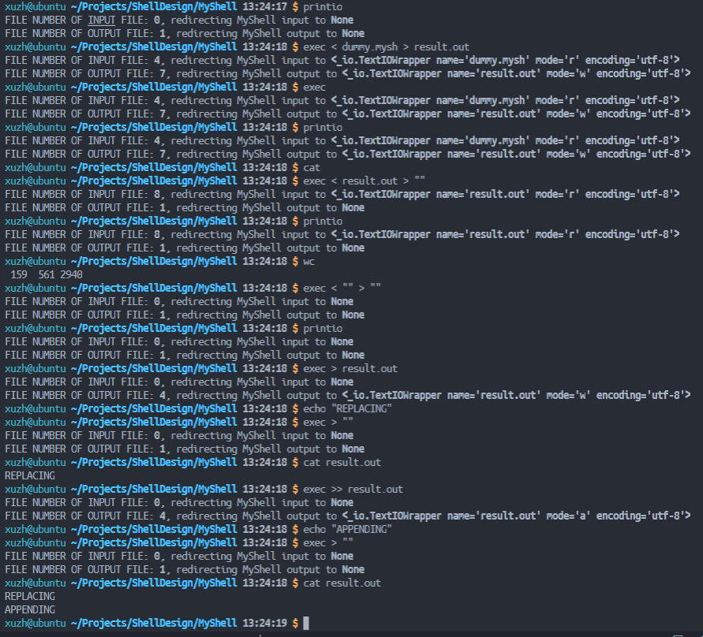

15. `shift`

    通过命令行：`./MyShell.py -w dummy.mysh -a foo bar foobar hello world linux linus PyTorch CS231n`运行MyShell

    ```shell
    echo $0 $1 $2 $3 $4 $5 $6 $7 $8 $9
    shift
    echo $0 $1 $2 $3 $4 $5 $6 $7 $8 $9
    shift 1
    echo $0 $1 $2 $3 $4 $5 $6 $7 $8 $9
    shift 2
    echo $0 $1 $2 $3 $4 $5 $6 $7 $8 $9
    shift 3
    echo $0 $1 $2 $3 $4 $5 $6 $7 $8 $9
    shift 4
    echo $0 $1 $2 $3 $4 $5 $6 $7 $8 $9
    ```

    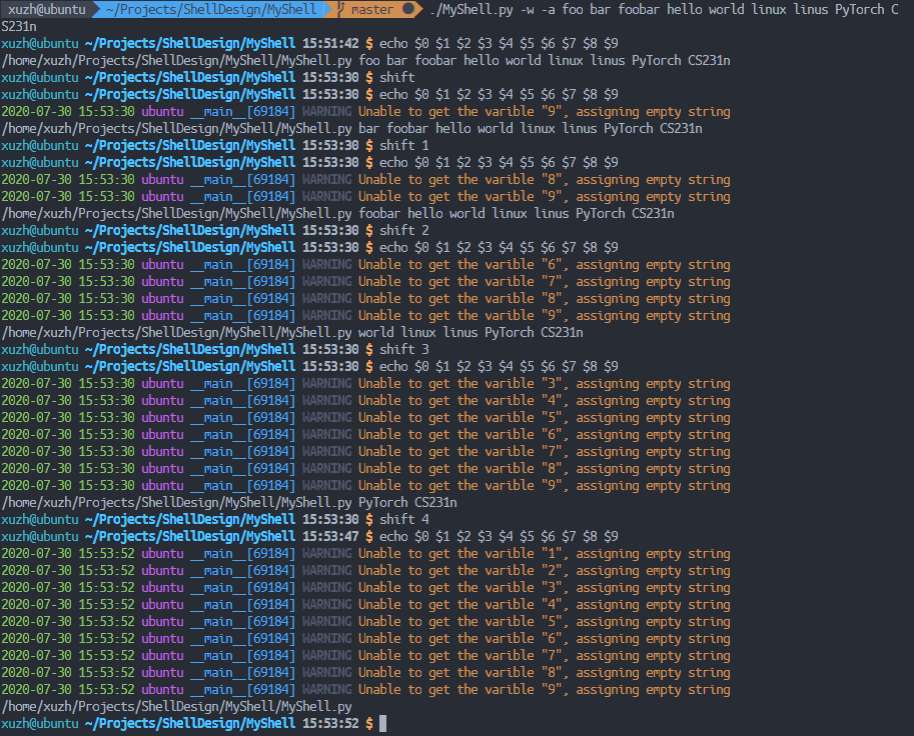

16. `sleep`

    ```shell
    sleep 10s
    ```

    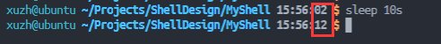

17. `time`

    ```shell
    time
    ```

    

18. `verbose`

    ```shell
    verbose
    verbose -d
    verbose -e
    echo $9
    verbose -w
    echo $9
    ```

    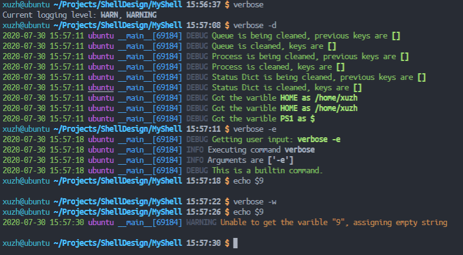

## 附录

### 完整源码