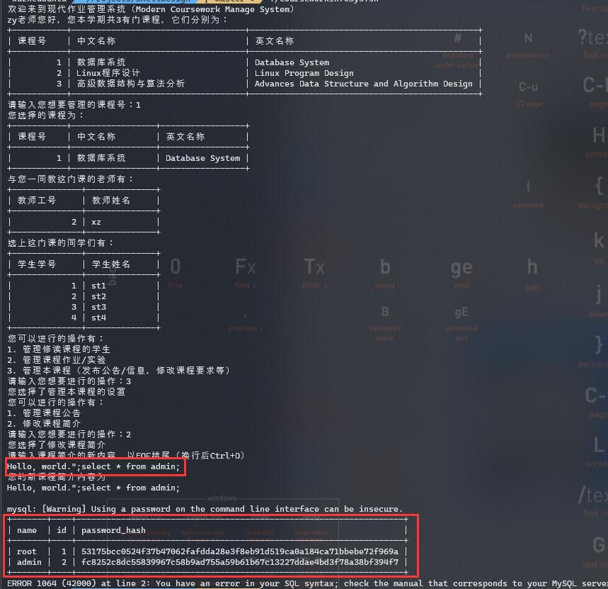

# 浙江大学实验报告

## 基本信息

- 课程名称：Linux程序设计

- 实验项目名称：Shell程序设计

- 学生姓名：徐震

- 学号：3180105504

- 专业：计算机科学与技术

- 电子邮件地址：[3180105504@zju.edu.cn](mailto:3180105504@zju.edu.cn)

- 实验日期：2020.07.28

## 实验环境

### 硬件配置

- CPU: `2.6 GHz 6-Core Intel Core i7-9750H`
- GPU: `NVIDIA® GeForce® GTX 1650 and Intel(R) UHD Graphics 630`
- Memory: `16 GB 2666 MHz DDR4`
- Disk: `500 GB Solid State PCI-Express Drive * 2`

### 软件环境

- System: `Microsoft Windows 10, macOS Catalina 10.15.5 dual booting`

- Linux: `WSL2 on Windows 10, VMWare Virtual Machine Ubuntu 18.04, Manjaro USB Boot Disk, Ali Cloud ECS Server CentOS 7`

- 注意：我们会==在VMWare Virtual Machine Ubuntu 18.04上进行绝大多数实验操作（Host: Windows 10）==，如实验过程中使用了其他系统我们会注明。

- 主要实验环境详细配置：

  - 系统内核：`Linux ubuntu 5.3.0-43-generic #36~18.04.2-Ubuntu SMP Thu Mar 19 16:03:35 UTC 2020 x86_64 x86_64 x86_64 GNU/Linux`
  - CPU：`Intel(R) Core(TM) i7-9750H CPU @ 2.60GHz`
  - Memory：`MemTotal 6060516 kB`

- Python 3: 我们使用Python 3来实现MyShell，模拟Shell的简单功能

  - 经过测试的有：

    - `Python 3.8.2`
    - `Python 3.7.6`
    - `Python 3.6.9`
- 经过测试的系统有：

  - `Linux ubuntu 5.4.0-42-generic #46~18.04.1-Ubuntu SMP Fri Jul 10 07:21:24 UTC 2020 x86_64 x86_64 x86_64 GNU/Linux`
  - `Linux aliecs 3.10.0-1127.13.1.el7.x86_64 #1 SMP Tue Jun 23 15:46:38 UTC 2020 x86_64 x86_64 x86_64 GNU/Linux`
  - `macOS Catalina 10.15.5`
  - 系统命令有很大不同，但Shell可以基本正常运行的系统有：
  - `DESKTOP-XUZH Microsoft Windows 10 Pro 10.0.18363 N/A Build 18363`
  - 遗憾的是，我们没有经历测试全部的Python版本和所有可能的系统环境，但我们合理推断，在一般的`*nix`环境和`Python 3`下，MyShell都可以正常运行。在Windows环境下，MyShell的基本功能也可正常工作。

## 实验目的

1. 学习`Bourne shell`的shell脚本的基本概念
2. 学会shell程序如何执行
3. 通过写脚本，学会编写`Bourne shell`脚本程序的方法
4. 理解并掌握shell

## 实验要求

本实验在提交实验报告时，需要有下面内容：

- **源程序及详细注释**，源程序开始两行为程序名和作者及学号；
- 每题的源代码以文本内容附在对应题目后面；
- 程序运行结果的截图；
- **程序注释必须要用中文，海外学生除外**
- 第4、5题需要设计文档
- 讨论与心得
- 第1、2题程序中不能使用sed、awk等工具
- 本实验完成后所有源代码（文本格式）同时上传到[拼题A系统](pintia.cn)

## 实验内容/结果及分析

### 1

要求：编写shell 脚本，统计指定目录下的普通文件、子目录及可执行文件的数目，统计该目录下所有普通文件字节数总和，目录的路径名字由参数传入。

#### 源程序

```shell
#!/bin/bash
# WordCount
# Author: Xu Zhen 徐震 3180105504

dir=${1:-"."}

# 统计目录文件个数
dir_num="$(ls -l $dir|grep ^d|wc -l|xargs)"
regular_num="$(ls -l $dir|grep ^-|wc -l|xargs)"
exec_num="$(find $dir -type f -perm /111 -not \( -path "*/\.*" -o -path "\." \) | wc -l | xargs)"
regular_sum="$(find $dir -type f -not \( -path "*/\.*" -o -path "\." \) -exec du -cb {} + | grep total | tr -d -c 0-9)"
echo "Listing file count info of dir: $dir"
echo "Number of directories: $dir_num"
echo "Number of regular files: $regular_num"
echo "Number of executable files: $exec_num"
echo "Total size of regular files: ${regular_sum} Byte(s)"
```

#### 程序运行结果截图


### 2

要求：编写一个shell 脚本，输入一个字符串，忽略（删除）非字母后，检测该字符串是否为回文(palindrome)。对于一个字符串，如果从前向后读和从后向前读都是同一个字符串，则称之为回文串。例如，单词“mom”，“dad”和“noon”都是回文串。

#### 源程序

手动版

```shell
#!/bin/bash
# PalindromeTester
# Author: Xu Zhen 徐震 3180105504
# 我们注释掉了一些测试用的信息打印语句，读者可取消注释以观察程序运行过程
# 我们通过反转并对比字符串来检测其是否为回文
# 若我们并非在写脚本，我们或许会通过头尾两个指针做对比来实现这一功能
# 但在脚本语言中实现相关的操作会显得很麻烦
read -p "The string you want to test is: " word
trimmed=""
reversed=""
# 我们通过下标遍历字符串，剔除非字母部分
for i in $(seq 0 $(expr ${#word} - 1))
do
    thechar=${word:i:1}
    # echo "The letter at position $i is: $thechar"
    if [[ "$thechar" =~ [a-zA-Z] ]]
    then
        # echo "And I'm adding it to the trimmed string"
        trimmed+=$thechar
        # 我们可以在此处通过本语句构建反转了的字符串
        # 这样就不需要在下面调用reversed=$(echo $trimmed | rev)
        reversed="$thechar$reversed"
    fi
done
echo "The trimmed string would be: $trimmed"
echo -n "The reversed version of the trimmed: "
# 除了在循环中直接反转字符串，我们也可以通过管道调用rev命令获取其反转以检测回文
# reversed=$(echo $trimmed | rev)
echo $reversed
if [ $reversed = $trimmed ]
then
    echo "Gotcha! You're a palindrome!"
else
    echo "Well, you're not a palindrome!"
fi
```

简单版

```shell
#!/bin/bash
# PalindromeSmall
# Author: Xu Zhen 徐震 3180105504
# 在本实现中，我们直接调用了tr命令来剔除不合要求的字符串

# 本语句读入一行用户输入内容并删除非字母内容，复制给word变量
word="$(read word; echo $word | tr -d -c a-zA-Z)"
# 本语句反转word变量，赋值给reve变量
reve="$(echo $word | rev)"

# DEBUG INFO
# echo $word
# echo $reve

# 本语句进行回文测试并打印测试结果
[ $word = $reve ] && echo "True" || echo "False"
```

#### 程序运行结果截图


### 3

要求：编写一个实现文件备份和同步的shell脚本程序dirsync。程序的参数是两个需要备份同步的目录，如:

```shell
dirsync ~\dir1 ~\dir2  # ~\dir1为源目录，~\dir2为目标目录
```

dirsync程序实现两个目录内的所有文件和子目录（递归所有的子目录）内容保持一致。程序基本功能如下。

1. 备份功能：目标目录将使用来自源目录的最新文件，新文件和新子目录进行升级，源目录将保持不变。dirsync程序能够实现增量备份。

2. 同步功能：两个方向上的旧文件都将被最新文件替换，新文件都将被双向复制。源目录被删除的文件和子目录，目标目录也要对应删除。

3. 其它功能自行添加设计。

提示：不能使用现有的备份或同步程序，如：/usr/bin/rsync

#### 源程序

```shell
#!/bin/bash
# DirSync
# Author: Xu Zhen 徐震 3180105504

# echo "\$1 is $1"
# echo "\$2 is $2"
# echo "\$3 is $3"

##############################################
# 程序说明
##############################################

# 我们实现了目录备份：
#     1. 增添型备份（-a：append）   ：目标目录中的非重名文件会得到保留
#     2. 覆盖型备份（-r：replace）  ：目标目录中的非重名文件不会得到保留
# 与目录同步：
#     1. 保守型同步（-u：update）   ：所有的文件都会得到保留，旧文件会被替换为新文件
#     2. 激进型同步（-s：sync）     ：我们根据文件夹和文件的修改时间戳判断文件是否应得到保留：
#                                     修改时间（dir1中文件（夹））晚于目标文件夹（dir2）的文件

# 注意，若被同步目录下有同名文件，但两者类型不同，我们不敢贸然复制，请用户手动选择要保留文件夹还是文件

# 对于两个文件夹的同步功能，我们必须认识到的一点是：
# 若要完全保证所有修改都按照时间顺序进行，我们就不得不进行log记录
# 作为一个普通shell脚本而非Microsoft OneDrive这种具有自我储存的文件同步程序
# 我们无法在不使用外部储存的方式进行完全按照时间戳的文件同步，但我们可以尽量模拟这一过程

# 我们采取这样一种模拟操作，在进行同步（-s：sync）过程中（非-u：update，update会保留全部文件）
# 我们只保留修改日期最新的文件
# 对于文件夹，我们以文件夹的修改日期和文件的修改日期为标准判断用户是否删除了某一文件，例如：
# 在dir1中，用户有file1，file2（修改时间为500），在dir2中也有file1，和file2（修改时间为500）
# 用户在时间点1000删除了目录一的file1，因此dir1的最后修改时间变为1000，接着，用户在dir2创建了file3，时间点为2000
# 我们发现500<1000而1000<2000，因此在同步过程中会删除dir2中的file1，而保留并复制file3

# 当然这种操作有删除不必要文件的风险（某些新文件可能不会得到同步）
# 若用户希望保留所有文件，他/她应使用-u（update）而非-s（sync）

export PATH="$PATH:."

copyContent() {
    # 本函数的功能是进行不检查时间的文件与目录同步
    # 我们会默认$2所示的目录不存在
    # 创建相关文件夹后我们会对文件进行拷贝，对目录进行递归调用操作
    mkdir $2 > /dev/null 2>&1 # SILENCE
    [ -z "$(ls $1)" ] && return
    for file in $1/*
    do
        if [ -f $file ]; then
            # echo "We're copying $file to $2"
            cp $3a $file $2 # 这里的$3可能是-a或者-u，分别进行更新拷贝或全覆盖拷贝
        else
            stripped=${file##*/} # Expanding
            # echo "This is where the recursion starts"
            # echo "The stripped version is: $stripped"
            echo "[RECURSION] Source: $file, Destination: $2/$stripped"
            # 我们假设新的文件夹是不存在的（当然若已经存在我们会转移报错信息）
            mkdir $2/$stripped > /dev/null 2>&1
            # 我们进行一次全脚本的递归调用，以对子目录进行相同选项下的同步操作
            DirSync.sh $file $2/$stripped $3  "DUMMY" # 我们传入DUMMY参数以禁用提示符
        fi
    done
}

syncContent() {
    # 我们调用此函数来进行不同文件夹下的同步
    # 同步的逻辑如文件开头所说，根据目标目录和当前文件的文件的最近修改时间来确定何时删除
    # 因此这一操作是危险的，若用户的改动较为复杂，我们不推荐使用这种方式
    [ -z "$(ls $1)" ] && return
    dir_time=$(stat -c %Y $2) # 我们在进入循环前就计算目标目录的修改时间，因为循环内部的文件操作可能会导致修改时间发生改变
    for file in $1/*
    do
        stripped=${file##*/}
        if [ -f $file -o ! -d $2/$stripped ]; then
            # 对于在目标目录不存在的文件，我们进行按照时间的更新
            # 若$file是目录，而目标目录下不存在这一子目录，我们将其当作文件处理
            file_time=$(stat -c %Y $file)
            # echo "$file is last modified at $file_time"
            # echo "$2 is last modified at $dir_time"
            if [ ! -f $2/$stripped ]; then
                # echo "Careful now, there's a new file or a file to be deleted"
                if [ $file_time -lt $dir_time ]; then
                    echo "[DELETE] I think the file is ought to be deleted since it's not newer than the target dir"
                    rm -rf $file
                else
                    echo "[SYNC] I think we should sync the file since the file is newer than the target dir"
                    cp -ua $file $2
                fi
            else
                # echo "Whatever, we'll still do a -au copy"
                cp -ua $file $2
            fi
        else
            # 我们在目标目录下存在$file对应的子目录的情况下进行递归调用
            echo "[RECURSION] Source: $file, Destination: $2/$stripped"
            # echo "This is where the syncing recursion starts"
            DirSync.sh $file $2/$stripped $3 "DUMMY" # 我们传入DUMMY参数以禁用提示符
        fi
    done
}

testDir() {
    # 检查是否为目录，否则退出整个脚本
    if [ ! -d $1 ]; then
        echo "[FATAL] $1 is not a directory"
        exit 1
    fi
}

promptYN() {
    # 提示用户确认操作
    # 我们通过调用local确定相关regex
    message=$1
    set -- $(locale LC_MESSAGES)
    yesptrn=$1
    noptrn=$2
    # echo $yesptrn
    # echo $noptrn
    while true; do
    read -p "$message(Y/n)? " yn
        case $yn in
            ${yesptrn##^} ) return 0;; # 这里返回零表示True
            ${noptrn##^} ) return 1;; # 这里返回一表示False（我们也很奇怪）
            * ) echo "Please answer (Y/n).";; #用户输入的内容有误
        esac
    done
}

displayHelp()
{
    # 显示帮助信息
    # 在程序遇到无法识别的flag或识别到-h选项时会打印出相关信息
    echo -e "\nUsage: DirSync.sh Source Destination [ -a | -r | -u | -s ]"
    echo -e "\n-a    Perform an appending backup: files not in dir1 will be retained in dir2"
    echo -e "\n-r    Perform a replacing backup: everything under dir2 will be exact what they were in dir1"
    echo -e "\n-u    Perform a mutual update: files with same names will be updated to the newest versioni"
    echo -e "\n-s    Perform a syncing update: "
    echo "      We'll decide that a file is newly created if its timestamp is bigger than the destination dir"
    echo "      and there's no same-named file in the destination dir."
    echo "      And we'll decided that the user deleted the file if otherwise (no same-named and dir newer than file)"
    echo -e "\n-h    Display this help page. This option should be used separatedly: ./DirSync.sh -h"
    echo -e "\nAnd you can pass in the fourth argument to silence the program, not asking for your permission"
    echo -e "\nExample:\n          DirSync.sh Source Destination -a -y # run the programm right on, performing appending updates from \"Source\" to \"Destination\""
    echo "          DirSync.sh dir1 dir2 -s             # run the programm with user confirmation, doing a dangerous syncing between \"dir1\" and \"dir2\""
}

######################################
# 程序的主逻辑
######################################

if [ $1 = "-h" ]; then
    # 对于-h选项，我们打印帮助信息
    displayHelp
    exit 0
fi

testDir $1 # 检查$1是否为有效目录

if [ "$3" = "-a" -o "${#3}" -eq 0 ]; then
    # 没有给出选项的情况下默认使用"增加同步"的功能
    if [ -z $4 ]; then
        # 注意，第四个命令行参数是用于让程序安静运行的（不给出用户确认机会，一般用于内部递归调用）
        echo "[INFO] Are you trying to back up $1 to $2?"
        promptYN || exit 0 # 调用promptYN获取用户的答案
    fi
    copyContent $1 $2 "-a" # 调用内部赋值函数
elif [ $3 = "-r" ]; then # 覆盖型同步
    if [ -z $4 ]; then # 同上
        echo "[INFO] Are you trying to do a replace backup from $1 to $2?"
        echo "All the files originally in $2 will be deleted"
        promptYN || exit 0
    fi
    # 我们会清空原目标目录，接着将相关内容原封不动的复制到目标目录
    rm -rf $2
    cp -ua $1 $2
elif [ $3 = "-u" ]; then
    if [ -z $4 ]; then
        echo "[INFO] Are you trying to update between $1 and $2?"
        promptYN || exit 0
    fi
    # 对于同步型复制，我们进行左右复制以保留两个文件夹中都没有的内容
    testDir $2
    copyContent $1 $2 $3 
    copyContent $2 $1 $3
elif [ $3 = "-s" ]; then
    if [ -z $4 ]; then
        echo "[INFO] This is the syncing part, aha! And it's DANGEROUS TO USE!"
        echo "[INFO] You'd only want to use this when you've only made DIR CHANGE IN ONE OF THE TWO DIRS"
        promptYN || exit 0
    fi
    # 我们进行同步，调用方式同上，只不过我们会根据目标文件夹与当前目录的时间戳判断文件为新添加或将要被删除的
    testDir $2
    syncContent $1 $2 $3
    syncContent $2 $1 $3
else
    # 对于未识别的参数，我们打印帮助信息后直接退出
    echo "[FATAL] Unrecognized flag, use -a to do appending update, -u to do mutual update, -r to do full replacement and -s to do sync"
    displayHelp
    exit 1
fi
```

### 程序运行结果截图


### 4

用bash编写程序，实现一个简单的**作业管理系统。可以使用图形和数据库软件包来实现**，也可以用文件形式实现数据的存储。系统至少具备以下的基本功能：

系统中根据不同的权限分为三类用户：管理员、教师、学生，简要说明如下：

1. 管理员：

   创建、修改、删除、显示（list）教师帐号；教师帐户包括教师工号、教师姓名，教师用户以教师工号登录。

   创建、修改、删除课程；绑定（包括添加、删除）课程与教师用户。课程名称以简单的中文或英文命名。

2. 教师：

   对某门课程，创建或导入、修改、删除学生帐户，根据学号查找学生帐号；学生帐号的基本信息包括学号和姓名，学生使用学号登录。

   发布课程信息。包括新建、编辑、删除、显示（list）课程信息等功能。

   布置作业或实验。包括新建、编辑、删除、显示（list）作业或实验等功能。

   查找、打印所有学生的完成作业情况。

3. 学生：

   在教师添加学生账户后，学生就可以登录系统，并完成作业和实验。

   基本功能：新建、编辑作业或实验功能；查询作业或实验完成情况。

要求：

1. 用bash脚本实现上述基本功能；其它功能可根据实际情况有添加
2. 可以用一个简单的菜单“作业管理系统”界面。
3. **本实验题要求提供以下文档：**
   1. 有需求定义或功能描述文档。题中所提供功能需求非常简单，把这些需求详细化，允许你扩展和改变
   2. 设计文档，包括设计思想、功能模块、数据结构、算法等
   3. 源程序。详细的注释和良好编程风格

#### 需求描述

##### 设计文档

用bash编写程序，实现一个简单的**作业管理系统。使用数据库软件包来实现**。系统具备以下的基本功能：

- 仿图形界面的页面性逻辑：在Terminal等纯文字终端实现页面逻辑
- 重要信息的高亮显示
- 打印有用错误信息，方便调试
- 与后端数据库系统的交互衔接

- 系统登陆
  1. 教师、学生、管理员都通过其ID和密码登陆，需要事先说明自身身份。
  2. 系统内部通过`sha256`加密存储和验证密码。
  3. 在系统Banner处显示当前用户身份。

系统中根据不同的权限分为三类用户：管理员、教师、学生，简要说明如下：

- 管理员：

  1. 管理管理员账户
     1. 创建、修改、删除、显示（进入相关界面直接显示）管理员帐号。
     2. 对修改密码操作单独询问。
     3. 教师帐户包括管理员账号、管理员姓名等。
     4. 可以修改自身账号的信息，或删除自身账号，在下一次登陆时体现修改/删除效果。

  2. 管理教师账户
     1. 创建、修改、删除、显示（进入相关界面直接显示）教师帐号。
     2. 对修改密码操作单独询问。
     3. 教师帐户包括教师工号、教师姓名、性别、职称、注册时间、教师简介等。

  3. 管理学生账户
     1. 创建、修改、删除、显示（进入相关界面直接显示）学生帐号。
     2. 对修改密码操作单独询问。
     3. 学生帐户包括学生学号、学生姓名、性别、录取时间、学生简介等。

  4. 管理课程列表
     1. 创建、修改、删除、显示（进入相关界面直接显示）课程；绑定（包括添加、删除）课程与教师用户。
     2. 课程名称以简单的中文和英文命名，课程列表中包括课程号、课程中文名，课程英文名，课程简介等。

- 教师：

  1. 管理课程中的学生列表
     1. 显示修读课程的学生名单。
     2. 对某门课程，导入或删除学生帐户，根据学号查找学生帐号。
     3. 注：所有==可登录账户本身只有管理员有权限管理==。

  2. 发布课程信息
     1. 管理课程简介
        1. 显示、修改本课程的简介，支持换行。
     2. 管理课程公告
        1. 管理课程公告，包括新建、编辑、删除、显示（进入相关界面直接显示）课程信息等功能，公告内容支持换行。。
        2. 对于课程公告可以选择添加附件。
        3. 显示课程公告的附件情况。

  3. 布置作业或实验
     1. 管理课程作业/实验
        1. 包括新建、编辑、删除、显示（进入相关界面直接显示）作业或实验等功能，添加时可设定作业/实验截止时间。
        2. 作业/实验简介支持换行。
        3. 对于实验/作业可以选择添加附件。
        4. 显示课程实验/作业的附件情况。
     2. 查看作业/实验的完成情况
        1. 显示全部修读学生的完成情况。
        2. 单独查询某个同学的作业完成情况，并查看其所有提交内容。

- 学生：
  1. 查看自己修读的课程列表
  2. 总体查看作业/实验的完成情况，列举提交的次数等
  3. 管理课程作业的提交
     1. 对已经布置的课程作业/实验新建、编辑、删除、显示（进入相关界面直接显示）提交
     2. 根据设定的作业/实验截止时间判断学生是否真的可以创建/修改/删除提交。

#### 设计思想

##### 数据库交互

我们通过MySQL命令来直接执行数据库操作，这也是本实验的核心内容

您需要有一个==版本号至少为5.7.\*的MySQL数据库==，并且您需要对其有管理权限

我们通过设置文件的方式使得MySQL不会抱怨直接在命令行输入密码不安全：

```bash
mysql: [Warning] Using a password on the command line interface can be insecure.
```

- 注意：您可以修改程序运行目录下的`.mysql.cnf`文件来设置自己的数据库登陆信息

- 第一次使用本软件时请运行当前目录下的`table.sql`来初始化数据库中的表

  必须运行的部分是所有的`create table`

  后面的`insert`内容是可选的，但是至少要有一个管理员账户，否则本软件没有什么意义

  样例初始化语句（假设您知道root密码）：`mysql -uroot -p < tables.sql`：此语句会要求您输入root密码

- 请保证MySQL已经在本机正确安装，且`.mysql.cnf`已经被正确配置

  您需要在`.mysql.cnf`中设置您的登录名/密码/服务器，并设置数据库名称(和您在MySQL中使用的相同)

  例如您在MySQL中创建了`ShellDesigner`这个用户，密码为`ShellDesigner`，并打算使用`ShellDesign`这个数据库来管理本软件涉及到的内容

  登陆root用户后，可使用如下操作修改密码

```bash
ALTER USER 'user'@'hostname' IDENTIFIED BY 'newPass';
```

可以通过如下操作创建新用户

```bash
create user ShellDesigner identified by 'ShellDesigner';
create database ShellDesign;
grant all on ShellDesign.* to ShellDesigner;
```

.mysql.cnf就将有类似如下的内容

```mysql
[client]
user=ShellDesigner
password=ShellDesigner
host=localhost
database=ShellDesign
```

下列是我们默认的一些设置

```bash
mysql_u_default="ShellDesigner"
mysql_p_default="ShellDesigner"
mysql_h_default="localhost"
mysql_d_default="ShellDesign"
mysql_f=".mysql.cnf"

# 类似调用alias，我们在下面的Shell语句中执行MySQL调用时都会使用$mysql_prefix来开头
mysql_prefix="mysql --defaults-extra-file=$mysql_f"
```

我们采用了命令行调用MySQL数据库的方式实现此管理系统的主要功能。

为了方便复用和嵌套，我们将所有的SQL查询语句存储在字符串变量中（容易遭到SQL Injection攻击，后面会提到如何防御）

注意在每一次事件循环后我们都会尽量更新一次查询语句的变量内容（除非此语句是固定的）。

```bash
query_id="select cid from take where sid=$sid"
query_course="select id 课程号, name_zh 中文名称, name_en 英文名称 from course where id in ($query_id)"
```

第一层括号将返回结果当作数组处理，第二层`$()`是执行了一个Bash语句，在此是执行了一个MySQL查询

- 在本程序中，我们将结果存入变量时基本都会采用这种调用MySQL的方式，我们会使用`-se`选项，其中`-e`代表执行，`-s --slient`，安静模式，在此的效果是去除列名

- 在直接执行MySQL并原封不动的打印信息时，我们会使用-e选项，代表执行

值得注意的是，在命令行直接调用MySQL时，会打印列分隔符，而将结果存入变量则不会打印（列分隔符自动会得到删除）

```bash
# 重定向标准输出的到文件并打印文件
 xuzh@ubuntu  ~/Projects/ShellDesign   master ●  mysql -uShellDesigner -pShellDesigner ShellDesign -e "select * from admin;" > temp.txt; cat temp.txt
mysql: [Warning] Using a password on the command line interface can be insecure.
name    id      password_hash
root    1       53175bcc0524f37b47062fafdda28e3f8eb91d519ca0a184ca71bbebe72f969a
admin   2       fc8252c8dc55839967c58b9ad755a59b61b67c13227ddae4bd3f78a38bf394f7

# 直接执行语句，打印到标准输出
 xuzh@ubuntu  ~/Projects/ShellDesign   master ●  mysql -uShellDesigner -pShellDesigner ShellDesign -e "select * from admin;"
mysql: [Warning] Using a password on the command line interface can be insecure.
+-------+----+------------------------------------------------------------------+
| name  | id | password_hash                                                    |
+-------+----+------------------------------------------------------------------+
| root  |  1 | 53175bcc0524f37b47062fafdda28e3f8eb91d519ca0a184ca71bbebe72f969a |
| admin |  2 | fc8252c8dc55839967c58b9ad755a59b61b67c13227ddae4bd3f78a38bf394f7 |
+-------+----+------------------------------------------------------------------+

# 将标准输出重定向到Terminal标准输出
 xuzh@ubuntu  ~/Projects/ShellDesign   master ●  mysql -uShellDesigner -pShellDesigner ShellDesign -e "select * from admin;" > /dev/tty
mysql: [Warning] Using a password on the command line interface can be insecure.
+-------+----+------------------------------------------------------------------+
| name  | id | password_hash                                                    |
+-------+----+------------------------------------------------------------------+
| root  |  1 | 53175bcc0524f37b47062fafdda28e3f8eb91d519ca0a184ca71bbebe72f969a |
| admin |  2 | fc8252c8dc55839967c58b9ad755a59b61b67c13227ddae4bd3f78a38bf394f7 |
+-------+----+------------------------------------------------------------------+

# 重定向到变量并打印标准输出
 xuzh@ubuntu  ~/Projects/ShellDesign   master ●  temp=$(mysql -uShellDesigner -pShellDesigner ShellDesign -e "select * from admin;");echo "$temp"
mysql: [Warning] Using a password on the command line interface can be insecure.
name    id      password_hash
root    1       53175bcc0524f37b47062fafdda28e3f8eb91d519ca0a184ca71bbebe72f969a
admin   2       fc8252c8dc55839967c58b9ad755a59b61b67c13227ddae4bd3f78a38bf394f7
```

因此当我们想要让此变量获取打印的信息时，我们应直接将返回信息赋值到变量中，当我们想直接使用MySQL的格式化功能时，我们应直接使用命令将输出导入到`/dev/tty`。

调用举例：

```bash
# 通过变量$mysql_prefix中定义的格式执行MySQL查询：mysql --defaults-extra-file=$mysql_f
# 查询的内容是$query_id变量中存储的查询：select cid from take where sid=$sid
# 通过-s参数去除列名
# 并且将查询结果以数组形式存储到$cids变量中
cids=($($mysql_prefix -se "$query_id;"))

# 直接调用$mysql_prefix变量中定义的内容：mysql --defaults-extra-file=$mysql_f
# 查询的内容是$query_course变量中存储的查询：select id 课程号, name_zh 中文名称, name_en 英文名称 from course where id in ($query_id)
# 不进行输入输出的引导，直接打印到屏幕
# 直接调用MySQL并输出到/dev/tty可以使MySQL用分割线打印各种信息
$mysql_prefix -e "$query_course;"
```

同时，为了防止SQL注入攻击，我们设计了如下字符串来过滤敏感字符

不进行过滤直接运行就有可能遭到SQL注入攻击，泄露重要密码HASH值



这一函数会手动转义要插入到SQL命令中的字符串，使得MySQL可以正确解释被转义了的危险字符

```bash
function RemoveDanger() {
    danger_set=${2:-"[\"'\.\*;%]"}
    danger=$1
    safe=""
    for i in $(seq ${#danger}); do
        thechar="${danger:$i-1:1}"
        if [[ "$thechar" =~ $danger_set ]]; then
            # echo "$thechar"
            safe="$safe""\\""$thechar"
        else
            safe="$safe$thechar"
        fi
    done
    echo "$safe"
}
```

桐言的，出于安全性考虑，我们没有在数据库中明文存放密码，而是使用了加密用的`sha256 hash`

我们将用户密码进行sha256 hash后储存

并在登陆时将用户输入的内容进行sha256 hash，与数据库内部的hash值进行比较，若相等则认为密码正确

- 这种方式可以提高系统的安全性

  即使数据库内容被泄露，sha256的加密也会让数据偷盗者很难猜出正确的密码

  > [一个解释相关操作的视频](https://www.youtube.com/watch?v=7U-RbOKanYs)

##### 页面逻辑

我们通过一些页面循环来搭建页面逻辑

一个完整页面的结构如下所示


我们通过类似如下结构的代码来构建上述的事件循环页面：

```bash
function TeacherOPCourse() {
    while :; do # 课程操作UI主循环
        ##############################################
        #                                             #
        #                  打印Banner                 #
        #                                             #
        ##############################################
        PrintTeacher # 打印Banner

        target="${Green}课程${NoColor}" # 此时的目标字符串为：课程，用绿色显示以方便辨认


        ##############################################
        #                                             #
        #                  打印查询信息                 #
        #                                             #
        ##############################################
        query_tid="select tid from teach where cid=$cid"
        query_teacher="select id 教师工号, name 教师姓名, if(gender='F', \"女\", \"男\") 性别, registration_time 注册时间, title 职称, brief 简介 from teacher where id in ($query_tid)"

        echo "您选择的${target}为："

        # 此时我们打印课程简介信息，方便用户在后续使用过程中决定是否要修改课程简介信息
        $mysql_prefix -e "select id 课程号, name_zh 中文名称, name_en 英文名称, brief 课程简介 from course where id=$cid;"

        # 打印除了当前老师外一同教这门课的老师一共用户参考
        tids=($($mysql_prefix -e "$query_tid and tid <> $tid;"))
        if [ ${#tids[@]} -gt 0 ]; then
            echo "与您一同教这门课的老师有："
            $mysql_prefix -e "$query_teacher and id <> $tid;"
        else
            echo "这门${target}只有您自己在教"
        fi

        ##############################################
        #                                             #
        #                  操作栏循环                  #
        #                                             #
        ##############################################
        echo "您可以进行的操作有："
        echo "1. 管理修读${target}的学生"
        echo "2. 管理${target}作业/实验"
        echo "3. 管理本${target}信息（管理公告/简介等）"
        echo "0. ${ReturnPrev}"
        while :; do
            # 输入处理循环，这里比较tidy，因为我们将三个子操作都封装成了函数
            # 且这里无论选择那种操作都没有直接清屏返回的必要
            read -rp "请输入您想要进行的操作：" op
            case $op in
            1)
                echo "您选择了管理修读该${target}的学生"
                TeacherManageStudent
                break
                ;;
            2)
                echo "您选择了管理本${target}的实验和作业"
                TeacherManageHomework
                break
                ;;
            3)
                echo "您选择了管理本${target}的公告/信息"
                TeacherManageCourse
                break
                ;;
            0)
                echo "您选择了${ReturnPrev}"
                return 0
                ;;
            *)
                echo "您输入的操作$op有误，请输入上面列出的操作"
                ;;
            esac
        done
    done
}
```

我们通过每次主循环都调用这样的一个函数来清空屏幕：

其中的`clear`功能可以清空当前页面已打印的信息

接着我们通过`cat`打印ASCII ART

```bash
function PrintTeacher() {
    # TEACHER分隔符，会在老师登陆后的管理界面打印
    clear
    cat <<"EOF"
   ______   ______     ______     ______     __  __     ______     ______    
  /\__  _\ /\  ___\   /\  __ \   /\  ___\   /\ \_\ \   /\  ___\   /\  == \   
  \/_/\ \/ \ \  __\   \ \  __ \  \ \ \____  \ \  __ \  \ \  __\   \ \  __<   
     \ \_\  \ \_____\  \ \_\ \_\  \ \_____\  \ \_\ \_\  \ \_____\  \ \_\ \_\ 
      \/_/   \/_____/   \/_/\/_/   \/_____/   \/_/\/_/   \/_____/   \/_/ /_/ 
                                                                             
EOF
}
```

主循环保证了下一级函数返回后仍然会留在当前页面征求用户的意见

且同时屏幕上的信息会刷新

```bash
while :; do # 屏幕主循环

# 打印表格内容
$mysql_prefix ...

# 打印可用操作内容
echo "..."
    while :; do # 操作循环
    case $choice in
        1)
        # 用户输入了正确的选项
        # 在此执行下一步的功能
        ...
        # 运行结束后重新开始主循环，刷新数据
        break
        ;;

        0)
        # 通过return命令直接返回上一级函数调用/或退出运行
        return 0
        ;;

        *)
        # 用户输入有误
        # 不调用break命令直接进行操作循环
        ;;
    done
done
```

##### 页面交互

我们通过设置颜色，字体，以及精心调教read函数和嵌套循环，构成了一套较为流畅的UI导航交互逻辑

- 通过调用`tput`命令我们会将重要信息高亮显示，加快用户的定位过程

  我们通过初始化这样的语句来定义颜色命令，以后只需要调用相关变量就可以完成颜色的改变

  ```bash
  Red=$(tput setaf 1)
  Green=$(tput setaf 2)
  Yellow=$(tput setaf 3)
  Blue=$(tput setaf 4)
  Magenta=$(tput setaf 5)
  Cyan=$(tput setaf 6)
  Bold=$(tput bold)
  NoColor=$(tput sgr0)
  ```

  使用样例：

  ```bash
  # 这些变量打印出来都是有颜色或重量的
  # 每次刷新页面时都要清空目标变量
  target="${Green}${Bold}课程实验/作业${NoColor}"
  # 内容未发布提示信息
  no_publication="${Red}本课程还没有已发布的${NoColor}${target}"
  
  echo "Target is $target"
  echo "No publication infomation is $no_publication"
  ```

  

- 通过嵌套循环，我们让用户有很多试错机会

  ```bash
  while :; do
      read -rp "请输入您想要管理的课程号：" cid
  
      # 注意到我们使用正则表达式展开数组来进行元素检查
      # 因此表达式右侧的值应用引号括起以保证完全匹配
      # 我们使用了ShellCheck工具，而此工具会对=~右侧的表达式报错，因此我们使用了
      # shellcheck disable=SC2076
      # 来关闭这一报错
      [[ "${cids[*]}" =~ "${cid}" ]] && break
      echo "您输入的课程号$cid有误，请输入上表中列举出的某个课程号"
  done
  ```

  上衣部分描述的嵌套循环也是一个例子。

- 通过调教`read`命令，我们给了用户在清屏前观察屏幕的机会，配合高亮，可以快速定位操作中的错误

  ```bash
  function ContinueWithKey() {
      # 按任意键继续...
      # 有的时候我们会在清空屏幕之前打印一些信息，我们决定给用户一些时间来看看这些信息是什么
      read -n 1 -rp "${Blue}${Bold}按任意键继续...${NoColor}" -s
  }
  ```

  

  即使换成不同的终端，显示效果依然不错。

  

- 通过调教`read`命令，我们使得用户的明文密码不会得到显示

  同时，我们会==对错误的登录请求添加1s的超时惩罚==，以防止暴力破解密码的操作

  ```bash
  while :; do
      # todo: 使用cat命令可以清楚密码变量，提高安全性，但是我们还没发现该如何换行
      # 所以暂时使用了变量来存储密码
      read -rp "请输入您的密码：" -s password
      echo ""
      password_hash=$(echo "$password" | sha256sum - | tr -d " -")
      echo "验证中……"
      [ "$password_hash" = "$right_hash" ] && break
      sleep 1s # 为了防止暴力登录攻击，每次密码错误都要得到1s的时间惩罚
      echo "验证失败，请重新输入"
  done
  ```

- 通过嵌套循环，我们使得用户无需提前输入一些稍显冗余的数量信息

  例如在附件添加的过程中，用户无需实现输入要添加的附件数目

  ```bash
  # 这里我们通过Bash内部计数来减少一次MySQL链接
  attachment_count=0
  while :; do
      # 我们根据用户回答来修改程序运行流程
      # 用户无需提前知道需要添加的附件数量
      # 他/她只需要不断输入Y并添加内容
      read -rp "请输入您是否需要为${target}添加附件（Y/n）：" need_attach
      if [[ $need_attach =~ ^[1Yy] ]]; then # 正则表达式匹配
          attachment_count+=1
  
          echo "您选择了添加附件"
          read -rp "请输入您想要添加的附件名称：" attach_name
          attach_name=$(RemoveDanger "$attach_name") # 可能包含危险字符
          echo "您的附件名称为：$attach_name"
  
          read -rp "请输入您想要添加的附件URL：" attach_url
          # 对于URL，我们使用不同的转义策略
          attach_url=$(RemoveDanger "$attach_url" "[\"'\.\*;]")
          echo "您的附件URL为：$attach_url"
  
          # 添加附件到附件相关表，并修改attach_to表来对应附件和Content的关系
          # 我们暂时只使用了attach_to表格的一部分功能，在日后的开发中我们可以将一个附件分配给多个不同的Content
          # todo: 可以重用已经上传过的附件，建立多对多的附加/带附件内容的对应
          query_insert_attach="insert into attachment(name, url) value (\"$attach_name\", \"$attach_url\")"
          query_insert_attach_to="insert into attach_to(aid, uid) value (last_insert_id(), $subid)"
  
          # 同样的，我们利用了Transaction功能
          attach_id=$($mysql_prefix -se "set autocommit=0;$query_insert_attach;select last_insert_id();$query_insert_attach_to;commit;set autocommit=1;")
  
          echo "您刚刚添加的附件ID为：$attach_id"
      else
          break
      fi
  done
  ```

- 通过使用ASCII ART，我们让用户很容易的认识到自己的身份

  上面打印的STUDENT和TEACHER BANNER就是一个例子

  我们还在程序的登陆界面打印了CourseworkManager的字样以方便辨识

  ```bash
  # 以下几个Print函数都是用于打印ASCII Art的
  # 同时，它们通过调用clear函数来进行假GUI的页面模拟功能
  # 我们使用ASCII Art的初衷是让用户能在程序的不同Section中更快的找到自己想要的信息
  # 后来我们发现通过调用clear函数可以达到模拟GUI的功能
  function PrintBanner() {
      # 程序的主横幅：CourseworkManger
      # 会在初始登陆界面打印
      clear
      cat <<"EOF"
     _________                                                       __        _____                                                  
     \_   ___ \  ____  __ _________  ______ ______  _  _____________|  | __   /     \ _____    ____ _____     ____   ___________      
     /    \  \/ /  _ \|  |  \_  __ \/  ___// __ \ \/ \/ /  _ \_  __ \  |/ /  /  \ /  \\__  \  /    \\__  \   / ___\_/ __ \_  __ \     
     \     \___(  <_> )  |  /|  | \/\___ \\  ___/\     (  <_> )  | \/    <  /    Y    \/ __ \|   |  \/ __ \_/ /_/  >  ___/|  | \/     
      \______  /\____/|____/ |__|  /____  >\___  >\/\_/ \____/|__|  |__|_ \ \____|__  (____  /___|  (____  /\___  / \___  >__|        
             \/                         \/     \/                        \/         \/     \/     \/     \//_____/      \/            
                                                                                                                                      
  EOF
  }
  ```

- 通过清屏功能，我们避免打印太多冗余信息，并模拟了GUI式的交互性操作

#### 功能模块

##### 数据库定义

为了方便用户，我们定义了一个SQL脚本文件，用于快速初始化用户的数据库。

用户在初次运行程序之前可以通过如下的脚本设置数据库（假设您知道root密码）：

```bash
mysql -uroot -p < tables.sql
```

- 用户/数据库定义部分

  ```sql
  # note: we should define the default charset of the database before creating the tables without explicitly
  # defining charset
  
  drop database if exists ShellDesign;
  drop user if exists ShellDesigner;
  create user ShellDesigner identified by 'ShellDesigner';
  create database ShellDesign;
  grant all on ShellDesign.* to ShellDesigner;
  alter database ShellDesign character set utf8mb4 collate utf8mb4_unicode_ci;
  use ShellDesign;
  
  drop table if exists `take`;
  drop table if exists `info`;
  drop table if exists `teach`;
  drop table if exists `attach_to`;
  drop table if exists `attachment`;
  drop table if exists `submission`;
  drop table if exists `homework`;
  drop table if exists `content`;
  drop table if exists `teacher`;
  drop table if exists `student`;
  drop table if exists `admin`;
  drop table if exists `course`;
  ```

- 表建立部分

  ```sql
  create table `teacher`
  (
      name              varchar(100),
      id                bigint primary key auto_increment,
      brief             varchar(2000),
      gender            enum ('F', 'M') default 'F', # F for female and M for male
      registration_time datetime,
      title             varchar(500)    default 'Professor',
      password_hash     varchar(64)
  );
  
  create table `student`
  (
      name          varchar(100),
      id            bigint primary key auto_increment,
      brief         varchar(2000),
      gender        enum ('F', 'M') default 'F', # F for female and M for male
      enroll_time   datetime,
      password_hash char(64)
  );
  
  create table `admin`
  (
      name          varchar(100),
      id            bigint primary key auto_increment,
      password_hash char(64)
  );
  
  create table `course`
  (
      name_zh  varchar(100),
      name_en  varchar(100),
      brief    varchar(2000),
      syllabus varchar(4000),
      id       bigint primary key auto_increment
  );
  
  create table `teach`
  (
      tid bigint,
      cid bigint,
      foreign key (`tid`) references teacher (`id`) on delete cascade on update cascade,
      foreign key (`cid`) references course (`id`) on delete cascade on update cascade
  );
  
  create table `take`
  (
      cid bigint,
      sid bigint,
      foreign key (`sid`) references student (`id`) on delete cascade on update cascade,
      foreign key (`cid`) references course (`id`) on delete cascade on update cascade
  );
  
  # this is a dummy class so that we can ensure foreign key references from attachments to both submissions and homework
  create table `content`
  (
      id bigint primary key auto_increment
  );
  
  create table `info`
  (
      id           bigint primary key,
      content      varchar(2000),
      cid          bigint,
      release_time datetime,
      foreign key (`cid`) references course (`id`) on delete cascade on update cascade,
      foreign key (`id`) references content (`id`) on delete cascade on update cascade
  );
  
  create table `homework`
  (
      id            bigint primary key auto_increment,
      cid           bigint,
      tid           bigint,
      intro         varchar(2000),
      creation_time datetime,
      end_time      datetime,
      type          enum ('H', 'E') default 'H', # H for homework and e for experiment
      foreign key (`id`) references content (`id`) on delete cascade on update cascade,
      foreign key (`tid`) references teacher (`id`) on delete cascade on update cascade,
      foreign key (`cid`) references course (`id`) on delete cascade on update cascade
  );
  
  create table `submission`
  (
      id                       bigint primary key auto_increment,
      sid                      bigint,
      hid                      bigint,
      submission_text          varchar(2000),
      creation_time            datetime,
      latest_modification_time datetime,
      foreign key (`id`) references content (`id`) on delete cascade on update cascade,
      foreign key (`sid`) references student (`id`) on delete cascade on update cascade,
      foreign key (`hid`) references homework (`id`) on delete cascade on update cascade
  );
  
  create table `attachment`
  (
      id    bigint primary key auto_increment,
      name  varchar(100),
      url   varchar(800),
      brief varchar(2000)
  );
  
  create table `attach_to`
  (
      aid bigint,
      uid bigint,
      foreign key (`aid`) references attachment (`id`) on delete cascade on update cascade,
      foreign key (`uid`) references content (`id`) on delete cascade on update cascade
  );
  ```

- Dummy内容插入部分

  ```sql
  insert into `course`(id, name_zh, name_en)
  values (1, '数据库系统', 'Database System'),
         (2, 'Linux程序设计', 'Linux Program Design'),
         (3, '高级数据结构与算法分析', 'Advances Data Structure and Algorithm Design'),
         (4, '计算机图形学', 'Computer Graphics'),
         (5, '视觉识别中的深度卷积神经网络', 'Convolutional Neural Network for Visual Recognition'),
         (6, 'iOS开发', 'iOS Software Development');
  
  insert into `teacher`(id, name, password_hash, registration_time)
  values (1, 'zy', '49aabdaa1b0f6c3506f54521ef81fe5b5fe835d268f1f86e1021a342b59d43bc', now()), # password is zy
         (2, 'xz', 'b44f7d6b5283a44ee5f2bd98f84087a04810092122d75e8fbf8ad85f8f2981f1', now()); # password is xz
  
  insert into `admin`(id, name, password_hash)
  values (1, 'root', '53175bcc0524f37b47062fafdda28e3f8eb91d519ca0a184ca71bbebe72f969a'), # password is root
         (2, 'admin', 'fc8252c8dc55839967c58b9ad755a59b61b67c13227ddae4bd3f78a38bf394f7'); # password is admin
  
  insert into `student`(id, name, password_hash, enroll_time)
  values (1, 'st1', '2238ead9c048f351712c34d22b41f6eec218ea9a9e03e48fad829986b0dafc11', now()), # password is same as name
         (2, 'st2', '5e61d026a7889d9fc72e17f1b25f4d6d48bfe17046fea845aa8c5651ec89c333', now()),
         (3, 'st3', 'bbb977f8e93feb5dbd79e0688b822115b5acf774dd8a1fe6964e03d6b9579384', now()),
         (4, 'st4', '6133396ebcd382b137088d2ea91d60637744e404b4376e4635b45784b718db72', now()),
         (5, 'st5', 'd691a62aa63f1be970582902d0ff78df29899f09c5dd540b1447cdd051dcfc8d', now()),
         (6, 'st6', 'a7a287ffc9cb27131b9dc54199ba96cef87e753968bc620d714af212ef0f7a8c', now()),
         (7, 'st7', '73d0daf13c6159a1fbdeb37b6972325b6e29c312371a0f3d427bd35c0c87b928', now()),
         (8, 'st8', '4ce70fc1eef7303879a2ef33996db2f85058ae06e8590521267ae8d46ec59793', now());
  
  insert into `teach`(cid, tid)
  values (1, 1),
         (1, 2),
         (2, 1),
         (3, 1),
         (4, 2),
         (5, 2);
  
  insert into `take`(cid, sid)
  values (1, 1),
         (1, 2),
         (1, 3),
         (1, 4),
         (2, 3),
         (2, 4),
         (2, 5),
         (2, 6),
         (3, 7),
         (3, 8),
         (4, 1),
         (4, 3),
         (4, 5),
         (5, 2),
         (5, 4),
         (5, 6),
         (5, 8),
         (6, 1),
         (6, 7),
         (6, 8);
  
  
  insert into content(id)
  values (1),
         (2),
         (3),
         (4),
         (5),
         (6),
         (7);
  
  insert into homework(id, cid, tid, intro, creation_time, end_time, type)
  values (5, 1, 1, '实验4 JDBC系统的编写和使用', now(), now() + interval 7 day, 'E'),
         (6, 1, 1, '第五周数据库系统作业', now(), now() + interval 10 day, 'H'),
         (7, 1, 2, '课程大作业 MiniSQL的编写与使用', now(), now() + interval 20 day, 'H');
  
  insert into attachment(id, name, url)
  values (1, 'Linux Shell Program Design 3rd Edition.pdf',
          'https://raw.githubusercontent.com/dendenxu/miniSQL/master/miniSQL.tex'),
         (2, '数据库系统实验报告', 'https://raw.githubusercontent.com/dendenxu/miniSQL/master/xz.tex'),
         (3, '蒙特卡洛树搜索实现', 'https://raw.githubusercontent.com/dendenxu/DeepOthello/master/MCTS.py'),
         (4, 'JDBC接口调用参考与举例', 'https://raw.githubusercontent.com/dendenxu/DeepOthello/master/MCTS.py');
  
  insert into info(id, content, cid, release_time)
  values (1, '作业1的提交就要截止啦！请大家及时关注。', 1, NOW()),
         (2, '实验5的验收将在本周六下午4点开始，请需要验收的组长搜索"数据库系统"钉钉群并加入，钉钉群二维码详见附件', 1, NOW()),
         (3, 'ADS考试将在6月24日以线上/机房同时考试的形式进行，YDS老师的复习视频已上传到学在浙大系统，详见附件', 3, NOW()),
         (4, '明天的实验内容为样条插值（Spline）以及贝塞尔曲线的拟合（Bezier Path），请同学们提前预习相关内容，PPT已上传附件并开放下载', 4, NOW());
  
  insert into attach_to(aid, uid)
  values (1, 1),
         (1, 2),
         (1, 3),
         (2, 1),
         (2, 5),
         (2, 6),
         (4, 5),
         (3, 1);
  ```

##### 初始化模块

我们设计了两个初始化函数，用以定义一些在程序运行过程中全局使用的变量：

- 颜色变量，用以打印有色UI

  ```bash
  function DefineColor() {
      # 我们使用tput命令来定义颜色信息
      # 各类颜色常数，通过echo调用可以改变Shell的输出样式
      # 例如echo "${Red}Hello${NoColor}, world."会打印红色的Hello和原色的World
      # 上述例子会展开成echo "$(tput setaf 1)Hello$(tput sgr0), world."
      # ! consider more about this colorization
      Red=$(tput setaf 1)
      Green=$(tput setaf 2)
      Yellow=$(tput setaf 3)
      Blue=$(tput setaf 4)
      Magenta=$(tput setaf 5)
      Cyan=$(tput setaf 6)
      Bold=$(tput bold)
      NoColor=$(tput sgr0)
      ReturnPrev="${Yellow}${Bold}返回上一级${NoColor}"
  }
  ```

- 数据库变量，用以操作MySQL

  - 数据库操作变量，用以通过CMD调用MySQL
  - 数据库登陆定义，一些用户，密码等的提前设置

  ```bash
  function DefineMySQL() {
      # 下列是我们默认的一些设置
      mysql_u_default="ShellDesigner"
      mysql_p_default="ShellDesigner"
      mysql_h_default="localhost"
      mysql_d_default="ShellDesign"
      mysql_f=".mysql.cnf"
  
      # 若.mysql.cnf在当前目录不存在，我们会创建一个并将默认内容写入
      if [ ! -f "$mysql_f" ]; then
          echo "Automatically generating configuration file..." >&2
          echo "[client]" >$mysql_f
          echo "user=$mysql_u_default" >>$mysql_f
          echo "password=$mysql_p_default" >>$mysql_f
          echo "host=$mysql_h_default" >>$mysql_f
          echo "database=$mysql_d_default" >>$mysql_f
      fi
  
      # 类似调用alias，我们在下面的Shell语句中执行MySQL调用时都会使用$mysql_prefix来开头
      mysql_prefix="mysql --defaults-extra-file=$mysql_f"
  }
  
  ```

##### 登陆模块

正如前面描述的，我们在登陆模块采用了一些防范攻击的方法：

- 去除可能造成SQL注入的危险字符
- 登陆失败的操作会受到1s的惩罚时间
- 每次登陆至少等待100ms防止攻击
- 密码不使用明文显示
- 数据库中用sha256sum储存和验证密码

```bash
# 初始界面登陆逻辑
function LoginInUI() {
    while :; do
        PrintBanner # 打印一个好看的小Banner: CourseworkManger

        # 获取用户的身份/因为我们使用了有可能会重复的ID
        # todo: 可以通过构建一个Dummy Table来储存所有用户的相关信息来提供统一认证接口
        # 当然，这种方式给了用户手动退出系统的接口，否则我们很难定义一个什么特殊值来表示用户希望退出系统
        while :; do
            read -rp "请输入您的身份（T/S/A）或输入0退出系统：" identity
            case $identity in
            [Tt])
                identity="teacher"
                break
                ;;
            [Ss])
                identity="student"
                break
                ;;
            [Aa])
                identity="admin"
                break
                ;;
            0)
                echo "Bye"
                return 0
                ;;
            *) echo "请输入T, S, A或0" ;;
            esac
        done

        # 我们会在密码判断前进行账号检测
        while :; do
            read -rp "请输入您的登陆账号：" user_id
            echo "检查中..."
            sleep 0.1s # 防止暴力登录攻击，100ms的惩罚时间

            # * 防止SQL注入攻击，转义危险字符，详见StudentManageSubmission逻辑
            user_id=$(RemoveDanger "$user_id")

            # * MySQL调用方式详见StudentUI逻辑
            query_all_hash="select id, name, password_hash from $identity"
            query_right_hash="select password_hash from ($query_all_hash) all_hash where id=\"$user_id\""
            right_hash=$($mysql_prefix -se "$query_right_hash;")
            [ -z "$right_hash" ] || break
            echo "用户不存在，请重新输入"
        done

        # 我们不会在数据库中储存明文密码
        # 我们将用户密码进行sha256 hash后储存
        # 并在登陆时将用户输入的内容进行sha256 hash，与数据库内部的hash值进行比较，若相等则认为密码正确
        # * 这种方式可以提高系统的安全性
        # 即使数据库内容被泄露，sha256的加密也会让数据偷盗者很难猜出正确的密码
        # https://www.youtube.com/watch?v=7U-RbOKanYs
        while :; do
            # todo: 使用cat命令可以清楚密码变量，提高安全性，但是我们还没发现该如何换行
            # 所以暂时使用了变量来存储密码
            read -rp "请输入您的密码：" -s password
            echo ""


            password_hash=$(echo "$password" | sha256sum - | tr -d " -")
            echo "验证中……"
            sleep 0.1s # 防止暴力登录攻击，100ms的惩罚时间
            [ "$password_hash" = "$right_hash" ] && break
            sleep 1s # 为了防止暴力登录攻击，每次密码错误都要得到1s的时间惩罚
            echo "验证失败，请重新输入"
        done
        echo "验证成功"
        query_name="select name from $identity where id=$user_id"
        name=$($mysql_prefix -se "$query_name")
        case $identity in
        "teacher")
            TeacherUI "$user_id" "$name"
            # 这里没有选项循环，因此不需要调用break命令
            # * 详见StudentUI中的逻辑描述
            ;;
        "student")
            StudentUI "$user_id" "$name"
            ;;
        "admin")
            AdminUI "$user_id" "$name"
            ;;

        esac
    done
}
```

##### 学生操作模块

1. 管理课程

   `输入要管理的课程号`

   1. 管理课程作业

      `输入要管理的作业号`

      1. 发布新的提交

         `输入要发布的作业提交内容，添加附件等`

      2. 删除已发布的提交

         `输入要删除的提交号`

      3. 修改已发布的提交

         `输入要修改的提交号`

         `输入新的作业提交内容，添加附件等`

      4. 查看已发布的提交

         `输入要查看的作业号`

      5. 返回上一级

   2. 返回上一级

2. 查看所有作业完成情况

3. 返回上一级

##### 教师操作模块

1. 管理课程

   `输入要管理的课程号`

   1. 管理修读课程的学生

      1. 向课程名单中添加学生

         `输入要添加的学生的学号`

      2. 从课程名单中移除学生

         `输入要移除的学生的学号`

      3. 返回上一级

   2. 管理课程作业/实验

      1. 发布新的课程作业/实验

         `输入新的作业/实验内容，截止日期，添加附件等`

      2. 删除已发布的课程作业/实验

         `输入要删除的作业/实验号码`

      3. 修改已发布的课程作业/实验

         `输入要修改的作业/实验号码`

         `输入新的作业/实验内容，截止日期，添加附件等`

      4. 查看已发布的作业/实验内容

         `输入要查看的作业/实验号码`

         - 单独查看已完成情况
           - `输入要查看完成情况的学生的学号`
             - `输入要查看的提交的提交号码`

      5. 返回上一级

   3. 管理课程简介/公告

      1. 管理课程公告

         1. 发布新的课程公告

            `输入新的公告内容，添加附件等`

         2. 删除已发布的课程公告

            `输入要删除的公告号码`

         3. 修改已发布的课程公告

            `输入要修改的公告号码`

            `输入新的公告内容，添加附件等`

         4. 查看已发布的公告内容

            `输入要查看的公告号码`

         5. 返回上一级

      2. 修改课程简介

         `输入新的课程简介内容`

      3. 返回上一级

   4. 返回上一级

2. 返回上一级

##### 管理员操作模块

1. 管理管理员账户

   1. 添加管理员账户

      `输入管理员姓名，输入/确认密码`

   2. 删除管理员账户

      `输入要删除的管理员账号`

   3. 修改管理员账户

      `输入要修改的管理员账号`

      `输入新的管理员姓名，输入/确认新的密码`

   4. 返回上一级

2. 管理教师账户

   1. 添加教师账户

      `输入教师姓名，性别，简介，职称等，输入/确认密码`

   2. 删除教师账户

      `输入要删除的教师账号`

   3. 修改教师账户

      `输入要修改的教师账号`

      `输入新的教师姓名，性别，简介，职称等，输入/确认新的密码`

   4. 返回上一级

3. 管理学生账户

   1. 添加学生账户

      `输入学生姓名，性别，简介等，输入/确认密码`

   2. 删除学生账户

      `输入要删除的学生账号`

   3. 修改学生账户

      `输入要修改的学生账号`

      `输入新的学生姓名，性别，简介等，输入/确认新的密码`

   4. 返回上一级

4. 管理课程列表

   1. 添加课程

      `输入课程的中文、英文名称，添加课程简介等`

   2. 删除课程

      `输入要删除的课程号`

   3. 修改课程

      `输入要修改的课程号`

      `输入课程的中文、英文名称，添加课程简介等`

   4. 管理课程讲师

      1. 向课程名单中添加课程讲师

         `输入要添加的讲师的工号`

      2. 从课程名单中移除课程讲师

         `输入要删除的讲师的工号`

      3. 返回上一级

   5. 返回上一级

5. 返回上一级

##### Gadgets小部件

- 清除危险字符模块

  可以读取字符串，并检测其全部的字符内容，与给出的`$danger_set`变量所示的正则表达式做匹配

  对于匹配成功的字符，通过调用`safe="$safe""\\""$thechar"`将其内容添加到末尾

  使用时，通过第一个参数`$1`传入目标字符串，通过第二个参数传入自定义的`$2`正则表达式

  ```bash
  function RemoveDanger() {
      danger_set=${2:-"[\"'\.\*;%]"}
      danger=$1
      safe=""
      for i in $(seq ${#danger}); do
          thechar="${danger:$i-1:1}"
          if [[ "$thechar" =~ $danger_set ]]; then
              # echo "$thechar"
              safe="$safe""\\""$thechar"
          else
              safe="$safe$thechar"
          fi
      done
      echo "$safe"
  }
  ```

- 打印附件信息模块

  通过预先设定的一些参数（包括`SQL`语句和是否存在附件的`Bool`值等）

  ```bash
  function PrintAttachment() {
      # 用于打印附件信息的小函数，可以提高代码可读性
      # 这个函数认为：
      # 1. $attachment_count可以用于判断是否有附件需要打印（不一定要是精确的附件数目
      # 2. $target是目标内容的字符串描述，例如"课程作业/实验"
      # 3. $mysql_prefix可以正确执行MySQL命令，$query_attachment可以正确打印相关附件
      if [ "$attachment_count" -gt 0 ]; then
          echo "本${target}的附件包括："
          $mysql_prefix -e "$query_attachment;"
      else
          # 我们是用红色显示来让用户快速定位这一提示
          echo "${Red}本${target}${Red}还没有附件${NoColor}"
      fi
  }
  ```

- 打印各类`ASCII ART`

  1. `Teacher`

     ```bash
     function PrintTeacher() {
         # TEACHER分隔符，会在老师登陆后的管理界面打印
         clear
         cat <<"EOF"
        ______   ______     ______     ______     __  __     ______     ______    
       /\__  _\ /\  ___\   /\  __ \   /\  ___\   /\ \_\ \   /\  ___\   /\  == \   
       \/_/\ \/ \ \  __\   \ \  __ \  \ \ \____  \ \  __ \  \ \  __\   \ \  __<   
          \ \_\  \ \_____\  \ \_\ \_\  \ \_____\  \ \_\ \_\  \ \_____\  \ \_\ \_\ 
           \/_/   \/_____/   \/_/\/_/   \/_____/   \/_/\/_/   \/_____/   \/_/ /_/ 
                                                                                  
     EOF
     }
     ```

  2. `Student`

     ```bash
     function PrintStudent() {
         # STUDENT分隔符，会在学生登陆后的管理界面打印
         clear
         cat <<"EOF"
        ______     ______   __  __     _____     ______     __   __     ______  
       /\  ___\   /\__  _\ /\ \/\ \   /\  __-.  /\  ___\   /\ "-.\ \   /\__  _\ 
       \ \___  \  \/_/\ \/ \ \ \_\ \  \ \ \/\ \ \ \  __\   \ \ \-.  \  \/_/\ \/ 
        \/\_____\    \ \_\  \ \_____\  \ \____-  \ \_____\  \ \_\\"\_\    \ \_\ 
         \/_____/     \/_/   \/_____/   \/____/   \/_____/   \/_/ \/_/     \/_/ 
                                                                                
     EOF
     }
     ```

  3. `Admin`

     ```bash
     function PrintAdmin() {
         # ADMIN分隔符，会在管理员登陆后的管理界面打印
         clear
         cat <<"EOF"
        ______     _____     __    __     __     __   __    
       /\  __ \   /\  __-.  /\ "-./  \   /\ \   /\ "-.\ \   
       \ \  __ \  \ \ \/\ \ \ \ \-./\ \  \ \ \  \ \ \-.  \  
        \ \_\ \_\  \ \____-  \ \_\ \ \_\  \ \_\  \ \_\\"\_\ 
         \/_/\/_/   \/____/   \/_/  \/_/   \/_/   \/_/ \/_/ 
                                                            
     EOF
     }
     ```

- **继续运行**按键模块

  ```bash
  function ContinueWithKey() {
      # 按任意键继续...
      # 有的时候我们会在清空屏幕之前打印一些信息，我们决定给用户一些时间来看看这些信息是什么
      read -n 1 -rp "${Blue}${Bold}按任意键继续...${NoColor}" -s
  }
  ```

##### 主程序

我们通过函数来设计程序：原因是Bash会在读入整个函数的所有内容后运行，这意味着修改脚本的同时运行脚本是可以进行的（原函数已经在内存中了）

> [一个关于这个问题的讨论](https://www.shellscript.sh/tips/change-running-script/)

主程序从这里开始，上面定义的都是可供调用的函数

请查看对程序的注释来理解本软件的工作原理

```bash
DefineColor
DefineMySQL
LoginInUI
```

#### 完整源码

##### Bash

```bash
#!/bin/bash
# CourseworkInfoSys
# Author: Xu Zhen 徐震 3180105504
# shellcheck disable=SC2076
# 这是一个现代教务管理系统，主要面向作业管理
# 我们通过编写Shell程序，调用MySQL数据库来管理作业系统
# ! 您的MySQL版本要至少为5.7
# ! 您的运行环境最好要有至少150列的字符宽度，因为我们使用了ASCII ART，且很多查询语句的宽度会较大
# 5.6.* 版本的MySQL会在执行tables.sql中的语句时出现问题
# * 由于许多管理逻辑都是重复的，但将代码集合为一个函数又会显得过于刻意/不灵活，我们会将注释主要写在第一次遇到相关逻辑的部分
# * 阅读源码的最好方式是从头开始，因为我们将主要函数都放在了开头(StudentUI, StudentManageSubmission)

function DefineColor() {
    # 我们使用tput命令来定义颜色信息
    # 各类颜色常数，通过echo调用可以改变Shell的输出样式
    # 例如echo "${Red}Hello${NoColor}, world."会打印红色的Hello和原色的World
    # 上述例子会展开成echo "$(tput setaf 1)Hello$(tput sgr0), world."
    # ! consider more about this colorization
    Red=$(tput setaf 1)
    Green=$(tput setaf 2)
    Yellow=$(tput setaf 3)
    Blue=$(tput setaf 4)
    Magenta=$(tput setaf 5)
    Cyan=$(tput setaf 6)
    Bold=$(tput bold)
    NoColor=$(tput sgr0)
    ReturnPrev="${Yellow}${Bold}返回上一级${NoColor}"
}

function DefineMySQL() {
    # 我们通过mysql命令来直接执行数据库操作，这也是本实验的核心内容
    # 我们通过设置文件的方式使得MySQL不会抱怨直接在命令行输入密码不安全：
    # mysql: [Warning] Using a password on the command line interface can be insecure.
    # * 注意：您可以修改程序运行目录下的.mysql.cnf文件来设置自己的数据库登陆信息

    # ! 第一次使用本软件时请运行当前目录下的table.sql来初始化数据库中的表
    # 必须运行的部分是所有的create table
    # 后面的insert内容是可选的，但是至少要有一个管理员账户，否则本软件没有什么意义
    # 样例初始化语句（假设您知道root密码）：mysql -uroot -p < tables.sql

    # ! 请保证MySQL已经在本机正确安装，且.mysql.cnf已经被正确配置
    # 您需要在.mysql.cnf中设置您的登录名/密码/服务器，并设置数据库名称(和您在MySQL中使用的相同)
    # 例如您在MySQL中创建了ShellDesigner这个用户，密码为ShellDesigner，并打算使用ShellDesign这个数据库来管理本软件涉及到的内容

    # 登陆root用户后，可使用如下操作修改密码
    # ALTER USER 'user'@'hostname' IDENTIFIED BY 'newPass';
    # 可以通过如下操作创建新用户
    # create user ShellDesigner identified by 'ShellDesigner';
    # create database ShellDesign;
    # grant all on ShellDesign.* to ShellDesigner;

    # .mysql.cnf就将有类似如下的内容
    # [client]
    # user=ShellDesigner
    # password=ShellDesigner
    # host=localhost
    # database=ShellDesign

    # 下列是我们默认的一些设置
    mysql_u_default="ShellDesigner"
    mysql_p_default="ShellDesigner"
    mysql_h_default="localhost"
    mysql_d_default="ShellDesign"
    mysql_f=".mysql.cnf"

    # 若.mysql.cnf在当前目录不存在，我们会创建一个并将默认内容写入
    if [ ! -f "$mysql_f" ]; then
        echo "Automatically generating configuration file..." >&2
        echo "[client]" >$mysql_f
        echo "user=$mysql_u_default" >>$mysql_f
        echo "password=$mysql_p_default" >>$mysql_f
        echo "host=$mysql_h_default" >>$mysql_f
        echo "database=$mysql_d_default" >>$mysql_f
    fi

    # 类似调用alias，我们在下面的Shell语句中执行MySQL调用时都会使用$mysql_prefix来开头
    mysql_prefix="mysql --defaults-extra-file=$mysql_f"
}

# 初始界面登陆逻辑
function LoginInUI() {
    while :; do
        PrintBanner # 打印一个好看的小Banner: CourseworkManger

        # 获取用户的身份/因为我们使用了有可能会重复的ID
        # todo: 可以通过构建一个Dummy Table来储存所有用户的相关信息来提供统一认证接口
        # 当然，这种方式给了用户手动退出系统的接口，否则我们很难定义一个什么特殊值来表示用户希望退出系统
        while :; do
            read -rp "请输入您的身份（T/S/A）或输入0退出系统：" identity
            case $identity in
            [Tt])
                identity="teacher"
                break
                ;;
            [Ss])
                identity="student"
                break
                ;;
            [Aa])
                identity="admin"
                break
                ;;
            0)
                echo "Bye"
                return 0
                ;;
            *) echo "请输入T, S, A或0" ;;
            esac
        done

        # 我们会在密码判断前进行账号检测
        while :; do
            read -rp "请输入您的登陆账号：" user_id
            echo "检查中..."
            sleep 0.1s # 防止暴力登录攻击，100ms的惩罚时间

            # * 防止SQL注入攻击，转义危险字符，详见StudentManageSubmission逻辑
            user_id=$(RemoveDanger "$user_id")

            # * MySQL调用方式详见StudentUI逻辑
            query_all_hash="select id, name, password_hash from $identity"
            query_right_hash="select password_hash from ($query_all_hash) all_hash where id=\"$user_id\""
            right_hash=$($mysql_prefix -se "$query_right_hash;")
            [ -z "$right_hash" ] || break
            echo "用户不存在，请重新输入"
        done

        # 我们不会在数据库中储存明文密码
        # 我们将用户密码进行sha256 hash后储存
        # 并在登陆时将用户输入的内容进行sha256 hash，与数据库内部的hash值进行比较，若相等则认为密码正确
        # * 这种方式可以提高系统的安全性
        # 即使数据库内容被泄露，sha256的加密也会让数据偷盗者很难猜出正确的密码
        # https://www.youtube.com/watch?v=7U-RbOKanYs
        while :; do
            # todo: 使用cat命令可以清楚密码变量，提高安全性，但是我们还没发现该如何换行
            # 所以暂时使用了变量来存储密码
            read -rp "请输入您的密码：" -s password
            echo ""


            password_hash=$(echo "$password" | sha256sum - | tr -d " -")
            echo "验证中……"
            sleep 0.1s # 防止暴力登录攻击，100ms的惩罚时间
            [ "$password_hash" = "$right_hash" ] && break
            sleep 1s # 为了防止暴力登录攻击，每次密码错误都要得到1s的时间惩罚
            echo "验证失败，请重新输入"
        done
        echo "验证成功"
        query_name="select name from $identity where id=$user_id"
        name=$($mysql_prefix -se "$query_name")
        case $identity in
        "teacher")
            TeacherUI "$user_id" "$name"
            # 这里没有选项循环，因此不需要调用break命令
            # * 详见StudentUI中的逻辑描述
            ;;
        "student")
            StudentUI "$user_id" "$name"
            ;;
        "admin")
            AdminUI "$user_id" "$name"
            ;;

        esac
    done
}

function RemoveDanger() {
    danger_set=${2:-"[\"'\.\*;%]"}
    danger=$1
    safe=""
    for i in $(seq ${#danger}); do
        thechar="${danger:$i-1:1}"
        if [[ "$thechar" =~ $danger_set ]]; then
            # echo "$thechar"
            safe="$safe""\\""$thechar"
        else
            safe="$safe$thechar"
        fi
    done
    echo "$safe"
}

# 以下几个Print函数都是用于打印ASCII Art的
# 同时，它们通过调用clear函数来进行假GUI的页面模拟功能
# 我们使用ASCII Art的初衷是让用户能在程序的不同Section中更快的找到自己想要的信息
# 后来我们发现通过调用clear函数可以达到模拟GUI的功能
function PrintBanner() {
    # 程序的主横幅：CourseworkManger
    # 会在初始登陆界面打印
    clear
    cat <<"EOF"
   _________                                                       __        _____                                                  
   \_   ___ \  ____  __ _________  ______ ______  _  _____________|  | __   /     \ _____    ____ _____     ____   ___________      
   /    \  \/ /  _ \|  |  \_  __ \/  ___// __ \ \/ \/ /  _ \_  __ \  |/ /  /  \ /  \\__  \  /    \\__  \   / ___\_/ __ \_  __ \     
   \     \___(  <_> )  |  /|  | \/\___ \\  ___/\     (  <_> )  | \/    <  /    Y    \/ __ \|   |  \/ __ \_/ /_/  >  ___/|  | \/     
    \______  /\____/|____/ |__|  /____  >\___  >\/\_/ \____/|__|  |__|_ \ \____|__  (____  /___|  (____  /\___  / \___  >__|        
           \/                         \/     \/                        \/         \/     \/     \/     \//_____/      \/            
                                                                                                                                    
EOF
}

function PrintDelimiter() {
    # SECTION分隔符，会在无法确定用户身份但需要分隔的位置打印
    clear
    cat <<"EOF"
   ______     ______     ______     ______   __     ______     __   __     
  /\  ___\   /\  ___\   /\  ___\   /\__  _\ /\ \   /\  __ \   /\ "-.\ \    
  \ \___  \  \ \  __\   \ \ \____  \/_/\ \/ \ \ \  \ \ \/\ \  \ \ \-.  \   
   \/\_____\  \ \_____\  \ \_____\    \ \_\  \ \_\  \ \_____\  \ \_\\"\_\  
    \/_____/   \/_____/   \/_____/     \/_/   \/_/   \/_____/   \/_/ \/_/  
                                                                           
EOF
}

function PrintTeacher() {
    # TEACHER分隔符，会在老师登陆后的管理界面打印
    clear
    cat <<"EOF"
   ______   ______     ______     ______     __  __     ______     ______    
  /\__  _\ /\  ___\   /\  __ \   /\  ___\   /\ \_\ \   /\  ___\   /\  == \   
  \/_/\ \/ \ \  __\   \ \  __ \  \ \ \____  \ \  __ \  \ \  __\   \ \  __<   
     \ \_\  \ \_____\  \ \_\ \_\  \ \_____\  \ \_\ \_\  \ \_____\  \ \_\ \_\ 
      \/_/   \/_____/   \/_/\/_/   \/_____/   \/_/\/_/   \/_____/   \/_/ /_/ 
                                                                             
EOF
}

function PrintStudent() {
    # STUDENT分隔符，会在学生登陆后的管理界面打印
    clear
    cat <<"EOF"
   ______     ______   __  __     _____     ______     __   __     ______  
  /\  ___\   /\__  _\ /\ \/\ \   /\  __-.  /\  ___\   /\ "-.\ \   /\__  _\ 
  \ \___  \  \/_/\ \/ \ \ \_\ \  \ \ \/\ \ \ \  __\   \ \ \-.  \  \/_/\ \/ 
   \/\_____\    \ \_\  \ \_____\  \ \____-  \ \_____\  \ \_\\"\_\    \ \_\ 
    \/_____/     \/_/   \/_____/   \/____/   \/_____/   \/_/ \/_/     \/_/ 
                                                                           
EOF
}

function PrintAdmin() {
    # ADMIN分隔符，会在管理员登陆后的管理界面打印
    clear
    cat <<"EOF"
   ______     _____     __    __     __     __   __    
  /\  __ \   /\  __-.  /\ "-./  \   /\ \   /\ "-.\ \   
  \ \  __ \  \ \ \/\ \ \ \ \-./\ \  \ \ \  \ \ \-.  \  
   \ \_\ \_\  \ \____-  \ \_\ \ \_\  \ \_\  \ \_\\"\_\ 
    \/_/\/_/   \/____/   \/_/  \/_/   \/_/   \/_/ \/_/ 
                                                       
EOF
}

function ContinueWithKey() {
    # 按任意键继续...
    # 有的时候我们会在清空屏幕之前打印一些信息，我们决定给用户一些时间来看看这些信息是什么
    read -n 1 -rp "${Blue}${Bold}按任意键继续...${NoColor}" -s
}

function StudentUI() {
    # 学生UI主界面，为了方便测试我们为sid, name变量加入了默认值
    sid=${1:-"1"}
    name=${2:-"st1"}
    while :; do      # 学生主界面UI循环
        PrintStudent # 打印Banner

        # 无内容提示信息
        no_publication="${Red}您本学期没有课程${NoColor}"

        # 为了方便复用和嵌套，我们将所有的SQL查询语句存储在字符串变量中（容易遭到SQL Injection攻击，后面会提到如何防御）
        # 注意在每一次事件循环后我们都会尽量更新一次查询语句的变量内容（除非此语句是固定的）。
        query_id="select cid from take where sid=$sid"
        query_course="select id 课程号, name_zh 中文名称, name_en 英文名称 from course where id in ($query_id)"

        # 第一层括号将返回结果当作数组处理，第二层$()是执行了一个Bash语句，在此是执行了一个MySQL查询
        # ! 在本程序中，我们将结果存入变量时基本都会采用这种调用MySQL的方式，我们会使用-se选项，其中-e代表执行，-s --slient，安静模式，在此的效果是去除列名
        # ! 在直接执行MySQL并原封不动的打印信息时，我们会使用-e选项，代表执行

        # * 值得注意的是，在命令行直接调用MySQL时，会打印列分隔符，而将结果存入变量则不会打印（列分隔符自动会得到删除）

        # 重定向标准输出的到文件并打印文件
        #  xuzh@ubuntu  ~/Projects/ShellDesign   master ●  mysql -uShellDesigner -pShellDesigner ShellDesign -e "select * from admin;" > temp.txt; cat temp.txt
        # mysql: [Warning] Using a password on the command line interface can be insecure.
        # name    id      password_hash
        # root    1       53175bcc0524f37b47062fafdda28e3f8eb91d519ca0a184ca71bbebe72f969a
        # admin   2       fc8252c8dc55839967c58b9ad755a59b61b67c13227ddae4bd3f78a38bf394f7

        # 直接执行语句，打印到标准输出
        #  xuzh@ubuntu  ~/Projects/ShellDesign   master ●  mysql -uShellDesigner -pShellDesigner ShellDesign -e "select * from admin;"
        # mysql: [Warning] Using a password on the command line interface can be insecure.
        # +-------+----+------------------------------------------------------------------+
        # | name  | id | password_hash                                                    |
        # +-------+----+------------------------------------------------------------------+
        # | root  |  1 | 53175bcc0524f37b47062fafdda28e3f8eb91d519ca0a184ca71bbebe72f969a |
        # | admin |  2 | fc8252c8dc55839967c58b9ad755a59b61b67c13227ddae4bd3f78a38bf394f7 |
        # +-------+----+------------------------------------------------------------------+

        # 将标准输出重定向到Terminal标准输出
        #  xuzh@ubuntu  ~/Projects/ShellDesign   master ●  mysql -uShellDesigner -pShellDesigner ShellDesign -e "select * from admin;" > /dev/tty
        # mysql: [Warning] Using a password on the command line interface can be insecure.
        # +-------+----+------------------------------------------------------------------+
        # | name  | id | password_hash                                                    |
        # +-------+----+------------------------------------------------------------------+
        # | root  |  1 | 53175bcc0524f37b47062fafdda28e3f8eb91d519ca0a184ca71bbebe72f969a |
        # | admin |  2 | fc8252c8dc55839967c58b9ad755a59b61b67c13227ddae4bd3f78a38bf394f7 |
        # +-------+----+------------------------------------------------------------------+

        # 重定向到变量并打印标准输出
        #  xuzh@ubuntu  ~/Projects/ShellDesign   master ●  temp=$(mysql -uShellDesigner -pShellDesigner ShellDesign -e "select * from admin;");echo "$temp"
        # mysql: [Warning] Using a password on the command line interface can be insecure.
        # name    id      password_hash
        # root    1       53175bcc0524f37b47062fafdda28e3f8eb91d519ca0a184ca71bbebe72f969a
        # admin   2       fc8252c8dc55839967c58b9ad755a59b61b67c13227ddae4bd3f78a38bf394f7

        # * 因此当我们想要让此变量获取打印的信息时，我们应直接将返回信息赋值到变量中
        # * 当我们想直接使用MySQL的格式化功能时，我们应直接使用命令将输出导入到/dev/tty
        cids=($($mysql_prefix -se "$query_id;"))

        echo "$name同学您好，欢迎来到现代作业管理系统（Modern Coursework Manage System）"
        if [ ${#cids[@]} -eq 0 ]; then
            echo "$no_publication"
        else
            echo "您本学期共${#cids[@]}有门课程，它们分别为："
        fi
        echo "您可以进行的操作有："
        echo "1. 管理课程（提交/修改/删除作业）"
        echo "2. 查看所有的作业/实验"
        echo "0. ${ReturnPrev}"
        while :; do # 操作循环UI，直到获得正确的输入
            read -rp "请输入您想要进行的操作：" op
            case $op in
            1)
                echo "您选择了管理课程"
                if [ ${#cids[@]} -eq 0 ]; then
                    echo "$no_publication"
                    ContinueWithKey
                    break
                fi
                # 直接调用MySQL并输出到/dev/tty可以使MySQL用分割线打印各种信息
                $mysql_prefix -e "$query_course;"
                while :; do
                    read -rp "请输入您想要管理的课程号：" cid

                    # 注意到我们使用正则表达式展开数组来进行元素检查
                    # 因此表达式右侧的值应用引号括起以保证完全匹配
                    # 我们使用了ShellCheck工具，而此工具会对=~右侧的表达式报错，因此我们使用了
                    # shellcheck disable=SC2076
                    # 来关闭这一报错
                    [[ "${cids[*]}" =~ "${cid}" ]] && break
                    echo "您输入的课程号$cid有误，请输入上表中列举出的某个课程号"
                done

                # 每次调用新的函数代表我们将要进入一个新的页面，我们不想让用户在下一页面刷新时每次都重复选择某一门课程的过程
                # 因此我们将选择好的课程号存储到cid变量中，隐式传递到函数StudentOPCourse中
                StudentOPCourse
                break
                ;;
            2)
                # 查看所有作业及其完成情况
                # 这波，这波是个SQL题，这种长长的还不能格式化的SQL Query也是让人头大
                # 我们调用了许多MySQL内置功能，例如UNIX_TIMESTAMP还有IF语句等，还嵌套了Linux的命令以及变量
                # 值得注意的是，对于双引号需要加上转移符号，防止Bash解释它们
                echo "您选择了查看所有的作业和实验"
                query_all_hw="select sub.hid 作业ID, sub.intro 作业简介, sub.creation_time 发布时间, sub.end_time 截止时间,if(unix_timestamp(sub.end_time)<$(date +%s),\"是\",\"否\") 是否截止, if(count(sub.id)>0,\"是\",\"否\") 是否完成, count(sub.id) 创建的提交数目 from (select S.sid, S.id, H.id hid, H.intro, H.creation_time, H.end_time from (select * from submission where sid=$sid) S right join homework H on S.hid=H.id where H.cid in (select cid from take where sid=$sid)) sub group by sub.hid"

                $mysql_prefix -e "$query_all_hw;"

                # 我们打印了一些信息，让用户确认一下
                ContinueWithKey
                break
                ;;
            0)
                echo "您选择了${ReturnPrev}"
                return 0
                ;;
            *)
                echo "您输入的操作$op有误，请输入上面列出的操作"
                # 此时不进行Break而是继续请求用户的操作选择
                ;;
            esac
        done
    done
}

function StudentOPCourse() {
    while :; do
        # 打印STUDENT Banner
        PrintStudent

        # target代指我们想要管理的内容的字符串，可以是课程或课程实验/作业。用于格式化打印
        # 每次刷新页面时都要清空
        target="${Green}课程实验/作业${NoColor}"
        # 内容未发布提示信息
        no_publication="${Red}本课程还没有已发布的${NoColor}${target}"

        # 课程教师查询语句
        query_tid="select tid from teach where cid=$cid"
        query_teacher="select id 教师工号, name 教师姓名, if(gender='F', \"女\", \"男\") 性别, registration_time 注册时间, title 职称, brief 简介 from teacher where id in ($query_tid)"

        # 课程信息查询语句
        query_course="select id 课程号, name_zh 中文名称, name_en 英文名称, brief 课程简介 from course where id=$cid"

        echo "您选择的课程为："
        $mysql_prefix -e "$query_course;"

        echo "教这门课的老师有："
        $mysql_prefix -e "$query_teacher;"

        # 相关作业/实验查询
        query_hid="select id from homework where cid=$cid"
        query_hw="select id 作业ID, intro 作业简介, creation_time 作业发布时间, end_time 作业截止时间 from homework where cid=$cid"

        # 以数组形式存入变量
        hids=($($mysql_prefix -e "$query_hid;"))

        # 根据数量显示不同的提示
        if [ ${#hids[@]} -gt 0 ]; then
            echo "本课程已有的${target}如下图所示"
            $mysql_prefix -e "$query_hw;"
        else
            echo "$no_publication"
        fi

        echo "您可以进行的操作有："
        echo "1. 管理${target}"
        echo "0. ${ReturnPrev}"
        while :; do
            read -rp "请输入您想要进行的操作：" op
            case $op in
            1)
                echo "您选择了管理本课程的${target}"
                # 根据数量显示不同的提示
                if [ ${#hids[@]} -eq 0 ]; then
                    echo "$no_publication"
                    ContinueWithKey
                    break
                fi
                while :; do
                    read -rp "请输入您想要管理的${target}ID：" hid
                    [[ "${hids[*]}" =~ "${hid}" ]] && break
                    echo "您输入的${target}ID$hid有误，请输入上表中列举出的某个${target}ID"
                done
                # 每次调用新的函数代表我们将要进入一个新的页面，我们不想让用户在下一页面刷新时每次都重复选择某一项课程作业/实验
                # 因此我们将选择好的课程号存储到hid变量中，隐式传递到函数中
                StudentManageSubmission

                break
                ;;
            0)
                echo "您选择了${ReturnPrev}"
                return 0
                ;;
            *)
                echo "您输入的操作$op有误，请输入上面列出的操作"
                ;;
            esac
        done
    done
}

function PrintAttachment() {
    # 用于打印附件信息的小函数，可以提高代码可读性
    # 这个函数认为：
    # 1. $attachment_count可以用于判断是否有附件需要打印（不一定要是精确的附件数目
    # 2. $target是目标内容的字符串描述，例如"课程作业/实验"
    # 3. $mysql_prefix可以正确执行MySQL命令，$query_attachment可以正确打印相关附件
    if [ "$attachment_count" -gt 0 ]; then
        echo "本${target}的附件包括："
        $mysql_prefix -e "$query_attachment;"
    else
        # 我们是用红色显示来让用户快速定位这一提示
        echo "${Red}本${target}${Red}还没有附件${NoColor}"
    fi
}

function StudentManageSubmission() {
    while :; do # 管理作业提交的UI界面主循环，每次重新运行这一循环都会清空界面，退出循环后会回到上一级
        PrintStudent

        # "提交"的上一级为："课程作业/实验"
        upper="${Green}课程作业/实验${NoColor}"
        target="$upper${Green}提交${NoColor}"

        # 用红色显示的没有提交的信息，方便用户定位
        no_publication="${Red}您在本${NoColor}$upper${Red}下还没有${NoColor}${target}"

        echo "您选择了修改以下的$upper："
        query_course_homework="select id \`作业/实验ID\`, intro \`作业/实验简介\`, creation_time 创建时间, end_time 截止时间 from homework where id=$hid"
        query_attachment="select A.id 附件ID, A.name 附件名称, A.url 附件URL from attachment A join attach_to T on A.id=T.aid where T.uid=$hid"
        query_count_attachment="select count(1) from attachment join attach_to on id=aid where uid=$hid"
        $mysql_prefix -e "$query_course_homework;"

        # 我们通过MySQL Query直接确定相关附件数量的值
        attachment_count=$($mysql_prefix -se "$query_count_attachment")

        # 暂时替换$target和$upper
        temp=${target}
        target=$upper
        PrintAttachment # 这里我们打印的是upper的附件，但PrintAttachment会通过$target打印名称
        target=$temp

        # subid: submission_id：提交ID
        query_subids="select id from submission where sid=$sid and hid=$hid"
        query_subs="select id 提交ID, submission_text 提交内容, creation_time 创建时间, latest_modification_time 最近修改时间 from submission where id in ($query_subids)"

        subids=($($mysql_prefix -se "$query_subids;"))
        if [ ${#subids[@]} -gt 0 ]; then
            echo "您在本$upper创建的${target}如下所示"
            $mysql_prefix -e "$query_subs;"
        else
            echo "$no_publication"
            # 这里不可调用break，会直接退出此界面
        fi

        query_end_time="select unix_timestamp(end_time) from homework where id=$hid"
        end_time=$($mysql_prefix -se "$query_end_time;")
        if [ "$end_time" -lt "$(date +%s)" ]; then
            echo "${Red}本作业已经截止提交${NoColor}"
            # ContinueWithKey
            # break
        fi

        echo "您可以进行的操作有："
        echo "1. 发布新的${target}"
        echo "2. 删除已发布的${target}"
        echo "3. 修改已发布的${target}"
        echo "4. 查看已发布的${target}"
        echo "0. ${ReturnPrev}"
        while :; do # 操作循环
            read -rp "请输入您想要进行的操作：" op
            case $op in
            1)
                echo "您选择了发布新的${target}"
                if [ "$end_time" -lt "$(date +%s)" ]; then
                    echo "${Red}本作业已经截止提交${NoColor}"
                    ContinueWithKey
                    break
                fi
                echo "请输入${target}的简介内容，以EOF结尾（换行后Ctrl+D）"

                # 我们通过连续读取内容直到遇到EOF，也就是Ctrl+D来获取可换行的简介/描述
                # 注意EOF必须在NewLine后直接输入才有效
                # 注意到read函数只会读入除了换行符以外的部分，因此换行符需要手动加入
                # read在遇到EOF后会返回非True值
                full_string=""
                while read -r temp; do
                    full_string+="$temp"$'\n'
                done

                # 我们设计了RemoveDanger函数来减少受到SQL注入攻击的可能性
                # 简单来讲这一函数的作用就是找到可疑的字符，例如.;*"'等，并对他们进行手动转义
                # MySQL在处理Query时候会重新解释读入的字符串，原本已经被转义的字符在重新解释后很可能不再得到转义，也就给了不法分子可乘之机。
                full_string=$(RemoveDanger "$full_string")

                echo -e "您的${target}的简介内容为\n$full_string"

                # 由于我们需要保证在Content中与其他具体类型中的标号相同，我们使用数据库的Transaction功能
                # 通过构建事务，我们保证在Content中添加内容后，submission会获取到相同的ID值，以保证数据完整性和对应性
                query_insert_content="insert into content value ()"
                query_insert_submission="insert into submission value (last_insert_id(), $sid, $hid, \"$full_string\", now(), now())"

                # 我们可以通过;串联SQL语句来让它们在同一个MySQL Connection中执行
                # 注意到我们调用了select last_insert_id()这一语句，这也是这一连串执行中唯一有打印内容的一个（返回上次插入的信息）
                subid=$($mysql_prefix -se "set autocommit=0;$query_insert_content;select last_insert_id();$query_insert_submission;commit;set autocommit=1;")

                echo "您刚刚添加的${target}ID为：$subid"

                # 这里我们通过Bash内部计数来减少一次MySQL链接
                attachment_count=0
                while :; do
                    # 我们根据用户回答来修改程序运行流程
                    # 用户无需提前知道需要添加的附件数量
                    # 他/她只需要不断输入Y并添加内容
                    read -rp "请输入您是否需要为${target}添加附件（Y/n）：" need_attach
                    if [[ $need_attach =~ ^[1Yy] ]]; then # 正则表达式匹配
                        attachment_count+=1

                        echo "您选择了添加附件"
                        read -rp "请输入您想要添加的附件名称：" attach_name
                        attach_name=$(RemoveDanger "$attach_name") # 可能包含危险字符
                        echo "您的附件名称为：$attach_name"

                        read -rp "请输入您想要添加的附件URL：" attach_url
                        # 对于URL，我们使用不同的转义策略
                        attach_url=$(RemoveDanger "$attach_url" "[\"'\.\*;]")
                        echo "您的附件URL为：$attach_url"

                        # 添加附件到附件相关表，并修改attach_to表来对应附件和Content的关系
                        # 我们暂时只使用了attach_to表格的一部分功能，在日后的开发中我们可以将一个附件分配给多个不同的Content
                        # todo: 可以重用已经上传过的附件，建立多对多的附加/带附件内容的对应
                        query_insert_attach="insert into attachment(name, url) value (\"$attach_name\", \"$attach_url\")"
                        query_insert_attach_to="insert into attach_to(aid, uid) value (last_insert_id(), $subid)"

                        # 同样的，我们利用了Transaction功能
                        attach_id=$($mysql_prefix -se "set autocommit=0;$query_insert_attach;select last_insert_id();$query_insert_attach_to;commit;set autocommit=1;")

                        echo "您刚刚添加的附件ID为：$attach_id"
                    else
                        break
                    fi
                done

                # 打印一些信息，让用户得到应有的反馈
                echo "您刚刚对课程号为$cid的课程的ID为$hid的$upper发布了如下的${target}："
                query_course_submission="select id 提交ID, submission_text 提交内容, creation_time 创建时间, latest_modification_time 最近修改时间 from submission where id=$subid"
                query_attachment="select A.id 附件ID, A.name 附件名称, A.url 附件URL from attachment A join attach_to T on A.id=T.aid where T.uid=$subid"
                $mysql_prefix -e "$query_course_submission;"
                PrintAttachment

                # 下面调用break后就会清空屏幕，因此我们给用户一个回顾当下的机会
                ContinueWithKey
                # 清空屏幕
                break
                ;;
            2)
                echo "您选择了删除已发布的${target}"
                if [ "$end_time" -lt "$(date +%s)" ]; then
                    echo "${Red}本作业已经截止提交${NoColor}"
                    ContinueWithKey
                    break
                fi
                # 若根本没有发布内容，删除就是完全无用的
                if [ ${#subids[@]} -eq 0 ]; then
                    echo "$no_publication"
                    ContinueWithKey
                    break
                fi

                # 逻辑同上述的while read 循环
                while :; do
                    read -rp "请输入您想要删除的${target}ID：" subid
                    [[ "${subids[*]}" =~ "${subid}" ]] && break
                    echo "您输入的${target}ID$subid有误，请输入上表中列举出的某个${target}ID"
                done

                # 我们对各类Foreign Key使用了on update cascade on delete cascade 功能，就无需显式的删除其他有可能引用到相关内容的东西
                query_delete_content="delete from content where id=$subid"
                $mysql_prefix -e "$query_delete_content;"

                break
                ;;
            3)
                echo "您选择了修改已发布的${target}"
                if [ "$end_time" -lt "$(date +%s)" ]; then
                    echo "${Red}本作业已经截止提交${NoColor}"
                    ContinueWithKey
                    break
                fi
                # 若根本没有发布内容，修改就是完全无用的
                if [ ${#subids[@]} -eq 0 ]; then
                    echo "$no_publication"
                    ContinueWithKey
                    break
                fi

                # 逻辑同上述的while read 循环
                while :; do
                    read -rp "请输入您想要修改的${target}ID：" subid
                    [[ "${subids[*]}" =~ "${subid}" ]] && break
                    echo "您输入的${target}ID$subid有误，请输入上表中列举出的某个${target}ID"
                done

                echo "您选择修改的${target}为："

                # 让用户观察自己选择修改的内容
                query_course_submission="select id 提交ID, submission_text 提交内容, creation_time 创建时间, latest_modification_time 最近修改时间 from submission where id=$subid"
                query_attachment="select A.id 附件ID, A.name 附件名称, A.url 附件URL from attachment A join attach_to T on A.id=T.aid where T.uid=$subid"
                $mysql_prefix -e "$query_course_submission;"
                query_count_attachment="select count(1) from attachment join attach_to on id=aid where uid=$subid"
                attachment_count=$($mysql_prefix -se "$query_count_attachment")
                PrintAttachment

                # 对于full_string的处理同上
                echo "请输入${target}的简介内容，以EOF结尾（换行后Ctrl+D）"
                full_string=""
                while read -r temp; do
                    full_string+="$temp"$'\n'
                done
                full_string=$(RemoveDanger "$full_string")
                echo -e "您的${target}的简介内容为\n$full_string"

                # 同上
                query_modify_submission="update submission set submission_text=\"$full_string\", latest_modification_time=now() where id=$subid"
                $mysql_prefix -e "$query_modify_submission;"
                echo "您刚刚修改的${target}ID为：$subid"
                while :; do
                    read -rp "请输入您是否需要为${target}添加附件（Y/n）：" need_attach
                    if [[ $need_attach =~ ^[1Yy] ]]; then
                        echo "您选择了添加附件"
                        read -rp "请输入您想要添加的附件名称：" attach_name
                        attach_name=$(RemoveDanger "$attach_name")
                        echo "您的附件名称为：$attach_name"
                        read -rp "请输入您想要添加的附件URL：" attach_url
                        # 对于URL，我们使用不同的转义策略
                        attach_url=$(RemoveDanger "$attach_url" "[\"'\.\*;]")
                        echo "您的附件URL为：$attach_url"
                        query_insert_attach="insert into attachment(name, url) value (\"$attach_name\", \"$attach_url\")"
                        query_insert_attach_to="insert into attach_to(aid, uid) value (last_insert_id(), $subid)"
                        attach_id=$($mysql_prefix -se "set autocommit=0;$query_insert_attach;select last_insert_id();$query_insert_attach_to;commit;set autocommit=1;")
                        echo "您刚刚添加的附件ID为：$attach_id"
                    else
                        break
                    fi
                done

                echo "您刚刚对课程号为$cid的课程的ID为$hid的$upper修改了如下的${target}："
                $mysql_prefix -e "$query_course_submission;"

                attachment_count=$($mysql_prefix -se "$query_count_attachment")
                PrintAttachment
                ContinueWithKey
                break
                ;;
            4)
                echo "您选择了查询已发布的${target}"

                # 几乎相同的逻辑
                if [ ${#subids[@]} -eq 0 ]; then
                    echo "$no_publication"
                    ContinueWithKey
                    break
                fi

                while :; do
                    read -rp "请输入您想要查询的作业/实验提交ID：" subid
                    [[ "${subids[*]}" =~ "${subid}" ]] && break
                    echo "您输入的提交ID$subid有误，请输入上表中列举出的某个提交ID"
                done

                echo "您选择查询的提交为："
                query_course_submission="select id 提交ID, submission_text 提交内容, creation_time 创建时间, latest_modification_time 最近修改时间 from submission where id=$subid"
                query_attachment="select A.id 附件ID, A.name 附件名称, A.url 附件URL from attachment A join attach_to T on A.id=T.aid where T.uid=$subid"
                $mysql_prefix -e "$query_course_submission;"

                # 没有了添加附件的过程，我们通过调用MySQL接口来进行手动计数
                query_count_attachment="select count(1) from attachment join attach_to on id=aid where uid=$subid"
                attachment_count=$($mysql_prefix -se "$query_count_attachment")
                PrintAttachment

                # 同样的，打印信息后不直接返回而是继续进行调用
                ContinueWithKey

                # 这里使用了break，因为我们有一个检测命令是否正确的指令
                break
                ;;
            0)
                echo "您选择了${ReturnPrev}"
                return 0
                ;;
            *)
                echo "您输入的操作$op有误，请输入上面列出的操作"
                ;;
            esac
        done
    done
}

function TeacherUI() {
    # 同样的，我们使用默认值以方便调试
    tid=${1:-"1"}
    name=${2:-"zy"}

    while :; do      # 页面主循环
        PrintTeacher # 打印TEACHER BANNER提示用户

        no_publication="${Red}您本学期没有课程${NoColor}"
        query_id="select cid from teach where tid=$tid"
        query_course="select id 课程号, name_zh 中文名称, name_en 英文名称 from course where id in ($query_id)"

        # 所有课程数目
        cids=($($mysql_prefix -se "$query_id;"))

        echo "$name老师您好，欢迎来到现代作业管理系统（Modern Coursework Manage System）"
        if [ ${#cids[@]} -eq 0 ]; then
            echo "您本学期没有课程"
        else
            echo "您本学期共${#cids[@]}有门课程，它们分别为："
            $mysql_prefix -e "$query_course;"
        fi

        # 虽然只有一个有效选项，但这样处理可以让用户有返回上一级的机会
        echo "您可以进行的操作有："
        echo "1. 管理课程"
        echo "0. ${ReturnPrev}"
        while :; do # 错误输入的处理循环，这里只能输入0或者1
            read -rp "请输入您想要进行的操作：" op
            case $op in
            1)
                echo "您选择了管理课程"
                if [ ${#cids[@]} -eq 0 ]; then
                    echo "您本学期没有课程"
                    ContinueWithKey
                    break
                fi
                while :; do
                    read -rp "请输入您想要管理的课程号：" cid
                    [[ "${cids[*]}" =~ "${cid}" ]] && break
                    echo "您输入的课程号$cid有误，请输入上表中列举出的某个课程号"
                done

                TeacherOPCourse
                # 若操作过程中没有显式的打印+清屏操作，我们不会让用户按任意键继续
                break
                ;;
            0)
                echo "您选择了${ReturnPrev}"
                return 0
                ;;
            *)
                echo "您输入的操作$op有误，请输入上面列出的操作"
                ;;
            esac
        done
    done
}

function TeacherOPCourse() {
    while :; do      # 课程操作UI主循环
        PrintTeacher # 打印Banner

        target="${Green}课程${NoColor}" # 此时的目标字符串为：课程，用绿色显示以方便辨认
        query_tid="select tid from teach where cid=$cid"
        query_teacher="select id 教师工号, name 教师姓名, if(gender='F', \"女\", \"男\") 性别, registration_time 注册时间, title 职称, brief 简介 from teacher where id in ($query_tid)"

        echo "您选择的${target}为："

        # 此时我们打印课程简介信息，方便用户在后续使用过程中决定是否要修改课程简介信息
        $mysql_prefix -e "select id 课程号, name_zh 中文名称, name_en 英文名称, brief 课程简介 from course where id=$cid;"

        # 打印除了当前老师外一同教这门课的老师一共用户参考
        tids=($($mysql_prefix -e "$query_tid and tid <> $tid;"))
        if [ ${#tids[@]} -gt 0 ]; then
            echo "与您一同教这门课的老师有："
            $mysql_prefix -e "$query_teacher and id <> $tid;"
        else
            echo "这门${target}只有您自己在教"
        fi

        echo "您可以进行的操作有："
        echo "1. 管理修读${target}的学生"
        echo "2. 管理${target}作业/实验"
        echo "3. 管理本${target}信息（管理公告/简介等）"
        echo "0. ${ReturnPrev}"
        while :; do
            # 输入处理循环，这里比较tidy，因为我们将三个子操作都封装成了函数
            # 且这里无论选择那种操作都没有直接清屏返回的必要
            read -rp "请输入您想要进行的操作：" op
            case $op in
            1)
                echo "您选择了管理修读该${target}的学生"
                TeacherManageStudent
                break
                ;;
            2)
                echo "您选择了管理本${target}的实验和作业"
                TeacherManageHomework
                break
                ;;
            3)
                echo "您选择了管理本${target}的公告/信息"
                TeacherManageCourse
                break
                ;;
            0)
                echo "您选择了${ReturnPrev}"
                return 0
                ;;
            *)
                echo "您输入的操作$op有误，请输入上面列出的操作"
                ;;
            esac
        done
    done
}

function TeacherManageCourse() {
    # 和上一个函数有些类似，基本不涉及MySQL操作，因此只是嵌套了一层子菜单
    while :; do
        PrintTeacher

        target1="${Green}课程公告${NoColor}"
        target2="${Green}课程简介${NoColor}"
        echo "您可以进行的操作有："
        echo "1. 管理课程$target1"
        echo "2. 修改课程$target2"
        echo "0. ${ReturnPrev}"
        while :; do
            read -rp "请输入您想要进行的操作：" op
            case $op in
            1)
                echo "您选择了管理$target1"
                TeacherManageCourseInfo
                break
                ;;
            2)
                echo "您选择了修改$target2"
                TeacherManageCourseBrief
                break
                ;;
            0)
                echo "您选择了${ReturnPrev}"
                return 0
                ;;
            *)
                echo "您输入的操作$op有误，请输入上面列出的操作"
                ;;
            esac
        done
    done
}

function TeacherManageCourseBrief() {
    # 管理课程简介内容
    # 因为课程简介只有一个，用户进入这一阶段就一定是为了修改它，因此这一界面没有任何重复性的提示信息
    target="${Green}课程简介${NoColor}"
    echo "${target}的原内容为"
    $mysql_prefix -e "select brief 课程简介 from course where id=$cid"

    # 类似的，我们会通过转义危险字符来减少受到MySQL攻击的可能性
    echo "请输入${target}的新内容，以EOF结尾（换行后Ctrl+D）"
    # 这种读取方式在前面已经介绍过
    full_string=""
    while read -r temp; do
        full_string+="$temp"$'\n'
    done
    full_string=$(RemoveDanger "$full_string")

    echo -e "您的新${target}内容为\n$full_string"
    query_brief_update="update course set brief = \"$full_string\" where id=$cid"
    # 我们增加了字符串处理函数以减少受到SQL注入攻击的可能性。
    # we can easily perfomr SQL injection if the string is not carefully treated
    # update course set brief = "Hello, world.";select * from admin;\" where id=$cid
    $mysql_prefix -e "$query_brief_update;"

    # 但值得注意的是，课程简介的管理会打印信息，且函数返回后将直接清屏，我们会让用户有机会再看一眼
    ContinueWithKey
}

function TeacherManageCourseInfo() {
    # 管理公告的逻辑和学生管理作业提交的逻辑十分类似
    # 但细节处又有不少不一样的地方，提取为一个单独的General Purpose函数会显得很Messy
    while :; do
        PrintTeacher

        target="${Green}课程公告${NoColor}"
        no_publication="${Red}本课程没有已发布的${NoColor}${target}"

        query_iid="select id from info where cid=$cid"
        query_info="select id 公告ID, release_time 公告发布时间, content 公告内容 from info where cid=$cid"

        iids=($($mysql_prefix -e "$query_iid;"))

        # 惯例：打印一下已有的公告来供用户参考
        if [ ${#iids[@]} -gt 0 ]; then
            echo "本课程已有的${target}如下图所示"
            $mysql_prefix -e "$query_info;"
        else
            echo "$no_publication"
        fi

        echo "您可以进行的操作有："
        echo "1. 发布新的${target}"
        echo "2. 删除已发布的${target}"
        echo "3. 修改已发布的${target}"
        echo "4. 查询已发布的${target}"
        echo "0. ${ReturnPrev}"

        while :; do
            read -rp "请输入您想要进行的操作：" op
            case $op in
            1)
                echo "您选择了发布新的${target}"

                # todo: 这一段操作可以考虑封装成函数
                echo "请输入${target}的新内容，以EOF结尾（换行后Ctrl+D）"
                full_string=""
                while read -r temp; do
                    full_string+="$temp"$'\n'
                done
                full_string=$(RemoveDanger "$full_string")
                echo -e "您的新${target}内容为\n$full_string"

                # 这里的逻辑在上面也有体现
                # 由于我们需要保证在Content中与其他具体类型中的标号相同，我们使用Commit
                query_insert_content="insert into content value ()"
                query_insert_info="insert into info(id, content, cid, release_time) value (last_insert_id(), \"$full_string\", $cid, now())"

                iid=$($mysql_prefix -se "set autocommit=0;$query_insert_content;select last_insert_id();$query_insert_info;commit;set autocommit=1;")

                echo "您刚刚发布的${target}ID为：$iid"
                attachment_count=0
                while :; do
                    read -rp "请输入您是否需要为${target}添加附件（Y/n）：" need_attach
                    if [[ $need_attach =~ ^[1Yy] ]]; then
                        attachment_count+=1
                        echo "您选择了添加附件"
                        read -rp "请输入您想要添加的附件名称：" attach_name
                        attach_name=$(RemoveDanger "$attach_name")
                        echo "您的附件名称为：$attach_name"
                        read -rp "请输入您想要添加的附件URL：" attach_url
                        # 对于URL，我们使用不同的转义策略
                        attach_url=$(RemoveDanger "$attach_url" "[\"'\.\*;]")
                        echo "您的附件URL为：$attach_url"
                        query_insert_attach="insert into attachment(name, url) value (\"$attach_name\", \"$attach_url\")"
                        query_insert_attach_to="insert into attach_to(aid, uid) value (last_insert_id(), $iid)"
                        attach_id=$($mysql_prefix -se "set autocommit=0;$query_insert_attach;select last_insert_id();$query_insert_attach_to;commit;set autocommit=1;")
                        echo "您刚刚添加的附件ID为：$attach_id"
                    else
                        break
                    fi
                done

                echo "您刚刚对课程号为$cid的课程发布了如下的${target}："
                query_course_info="select I.id 公告ID, I.content 公告内容, I.release_time 公告发布时间 from (info I join course C on I.cid=C.id) where I.id=$iid;"
                query_attachment="select A.id 附件ID, A.name 附件名称, A.url 附件URL from attachment A join attach_to T on A.id=T.aid where T.uid=$iid"
                $mysql_prefix -e "$query_course_info;"

                PrintAttachment
                ContinueWithKey

                break
                ;;
            2)
                # 完全类似的逻辑
                echo "您选择了删除已发布的${target}"
                if [ ${#iids[@]} -eq 0 ]; then
                    echo "$no_publication"
                    ContinueWithKey
                    break
                fi
                while :; do
                    read -rp "请输入您想要删除的${target}ID：" iid
                    [[ "${iids[*]}" =~ "${iid}" ]] && break
                    echo "您输入的${target}ID$iid有误，请输入上表中列举出的某个${target}ID"
                done
                query_delete_content="delete from content where id=$iid"
                $mysql_prefix -e "$query_delete_content;"
                break
                ;;
            3)
                # 同上
                echo "您选择了修改已发布的${target}"
                if [ ${#iids[@]} -eq 0 ]; then
                    echo "$no_publication"
                    ContinueWithKey
                    break
                fi
                while :; do
                    read -rp "请输入您想要修改的${target}ID：" iid
                    [[ "${iids[*]}" =~ "${iid}" ]] && break
                    echo "您输入的${target}ID$iid有误，请输入上表中列举出的某个${target}ID"
                done

                # 修改内容前让用户有确认的机会
                echo "您选择了修改以下的${target}："
                query_course_info="select I.id 公告ID, I.content 公告内容, I.release_time 公告发布时间 from (info I join course C on I.cid=C.id) where I.id=$iid;"
                query_attachment="select A.id 附件ID, A.name 附件名称, A.url 附件URL from attachment A join attach_to T on A.id=T.aid where T.uid=$iid"
                query_count_attachment="select count(1) from attachment join attach_to on id=aid where uid=$iid"
                $mysql_prefix -e "$query_course_info;"
                attachment_count=$($mysql_prefix -se "$query_count_attachment")
                PrintAttachment

                # 同上
                echo "请输入${target}的新内容，以EOF结尾（换行后Ctrl+D）"
                full_string=""
                while read -r temp; do
                    full_string+="$temp"$'\n'
                done
                full_string=$(RemoveDanger "$full_string")
                echo -e "您的新${target}内容为\n$full_string"

                query_insert_info="update info set content=\"$full_string\" where id=$iid"

                $mysql_prefix -se "$query_insert_info;"

                echo "您刚刚修改的${target}ID为：$iid"

                # 同上
                while :; do
                    read -rp "请输入您是否需要为${target}添加新的附件（Y/n）：" need_attach
                    if [[ $need_attach =~ ^[1Yy] ]]; then
                        echo "您选择了添加附件"
                        read -rp "请输入您想要添加的附件名称：" attach_name
                        attach_name=$(RemoveDanger "$attach_name")
                        echo "您的附件名称为：$attach_name"
                        read -rp "请输入您想要添加的附件URL：" attach_url
                        # 对于URL，我们使用不同的转义策略
                        attach_url=$(RemoveDanger "$attach_url" "[\"'\.\*;]")
                        echo "您的附件URL为：$attach_url"
                        query_insert_attach="insert into attachment(name, url) value (\"$attach_name\", \"$attach_url\")"
                        query_insert_attach_to="insert into attach_to(aid, uid) value (last_insert_id(), $iid)"
                        attach_id=$($mysql_prefix -se "set autocommit=0;$query_insert_attach;select last_insert_id();$query_insert_attach_to;commit;set autocommit=1;")
                        echo "您刚刚添加的附件ID为：$attach_id"
                    else
                        break
                    fi
                done

                echo "您刚刚对课程号为$cid的课程发布了如下的${target}："
                $mysql_prefix -e "$query_course_info;"

                attachment_count=$($mysql_prefix -se "$query_count_attachment")
                PrintAttachment
                ContinueWithKey

                break
                ;;
            4)
                echo "您选择了查询已发布的${target}"
                if [ ${#iids[@]} -eq 0 ]; then
                    echo "$no_publication"
                    ContinueWithKey
                    break
                fi
                while :; do
                    read -rp "请输入您想要查询的${target}ID：" iid
                    [[ "${iids[*]}" =~ "${iid}" ]] && break
                    echo "您输入的${target}ID$iid有误，请输入上表中列举出的某个${target}ID"
                done
                echo "您选择了查询以下的${target}："
                query_course_info="select I.id 公告ID, I.content 公告内容, I.release_time 公告发布时间 from (info I join course C on I.cid=C.id) where I.id=$iid;"
                query_attachment="select A.id 附件ID, A.name 附件名称, A.url 附件URL from attachment A join attach_to T on A.id=T.aid where T.uid=$iid"
                query_count_attachment="select count(1) from attachment join attach_to on id=aid where uid=$iid"
                $mysql_prefix -e "$query_course_info;"
                attachment_count=$($mysql_prefix -se "$query_count_attachment")
                PrintAttachment
                ContinueWithKey
                break
                ;;
            0)
                echo "您选择了${ReturnPrev}"
                return 0
                ;;
            *)
                echo "您输入的操作$op有误，请输入上面列出的操作"
                ;;
            esac
        done
    done
}

function TeacherManageStudent() {
    # 老师管理学生账户
    # 添加/删除到课程等
    while :; do
        PrintTeacher # 打印Banner
        target="${Green}学生${NoColor}"
        no_publication="${Red}没有${NoColor}$target${Red}选上这门课${NoColor}"

        # 查询已经选上课的同学们
        query_sid="select sid from take where cid=$cid"
        query_student="select id 学生学号, name 学生姓名 from student where id in ($query_sid)"
        sids=($($mysql_prefix -e "$query_sid;"))
        if [ ${#sids[@]} -gt 0 ]; then
            echo "选上这门课的$target们有："
            $mysql_prefix -e "$query_student;"
        else
            echo "$no_publication"
        fi

        # 操作
        echo "您可以进行的操作有："
        echo "1. 向课程名单中添加$target"
        echo "2. 从课程名单中移除$target"
        echo "0. ${ReturnPrev}"
        while :; do
            read -rp "请输入您想要进行的操作：" op
            case $op in
            1)
                echo "您选择了对课程导入新的$target账户"

                # 列举没有导入到课程下，但是已经在管理系统注册了账户的学生方便老师导入
                query_all_sids="select id from student where id not in ($query_sid)"
                query_all_students="select id 学号, name 姓名 from student where id not in ($query_sid)"
                all_sids=($($mysql_prefix -se "$query_all_sids;"))
                echo "没有被导入该课程但是已经注册的$target有："
                $mysql_prefix -e "$query_all_students;"
                while :; do
                    read -rp "请输入您想要添加的$target学号：" sid
                    [[ "${all_sids[*]}" =~ "${sid}" ]] && break
                    echo "您输入的学号$sid有误，请输入上表中列举出的某个$target的学号"
                done

                # 打印下老师选择的同学
                echo "您选择了将下列$target添加进课程名单："
                query_student_info="select id 学号, name 姓名 from student where id=$sid"
                $mysql_prefix -e "$query_student_info;"

                # 给老师一个确认是否添加的机会
                read -rp "是否要添加（Y/n）：" need_insert_student_course
                if [[ $need_insert_student_course =~ ^[1Yy] ]]; then
                    query_insert_student_course="insert into take(sid, cid) value ($sid, $cid)"
                    $mysql_prefix -e "$query_insert_student_course;"
                fi
                break
                ;;
            2)
                echo "您选择了从课程名单中移除$target"
                if [ ${#sids[@]} -eq 0 ]; then
                    echo "$no_publication"
                    ContinueWithKey
                    break
                fi
                while :; do
                    read -rp "请输入您想要删除的$target学号：" sid
                    [[ "${sids[*]}" =~ "${sid}" ]] && break
                    echo "您输入的学号$sid有误，请输入上表中列举出的某个$target的学号"
                done
                echo "您选择了将下列$target从课程名单中移除："
                query_student_info="select id 学号, name 姓名 from student where id=$sid"
                $mysql_prefix -e "$query_student_info;"

                # 类似的，给老师一个确认的机会
                read -rp "是否要移除（Y/n）：" need_delete_student_course

                if [[ $need_delete_student_course =~ ^[1Yy] ]]; then

                    # * 值得注意的是，虽然我们已经使用了on delete cascade功能来方便MySQL中的外键管理，但此时的删除并不是删除整个学生账户
                    # * 而是调整账户使其不再在课程内
                    # 这里如果处理不当会出现数据不一致的错误
                    # todo: 想出一种可以从设计上避免数据不一致的数据库定义范式
                    # ! 但这里有一个Paradox：若一个学生被移出课程名单，是否需要清除其已有的提交呢？
                    # * 我们现在选择的是移除，也就是说若学生曾经提交过作业，但老师将其从名单中移除了，后又添加回来了，他的所有提交都会消失
                    query_delete_student_course="delete from take where sid=$sid and cid=$cid"
                    query_delete_student_attach_to="delete from attach_to where uid in (select id from submission where sid=$sid and hid in (select id from homework where cid=$cid))"
                    query_delete_student_submission="delete from submission where sid=$sid and hid in (select id from homework where cid=$cid)"

                    # 我们使用了commit来尽量保证操作的完整性
                    $mysql_prefix -e "set autocommit=0;$query_delete_student_course;$query_delete_student_attach_to;$query_delete_student_submission;commit;set autocommit=1;"
                fi
                break
                ;;
            0)
                echo "您选择了${ReturnPrev}"
                return 0
                ;;
            *)
                echo "您输入的操作$op有误，请输入上面列出的操作"
                ;;
            esac
        done
    done
}

function TeacherManageHomework() {
    # * 老师管理作业的逻辑和学生管理作业提交的逻辑十分相似
    # 详细注释内容请参考：StudentManageSubmission函数
    while :; do
        PrintTeacher

        target="${Green}课程作业/实验${NoColor}"
        no_publication="${Red}本课程还没有已发布的${NoColor}$target"

        query_hid="select id from homework where cid=$cid"
        query_hw="select id 作业ID, intro 作业简介, creation_time 作业发布时间, end_time 作业截止时间 from homework where cid=$cid"

        hids=($($mysql_prefix -e "$query_hid;"))
        if [ ${#hids[@]} -gt 0 ]; then
            echo "本课程已有的${target}如下图所示"
            $mysql_prefix -e "$query_hw;"
        else
            echo "$no_publication"
        fi

        echo "您可以进行的操作有："
        echo "1. 发布新的${target}"
        echo "2. 删除已发布的${target}"
        echo "3. 修改已发布的${target}"
        echo "4. 查看已发布的${target}"
        echo "0. ${ReturnPrev}"

        while :; do
            read -rp "请输入您想要进行的操作：" op
            case $op in
            1)
                echo "您选择了发布新的${target}"
                echo "请输入课程实验的简介内容，以EOF结尾（换行后Ctrl+D）"
                full_string=""
                while read -r temp; do
                    full_string+="$temp"$'\n'
                done

                full_string=$(RemoveDanger "$full_string")

                echo -e "您的${target}的简介内容为\n$full_string"

                read -rp "请输入您想要创建的是作业还是实验（H/E）：" h_or_e
                [[ $h_or_e =~ ^[Hh] ]] && h_or_e="H" || h_or_e="E"

                while :; do
                    read -rp "请输入作业的持续时间（天）：" days
                    [[ $days =~ ^[0-9]+$ ]] && break || echo "请输入整数"
                done

                # 由于我们需要保证在Content中与其他具体类型中的标号相同，我们使用Commit
                # 一天有86400秒
                # 数学运算需要用符号$(())进行，且运算内部的变量不需要使用$符号，*等也不需要转义
                # 当然，我们也可以通过调用expr来进行数学运算，不同于上面描述的是，使用expr需要转义和$
                query_insert_content="insert into content value ()"
                query_insert_hw="insert into homework(id, cid,tid,intro,creation_time,end_time) value (last_insert_id(),$cid,$tid,\"$full_string\",now(),from_unixtime($(($(date +%s) + days * 86400))))"

                hid=$($mysql_prefix -se "set autocommit=0;$query_insert_content;select last_insert_id();$query_insert_hw;commit;set autocommit=1;")

                echo "您刚刚添加的${target}ID为：$hid"
                attachment_count=0
                while :; do
                    read -rp "请输入您是否需要为${target}添加附件（Y/n）：" need_attach
                    if [[ $need_attach =~ ^[1Yy] ]]; then
                        attachment_count+=1
                        echo "您选择了添加附件"
                        read -rp "请输入您想要添加的附件名称：" attach_name
                        attach_name=$(RemoveDanger "$attach_name")
                        echo "您的附件名称为：$attach_name"
                        read -rp "请输入您想要添加的附件URL：" attach_url
                        # 对于URL，我们使用不同的转义策略（对百分号需要进行特殊处理）
                        attach_url=$(RemoveDanger "$attach_url" "[\"'\.\*;]")
                        echo "您的附件URL为：$attach_url"
                        query_insert_attach="insert into attachment(name, url) value (\"$attach_name\", \"$attach_url\")"
                        query_insert_attach_to="insert into attach_to(aid, uid) value (last_insert_id(), $hid)"
                        attach_id=$($mysql_prefix -se "set autocommit=0;$query_insert_attach;select last_insert_id();$query_insert_attach_to;commit;set autocommit=1;")
                        echo "您刚刚添加的附件ID为：$attach_id"
                    else
                        break
                    fi
                done

                # 打印全部信息
                echo "您刚刚对课程号为$cid的课程发布了如下的${target}："
                query_course_homework="select H.id \`作业/实验ID\`, H.intro \`作业/实验简介\`, H.creation_time 创建时间, H.end_time 结束时间 from homework H where H.id=$hid"
                query_attachment="select A.id 附件ID, A.name 附件名称, A.url 附件URL from attachment A join attach_to T on A.id=T.aid where T.uid=$hid"
                $mysql_prefix -e "$query_course_homework;"
                PrintAttachment

                ContinueWithKey

                break
                ;;
            2)
                # 同上
                echo "您选择了删除已发布的${target}"
                if [ ${#hids[@]} -eq 0 ]; then
                    echo "$no_publication"
                    ContinueWithKey
                    break
                fi
                while :; do
                    read -rp "请输入您想要删除的${target}ID：" hid
                    [[ "${hids[*]}" =~ "${hid}" ]] && break
                    echo "您输入的${target}ID$hid有误，请输入上表中列举出的某个${target}ID"
                done
                query_delete_content="delete from content where id=$hid"
                $mysql_prefix -e "$query_delete_content;"

                break
                ;;
            3)
                # 同上
                echo "您选择了修改已发布的${target}"
                if [ ${#hids[@]} -eq 0 ]; then
                    echo "$no_publication"
                    ContinueWithKey
                    break
                fi
                while :; do
                    read -rp "请输入您想要修改的${target}ID：" hid
                    [[ "${hids[*]}" =~ "${hid}" ]] && break
                    echo "您输入的${target}ID$hid有误，请输入上表中列举出的某个${target}ID"
                done

                echo "您选择了修改以下的${target}："
                query_course_homework="select id \`作业/实验ID\`, intro \`作业/实验简介\`, creation_time 创建时间, end_time 截止时间 from homework where id=$hid"
                query_attachment="select A.id 附件ID, A.name 附件名称, A.url 附件URL from attachment A join attach_to T on A.id=T.aid where T.uid=$hid"
                query_count_attachment="select count(1) from attachment join attach_to on id=aid where uid=$hid"
                $mysql_prefix -e "$query_course_homework;"
                attachment_count=$($mysql_prefix -se "$query_count_attachment")
                PrintAttachment

                echo "请输入${target}简介的新内容，以EOF结尾（换行后Ctrl+D）"
                full_string=""
                while read -r temp; do
                    full_string+="$temp"$'\n'
                done

                full_string=$(RemoveDanger "$full_string")

                echo -e "您的新${target}简介内容为\n$full_string"

                query_insert_homework="update homework set intro=\"$full_string\" where id=$hid"

                $mysql_prefix -se "$query_insert_homework;"

                while :; do
                    read -rp "请输入作业的持续时间（天）：" days
                    [[ $days =~ ^[0-9]+$ ]] && break || echo "请输入整数"
                done

                query_get_start_time="select unix_timestamp(creation_time) from homework where id=$hid"
                creation_time=$($mysql_prefix -se "$query_get_start_time;")
                query_update_end_time="update homework set end_time=from_unixtime($((creation_time + days * 86400))) where id=$hid"
                $mysql_prefix -e "$query_update_end_time;"

                echo "您刚刚修改的课程${target}ID为：$hid"
                attachment_count=$($mysql_prefix -se "$query_count_attachment")
                while :; do
                    read -rp "请输入您是否需要为课程${target}添加新的附件（Y/n）：" need_attach
                    if [[ $need_attach =~ ^[1Yy] ]]; then
                        echo "您选择了添加附件"
                        read -rp "请输入您想要添加的附件名称：" attach_name
                        attach_name=$(RemoveDanger "$attach_name")
                        echo "您的附件名称为：$attach_name"
                        read -rp "请输入您想要添加的附件URL：" attach_url
                        # 对于URL，我们使用不同的转义策略
                        attach_url=$(RemoveDanger "$attach_url" "[\"'\.\*;]")
                        echo "您的附件URL为：$attach_url"
                        query_insert_attach="insert into attachment(name, url) value (\"$attach_name\", \"$attach_url\")"
                        query_insert_attach_to="insert into attach_to(aid, uid) value (last_insert_id(), $hid)"
                        attach_id=$($mysql_prefix -se "set autocommit=0;$query_insert_attach;select last_insert_id();$query_insert_attach_to;commit;set autocommit=1;")
                        echo "您刚刚添加的附件ID为：$attach_id"
                    else
                        break
                    fi
                done

                echo "您刚刚对课程号为$cid的课程发布了如下的课程${target}："
                $mysql_prefix -e "$query_course_homework;"
                PrintAttachment
                ContinueWithKey

                break
                ;;
            4)
                echo "您选择了查看已发布的${target}的完成情况"
                if [ ${#hids[@]} -eq 0 ]; then
                    echo "$no_publication"
                    ContinueWithKey
                    break
                fi
                while :; do
                    read -rp "请输入您想要查看的${target}ID：" hid
                    [[ "${hids[*]}" =~ "${hid}" ]] && break
                    echo "您输入的${target}ID$hid有误，请输入上表中列举出的某个${target}ID"
                done

                echo "您选择了查询以下的${target}："
                query_course_homework="select id \`作业/实验ID\`, intro \`作业/实验简介\`, creation_time 创建时间, end_time 截止时间 from homework where id=$hid"
                query_attachment="select A.id 附件ID, A.name 附件名称, A.url 附件URL from attachment A join attach_to T on A.id=T.aid where T.uid=$hid"
                query_count_attachment="select count(1) from attachment join attach_to on id=aid where uid=$hid"
                $mysql_prefix -e "$query_course_homework;"
                attachment_count=$($mysql_prefix -se "$query_count_attachment")
                PrintAttachment

                query_sid="select sid from take where cid=$cid"
                query_finish="select stu.id 学生学号, stu.name 学生姓名, if(count(sub.id)>0,\"是\",\"否\") 是否完成, count(sub.id) 创建的提交数目 from (select * from submission where hid=$hid) sub right join (select * from student where id in ($query_sid)) stu on sub.sid=stu.id group by stu.id"

                $mysql_prefix -e "$query_finish"
                read -rp "请输入您是否单独查询完成情况（Y/n）：" check_finish
                if [[ $check_finish =~ ^[1Yy] ]]; then
                    CheckFinishYet
                fi
                break
                ;;
            0)
                echo "您选择了${ReturnPrev}"
                return 0
                ;;
            *)
                echo "您输入的操作$op有误，请输入上面列出的操作"
                ;;
            esac
        done
    done
}

function CheckFinishYet() {
    # 当学习某门课的学生过多，我们可以单独检查他们的作业完成情况
    while :; do
        PrintTeacher
        query_sid="select sid from take where cid=$cid"
        query_finish="select stu.id 学生学号, stu.name 学生姓名, if(count(sub.id)>0,\"是\",\"否\") 是否完成, count(sub.id) 创建的提交数目 from (select * from submission where hid=$hid) sub right join (select * from student where id in ($query_sid)) stu on sub.sid=stu.id group by stu.id"
        sids=($($mysql_prefix -se "$query_sid;"))
        $mysql_prefix -e "$query_finish"
        while :; do
            if [[ $check_finish =~ ^[1Yy] ]]; then
                while :; do
                    read -rp "请输入您想要查询完成情况的学号：" sid
                    [[ "${sids[*]}" =~ "${sid}" ]] && break
                    echo "您输入的学号$sid有误，请输入上表中列举出的某个$target的学号"
                done
                query_finish_sid="$query_finish having stu.id=$sid"
                $mysql_prefix -e "$query_finish_sid"

                # subid: submission_id：提交ID
                query_subids="select id from submission where sid=$sid and hid=$hid"
                query_subs="select id 提交ID, submission_text 提交内容, creation_time 创建时间, latest_modification_time 最近修改时间 from submission where id in ($query_subids)"

                subids=($($mysql_prefix -se "$query_subids;"))
                if [ ${#subids[@]} -gt 0 ]; then
                    echo "本学生在本作业/实验下创建的提交如下所示"
                    $mysql_prefix -e "$query_subs;"
                else
                    echo "${Red}本学生还没有在该作业上发布提交${NoColor}"
                    read -rp "请输入您是否单独查询完成情况（Y/n）：" check_finish
                    break
                    # 这里不可调用break，会直接退出此界面
                fi

                while :; do
                    read -rp "请输入您想要查询的作业/实验提交ID：" subid
                    [[ "${subids[*]}" =~ "${subid}" ]] && break
                    echo "您输入的提交ID$subid有误，请输入上表中列举出的某个提交ID"
                done

                echo "您选择查询的提交为："
                query_course_submission="select id 提交ID, submission_text 提交内容, creation_time 创建时间, latest_modification_time 最近修改时间 from submission where id=$subid"
                query_attachment="select A.id 附件ID, A.name 附件名称, A.url 附件URL from attachment A join attach_to T on A.id=T.aid where T.uid=$subid"
                $mysql_prefix -e "$query_course_submission;"

                # 没有了添加附件的过程，我们通过调用MySQL接口来进行手动计数
                query_count_attachment="select count(1) from attachment join attach_to on id=aid where uid=$subid"
                attachment_count=$($mysql_prefix -se "$query_count_attachment")
                PrintAttachment
            else
                return 0
            fi

            read -rp "请输入您是否单独查询完成情况（Y/n）：" check_finish
            break
        done
    done
}

function AdminUI() {
    # 同样的，我们使用默认值以方便调试
    # me_admin_id=${1:-"1"}
    name=${2:-"root"}

    while :; do    # 页面主循环
        PrintAdmin # 打印ADMIN BANNER提示用户

        echo "$name管理员您好，欢迎来到现代作业管理系统（Modern Coursework Manage System）"

        # 此处仅仅是一个菜单
        # 为了方便查询和利用屏幕空间，我们仅仅在选定操作类型后才打印相关信息
        echo "您可以进行的操作有："
        echo "1. 管理管理员账户"
        echo "2. 管理教师账户"
        echo "3. 管理学生账户"
        echo "4. 管理课程列表"
        echo "0. ${ReturnPrev}"
        while :; do # 错误输入的处理循环，这里只能输入0或者1
            read -rp "请输入您想要进行的操作：" op
            case $op in
            1)
                echo "您选择了管理管理员账户"
                AdminManageAdmin
                break
                ;;
            2)
                echo "您选择了管理教师账户"
                AdminManageTeacher
                break
                ;;
            3)
                echo "您选择了管理学生账户"
                AdminManageStudent
                break
                ;;
            4)
                echo "您选择了管理课程列表"
                AdminManageCourse
                break
                ;;
            0)
                echo "您选择了${ReturnPrev}"
                return 0
                ;;
            *)
                echo "您输入的操作$op有误，请输入上面列出的操作"
                ;;
            esac
        done
    done
}

function AdminManageCourse() {
    # 课程管理逻辑
    # 很多操作已经在前面详细描述过了
    # * 我们意识到，很多逻辑都是重复的，但又有很多小细节难以抹平
    # * 我们考虑过将许多大量重复的小段代码抽象成单独函数，但这些小代码中往往有break等控制逻辑，很难实现
    # * 我们也考虑过直接抽象所有管理逻辑到一个函数中，但那样要处理的细节过多，难以调试，很难定位到底是哪里出错
    # 因此现在采用了较为直接的方法，每种逻辑都使用了不同的函数以方便排查错误和提供模块化功能（一个模块宕机其他模块也能暂时正常使用）
    # todo: 重构重复性高的内容到一个大函数中
    # mark: 没有C++等语言的面向对象特性，这种复杂逻辑的设计其实是极为困难的，或许Shell语言的目的本身就不是如此吧
    while :; do
        PrintAdmin
        target="${Green}课程${NoColor}"
        no_course="${Red}系统中没有课程${NoColor}"
        query_cid="select id from course"
        query_course="select id 课程号, name_zh 中文名称, name_en 英文名称, brief 课程简介 from course"
        cids=($($mysql_prefix -se "$query_cid;"))

        # 打印已有的课程信息
        if [ ${#cids[@]} -gt 0 ]; then
            echo "系统中已有的${target}如下所示："
            $mysql_prefix -e "$query_course;"
        else
            echo "$no_course"
        fi
        echo "您可以进行的操作有："
        echo "1. 添加${target}"
        echo "2. 删除${target}"
        echo "3. 修改${target}"
        echo "4. 管理${target}讲师" # 就是管理哪个老师可以讲什么课的逻辑
        echo "0. ${ReturnPrev}"
        while :; do
            read -rp "请输入您想要进行的操作：" op
            case $op in
            1)
                echo "您选择了添加${target}"

                # 值得注意的是，我们没有对用户输入的是中文还是英文作出严格的判断
                # 因此用户可以根据自己的喜好来调整名称的结果，中文名称中也可以有拉丁字母出现
                # 获取并确认中文内容
                read -rp "请输入您想要的新${target}中文名称：" c_name_zh
                c_name_zh=$(RemoveDanger "$c_name_zh")
                echo "您的${target}名称为：$c_name_zh"

                # 获取并确认英文内容
                read -rp "请输入您想要的新${target}英文名称：" c_name_en
                c_name_en=$(RemoveDanger "$c_name_en")
                echo "您的${target}名称为：$c_name_en"

                # 获取并确认简介内容
                echo "请输入${target}的简介内容，以EOF结尾（换行后Ctrl+D）"
                full_string=""
                while read -r temp; do
                    full_string+="$temp"$'\n'
                done
                full_string=$(RemoveDanger "$full_string")
                echo -e "您的${target}的简介内容为\n$full_string"

                query_insert_course="insert into course(name_zh, name_en, brief) value (\"$c_name_zh\",\"$c_name_en\",\"$full_string\")"
                query_last_insert_id="select last_insert_id()"

                cid=$($mysql_prefix -se "$query_insert_course;$query_last_insert_id;")
                echo "添加成功……"
                query_course_new="$query_course where id=$cid"
                echo "您新添加的$target如下所示"
                $mysql_prefix -e "$query_course_new;"
                ContinueWithKey
                break
                ;;
            2)
                echo "您选择了删除${target}"
                if [ ${#cids[@]} -eq 0 ]; then
                    echo "$no_course"
                    ContinueWithKey
                    break
                fi
                while :; do
                    read -rp "请输入您想要删除的${target}ID：" cid
                    [[ "${cids[*]}" =~ "${cid}" ]] && break
                    echo "您输入的${target}ID$cid有误，请输入上表中列举出的某个${target}ID"
                done
                echo "您选择了将下列$target从课程名单中移除，${Red}注意：其所有相关信息都会丢失：${NoColor}："
                query_course_info="$query_course where id=$cid"
                $mysql_prefix -e "$query_course_info;"

                # 类似的，给老师一个确认的机会
                read -rp "是否要移除（Y/n）：" need_delete
                if [[ $need_delete =~ ^[1Yy] ]]; then
                    query_delete_course="delete from course where id=$cid"
                    $mysql_prefix -e "$query_delete_course"
                fi
                break
                ;;
            3)
                echo "您选择了修改${target}"
                if [ ${#cids[@]} -eq 0 ]; then
                    echo "$no_course"
                    ContinueWithKey
                    break
                fi
                while :; do
                    read -rp "请输入您想要修改的${target}ID：" cid
                    [[ "${cids[*]}" =~ "${cid}" ]] && break
                    echo "您输入的${target}ID$cid有误，请输入上表中列举出的某个${target}ID"
                done

                read -rp "请输入您想要的新${target}中文名称：" c_name_zh
                c_name_zh=$(RemoveDanger "$c_name_zh")
                echo "您的${target}名称为：$c_name_zh"

                read -rp "请输入您想要的新${target}英文名称：" c_name_en
                c_name_en=$(RemoveDanger "$c_name_en")
                echo "您的${target}名称为：$c_name_en"

                echo "请输入${target}的简介内容，以EOF结尾（换行后Ctrl+D）"
                full_string=""
                while read -r temp; do
                    full_string+="$temp"$'\n'
                done
                full_string=$(RemoveDanger "$full_string")
                echo -e "您的${target}的简介内容为\n$full_string"

                query_change_course="update course set name_zh=\"$c_name_zh\", name_en=\"$c_name_en\", brief=\"$full_string\" where id=$cid"

                $mysql_prefix -e "$query_change_course;"

                echo "$target修改成功..."
                query_course_new="$query_course where id=$cid"
                echo "您新添加的$target如下所示"
                $mysql_prefix -e "$query_course_new;"
                ContinueWithKey

                break
                ;;
            4)
                echo "您选择了管理${target}讲师"
                if [ ${#cids[@]} -eq 0 ]; then
                    echo "$no_course"
                    ContinueWithKey
                    break
                fi
                while :; do
                    read -rp "请输入您想要管理的${target}ID：" cid
                    [[ "${cids[*]}" =~ "${cid}" ]] && break
                    echo "您输入的${target}ID$cid有误，请输入上表中列举出的某个${target}ID"
                done

                AdminManageTeaching
                break
                ;;

            0)
                echo "您选择了${ReturnPrev}"
                return 0
                ;;
            *)
                echo "您输入的操作$op有误，请输入上面列出的操作"
                ;;
            esac
        done
    done
}

function AdminManageTeaching() {
    while :; do
        PrintAdmin
        target="${Green}教师${NoColor}"
        no_teacher="${Red}没有教师教授这门课${NoColor}"

        query_tid="select tid from teach where cid=$cid"
        query_teacher_basic="select id 教师工号, name 教师姓名, if(gender='F', \"女\", \"男\") 性别, registration_time 注册时间, title 职称, brief 简介 from teacher"
        query_teacher="$query_teacher_basic where id in ($query_tid)"
        tids=($($mysql_prefix -se "$query_tid;"))

        if [ ${#tids[@]} -gt 0 ]; then
            echo "系统中已有的教这门课的${target}如下所示："
            $mysql_prefix -e "$query_teacher;"
        else
            echo "$no_teacher"
        fi
        # 操作
        echo "您可以进行的操作有："
        echo "1. 向课程名单中添加$target"
        echo "2. 从课程名单中移除$target"
        echo "0. ${ReturnPrev}"
        while :; do
            read -rp "请输入您想要进行的操作：" op
            case $op in
            1)
                echo "您选择了对课程导入新的$target账户"

                # 列举没有导入到课程下，但是已经在管理系统注册了账户的学生方便老师导入
                query_all_tids="select id from teacher where id not in ($query_tid)"
                query_all_teachers="$query_teacher_basic where id not in ($query_tid)"
                all_tids=($($mysql_prefix -se "$query_all_tids;"))
                echo "没有被导入该课程但是已经注册的$target有："
                $mysql_prefix -e "$query_all_teachers;"
                while :; do
                    read -rp "请输入您想要添加的${target}ID：" tid
                    [[ "${all_tids[*]}" =~ "${tid}" ]] && break
                    echo "您输入的ID$tid有误，请输入上表中列举出的某个$target的ID"
                done

                # 打印下老师选择的同学
                echo "您选择了将下列$target添加进课程名单："
                query_teacher_info="$query_teacher_basic where id=$tid"
                $mysql_prefix -e "$query_teacher_info;"

                # 给老师一个确认是否添加的机会
                read -rp "是否要添加（Y/n）：" need_insert_teacher_course
                if [[ $need_insert_teacher_course =~ ^[1Yy] ]]; then
                    query_insert_teacher_course="insert into teach(tid, cid) value ($tid, $cid)"
                    $mysql_prefix -e "$query_insert_teacher_course;"
                fi
                break
                ;;
            2)
                echo "您选择了从课程名单中移除$target"
                if [ ${#tids[@]} -eq 0 ]; then
                    echo "$no_teacher"
                    ContinueWithKey
                    break
                fi
                while :; do
                    read -rp "请输入您想要移除的${target}ID：" tid
                    [[ "${all_tids[*]}" =~ "${tid}" ]] && break
                    echo "您输入的ID$tid有误，请输入上表中列举出的某个$target的ID"
                done
                echo "您选择了将下列$target从课程名单中移除"
                query_teacher_info="$query_teacher_basic where id=$tid"
                $mysql_prefix -e "$query_teacher_info;"

                # 类似的，给老师一个确认的机会
                read -rp "是否要移除（Y/n）：" need_delete_teacher_course

                if [[ $need_delete_teacher_course =~ ^[1Yy] ]]; then
                    # * 我们现在选择的是移除，也就是说若老师曾经发布过作业，但管理员将其从名单中移除了，后又添加回来了，他的所有作业都会消失
                    # * 类似的，对应作业的提交也会消失，对应提交的附件关系也会消失
                    # todo: 实现附件attachment和带附件内容content的多对多管理能力
                    query_delete_teacher_course="delete from teach where tid=$tid and cid=$cid"
                    query_delete_teacher_hw="delete from homework where tid=$tid"

                    # 我们使用了commit来尽量保证操作的完整性
                    $mysql_prefix -e "set autocommit=0;$query_delete_teacher_course;$query_delete_teacher_hw;commit;set autocommit=1;"
                fi
                break
                ;;
            0)
                echo "您选择了${ReturnPrev}"
                return 0
                ;;
            *)
                echo "您输入的操作$op有误，请输入上面列出的操作"
                ;;
            esac
        done
    done
}

function AdminManageStudent() {
    # 和课程管理逻辑十分相似
    while :; do
        PrintAdmin
        target="${Green}学生账户${NoColor}"
        no_student="${Red}系统中没有学生${NoColor}"
        query_sid="select id from student"
        query_student="select id 学生学号, name 学生姓名, if(gender='F', \"女\", \"男\") 性别, enroll_time 录取时间, brief 简介 from student"
        sids=($($mysql_prefix -se "$query_sid;"))

        if [ ${#sids[@]} -gt 0 ]; then
            echo "系统中已有的${target}如下所示："
            $mysql_prefix -e "$query_student;"
        else
            echo "$no_student"
        fi
        echo "您可以进行的操作有："
        echo "1. 添加${target}"
        echo "2. 删除${target}"
        echo "3. 修改${target}"
        echo "0. ${ReturnPrev}"
        while :; do
            read -rp "请输入您想要进行的操作：" op
            case $op in
            1)
                echo "您选择了添加${target}"

                read -rp "请输入您想要的新${target}名称：" s_name
                s_name=$(RemoveDanger "$s_name")
                echo "您的${target}名称为：$s_name"

                # 为了表示对女性的尊重，我们将无法判断为男性的任何情况都设定为女性教师/学生
                read -rp "请输入新的${target}对应的性别（M/F）：" s_gender
                [[ $s_gender =~ ^[Mm] ]] && s_gender="M" || s_gender="F"
                echo "您选择的性别为：$s_gender"

                echo "请输入${target}的简介内容，以EOF结尾（换行后Ctrl+D）"
                full_string=""
                while read -r temp; do
                    full_string+="$temp"$'\n'
                done

                full_string=$(RemoveDanger "$full_string")

                echo -e "您的${target}的简介内容为\n$full_string"

                while :; do
                    read -rp "请输入您的密码：" -s password
                    echo ""
                    password_hash_ori=$(echo "$password" | sha256sum - | tr -d " -")
                    read -rp "请确认您的密码：" -s password
                    echo ""
                    password_hash_fi=$(echo "$password" | sha256sum - | tr -d " -")
                    if [ "$password_hash_ori" = "$password_hash_fi" ]; then
                        echo "密码设置成功...."
                        break
                    fi
                    echo "您两次输入的密码不一致，请重新输入"
                done
                query_insert_student="insert into student(name, brief, gender, password_hash, enroll_time) value (\"$s_name\",\"$full_string\",\"$s_gender\", \"$password_hash\", now())"
                query_last_insert_id="select last_insert_id()"

                sid=$($mysql_prefix -se "$query_insert_student;$query_last_insert_id;")

                query_student_new="$query_student where id=$sid"
                echo "添加成功……"

                echo "您新添加的$target如下所示"
                $mysql_prefix -e "$query_student_new;"
                ContinueWithKey
                break
                ;;
            2)
                echo "您选择了删除${target}"
                if [ ${#sids[@]} -eq 0 ]; then
                    echo "$no_student"
                    ContinueWithKey
                    break
                fi
                while :; do
                    read -rp "请输入您想要删除的${target}ID：" sid
                    [[ "${sids[*]}" =~ "${sid}" ]] && break
                    echo "您输入的${target}ID$sid有误，请输入上表中列举出的某个${target}ID"
                done
                echo "您选择了将下列$target从系统中中移除，${Red}注意：其所有相关信息都会丢失：${NoColor}"
                query_student_info="$query_student where id=$sid"
                $mysql_prefix -e "$query_student_info;"

                # 类似的，给老师一个确认的机会
                read -rp "是否要移除（Y/n）：" need_delete
                if [[ $need_delete =~ ^[1Yy] ]]; then
                    query_delete_student="delete from student where id=$sid"
                    $mysql_prefix -e "$query_delete_student"
                fi
                break
                ;;
            3)
                echo "您选择了修改${target}"
                if [ ${#sids[@]} -eq 0 ]; then
                    echo "$no_student"
                    ContinueWithKey
                    break
                fi
                while :; do
                    read -rp "请输入您想要修改的${target}ID：" sid
                    [[ "${sids[*]}" =~ "${sid}" ]] && break
                    echo "您输入的${target}ID$sid有误，请输入上表中列举出的某个${target}ID"
                done

                read -rp "请输入您想要的新${target}名称：" s_name
                s_name=$(RemoveDanger "$s_name")
                echo "您的${target}名称为：$s_name"

                read -rp "请输入新的${target}对应的性别（M/F）：" s_gender
                [[ $s_gender =~ ^[Mm] ]] && s_gender="M" || s_gender="F"
                echo "您选择的性别为：$s_gender"

                echo "请输入${target}的简介内容，以EOF结尾（换行后Ctrl+D）"
                full_string=""
                while read -r temp; do
                    full_string+="$temp"$'\n'
                done

                full_string=$(RemoveDanger "$full_string")

                echo -e "您的${target}的简介内容为\n$full_string"

                # 由于密码比较敏感，我们会首先询问用户是否需要真的修改
                # 这里我们与先前提到的内容对应，使用sha256sum来储存密码以提高安全性
                # 即使数据库遭到泄露，用户也无法直接获得密码
                read -rp "是否要修改${target}密码（Y/n）：" need_change_pw
                if [[ $need_change_pw =~ ^[1Yy] ]]; then
                    while :; do
                        read -rp "请输入您的密码：" -s password
                        echo ""
                        password_hash_ori=$(echo "$password" | sha256sum - | tr -d " -")
                        read -rp "请确认您的密码：" -s password
                        echo ""
                        password_hash_fi=$(echo "$password" | sha256sum - | tr -d " -")
                        if [ "$password_hash_ori" = "$password_hash_fi" ]; then
                            query_change_pw="update student set password_hash=\"$password_hash_ori\" where id=$sid"
                            $mysql_prefix -e "$query_change_pw;"
                            echo "密码修改成功..."
                            break
                        fi
                        echo "您两次输入的密码不一致，请重新输入"
                    done
                fi

                query_change_student="update student set name=\"$s_name\", brief=\"$full_string\", gender=\"$s_gender\" where id=$sid"

                $mysql_prefix -e "$query_change_student;"

                echo "修改成功..."
                query_student_new="$query_student where id=$sid"
                echo "您新添加的$target如下所示"
                $mysql_prefix -e "$query_student_new;"
                ContinueWithKey

                break
                ;;
            0)
                echo "您选择了${ReturnPrev}"
                return 0
                ;;
            *)
                echo "您输入的操作$op有误，请输入上面列出的操作"
                ;;
            esac
        done
    done
}

function AdminManageTeacher() {
    # 与管理同学的逻辑十分相似
    while :; do
        PrintAdmin
        target="${Green}教师账户${NoColor}"
        no_teacher="${Red}系统中没有教师${NoColor}"

        query_tid="select id from teacher"
        query_teacher="select id 教师工号, name 教师姓名, if(gender='F', \"女\", \"男\") 性别, registration_time 注册时间, title 职称, brief 简介 from teacher"
        tids=($($mysql_prefix -se "$query_tid;"))

        if [ ${#tids[@]} -gt 0 ]; then
            echo "系统中已有的${target}如下所示："
            $mysql_prefix -e "$query_teacher;"
        else
            echo "$no_teacher"
        fi
        echo "您可以进行的操作有："
        echo "1. 添加${target}"
        echo "2. 删除${target}"
        echo "3. 修改${target}"
        echo "0. ${ReturnPrev}"
        while :; do
            read -rp "请输入您想要进行的操作：" op
            case $op in
            1)
                echo "您选择了添加${target}"

                read -rp "请输入您想要的新${target}名称：" t_name
                t_name=$(RemoveDanger "$t_name")
                echo "您的${target}名称为：$t_name"

                read -rp "请输入新的${target}对应的性别（M/F）：" t_gender
                [[ $t_gender =~ ^[Mm] ]] && t_gender="M" || t_gender="F"
                echo "您选择的性别为：$t_gender"

                read -rp "请输入您的${target}的职称：" t_title
                t_title=$(RemoveDanger "$t_title")
                echo "您的${target}职称为：$t_title"

                echo "请输入${target}的简介内容，以EOF结尾（换行后Ctrl+D）"
                full_string=""
                while read -r temp; do
                    full_string+="$temp"$'\n'
                done

                full_string=$(RemoveDanger "$full_string")

                echo -e "您的${target}的简介内容为\n$full_string"

                while :; do
                    read -rp "请输入您的密码：" -s password
                    echo ""
                    password_hash_ori=$(echo "$password" | sha256sum - | tr -d " -")
                    read -rp "请确认您的密码：" -s password
                    echo ""
                    password_hash_fi=$(echo "$password" | sha256sum - | tr -d " -")
                    if [ "$password_hash_ori" = "$password_hash_fi" ]; then
                        echo "密码设置成功...."
                        break
                    fi
                    echo "您两次输入的密码不一致，请重新输入"
                done
                query_insert_teacher="insert into teacher(name, brief, title, gender, password_hash, registration_time) value (\"$t_name\",\"$full_string\",\"$t_title\",\"$t_gender\", \"$password_hash\", now())"
                query_last_insert_id="select last_insert_id()"

                tid=$($mysql_prefix -se "$query_insert_teacher;$query_last_insert_id;")
                echo "添加成功……"

                query_teacher_new="$query_teacher where id=$tid"
                echo "您新添加的$target如下所示"
                $mysql_prefix -e "$query_teacher_new;"
                ContinueWithKey
                break
                ;;
            2)
                echo "您选择了删除${target}"
                if [ ${#tids[@]} -eq 0 ]; then
                    echo "$no_teacher"
                    ContinueWithKey
                    break
                fi
                while :; do
                    read -rp "请输入您想要删除的${target}ID：" tid
                    [[ "${tids[*]}" =~ "${tid}" ]] && break
                    echo "您输入的${target}ID$tid有误，请输入上表中列举出的某个${target}ID"
                done
                echo "您选择了将下列$target从课程名单中移除，${Red}注意：其所有相关信息都会丢失：${NoColor}："
                query_teacher_info="$query_teacher where id=$tid"
                $mysql_prefix -e "$query_teacher_info;"

                # 类似的，给老师一个确认的机会
                read -rp "是否要移除（Y/n）：" need_delete
                if [[ $need_delete =~ ^[1Yy] ]]; then
                    query_delete_teacher="delete from teacher where id=$tid"
                    $mysql_prefix -e "$query_delete_teacher"
                fi
                break
                ;;
            3)
                echo "您选择了修改${target}"
                if [ ${#tids[@]} -eq 0 ]; then
                    echo "$no_teacher"
                    ContinueWithKey
                    break
                fi
                while :; do
                    read -rp "请输入您想要修改的${target}ID：" tid
                    [[ "${tids[*]}" =~ "${tid}" ]] && break
                    echo "您输入的${target}ID$tid有误，请输入上表中列举出的某个${target}ID"
                done

                read -rp "请输入您想要的新${target}名称：" t_name
                t_name=$(RemoveDanger "$t_name")
                echo "您的${target}名称为：$t_name"

                # 为了表示对女性的尊重，我们将无法判断为男性的任何情况都设定为女性教师/学生
                read -rp "请输入新的${target}对应的性别（M/F）：" t_gender
                [[ $t_gender =~ ^[Mm] ]] && t_gender="M" || t_gender="F"
                echo "您选择的性别为：$t_gender"

                read -rp "请输入您的${target}的职称：" t_title
                t_title=$(RemoveDanger "$t_title")
                echo "您的${target}职称为：$t_title"

                echo "请输入${target}的简介内容，以EOF结尾（换行后Ctrl+D）"
                full_string=""
                while read -r temp; do
                    full_string+="$temp"$'\n'
                done

                full_string=$(RemoveDanger "$full_string")

                echo -e "您的${target}的简介内容为\n$full_string"

                read -rp "是否要修改${target}密码（Y/n）：" need_change_pw
                if [[ $need_change_pw =~ ^[1Yy] ]]; then
                    while :; do
                        read -rp "请输入您的密码：" -s password
                        echo ""
                        password_hash_ori=$(echo "$password" | sha256sum - | tr -d " -")
                        read -rp "请确认您的密码：" -s password
                        echo ""
                        password_hash_fi=$(echo "$password" | sha256sum - | tr -d " -")
                        if [ "$password_hash_ori" = "$password_hash_fi" ]; then
                            query_change_pw="update teacher set password_hash=\"$password_hash_ori\" where id=$tid"
                            $mysql_prefix -e "$query_change_pw;"
                            echo "密码修改成功..."
                            break
                        fi
                        echo "您两次输入的密码不一致，请重新输入"
                    done
                fi

                query_change_teacher="update teacher set name=\"$t_name\", brief=\"$full_string\", gender=\"$t_gender\", title=\"$t_title\" where id=$tid"

                $mysql_prefix -e "$query_change_teacher;"

                echo "教师账户修改成功..."
                query_teacher_new="$query_teacher where id=$tid"
                echo "您新添加的$target如下所示"
                $mysql_prefix -e "$query_teacher_new;"
                ContinueWithKey

                break
                ;;
            0)
                echo "您选择了${ReturnPrev}"
                return 0
                ;;
            *)
                echo "您输入的操作$op有误，请输入上面列出的操作"
                ;;
            esac
        done
    done
}

function AdminManageAdmin() {
    while :; do
        PrintAdmin
        target="${Green}管理员账户${NoColor}"
        no_admin="${Red}系统中没有管理员${NoColor}"

        query_admid="select id from admin"
        query_admin="select id 管理员账号, name 管理员姓名 from admin"
        admids=($($mysql_prefix -se "$query_admid;"))

        if [ ${#admids[@]} -gt 0 ]; then
            echo "系统中已有的${target}如下所示："
            $mysql_prefix -e "$query_admin;"
        else
            echo "$no_admin"
        fi
        echo "您可以进行的操作有："
        echo "1. 添加${target}"
        echo "2. 删除${target}"
        echo "3. 修改${target}"
        echo "0. ${ReturnPrev}"
        while :; do
            read -rp "请输入您想要进行的操作：" op
            case $op in
            1)
                echo "您选择了添加${target}"

                read -rp "请输入您想要的新${target}名称：" admin_name
                admin_name=$(RemoveDanger "$admin_name")
                echo "您的${target}名称为：$admin_name"

                while :; do
                    read -rp "请输入您的密码：" -s password
                    echo ""
                    password_hash_ori=$(echo "$password" | sha256sum - | tr -d " -")
                    read -rp "请确认您的密码：" -s password
                    echo ""
                    password_hash_fi=$(echo "$password" | sha256sum - | tr -d " -")
                    if [ "$password_hash_ori" = "$password_hash_fi" ]; then
                        echo "密码设置成功...."
                        break
                    fi
                    echo "您两次输入的密码不一致，请重新输入"
                done
                query_insert_admin="insert into admin(name, password_hash) value (\"$admin_name\", \"$password_hash\")"
                query_last_insert_id="select last_insert_id()"
                admid=$($mysql_prefix -se "$query_insert_admin;$query_last_insert_id;")

                echo "添加成功……"

                query_admin_new="select id 管理员账号, name 管理员姓名 from admin where id=$admid"
                echo "您新添加的$target如下所示"
                $mysql_prefix -e "$query_admin_new;"
                ContinueWithKey
                break
                ;;
            2)
                # 各类小操作的逻辑都十分相似
                echo "您选择了删除${target}"
                if [ ${#admids[@]} -eq 0 ]; then
                    echo "$no_admin"
                    ContinueWithKey
                    break
                fi
                while :; do
                    read -rp "请输入您想要删除的${target}ID：" admid
                    [[ "${admids[*]}" =~ "${admid}" ]] && break
                    echo "您输入的${target}ID$admid有误，请输入上表中列举出的某个${target}ID"
                done
                echo "您选择了将下列$target从课程名单中移除："
                query_admin_info="select id 管理员账号, name 管理员姓名 from admin where id=$admid"
                $mysql_prefix -e "$query_admin_info;"

                # 类似的，给老师一个确认的机会
                read -rp "是否要移除（Y/n）：" need_delete
                if [[ $need_delete =~ ^[1Yy] ]]; then
                    query_delete_admin="delete from admin where id=$admid"
                    $mysql_prefix -e "$query_delete_admin"
                fi
                break
                ;;
            3)
                echo "您选择了修改${target}"
                if [ ${#admids[@]} -eq 0 ]; then
                    echo "$no_admin"
                    ContinueWithKey
                    break
                fi
                while :; do
                    read -rp "请输入您想要修改的${target}ID：" admid
                    [[ "${admids[*]}" =~ "${admid}" ]] && break
                    echo "您输入的${target}ID$admid有误，请输入上表中列举出的某个${target}ID"
                done

                read -rp "请输入您想要的新${target}名称：" admin_name
                admin_name=$(RemoveDanger "$admin_name")
                echo "您的${target}名称为：$admin_name"

                query_change_admin_name="update admin set name=\"$admin_name\" where id=$admid"
                $mysql_prefix -e "$query_change_admin_name;"

                read -rp "是否要修改${target}密码（Y/n）：" need_change_pw
                if [[ $need_change_pw =~ ^[1Yy] ]]; then
                    while :; do
                        read -rp "请输入您的密码：" -s password
                        echo ""
                        password_hash_ori=$(echo "$password" | sha256sum - | tr -d " -")
                        read -rp "请确认您的密码：" -s password
                        echo ""
                        password_hash_fi=$(echo "$password" | sha256sum - | tr -d " -")
                        if [ "$password_hash_ori" = "$password_hash_fi" ]; then
                            query_change_pw="update admin set password_hash=\"$password_hash_ori\" where id=$admid"
                            $mysql_prefix -e "$query_change_pw;"
                            echo "密码修改成功...."
                            break
                        fi
                        echo "您两次输入的密码不一致，请重新输入"
                    done
                fi
                echo "管理员账户修改成功...."
                query_admin_new="select id 管理员账号, name 管理员姓名 from admin where id=$admid"
                echo "您新修改的$target如下所示"
                $mysql_prefix -e "$query_admin_new;"
                ContinueWithKey

                break
                ;;
            0)
                echo "您选择了${ReturnPrev}"
                return 0
                ;;
            *)
                echo "您输入的操作$op有误，请输入上面列出的操作"
                ;;
            esac
        done
    done
}

# ! 我们通过函数来设计程序：原因是Bash会在读入整个函数的所有内容后运行，这意味着修改脚本的同时运行脚本是可以进行的（原函数已经在内存中了）
# https://www.shellscript.sh/tips/change-running-script/
# 主程序从这里开始，上面定义的都是可供调用的函数
# 请查看对程序的注释来理解本软件的工作原理
DefineColor
DefineMySQL
LoginInUI
```

##### MySQL

```sql
# note: we should define the default charset of the database before creating the tables without explicitly
# defining charset

drop database if exists ShellDesign;
drop user if exists ShellDesigner;
create user ShellDesigner identified by 'ShellDesigner';
create database ShellDesign;
grant all on ShellDesign.* to ShellDesigner;
alter database ShellDesign character set utf8mb4 collate utf8mb4_unicode_ci;
use ShellDesign;

drop table if exists `take`;
drop table if exists `info`;
drop table if exists `teach`;
drop table if exists `attach_to`;
drop table if exists `attachment`;
drop table if exists `submission`;
drop table if exists `homework`;
drop table if exists `content`;
drop table if exists `teacher`;
drop table if exists `student`;
drop table if exists `admin`;
drop table if exists `course`;

create table `teacher`
(
    name              varchar(100),
    id                bigint primary key auto_increment,
    brief             varchar(2000),
    gender            enum ('F', 'M') default 'F', # F for female and M for male
    registration_time datetime,
    title             varchar(500)    default 'Professor',
    password_hash     varchar(64)
);

create table `student`
(
    name          varchar(100),
    id            bigint primary key auto_increment,
    brief         varchar(2000),
    gender        enum ('F', 'M') default 'F', # F for female and M for male
    enroll_time   datetime,
    password_hash char(64)
);

create table `admin`
(
    name          varchar(100),
    id            bigint primary key auto_increment,
    password_hash char(64)
);

create table `course`
(
    name_zh  varchar(100),
    name_en  varchar(100),
    brief    varchar(2000),
    syllabus varchar(4000),
    id       bigint primary key auto_increment
);

create table `teach`
(
    tid bigint,
    cid bigint,
    foreign key (`tid`) references teacher (`id`) on delete cascade on update cascade,
    foreign key (`cid`) references course (`id`) on delete cascade on update cascade
);

create table `take`
(
    cid bigint,
    sid bigint,
    foreign key (`sid`) references student (`id`) on delete cascade on update cascade,
    foreign key (`cid`) references course (`id`) on delete cascade on update cascade
);

# this is a dummy class so that we can ensure foreign key references from attachments to both submissions and homework
create table `content`
(
    id bigint primary key auto_increment
);

create table `info`
(
    id           bigint primary key,
    content      varchar(2000),
    cid          bigint,
    release_time datetime,
    foreign key (`cid`) references course (`id`) on delete cascade on update cascade,
    foreign key (`id`) references content (`id`) on delete cascade on update cascade
);

create table `homework`
(
    id            bigint primary key auto_increment,
    cid           bigint,
    tid           bigint,
    intro         varchar(2000),
    creation_time datetime,
    end_time      datetime,
    type          enum ('H', 'E') default 'H', # H for homework and e for experiment
    foreign key (`id`) references content (`id`) on delete cascade on update cascade,
    foreign key (`tid`) references teacher (`id`) on delete cascade on update cascade,
    foreign key (`cid`) references course (`id`) on delete cascade on update cascade
);

create table `submission`
(
    id                       bigint primary key auto_increment,
    sid                      bigint,
    hid                      bigint,
    submission_text          varchar(2000),
    creation_time            datetime,
    latest_modification_time datetime,
    foreign key (`id`) references content (`id`) on delete cascade on update cascade,
    foreign key (`sid`) references student (`id`) on delete cascade on update cascade,
    foreign key (`hid`) references homework (`id`) on delete cascade on update cascade
);

create table `attachment`
(
    id    bigint primary key auto_increment,
    name  varchar(100),
    url   varchar(800),
    brief varchar(2000)
);

create table `attach_to`
(
    aid bigint,
    uid bigint,
    foreign key (`aid`) references attachment (`id`) on delete cascade on update cascade,
    foreign key (`uid`) references content (`id`) on delete cascade on update cascade
);

insert into `course`(id, name_zh, name_en)
values (1, '数据库系统', 'Database System'),
       (2, 'Linux程序设计', 'Linux Program Design'),
       (3, '高级数据结构与算法分析', 'Advances Data Structure and Algorithm Design'),
       (4, '计算机图形学', 'Computer Graphics'),
       (5, '视觉识别中的深度卷积神经网络', 'Convolutional Neural Network for Visual Recognition'),
       (6, 'iOS开发', 'iOS Software Development');

insert into `teacher`(id, name, password_hash, registration_time)
values (1, 'zy', '49aabdaa1b0f6c3506f54521ef81fe5b5fe835d268f1f86e1021a342b59d43bc', now()), # password is zy
       (2, 'xz', 'b44f7d6b5283a44ee5f2bd98f84087a04810092122d75e8fbf8ad85f8f2981f1', now()); # password is xz

insert into `admin`(id, name, password_hash)
values (1, 'root', '53175bcc0524f37b47062fafdda28e3f8eb91d519ca0a184ca71bbebe72f969a'), # password is root
       (2, 'admin', 'fc8252c8dc55839967c58b9ad755a59b61b67c13227ddae4bd3f78a38bf394f7'); # password is admin

insert into `student`(id, name, password_hash, enroll_time)
values (1, 'st1', '2238ead9c048f351712c34d22b41f6eec218ea9a9e03e48fad829986b0dafc11', now()), # password is same as name
       (2, 'st2', '5e61d026a7889d9fc72e17f1b25f4d6d48bfe17046fea845aa8c5651ec89c333', now()),
       (3, 'st3', 'bbb977f8e93feb5dbd79e0688b822115b5acf774dd8a1fe6964e03d6b9579384', now()),
       (4, 'st4', '6133396ebcd382b137088d2ea91d60637744e404b4376e4635b45784b718db72', now()),
       (5, 'st5', 'd691a62aa63f1be970582902d0ff78df29899f09c5dd540b1447cdd051dcfc8d', now()),
       (6, 'st6', 'a7a287ffc9cb27131b9dc54199ba96cef87e753968bc620d714af212ef0f7a8c', now()),
       (7, 'st7', '73d0daf13c6159a1fbdeb37b6972325b6e29c312371a0f3d427bd35c0c87b928', now()),
       (8, 'st8', '4ce70fc1eef7303879a2ef33996db2f85058ae06e8590521267ae8d46ec59793', now());

insert into `teach`(cid, tid)
values (1, 1),
       (1, 2),
       (2, 1),
       (3, 1),
       (4, 2),
       (5, 2);

insert into `take`(cid, sid)
values (1, 1),
       (1, 2),
       (1, 3),
       (1, 4),
       (2, 3),
       (2, 4),
       (2, 5),
       (2, 6),
       (3, 7),
       (3, 8),
       (4, 1),
       (4, 3),
       (4, 5),
       (5, 2),
       (5, 4),
       (5, 6),
       (5, 8),
       (6, 1),
       (6, 7),
       (6, 8);


insert into content(id)
values (1),
       (2),
       (3),
       (4),
       (5),
       (6),
       (7);

insert into homework(id, cid, tid, intro, creation_time, end_time, type)
values (5, 1, 1, '实验4 JDBC系统的编写和使用', now(), now() + interval 7 day, 'E'),
       (6, 1, 1, '第五周数据库系统作业', now(), now() + interval 10 day, 'H'),
       (7, 1, 2, '课程大作业 MiniSQL的编写与使用', now(), now() + interval 20 day, 'H');

insert into attachment(id, name, url)
values (1, 'Linux Shell Program Design 3rd Edition.pdf',
        'https://raw.githubusercontent.com/dendenxu/miniSQL/master/miniSQL.tex'),
       (2, '数据库系统实验报告', 'https://raw.githubusercontent.com/dendenxu/miniSQL/master/xz.tex'),
       (3, '蒙特卡洛树搜索实现', 'https://raw.githubusercontent.com/dendenxu/DeepOthello/master/MCTS.py'),
       (4, 'JDBC接口调用参考与举例', 'https://raw.githubusercontent.com/dendenxu/DeepOthello/master/MCTS.py');

insert into info(id, content, cid, release_time)
values (1, '作业1的提交就要截止啦！请大家及时关注。', 1, NOW()),
       (2, '实验5的验收将在本周六下午4点开始，请需要验收的组长搜索"数据库系统"钉钉群并加入，钉钉群二维码详见附件', 1, NOW()),
       (3, 'ADS考试将在6月24日以线上/机房同时考试的形式进行，YDS老师的复习视频已上传到学在浙大系统，详见附件', 3, NOW()),
       (4, '明天的实验内容为样条插值（Spline）以及贝塞尔曲线的拟合（Bezier Path），请同学们提前预习相关内容，PPT已上传附件并开放下载', 4, NOW());

insert into attach_to(aid, uid)
values (1, 1),
       (1, 2),
       (1, 3),
       (2, 1),
       (2, 5),
       (2, 6),
       (4, 5),
       (3, 1);
```

#### 程序运行结果截图

==由于可供实验的内容的可能性组合着实太多，我们在此仅仅展示一部分的实验结果==

登陆界面：防止恶意登陆的罚时0.1s/1s操作


登录成功界面的Banner以及有颜色的返回上一级信息


管理界面需管理信息的高亮显示以及任意键继续功能

添加新的管理员账户测试（以及登录测试）


测试后可以用新添加的账号重新登陆


课程教师管理功能测试


教师管理界面中可以看到刚刚添加的新老师


作业完成情况统计与检查


SQL注入攻击防护能力测试


学生管理界面


发布作业提交功能测试


退出后界面


### 5

使用任何一种程序设计语言实现一个shell 程序的基本功能。
shell 或者命令行解释器是操作系统中最基本的用户接口。写一个简单的shell 程序——myshell，它具有以下属性：

1. 这个shell 程序必须支持以下内部命令：`bg、cd 、clr、dir、echo 、exec 、exit 、environ、fg 、help、jobs 、pwd 、quit、set 、shift 、test 、time 、umask、unset`。部分命令解释如下：
   1. cd <directory>  ——把当前默认目录改变为<directory>。如果没有<directory>参数，则显示当前目录。如该目录不存在，会出现合适的错误信息。这个命令也可以改变PWD 环境变量。
   2. pwd ——显示当前目录。
   3. time ——显示当前时间
   4. clr  ——清屏。
   5. dir <directory>  ——列出目录<directory>的内容。
   6. environ  ——列出所有的环境变量。
   7. echo <comment>  ——在屏幕上显示<comment>并换行（多个空格和制表符可能被缩减为一个空格）。
   8. help ——显示用户手册，并且使用more 命令过滤。
   9. quit  ——退出shell。
   10. shell 的环境变量应该包含shell=<pathname>/myshell，其中<pathname>/myshell 是可执行程序shell 的完整路径（不是你的目录下的路径，而是它执行程序的路径）。
2. 其他的命令行输入被解释为程序调用，shell 创建并执行这个程序，并作为自己的子进程。程序的执行的环境变量包含一下条目：
   parent=<pathname>/myshell。
3. shell 必须能够从文件中提取命令行输入，例如shell 使用以下命令行被调用：
   myshell batchfile 
   这个批处理文件应该包含一组命令集，当到达文件结尾时shell 退出。很明显，如果shell 被调用时没有使用参数，它会在屏幕上显示提示符请求用户输入。
4. shell 必须支持I/O 重定向，stdin 和stdout，或者其中之一，例如命令行为：
   programname arg1 arg2 < inputfile > outputfile 
   使用arg1 和arg2 执行程序programname，输入文件流被替换为inputfile，输出文件流被替换为outputfile。
   stdout 重定向应该支持以下内部命令：dir、environ、echo、help。
   使用输出重定向时，如果重定向字符是>，则创建输出文件，如果存在则覆盖之；如果重定向字符为>>，也会创建输出文件，如果存在则添加到文件尾。
5. shell 必须支持后台程序执行。如果在命令行后添加&字符，在加载完程序后需要立刻返回命令行提示符。
6. 必须支持管道（“|”）操作。
7. 命令行提示符必须包含当前路径。

提示：

1. 你可以假定所有命令行参数（包括重定向字符<、>、>>和后台执行字符&）和其他命令行参数用空白空间分开，空白空间可以为一个或多个空格或制表符（见上面（四） 中的命令行）。

项目要求：

1. 设计一个简单的全新命令行shell，至少满足上面的要求并且在指定的Linux 平台上执行。拒绝使用已有的shell程序的任何环境及功能。严禁使用开源代码。
2. 写一个关于如何使用shell 的简单的用户手册，用户手册应该包含足够的细节以方便Linux初学者使用。例如：你应该解释I/O 重定向、管道、程序环境和后台程序执行。
3. 源代码必须有很详细的注释，并且有很好的组织结构以方便别人阅读和维护；否则会扣除客观的分数。结构和注释好的程序更加易于理解，并且可以保证批改你作业的人不用很费劲地去读你的代码。

实验报告内容包括：
源代码文件、必要设计文档和用户手册，所有提交的文件以文本形式复制到报告内；还有myshell上测试各种命令的运行结果截图。

#### 需求描述

##### 设计文档

shell 或者命令行解释器是操作系统中最基本的用户接口。我们实现了一个跨平台的简单的shell 程序——**MyShell**，它具有以下属性：

1. 支持的内部指令集：`cd, clr, pwd, dir, echo, exit, quit, jobs, fg, bg, term, environ, set, unset, umask, printio, exec, shift, test, sleep, time, help, verbose`

   - `cd`

     更改工作目录

     `cd [target]`

     - 无参数调用时会打印当前工作目录
     - 传入一个参数调用时会尝试进入参数所示的目录
     - 在各平台上都可正常使用
     - 无法进入不存在的目录/或根本不是目录的路径/没有权限进入的路径

   - `clr`

     清空屏幕

     `clr`

     - 本指令没有参数
     - 本指令需要调用系统相关命令以管理终端屏幕

   - `pwd`

     打印当前工作目录

     `pwd [-a]`

     - 无参数调用时会打印当前工作目录，用户根目录以`~`显示
     - 传入参数`-a`调用时会打印当前工作目录完整路径

   - `dir`

     列举文件夹内容

     `dir [target [target ...]]`

     - 无参数调用时会显示当前目录下的文件列表
     - 传入多个目录时会依次显示目录的列举结果，结果中多个目录间以空行分隔
     - 对于每个目录，结果的第一行是下面将要现实的目录路径
     - 普通文件加粗显示，可执行文件以红色粗体显示，目录以蓝色粗体显示
     - 目录中的文件列表前以`rwxrwxrwx`格式显示文件/目录权限
     - 目录中的文件列表前显示的时间是最近修改时间
     - 若用户参数中有无法显示的目录（不存在/非目录/无权限等），会导致程序运行错误，此时将无法使用管道，但我们会打印出可以显示的那些目录的内容。

   - `echo`

     打印内容

     `echo [-r] [content [content ...]]`

     - 无参数调用时会打印空字符串
     - 传入多个参数（除了开头的`-r`）时会用空格分隔它们，并打印
     - 传入的参数可以通过双引号包裹，被包裹的内容被视为一个整体
     - 参数中可以包含`~`字符，会被替换为用户的根目录
     - 参数中可以包含`$...`代表的变量，会被替换为相应的变量值，变量不存在时替换为空字符串
     - 引号可以用于区分变量和普通内容，例如`echo PATH_TO_SHELL"$SHELL"SOME_STRING`只有一个参数，但是变量`$SHELL`会被正确处理
     - 若要打印`$`符号，请输入`\$`以转义
     - 若要打印`~`符号，请输入`\~`以转义
     - 不采用`-r`开关时，会尝试转义传入字符中的可转义内容，例如调用`echo "\033[1m\033[31mHello, world.\033[0m"`会以红色粗体打印`Hello, world.`
     - 加入`-r`参数后，上面的命令会以普通字体打印`\033[1m\033[31mHello, world.\033[0m`

   - `exit`

     退出MyShell

     `exit`

     - 我们不会处理任何参数，因为MyShell是一个Python Object，所以没有系统返回值的概念
     - 通过调用`exit/quit/EOF`退出是最安全的退出方式，因为这种情况下MyShell会有机会清空还没有结束的后台工作

   - `quit`

     同`exit`

   - `jobs`

     打印当前任务信息

     `jobs`

     - 我们不会处理任何参数
     - 后台任务的格式为`[i] status env command`例如`[0] suspended env dummy &`
     - 已经被清除/已经完成的任务不会被显示
     - 尝试读取内容的外部后台程序会直接获得EOF
     - 任务信息是管理性质的信息，所以我们会忽略`exec`命令的设置，将任务管理结果直接打印到屏幕上

   - `fg`

     将后台任务提到前台执行

     `fg job_number`

     - 只接受一个参数
     - 对于正在执行的后台任务，提到前台运行
     - 通过外部命令的刷出的后台任务仍然不能获取输入，尝试读取内容的外部后台程序会直接获得EOF
     - 对于因为获取输入而暂停执行的命令，继续命令的执行并阻塞前台主线程

   - `bg`

     继续后台程序的执行

     `bg [job_number [job_number ...]]`

     - 由于所有的暂停的后台任务都是因为尝试获取用户输入，继续在后台执行它们只会得到继续暂停的结果
     - MyShell没有对快捷键操作进行处理，因此没有暂停正在运行的外部命令的功能

   - `term`

     终止后台任务的执行

     `term [job_number [job_number ...]]`

     - 对于后台任务进程（`multiprocessing.Process`），发出`SIGTERM`信号以终止运行；后台任务会自动处理信号并终止自身运行
     - 若后台任务不是内部命令，会对其子进程发出`SIGKILL`信号以尝试终止运行

   - `environ`

     打印MyShell全部内部变量

     `environ`

     - MyShell使用了内部的变量处理机制，在系统环境变量上加了一层额外的接口用以满足更严苛的测试环境。
     - `0, 1, 2, 3, 4, 5, 6, 7, 8, 9`是MyShell的保留变量，不能被修改和删除

   - `set`

     修改环境变量/设置新的环境变量

     `set key=value [key=value ...]`

     - 键值对以等于号配对，等于号的周围不允许出现空格，否则无法正常赋值
     - `0, 1, 2, 3, 4, 5, 6, 7, 8, 9`是MyShell的保留变量，不能被修改（它们实际上也不存在）
     - 修改`PS1`变量会导致命令提示符的提示符号被修改，其默认值为`$`美元符号
     - 修改`PWD`等不会导致当前目录发生改变，但调用`cd`命令进入别的命令后`PWD`变量就会被修改到目录改变后的地址下
     - 修改`HOME`变量会导致程序处理`~`的方式发生改变
     - 修改`USER`等变量不会对命令提示符样式有影响，但可能会对其他使用到这些变量的程序有影响
     - 修改`PATH`可以改变程序搜索可执行文件的路径

   - `unset`

     删除环境变量

     `unset key [key ...]`

     - `0, 1, 2, 3, 4, 5, 6, 7, 8, 9`是MyShell的保留变量，不能被删除（它们实际上也不存在）
     - 删除`PS1`变量会导致命令提示符采用默认值`$`
     - 删除`HOME`变量会导致程序无法正确处理`~`
     - 删除`USER`等变量不会对命令提示符样式有影响，但可能会对其他使用到这些变量的程序有影响

   - `umask`

     修改程序的`umask`值

     `umask [value]`

     - 在Windows上修改`umask`的效果较为奇怪
     - 不传入参数的时候会显示当前的`umask`
     - 传入新的`umask`会被尝试以八进制解释，并设置为新的`umask`值
     - Linux上普通文本文件的默认权限是`0o666`，可执行文件为`0o777`
     - 在MyShell修改的`umask`值会影响其后的文件创建

   - `printio`

     打印当前的输入输出重定向目标

     `printio`

     - 本命令没有参数

     - 本命令会打印当前MyShell的`exec`指令重定向目标

     - 例如执行`exec < dummy.mysh > result.out`后调用`printio`会打印

       ```shell
       FILE NUMBER OF INPUT FILE: 3, redirecting MyShell input to <_io.TextIOWrapper name='dummy.mysh' mode='r' encoding='utf-8'>
       FILE NUMBER OF INPUT FILE: 4, redirecting MyShell output to <_io.TextIOWrapper name='result.out' mode='w' encoding='utf-8'>
       ```

     - 由于`printio`的意义就在于查看当前的重定向路径，我们不会将其输入输出重定向，而是直接打印到屏幕上

   - `exec`

     调整Shell的默认输入输出源

     `exec [< input] [> output | >> output]`

     - 调用本函数的效果是：若`exec < input > output`类似于在下面执行的每一条指令后都调用`programname < input > output`。但对于输出文件，输出的内容会被累积，而非像调用`> output`那样完全覆盖

     - 单独调用`exec`不会对输入输出产生任何影响，仅仅会调用`printio`检测当前IO状态
     - 若在某次调用中只有使用`[< input] [> output]`的其中之一，另一个不会被改变
     - 用户可以通过`< ""`（传入空字符串）来清空输入源头，同样的，也可以用此方法清空输出源
     - 值得注意的是，在手册中标注不会受到`exec`影响（保证打印到`sys.__stdout__`）的程序总是会打印到`sys.__stdout__`，例如任务管理工作`jobs`或者`exec, printio`本身等。
     - 若使用的是`>>`符号，则会在原有的文件内容基础上添加新的输出内容。

   - `shift`

     管理特殊环境变量`1...9`，移动变量的位置（管理命令行参数）

     `shift [shamt]`

     - 通过`$0...$9`可以访问脚本/程序执行时候的命令行参数
     - `$0`存储的是当前脚本的路径（脚本模式）/当前MyShell的路径（交互模式）
     - `$0...$9`不可以被修改/删除（他们实际上也不存在于环境变量中）
     - 不带参数时，本命令可以让`$1...$9`获取下一个命令行参数，例如`$1`会获取`$2`的旧值
     - 带参数时，移动一定的数量，例如传入参数1的效果与不传入相同，传入2会使得`$1`获得`$3`的原始值
     - 调用`shift`命令不会修改`$0`的值
     - 用户的参数必须要能够转换成整数类型

   - `test`

     测试表达式结果是否为真或假

     `test expression`

     - 支持的表达式：

       `-o`：双目，逻辑或，参数为布尔值

       `-a`：双目，逻辑与，参数为布尔值

       `!`：单目，逻辑反，参数为布尔值

       `-z`：单目，字符串长度零检查，参数为字符串

       `-n`：单目，字符串长度非零检查，参数为字符串

       `==`：双目，字符串相等性检擦，参数为字符串

       `!=`：双目，字符出不等性检查，参数为字符串

       `-eq`：双目，数值相等性检查，参数为浮点数/整数

       `-ne`：双目，数值不等性检查，参数为浮点数/整数

       `-gt`：双目，数值大于性检查`lhs > rhs`，参数为浮点数/整数

       `-lt`：双目，数值小于性检查`lhs < rhs`，参数为浮点数/整数

       `-ge`：双目，数值大于等于检查`lhs >= rhs`，参数为浮点数/整数

       `-le`：双目，数值小于等于检查`lhs <= rhs`，参数为浮点数/整数

       `(`：左括号：被括号包裹的内容会被当成一个表达式来解释，返回布尔值

       `)`：右括号：被括号包裹的内容会被当成一个表达式来解释，返回布尔值

     - 表达式和运算子必须用空白符分隔开

     - 支持复杂的嵌套表达式，括号/单目运算符/双目运算符皆可嵌套执行

       ```shell
       test ! -z "" -a ( -n "1" -o 1 -ge 1 ) -o 2 -ne 1 # False, -a -o from right to left
       test ( ! -z "" -a ( -n "1" -o 1 -ge 1 ) ) -o 2 -ne 1 # True
       ```

     - `-a, -o`从右向左结合，但用户可以通过括号来定制它们的运算顺序

     - 用户需要保证输入的内容是合理的可匹配的表达式

       - 括号需匹配完整
       - 运算符能处理的数据类型需要进行合理判断。所有经过运算的表达式结果：布尔值

   - `sleep`

     等待一定时间

     `sleep amount`

     - 在*nix系统下，会尝试调用系统`sleep`指令，能够识别很多不同类型的睡眠时长
     - 在Windows下，会尝试调用Python 3的`time.sleep`，支持以秒为单位的睡眠请求

   - `time`

     获取当前系统时间

     `time`

     - 以格式`"%Y-%m-%d %H:%M:%S.%f"`打印时间

   - `help`

     获取在线帮助信息，通过`more/less`指令过滤

     `help [command]`

     - 无参数时，打印MyShell用户文档
     - 有参数时，打印相关指令的帮助文档，找不到MyShell内部文档时候会尝试调用系统的`man`指令

   - `verbose`

     调整MyShell的调试信息等级

     `verbose [-e|-w|-i|-d]`

     - MyShell的默认调试等级为：`DEBUG`，会打印程序运行和指令执行中的最详细信息
     - 推荐的日常运行等级为：`WARNING`，也就是调用`-w`后的结果
     - 无参数调用时会打印当前调试等级
     - 有参数调用时会尝试切换调试等级
     - 也可以在启动MyShell时传入类似格式的命令行参数来修改调试信息等级

2. 开发者调试指令集：`dummy, check_zombie, queues`，用户一般不需要调用这些指令

   - `dummy`

     输入输出测试程序

     `dummy`

     - 用于检查输入请求下的后台程序暂停是否被正常实现
     - 用户可以调用一下这个指令，看看是作什么用的

   - `check_zombie`

     检查僵尸线程状态，打印`daemon`下等待主进程退出的进程

     `check_zombie`

     - 正常情况下，被手动终止的后台任务会出现在这里

     - 类似的，这类任务管理指令会被直接输出到`sys.__stdout__`

   - `queues`

     检查程序内部任务管理器的输入队列状态

     `queues`

     - 打印当前的后台任务输入队列生存状态
     - 是开发者用于检查内存泄露的方式之一

3. MyShell在开始执行后会将环境变量`SHELL`设置为`MyShell`的运行位置

4. 其他的命令行输入被解释为程序调用，MyShell创建并执行这个程序，并作为自己的子进程。程序的执行的环境变量包含一下条目：

   `PARENT=<pathname>/MyShell.py`（也就是MyShell中`SHELL`变量的内容）。

5. MyShell能够从文件中提取命令行输入，例如shell 使用以下命令行被调用：

   ```shell
   ./MyShell.py dummy.mysh
   ```

   这个批处理文件应该包含一组命令集，当到达文件结尾时MyShell退出。很明显，如果MyShell被调用时没有使用参数，它会在屏幕上显示提示符请求用户输入。

6. MyShell除了上述的脚本执行，还支持其他运行时命令行参数：

   用户可以调用`./MyShell.py -h`查看相关内容

   ```shell
   usage: MyShell.py [-h] [-a [A [A ...]]] [-e] [-w] [-i] [-d] [F]
   
   MyShell by xudenden@gmail.com
   
   positional arguments:
     F               the batch file to be executed
   
   optional arguments:
     -h, --help      show this help message and exit
     -a [A [A ...]]  command line arguments to batch file
     -e              enable error level debugging info log
     -w              enable warning level debugging info log
     -i              enable info level debugging info log
     -d              enable debug(verbose) level debugging info log
   ```

   MyShell的调用举例：

   ```shell
   ./MyShell.py -w dummy.mysh -a foo bar foobar hello world linux linus PyTorch CS231n
   ```

7. MyShell支持I/O 重定向，stdin 和stdout，或者其中之一，例如命令行为：

   ```shell
   programname arg1 arg2 < inputfile > outputfile
   ```

   使用`arg1`和`arg2`执行程序`programname`，输入文件流被替换为`inputfile`，输出文件流被替换为`outputfile`。

   `stdout` 重定向持除了在上面注明需要打印信息（后台任务管理，输入输出重定向查看等）的所有内部指令。

   使用输出重定向时，如果重定向字符是`>`，则创建输出文件，如果存在则覆盖之；如果重定向字符为`>>`，也会创建输出文件，如果存在则添加到文件尾。

   对于`exec`指令，使用重定向符号会导致MyShell的输入输出被调整到指定的文件。

   MyShell在处理外部程序的调用时，为了方便用户观察结果和控制输入输出，会将`stderr`重定向到`stdout`一并打印到屏幕/定义的输出文件流。

8. MyShell支持后台程序执行。如果在命令行后添加`&`字符，在加载完程序后需要立刻返回命令行提示符。

   后台程序的主要管理接口为`jobs, term, fg, bg`

   值得注意的是，通过`subprocess`调用的外部后台程序的输入端口是关闭的

   内部指令的输入请求会触发后台任务的暂停操作

   MyShell退出时会尝试清空所有正在运行的后台任务

9. MyShell支持管道（“|”）操作。

   在MyShell中管道和输出重定向可以同时使用而不冲突

   但输入管道和输入重定向不可同时使用

   使用管道的指令举例（请保证`sha256sum`指令是可用的）：

   ```shell
   cat < dummy.mysh | wc > /dev/tty | echo "zy" > result.out | sha256sum | tr -d " -" >> result.out | wc | cat result.out | wc | cat result.out
   ```

   应该会打印类似如下的内容

   ```shell
       159     561    2940
   zy
   49aabdaa1b0f6c3506f54521ef81fe5b5fe835d268f1f86e1021a342b59d43bc
   ```

10. MyShell的命令提示符包含以下内容：

    ```shell
    ($CONDA_DEFAULT_ENV) $USER@location $PWD time("%H:%M:%S") $PS1
    ```

    分别为：

    - 括号内的Anaconda环境

    - 用户名和登陆位置名
    - 当前路径（用~替换`$HOME`的内容）
    - 当前时间（时:分:秒）
    - 命令提示符符号

11. MyShell支持详细的调试信息打印，详见`verbose`命令的帮助手册

      一般来说我们有四种类型的信息打印：

        1. `DEBUG`调试信息：非开发者可以忽略的调试信息，用于监测MyShell内部运行状态
        2. `INFO`一般信息：一般性的记录信息，大部分情况下可以忽略
        3. `WARNING`警告信息：一般在警告中出现，子进程非零退出，进程管理以及找不到的环境变量等
        4. `ERROR`错误信息：指令格式/运行时错误

      可以在开启MyShell时通过传入命令行参数开关`-e, -w, -i, -d`来调整等级。

      也可以在MyShell运行时通过调用`verbose`指令来实现

12. MyShell支持颜色/字体调整，我们会调整输出颜色等，使其尽量容易辨识，做到用户友好

      例如在命令提示符中，我们会用不同的颜色/字体区分提示符的不同部分

      值得注意的是，用户的终端需要支持颜色输出才能正常显示相关字符，否则会有难以预料的输出错误

      我们的测试基本都是在Visual Studio Code通过SSH连接Ubuntu下执行的颜色信息的显示较为友好

      

13. MyShell支持定制化指令：我们使用Python实现MyShell。并在内部指令中做了统一的接口

      ```python
      def builtin_foo(self, pipe="", args=[]):
          # do something
          # print things that doesn't go to pipe
          # print to sys.__stdout__ to always print to STDOUT
          # return strings that go into the pipe
          return result
      ```

      用户只需要定义新的以`builtin_`（注意下划线）开头的MyShell方法（包含`pipe`和`args`参数）即可添加内部指令，并无缝融入程序的运行中。

      例如：

      ```python
      def builtin_dummy(self, pipe="", args=[]):
          # 一个内置的dummy命令，用于测试是否可以正常触发suspension
          print("builtin_dummy: before any input requirements")
          print(input("dummy1> "))
          print(input("dummy2> "))
          print(input("dummy3> "))
          print(input("dummyend> "))
          result = input("dummy_content> ")
          return result
      ```

14. MyShell本体可以跨平台运行，后台任务的主体功能也可以在Windows上运行。

      可以运行的环境信息在本报告的前半部分已经列举过

      在第一次运行时Python 3或许会抱怨有一些包找不到，此时请通过`pip`来安装相关缺失的内容

      若`pip`速度过慢，用户可以使用[清华源](https://mirrors.tuna.tsinghua.edu.cn/help/pypi/)来提速

     MyShell在Windows上运行的情况：

      

      

15. MyShell有较为完备的内置报错系统

     在用户调用的命令出错时，我们会通过`exception`机制快速定位错误源头，并通过`logging`模块以人性化的方式打印相关信息

     

16. MyShell支持以`#`开头的注释，注意==注释符号前必须是空白字符==

     

17. MyShell支持输入历史记录的记录，用户可以通过上下方向键访问他们上次输入的内容。

     用户的左右方向键也可以被成功识别为移动光标的请求。

##### 用户手册

###### 程序IO重定向

Linux中的命令行程序以输入输出为主要信息交互方式，shell是Linux系列系统的基本接口之一，用户经常需要在各种各样的shell下运行不同的程序，并观察他们的输入输出结果。因此控制输入输出是shell的基本功能之一。

一般情况下，程序会从连接到终端的键盘设备（`stdin: /dev/tty`）读取用户的输入内容，并将输出内容打印到终端的屏幕上（`stdout: /dev/tty`）。

但若用户并不希望某个在shell环境下运行的程序从标准输入中`stdin: /dev/tty`读入内容，它可以通过==输入重定向符号==`<`来改变shell下程序的输入源。类似的，shell也提供==输出重定向==功能。一般的，若程序以`programname args < inputfile > outputfile`的形式被调用，它会从`inputfile`中读取内容，并将标准输出导入到`outputfile`中。

对于输入文件流，不同于通过键盘读取的标准输出，在`inputfile`的内容被读完时，程序将会获得`EOF`信号，而非被停止并等待输入。

对于输出文件流，若使用的重定向符号为`>`，则会创建新的`outputfile`文件/覆盖原有内容。若为`>>`，则在`outputfile`已经存在或有文件内容的情况下，会在保留原有文件的基础上在文件末尾添加新的内容。

###### 程序管道

正如上面所说的，管道其实也是输入输出重定向的一种。

不同于引导输入输出到文件，程序管道直接将上一个程序的输出作为本程序的输入，而本程序的输出会被看作下一个程序的输出。

类似的，输入内容耗尽时会获得`EOF`。

相对于通过文件进行交互，程序管道无需显式地对文件进行操作：这意味着其运行速度会快于通过重定向到文件。

`prog1 | prog2 | prog3`的调用效果相当于：

```shell
prog1 > file1
prog2 < file1 > file2
prog3 < file2
```

###### 程序的运行环境

在操作系统中，程序的运行环境也是控制程序运行方式的一种重要方式。

例如，我们熟悉的`PATH`环境变量就可以指导shell到相应的文件夹中寻找可执行文件来运行。

在一些深度学习环境中，`CUDA`相关环境变量可以控制相应程序对Nvidia CUDA的操作方式。

`HOME`环境变量还控制着shell对`~`符号的解释。

在Linux相关的shell脚本中，这些环境变量还被当作一般的变量来使用。例如我们可以将一些特殊的颜色字符储存到一个环境变量中，在以后调用相关程序需要打印相关颜色时，可以直接使用`$COLOR`

###### 后台程序执行

许多Linux Shell支持基于任务管理的多线程程序执行功能。我们可以通过在程序命令行末尾添加`&`来让程序在后台执行（特别是一些需要较长时间才能完成的程序），而立刻返回到可交互的命令行来输入其他命令。在程序完成后/状态发生改变时在shell中以一定的方式提示用户。

这种方式理论上可以管理无限多的后台程序。用户可以通过`jobs, bg, fg`等命令来查看/管理正在后台执行的程序。

在一些较为完备的shell中，键盘快捷键得到了很好的支持，用户可以通过<kbd>Ctrl+Z</kbd>来暂停/挂起正在执行的程序，并通过`bg`让其在后台恢复运行/`fg`让其恢复运行并提到前台。并且支持根据输入的程序暂停功能：在程序读取输入流时自动挂起。

#### 运行结果

1. 复杂重定向和管道操作

   ```shell
   cat < dummy.mysh | wc > /dev/tty | echo "zy" > result.out | sha256sum | tr -d " -" >> result.out | wc | cat result.out | wc | cat result.out
   ```

   

2. 脚本执行

   ```shell
   ./MyShell.py -w dummy.mysh -a foo bar foobar hello world linux linus PyTorch CS231n
   ```

   脚本内容`dummy.mysh`：

   ```shell
   test ! -z ""
   date +%s
   time
   set BOLD="\033[1m"
   set RED="\033[31m"
   set BLUE="\033[34m"
   set RESET="\033[0m"
   
   set LINE="$BOLD$BLUE##############################################################$RESET"
   
   echo $LINE
   
   umask
   echo "Changing UMASK to 0o777"
   umask 777
   umask
   echo "Changing UMASK to 0o002"
   umask 002
   
   echo $LINE
   
   echo "Hello, my name is $SHELL"
   set hello_msg="Hello, my name is"
   echo -r "$hello_msg $USER, and I live in $HOME"
   echo "Should print sha256sum of zy in the next line"
   echo "xz" | sha256sum | tr -d " -"
   echo "Should print 1 1 65 in the following line"
   echo "zy" | sha256sum | tr -d " -" | wc
   
   echo $LINE
   
   dir
   pwd
   unset hello_msg
   echo "Should get empty output"
   echo $hello_msg
   
   echo $LINE
   
   echo "Should print /dev/null"
   ls /dev | grep null
   echo "Should print all files containing 1 in /tmp"
   ls /tmp | grep 1
   
   echo $LINE
   
   echo "Should make a file log.log"
   echo "Hello, I'm your logger." > log.log
   dir
   echo "Should see content of log.log"
   cat < log.log
   echo "Hello, again..." >> log.log
   echo "Should display content of log.log"
   cat log.log
   echo "Should display word count of log.log"
   wc < log.log
   
   echo $LINE
   
   echo "Opening some sleepy jobs"
   echo "And calling command jobs"
   sleep 2s | echo "Sleeping in $0" &
   echo "waiting 0.25s"
   jobs
   sleep 0.25s
   sleep 2s | echo "This is some job management" &
   echo "waiting 0.25s"
   jobs
   sleep 0.25s
   sleep 2s | echo "MyShell is $SHELL" &
   echo "waiting 0.25s"
   jobs
   sleep 0.25s
   sleep 2s &
   echo "waiting 0.25s"
   jobs
   sleep 0.25s
   sleep 2s &
   echo "Getting current runnning jobs..."
   jobs
   
   echo "Getting back to fore ground"
   echo "Waiting for background jobs to terminate"
   echo "At the same time I can still do other things like testing..."
   test "" -o "a"
   test ! -z "a" -a ( -n "1" -o 1 -ge 1 ) -a 2 -ne 1
   test ! -z "" -a ( -n "1" -o 1 -ge 1 ) -o 2 -ne 1 # False, -a -o from right to left
   test ( ! -z "" -a ( -n "1" -o 1 -ge 1 ) ) -o 2 -ne 1 # True
   sleep 2s
   
   echo "Should produce empty content"
   jobs
   
   echo "Jobs are done ~"
   
   echo "Spawning dummy built_in job that is trying to read from user (will suspend)"
   
   dummy &
   dummy &
   dummy &
   dummy &
   
   echo "Counting jobs"
   jobs
   
   echo "$RED$BOLD""WE'RE ONLY TERMINATING JOB [0] AND [1], YOU SHOULD SEE WARMING IF -w. NO ZOMBIE""$RESET"
   
   term 0 1
   
   echo $LINE
   
   echo "calling environ..."
   environ
   
   echo "Arg 0 is: $0"
   echo "Arg 1 is: $1"
   echo "Arg 2 is: $2"
   echo "Arg 3 is: $3"
   echo "Arg 4 is: $4"
   echo "Arg 5 is: $5"
   echo "Arg 6 is: $6"
   echo "Arg 7 is: $7"
   echo "Arg 8 is: $8"
   echo "Arg 9 is: $9"
   
   echo "Shifting number 1"
   shift
   echo "Arg 0 is: $0"
   echo "Arg 1 is: $1"
   echo "Arg 2 is: $2"
   echo "Arg 3 is: $3"
   echo "Arg 4 is: $4"
   echo "Arg 5 is: $5"
   echo "Arg 6 is: $6"
   echo "Arg 7 is: $7"
   echo "Arg 8 is: $8"
   echo "Arg 9 is: $9"
   
   echo "Shifting number 2"
   shift
   echo "Arg 1 is: $1"
   
   echo "Shifting number 3"
   shift
   echo "Arg 1 is: $1"
   
   echo "Shifting number 4"
   shift
   echo "Arg 1 is: $1"
   
   echo "Shifting number 5"
   shift
   echo "Arg 1 is: $1"
   echo "$BOLD"Bye!"$RESET"
   ```

   执行结果：

   

   …

   ```
   False
   1596083355
   2020-07-30 12:29:15.712186
   ##############################################################
   0o002
   Changing UMASK to 0o777
   0o777
   Changing UMASK to 0o002
   ##############################################################
   Hello, my name is /home/xuzh/Projects/ShellDesign/MyShell/MyShell.py
   Hello, my name is xuzh, and I live in /home/xuzh
   Should print sha256sum of zy in the next line
   b44f7d6b5283a44ee5f2bd98f84087a04810092122d75e8fbf8ad85f8f2981f1
   Should print 1 1 65 in the following line
         1       1      65
   ##############################################################
   .
   rwxrwxr-x 2020-07-30 12:08:45 hello
   rw-rw-r-- 2020-07-29 14:28:40 log.log
   rw-rw-r-- 2020-07-29 12:57:15 should.out
   rw-rw-r-- 2020-07-29 12:36:49 MyShell.md
   rw-rw-r-- 2020-07-30 12:26:17 result.out
   rw-rw-r-- 2020-07-25 12:11:10 dummy.py
   rwxrwxr-x 2020-07-25 14:09:29 process.py
   rw-rw-r-- 2020-07-30 12:08:43 hello.c
   rw-rw-r-- 2020-07-26 17:43:58 sleep10s.py
   rwxrwxr-x 2020-07-29 14:52:17 MyShell.py
   rw-rw-r-- 2020-07-29 12:56:43 dummy.mysh
   rw-rw-r-- 2020-07-22 19:23:17 COLOR.py
   rw-rw-r-- 2020-07-29 10:43:24 MyShellException.py
   rwxrwxr-x 2020-07-29 12:42:10 __pycache__
   ~/Projects/ShellDesign/MyShell
   Should get empty output
   2020-07-30 12:29:15 ubuntu __main__[66739] WARNING Unable to get the varible "hello_msg", assigning empty string
   
   ##############################################################
   Should print /dev/null
   null
   Should print all files containing 1 in /tmp
   clr-debug-pipe-64261-7288941-in
   clr-debug-pipe-64261-7288941-out
   dotnet-diagnostic-64261-7288941-socket
   pymp-1yf6wit3
   pymp-i1l0r1ba
   ssh-3Dl1dZ2MVhMN
   ssh-5opVjzIOSY1n
   ssh-F4yJVhHqoOo1
   ssh-ssJdLj12gJhT
   systemd-private-32fa36ac417343a4813881b03c5a5a50-bolt.service-9WJsxv
   systemd-private-32fa36ac417343a4813881b03c5a5a50-colord.service-qxRv3v
   systemd-private-32fa36ac417343a4813881b03c5a5a50-fwupd.service-WNl3wS
   systemd-private-32fa36ac417343a4813881b03c5a5a50-ModemManager.service-w89ayg
   systemd-private-32fa36ac417343a4813881b03c5a5a50-rtkit-daemon.service-ebfv3E
   systemd-private-32fa36ac417343a4813881b03c5a5a50-systemd-resolved.service-G0nqb0
   systemd-private-32fa36ac417343a4813881b03c5a5a50-systemd-timesyncd.service-N7TNbO
   tmp-64015c9VBFgG4O3ca.tpl
   tmp-64015EunG2vwQ362u.tpl
   tmp-64015jJWFioLuj9YL.tpl
   vmware-root_1361-3988687315
   vscode-ipc-0e8469e9-1fc8-467e-b42c-f6a8519ab561.sock
   vscode-ipc-705a4712-c1f7-43b0-9465-99c771a42a1d.sock
   vscode-ipc-76bfc346-b068-4fb1-8340-103432500cbb.sock
   vscode-ipc-77ad59b8-138f-4875-884e-368ed7e31e7d.sock
   vscode-ipc-846c3b8a-cd23-429d-aa84-b71bb5acbe7b.sock
   vscode-ipc-a1c81be6-faa1-49b2-8a12-38a172ae37e9.sock
   vscode-ipc-cb722aa7-90c1-4b82-b595-52d2e62b5d98.sock
   vscode-ipc-e9b20dcd-2866-4d0b-bd69-426b2dc6b153.sock
   vscode-ipc-efde013b-3ec4-4d77-9e0d-b10d25879dda.sock
   vscode-typescript1000
   ##############################################################
   Should make a file log.log
   .
   rwxrwxr-x 2020-07-30 12:08:45 hello
   rw-rw-r-- 2020-07-30 12:29:15 log.log
   rw-rw-r-- 2020-07-29 12:57:15 should.out
   rw-rw-r-- 2020-07-29 12:36:49 MyShell.md
   rw-rw-r-- 2020-07-30 12:26:17 result.out
   rw-rw-r-- 2020-07-25 12:11:10 dummy.py
   rwxrwxr-x 2020-07-25 14:09:29 process.py
   rw-rw-r-- 2020-07-30 12:08:43 hello.c
   rw-rw-r-- 2020-07-26 17:43:58 sleep10s.py
   rwxrwxr-x 2020-07-29 14:52:17 MyShell.py
   rw-rw-r-- 2020-07-29 12:56:43 dummy.mysh
   rw-rw-r-- 2020-07-22 19:23:17 COLOR.py
   rw-rw-r-- 2020-07-29 10:43:24 MyShellException.py
   rwxrwxr-x 2020-07-29 12:42:10 __pycache__
   Should see content of log.log
   Hello, I'm your logger.
   Should display content of log.log
   Hello, I'm your logger.
   Hello, again...
   Should display word count of log.log
         2       6      40
   ##############################################################
   Opening some sleepy jobs
   And calling command jobs
   waiting 0.25s
   [0] running env sleep 2s | echo "Sleeping in $0" &
   waiting 0.25s
   [0] running env sleep 2s | echo "Sleeping in $0" &
   [1] running env sleep 2s | echo "This is some job management" &
   waiting 0.25s
   [0] running env sleep 2s | echo "Sleeping in $0" &
   [1] running env sleep 2s | echo "This is some job management" &
   [2] running env sleep 2s | echo "MyShell is $SHELL" &
   waiting 0.25s
   [0] running env sleep 2s | echo "Sleeping in $0" &
   [1] running env sleep 2s | echo "This is some job management" &
   [2] running env sleep 2s | echo "MyShell is $SHELL" &
   [3] running env sleep 2s &
   Getting current runnning jobs...
   [0] running env sleep 2s | echo "Sleeping in $0" &
   [1] running env sleep 2s | echo "This is some job management" &
   [2] running env sleep 2s | echo "MyShell is $SHELL" &
   [3] running env sleep 2s &
   [4] running env sleep 2s &
   Getting back to fore ground
   Waiting for background jobs to terminate
   At the same time I can still do other things like testing...
   True
   True
   False
   True
   Sleeping in /home/xuzh/Projects/ShellDesign/MyShell/dummy.mysh
   [0] finished env sleep 2s | echo "Sleeping in $0" &
   This is some job management
   [1] finished env sleep 2s | echo "This is some job management" &
   MyShell is /home/xuzh/Projects/ShellDesign/MyShell/MyShell.py
   [2] finished env sleep 2s | echo "MyShell is $SHELL" &
   [3] finished env sleep 2s &
   [4] finished env sleep 2s &
   Should produce empty content
   Jobs are done /home/xuzh
   Spawning dummy built_in job that is trying to read from user (will suspend)
   builtin_dummy: before any input requirements
   [0] suspended env dummy &
   builtin_dummy: before any input requirements
   [1] suspended env dummy &
   builtin_dummy: before any input requirements
   [2] suspended env dummy &
   builtin_dummy: before any input requirements
   [3] suspended env dummy &
   Counting jobs
   [0] suspended env dummy &
   [1] suspended env dummy &
   [2] suspended env dummy &
   [3] suspended env dummy &
   WE'RE ONLY TERMINATING JOB [0] AND [1], YOU SHOULD SEE WARMING IF -w. NO ZOMBIE
   [0] terminated env dummy &
   2020-07-30 12:29:18 ubuntu __main__[66819] WARNING Terminating job [0] handler process by signal...
   [1] terminated env dummy &
   2020-07-30 12:29:18 ubuntu __main__[66823] WARNING Terminating job [1] handler process by signal...
   ##############################################################
   calling environ...
   SSH_CONNECTION=192.168.28.1 12000 192.168.28.146 22
   LANG=en_US.UTF-8
   OLDPWD=/home/xuzh/Projects/ShellDesign/MyShell
   XDG_SESSION_ID=29
   USER=xuzh
   PWD=/home/xuzh/Projects/ShellDesign/MyShell
   HOME=/home/xuzh
   SSH_CLIENT=192.168.28.1 12000 22
   MAIL=/var/mail/xuzh
   SHELL=/home/xuzh/Projects/ShellDesign/MyShell/MyShell.py
   SHLVL=2
   LOGNAME=xuzh
   DBUS_SESSION_BUS_ADDRESS=unix:path=/run/user/1000/bus
   XDG_RUNTIME_DIR=/run/user/1000
   PATH=/home/xuzh/.vscode-server/bin/91899dcef7b8110878ea59626991a18c8a6a1b3e/bin:/usr/local/sbin:/usr/local/bin:/usr/sbin:/usr/bin:/sbin:/bin:/usr/games:/usr/local/games:/home/xuzh/.local/bin
   _=/home/xuzh/Projects/ShellDesign/MyShell/./MyShell.py
   VSCODE_IPC_HOOK_CLI=/tmp/vscode-ipc-a1c81be6-faa1-49b2-8a12-38a172ae37e9.sock
   TERM_PROGRAM=vscode
   TERM_PROGRAM_VERSION=1.47.3
   COLORTERM=truecolor
   VSCODE_GIT_IPC_HANDLE=/run/user/1000/vscode-git-2fbb053fa5.sock
   GIT_ASKPASS=/home/xuzh/.vscode-server/bin/91899dcef7b8110878ea59626991a18c8a6a1b3e/extensions/git/dist/askpass.sh
   VSCODE_GIT_ASKPASS_NODE=/home/xuzh/.vscode-server/bin/91899dcef7b8110878ea59626991a18c8a6a1b3e/node
   VSCODE_GIT_ASKPASS_MAIN=/home/xuzh/.vscode-server/bin/91899dcef7b8110878ea59626991a18c8a6a1b3e/extensions/git/dist/askpass-main.js
   TERM=xterm-256color
   ZSH=/home/xuzh/.oh-my-zsh
   PAGER=less
   LESS=-R
   LSCOLORS=Gxfxcxdxbxegedabagacad
   LS_COLORS=rs=0:di=01;34:ln=01;36:mh=00:pi=40;33:so=01;35:do=01;35:bd=40;33;01:cd=40;33;01:or=40;31;01:mi=00:su=37;41:sg=30;43:ca=30;41:tw=30;42:ow=34;42:st=37;44:ex=01;32:*.tar=01;31:*.tgz=01;31:*.arc=01;31:*.arj=01;31:*.taz=01;31:*.lha=01;31:*.lz4=01;31:*.lzh=01;31:*.lzma=01;31:*.tlz=01;31:*.txz=01;31:*.tzo=01;31:*.t7z=01;31:*.zip=01;31:*.z=01;31:*.Z=01;31:*.dz=01;31:*.gz=01;31:*.lrz=01;31:*.lz=01;31:*.lzo=01;31:*.xz=01;31:*.zst=01;31:*.tzst=01;31:*.bz2=01;31:*.bz=01;31:*.tbz=01;31:*.tbz2=01;31:*.tz=01;31:*.deb=01;31:*.rpm=01;31:*.jar=01;31:*.war=01;31:*.ear=01;31:*.sar=01;31:*.rar=01;31:*.alz=01;31:*.ace=01;31:*.zoo=01;31:*.cpio=01;31:*.7z=01;31:*.rz=01;31:*.cab=01;31:*.wim=01;31:*.swm=01;31:*.dwm=01;31:*.esd=01;31:*.jpg=01;35:*.jpeg=01;35:*.mjpg=01;35:*.mjpeg=01;35:*.gif=01;35:*.bmp=01;35:*.pbm=01;35:*.pgm=01;35:*.ppm=01;35:*.tga=01;35:*.xbm=01;35:*.xpm=01;35:*.tif=01;35:*.tiff=01;35:*.png=01;35:*.svg=01;35:*.svgz=01;35:*.mng=01;35:*.pcx=01;35:*.mov=01;35:*.mpg=01;35:*.mpeg=01;35:*.m2v=01;35:*.mkv=01;35:*.webm=01;35:*.ogm=01;35:*.mp4=01;35:*.m4v=01;35:*.mp4v=01;35:*.vob=01;35:*.qt=01;35:*.nuv=01;35:*.wmv=01;35:*.asf=01;35:*.rm=01;35:*.rmvb=01;35:*.flc=01;35:*.avi=01;35:*.fli=01;35:*.flv=01;35:*.gl=01;35:*.dl=01;35:*.xcf=01;35:*.xwd=01;35:*.yuv=01;35:*.cgm=01;35:*.emf=01;35:*.ogv=01;35:*.ogx=01;35:*.aac=00;36:*.au=00;36:*.flac=00;36:*.m4a=00;36:*.mid=00;36:*.midi=00;36:*.mka=00;36:*.mp3=00;36:*.mpc=00;36:*.ogg=00;36:*.ra=00;36:*.wav=00;36:*.oga=00;36:*.opus=00;36:*.spx=00;36:*.xspf=00;36:
   SSH_AUTH_SOCK=/tmp/ssh-sHY4pYyqIN0I/agent.66323
   SSH_AGENT_PID=66324
   PS1=$
   BOLD=\033[1m
   RED=\033[31m
   BLUE=\033[34m
   RESET=\033[0m
   LINE=\033[1m\033[34m##############################################################\033[0m
   Arg 0 is: /home/xuzh/Projects/ShellDesign/MyShell/dummy.mysh
   Arg 1 is: foo
   Arg 2 is: bar
   Arg 3 is: foobar
   Arg 4 is: hello
   Arg 5 is: world
   Arg 6 is: linux
   Arg 7 is: linus
   Arg 8 is: PyTorch
   Arg 9 is: CS231n
   Shifting number 1
   Arg 0 is: /home/xuzh/Projects/ShellDesign/MyShell/dummy.mysh
   Arg 1 is: bar
   Arg 2 is: foobar
   Arg 3 is: hello
   Arg 4 is: world
   Arg 5 is: linux
   Arg 6 is: linus
   Arg 7 is: PyTorch
   Arg 8 is: CS231n
   2020-07-30 12:29:19 ubuntu __main__[66739] WARNING Unable to get the varible "9", assigning empty string
   Arg 9 is:
   Shifting number 2
   Arg 1 is: foobar
   Shifting number 3
   Arg 1 is: hello
   Shifting number 4
   Arg 1 is: world
   Shifting number 5
   Arg 1 is: linux
   Bye!
   [2] terminated env dummy &
   [3] terminated env dummy &
   2020-07-30 12:29:19 ubuntu __main__[66827] WARNING Terminating job [2] handler process by signal...
   2020-07-30 12:29:19 ubuntu __main__[66831] WARNING Terminating job [3] handler process by signal...
   ```

3. 复杂`test`命令执行（同时检查注释功能）

   ```shell
   test ! -z "" -a ( -n "1" -o 1 -ge 1 ) -o 2 -ne 1 # False, -a -o from right to left
   test ( ! -z "" -a ( -n "1" -o 1 -ge 1 ) ) -o 2 -ne 1 # True
   ```

   

4. `cd`

   ```shell
   cd ..
   cd ..
   cd
   cd DoesntExist
   cd /dev
   cd /var/log
   cd .
   cd ~
   cd /
   cd $HOME
   ```

   

5. `clr`

   ```shell
   clr
   ```

   

   

6. `pwd`

   ```shell
   pwd
   pwd -a
   ```

   

7. `dir`

   ```shell
   dir
   cd ..
   dir MyShell DirSync DoesntExist
   ```

   

8. `echo`

   ```shell
   echo "\033[1m\033[31mHello, world.\033[0m"
   echo "\033[1m\033[33mMy name is $SHELL\033[0m"
   echo -r "\033[1m\031[31mMy name is $SHELL\033[0m"
   echo without"$SHELL"any"$HOME"space and here come spaces
   echo "中文测试" # 注释测试
   ```

   

   

9. `exit`

   ```shell
   exit
   ```

   

10. `quit`

    ```shell
    quit
    ```

    

11. `jobs, fg, bg, term, exit`任务管理

    ```shell
    set BOLD="\033[1m"
    set RED="\033[31m"
    set BLUE="\033[34m"
    set RESET="\033[0m"
    
    set LINE="$BOLD$BLUE##############################################################$RESET"
    
    echo $LINE
    
    echo "Opening some sleepy jobs"
    echo "And calling command jobs"
    sleep 2s | echo "Sleeping in $0" &
    echo "waiting 0.25s"
    jobs
    sleep 0.25s
    sleep 2s | echo "This is some job management" &
    echo "waiting 0.25s"
    jobs
    sleep 0.25s
    sleep 2s | echo "MyShell is $SHELL" &
    echo "waiting 0.25s"
    jobs
    sleep 0.25s
    sleep 2s &
    echo "waiting 0.25s"
    jobs
    sleep 0.25s
    sleep 2s &
    echo "Getting current runnning jobs..."
    jobs
    
    echo "Getting back to fore ground"
    echo "Waiting for background jobs to terminate"
    echo "At the same time I can still do other things like testing..."
    test "" -o "a"
    test ! -z "a" -a ( -n "1" -o 1 -ge 1 ) -a 2 -ne 1
    test ! -z "" -a ( -n "1" -o 1 -ge 1 ) -o 2 -ne 1 # False, -a -o from right to left
    test ( ! -z "" -a ( -n "1" -o 1 -ge 1 ) ) -o 2 -ne 1 # True
    sleep 2s
    
    echo "Should produce empty content"
    jobs
    
    echo "Jobs are done ~"
    
    echo "Spawning dummy built_in job that is trying to read from user (will suspend)"
    
    dummy &
    dummy &
    dummy &
    dummy &
    
    echo "Counting jobs"
    jobs
    
    echo "$RED$BOLD""WE'RE ONLY TERMINATING JOB [0] AND [1], YOU SHOULD SEE WARMING IF -w. NO ZOMBIE""$RESET"
    
    term 0 1
    
    echo $LINE
    
    exit # should see termination message
    ```

    

    

    

    ```shell
    dummy &
    dummy &
    dummy &
    dummy &
    jobs
    term 0 1
    bg 2 3
    term 2 3
    jobs
    dummy &
    dummy &
    fg 0
    1
    2
    3
    4
    5
    term 1
    jobs
    ```

    

12. `environ, set, unset`变量检查

    ```shell
    echo "Hello, my name is $SHELL"
    set hello_msg="Hello, my name is"
    echo -r "$hello_msg $USER, and I live in $HOME"
    environ | grep hello_msg # should see hello_msg=Hello, my name is
    unset hello_msg
    echo "Should get empty output"
    echo $hello_msg
    environ | grep hello_msg # should see no hello_msg
    ```

    

13. `umask`

    ```shell
    umask
    echo "Changing UMASK to 0o077"
    umask 077
    touch text.txt
    gcc hello.c -o hello
    dir | grep -E "hello|text"
    echo "Displaying UMASK"
    umask
    echo "Changing UMASK to 0o002"
    umask 002
    ```

    

14. `printio, exec`

    ```shell
    printio
    exec < dummy.mysh > result.out
    exec
    printio
    cat
    exec < result.out > ""
    printio
    wc
    exec < "" > ""
    printio
    exec > result.out
    echo "REPLACING"
    exec > ""
    cat result.out
    exec >> result.out
    echo "APPENDING"
    exec > ""
    cat result.out
    ```

    

15. `shift`

    通过命令行：`./MyShell.py -w dummy.mysh -a foo bar foobar hello world linux linus PyTorch CS231n`运行MyShell

    ```shell
    echo $0 $1 $2 $3 $4 $5 $6 $7 $8 $9
    shift
    echo $0 $1 $2 $3 $4 $5 $6 $7 $8 $9
    shift 1
    echo $0 $1 $2 $3 $4 $5 $6 $7 $8 $9
    shift 2
    echo $0 $1 $2 $3 $4 $5 $6 $7 $8 $9
    shift 3
    echo $0 $1 $2 $3 $4 $5 $6 $7 $8 $9
    shift 4
    echo $0 $1 $2 $3 $4 $5 $6 $7 $8 $9
    ```

    

16. `sleep`

    ```shell
    sleep 10s
    ```

    

17. `time`

    ```shell
    time
    ```

    

18. `verbose`

    ```shell
    verbose
    verbose -d
    verbose -e
    echo $9
    verbose -w
    echo $9
    ```

    

19. `help`

    ```shell
    help
    help test
    help MyShell
    help jobs
    help waitpid
    help DoesntExist
    ```

    

    

    

#### 程序完整源码

```python
#!/usr/bin/python
import os  # 大部分os相关功能来自此包
import io  # 用于构建一个stdin的wrapper以捕捉程序的输入/输出请求
import sys  # 一些系统调用/常数的来源包
import re  # 正则表达式
import time  # 用在builtin_sleep中，针对Windows系统的睡眠操作
import platform  # 获取平台信息
import getpass  # 获取用户信息
import logging  # 用于打印一些详细调试信息
import coloredlogs  # 用于打印带颜色的调试信息
import datetime  # 用于取得时间/日期，用于builtin_time
import readline  # 用于提供人性化的input函数操作，例如输入历史功能等
import subprocess  # 用于刷出/控制子进程
import multiprocessing  # 用于后台程序的运行/管理
import traceback  # 用于打印报错信息的调用堆栈
import argparse  # 用于解释本程序的命令行参数
import codecs  # 用于转义字符串，用于builtin_echo
import signal  # 用于在调用builtin_term后给multiprocessing传递信号
import copy  # 用于复制MyShell以进行multiprocessing和任务管理

from subprocess import Popen, PIPE, STDOUT  # 子进程管理
from multiprocessing import Process, Queue, Pipe, Pool, Manager, Value  # 多进程管理
from COLOR import COLOR  # 颜色信息
from MyShellException import *  # MyShell错误管理
log = logging.getLogger(__name__)

coloredlogs.install(level='DEBUG')  # Change this to DEBUG to see more info.


# a decorator for logging function call
# 装饰器：用于在函数调用之前打印相关信息，有助于调试或检查函数调用记录
def logger(func):
    def wrapper(*args, **kwargs):
        # 本装饰器中我们使用logging模块提供详细信息打印功能
        log.debug(f"CALLING FUNCTION: {COLOR.BOLD(func)}")
        return func(*args, **kwargs)
    return wrapper


# a class decorator that can modify all callable class method with a decorator
# here we use this to log function call of sys.stdin wrapper
# 一个带参数装饰器，用于对类进行修改：为类中的每一个可调用函数添加参数中所示的装饰器
def for_all_methods(decorator):
    def decorate(cls):
        for attr in cls.__dict__:  # there's propably a better way to do this
            if callable(getattr(cls, attr)):
                # 通过批量修改类的内容，避免重复代码，提高拓展性
                setattr(cls, attr, decorator(getattr(cls, attr)))
        return cls
    return decorate


# a dict that logs itself on every getting item operation
# 一个会在调用__get_item__前打印相关信息的函数
class LoggingDict(dict):
    def __getitem__(self, key):
        log.debug(f"GETTING DICT ITEM {COLOR.BOLD(key)}")
        return super().__getitem__(key)


class MyShell:
    def __init__(self, dict_in={}, cmd_args=[]):
        # 所有的内置功能的函数开头都是builtin_
        builtin_prefix = "builtin_"

        # builtins is a simple dict containing functions (not called on access)
        self.builtins = {}
        for key, value in MyShell.__dict__.items():
            if key.startswith(builtin_prefix):
                self.builtins[key[len(builtin_prefix)::]] = value

        # 环境变量，用到了下面将要提到的OnCallDict的功能
        # we're using callable dict to evaluate values on call
        unsupported = {str(i): MyShell.PicklableCMDArgs(self, i) for i in range(10)}
        self.vars = MyShell.OnCallDict(unsupported=unsupported)
        self.vars["PS1"] = "$"
        self.vars["SHELL"] = os.path.abspath(__file__)

        # 对于命令函参数，我们为了防止写太多重复代码，就使用了picklable_nested类来自动生成相关callable object
        # ! pickle cannot handle nested function, however a simulating callable object is fine
        # 由于Pickle无法处理nested function，我们使用类来实现相关功能
        if not cmd_args:
            cmd_args = [os.path.abspath(__file__)]
        self.cmd_args = cmd_args

        # update: 我们会在调用多线程/后台执行功能时清空这一部分的变量，能够解决的问题有：
        # 1. queue can only be pass by inheritance
        # 2. cannot pickle weakref object
        # 3. cannot pickle thread lock object
        # 4. for safety purpose, cannot pickle authentification string
        # pickle无法正常处理含有multiprocessing.Manager的object，因此我们不会显示储存这样的变量
        # ! damn strange... when an object has a Manager, multiprocessing refuse to spawn it on Windows
        # self.job_manager = Manager()
        self.jobs = Manager().dict()
        self.status_dict = Manager().dict()
        self.queues = {}
        self.process = {}
        self.subp = None

        # 用于builtin_exec对输入输出的调整
        # None表示从原始输入/输出源接受相关信息
        self.input_file = None
        self.output_file = None

        # 初始化MyShell时可以传入初始环境变量
        for key, value in dict_in.items():
            # user should not be tampering with the vars already defined
            # however we decided not to disturb them
            self.vars[key] = value

        log.debug(f"SHELL var content: {self.vars['SHELL']}")
        log.debug(f"Built in command list: {self.builtins}")
        log.debug("MyShell is instanciated.")

    @property
    def job_counter(self):
        keys = [int(key) for key in self.jobs.keys()]
        count = 0
        while count in keys:
            count += 1
        return str(count)

    # 我们考虑过直接使用系统的环境变量接口，但那样或许就少了很多提前控制功能，跨平台性也不一定会很好
    # 所以MyShell会单独管理自己的变量（这里不一定要称为环境变量）
    # 与MyShell配合使用，用于统一管理环境变量，并与真正的系统环境变量交互的字典
    # 主要功能为，若字典value为可执行内容，则返回执行后的结果

    class OnCallDict():
        def keys(self):
            return os.environ.keys()

        def __iter__(self):
            return os.environ.__iter__()

        def __init__(self, unsupported={}):
            self.unsupported = unsupported

        def __getitem__(self, key):
            try:
                if key in self.unsupported:
                    var = self.unsupported[key]()
                else:
                    var = os.environ.__getitem__(key)
                log.debug(f"Got the varible {COLOR.BOLD(key + ' as ' + var)}")
            except (KeyError, IndexError) as e:
                log.warning(f"Unable to get the varible \"{key}\", assigning empty string")
                var = ""
            return var

        def __setitem__(self, key, value):
            if key in self.unsupported:
                raise ReservedKeyException(f"Key {key} is reserved, along with \"{list(self.unsupported.keys())}\"")
            return os.environ.__setitem__(key, value)

        def __delitem__(self, key):
            if key in self.unsupported:
                raise ReservedKeyException(f"Key {key} is reserved, along with \"{list(self.unsupported.keys())}\"")
            return os.environ.__delitem__(key)

    # StdinWrapper是一个继承自io.TextWrapper，是本类型对获取输入的job进行线程暂停的一种方式
    # 我们考虑过直接使用系统调用，但跨平台性会很难保证，因此对于后台外部命令，我们会直接关闭输入PIPE
    @for_all_methods(logger)  # using the full class logging system
    class StdinWrapper(io.TextIOWrapper):
        def __init__(self, queue, count, job, status_dict, *args, **kwargs):
            super().__init__(*args, **kwargs)
            self.queue = queue
            self.job = job
            self.status_dict = status_dict
            self.count = count
            self.ok = False

        # 用于修改job状态并打印相关信息
        def job_status(self, status):
            self.status_dict[self.count] = status
            print(f"{COLOR.BOLD(COLOR.YELLOW(f'[{self.count}]'))} {COLOR.BOLD(status)} env {COLOR.BOLD(self.job)}", file=sys.__stdout__)

        # 将第一次输入阻塞，等待主线程的fg命令
        # there might exists a better way
        def isok(self):
            if not self.ok:
                log.debug("Aha! You want to read something? Wait on!")
                self.job_status("suspended")

                log.debug(f"WHAT IS SELF.STATUS_DICT: {self.status_dict}")
                log.debug(f"WHAT IS SELF.COUNT: {self.count}")

                # queue的功能就是将本线程阻塞
                content = self.queue.get()

                log.debug(f"WHAT DID YOU GET: {content}")

                self.isok = True

                self.job_status("running")

        # 为了方便调试，我们对很多内容的调用都内置了记录器
        def __getattribute__(self, name):
            log.debug(f"GETTING ATTRIBUTE: {COLOR.BOLD(name)}")
            return super().__getattribute__(name)

        def fileno(self):
            self.isok()
            return super().fileno()

    # 以命令提示符方式执行MyShell
    def __call__(self):
        log.debug("This is MyShell.")

        # 通过返回值方式传输退出信号
        exit_signal = False
        while not exit_signal:
            exit_signal = self.command_prompt()

    # 用于模仿Nested Function的Object
    # 可以被pickle
    class PicklableCMDArgs():
        # 在我们的使用环境下，shell变量被直接传入了self，也就保留了指针，因此外部对cmd_args变量的改变也会使得这里的结果不同
        def __init__(self, shell, number):
            self.shell = shell
            self.number = number

        def __call__(self):
            return self.shell.cmd_args[self.number]

    def builtin_cd(self, pipe="", args=[]):
        # 更换目录功能
        # 对于多个参数的情况进行警告，并尝试进入第一个参数所示的功能
        if len(args):
            if len(args) > 1:
                log.warning("Are you trying to cd into multiple dirs? We'll only accept the first argument.")
            target_dir = args[0]
        else:
            # 在一般的shell中，无参数的cd调用会进入用户主目录
            # 但我们根据作业要求实现了打印当前工作目录的功能
            # well, we'd like to stay in home
            # but the teacher says we should pwd instead
            # target_dir = self.home()
            return self.builtin_pwd(pipe=pipe, args=args)

        # 若用户的输入开头为~符号，替换为用户主目录内容
        # if target_dir.startswith("~"):
        #     target_dir = f"{self.home()}{target_dir[1::]}"
        # the dir might not exist
        # 路径不存在则报错
        try:
            log.info(f"Changing CWD to {COLOR.BOLD(target_dir)}")
            os.chdir(target_dir)
            self.vars["PWD"] = os.getcwd()
        except (FileNotFoundError, NotADirectoryError, PermissionError) as e:
            raise FileNotFoundException(e, {"type": "cd"})

    # 清空屏幕功能
    def builtin_clr(self, pipe="", args=[]):
        # clear the screen
        # we're forced to do a system call here...
        # Windows系统下为cls命令，而*nix下为clear
        if os.name == "nt":
            os.system("cls")
        else:
            os.system("clear")
        # return ""

    def builtin_pwd(self, pipe="", args=[]):
        # 打印当前目录，如果使用了-a参数会打印完整的目录（将~符号替换为self.home()的值）
        cwd = self.cwd()  # 通过系统调用获得当前路径

        # 根据参数判断
        if len(args):
            if args[0] == "-a" and cwd.startswith("~"):
                cwd = f"{self.home()}{cwd[1::]}"
            else:
                raise ArgException("pwd only accepts -a as argument, otherwise don't give any argument")
        return cwd

    def builtin_dir(self, pipe="", args=[]):
        # 内置get_mode函数，用于获取文件劝降
        def get_mode(permissions):
            map_string = "rwxrwxrwx"
            map_empty = "---------"
            # 我们使用列表生成器对bit列表进行判断
            result = "".join([map_string[i] if permissions[i] else map_empty[i] for i in range(9)])
            return result

        # 没有参数时，处理当前目录
        if not len(args):
            args.append(".")

        # 不存在的目录的报错信息集合（用于最后的raise检查，会被调用'\n'.join）
        not_in_list = []
        # 储存将要打印的内容，最后会作为'\n'.join(result)的参数
        result = []

        for target_dir in args:
            # 第一行是当前打印的目录的名称
            result.append(target_dir)
            # if target_dir.startswith("~"):
            #     target_dir = f"{self.home()}{target_dir[1::]}"
            # the dir might not exist
            try:
                # 可能会出现找不到文件的情况，将找不到的文件添加到not_in_list中，继续处理下一个目录的打印操作，并在最后raise
                log.debug(f"Listing dir {COLOR.BOLD(target_dir)}")
                # 通过os接口获得文件名称
                dir_list = os.listdir(target_dir)
                for file_name in dir_list:
                    # 下面的stat等函数调用需要全路径
                    full_name = f"{target_dir}/{file_name}"

                    # 文件的访问权限，最后修改时间等信息
                    file_stat = os.stat(full_name)
                    file_mode = file_stat.st_mode
                    file_time = file_stat.st_mtime

                    # # guess we're not using this...
                    # type_code = file_mode >> 12

                    # 提取整数的每一位，一共获取9位
                    permissions = [(file_mode >> bit) & 1 for bit in range(9 - 1, -1, -1)]

                    # 将访问权限和目录信息转换为字符串
                    mode_str = get_mode(permissions)
                    time_str = datetime.datetime.fromtimestamp(file_time).strftime("%Y-%m-%d %H:%M:%S")

                    # 合并成为最终结果的一行的前半部分
                    file_line = f"{mode_str} {time_str} "

                    # 根据文件的类型/是否位可执行文件，写入相关颜色
                    if os.path.isdir(full_name):
                        # path is a directory
                        file_line += COLOR.BLUE(COLOR.BOLD(file_name))
                    else:
                        # ! os.access not working properly on windows
                        # todo: maybe we can recognize char block or others
                        # this is brutal
                        if os.access(full_name, os.X_OK):
                            # 用红色显示可执行文件
                            file_line += COLOR.RED(COLOR.BOLD(file_name))
                        else:
                            # 用普通粗体显示一般文件
                            file_line += COLOR.BOLD(file_name)

                    # 添加到完整的result数组中
                    result.append(file_line)
            except (FileNotFoundError, NotADirectoryError, PermissionError) as e:
                not_in_list.append(str(e))
            finally:
                # 若用户传入了多个参数，在不同的文件夹间打印一个换行（最终'\n'.join的效果）
                result.append("")

        # 找不到的目录（可能输入了一个文件）数量为非空
        if len(not_in_list):
            # 打印可以打印的内容
            # 由于raise会使函数停止继续执行，我们在此打印一些信息
            # ! 注意，这种情况下我们不会返回结果，piping会停止
            print("\n".join(result), end="")
            joined = '\n'.join(not_in_list)
            raise FileNotFoundException(f"Cannot list director[y|ies]: \n{joined}", {"type": "dir"})

        # 若一切正常则以字符串形式直接返回最终结果
        return "\n".join(result)

    def builtin_echo(self, pipe="", args=[]):
        # 我们支持-r参数，只能放在开头，如果用户使用了-r: raw input就不会对输入的特殊内容进行转义翻译
        # 但是相应的shell内置参数还是会被尝试替换，例如变量或者表示用户根目录的~符号，这不是echo函数所能控制的
        # 没有-r我们会尝试转义其他的escape code
        # ! if -r is provided, we won't do any escaping
        result = f"{' '.join(args)}\n"
        if len(args) >= 1 and args[0] == "-r":
            result = result[len("-r ")::]
        else:
            # 通过codecs包实现较易于拓展的转义功能
            result = codecs.escape_decode(bytes(result, "utf-8"))[0].decode("utf-8")
        return result

    def builtin_exit(self, pipe="", args=[]):
        # 我们通过异常退出
        raise ExitException("Exitting...")

    def builtin_quit(self, pipe="", args=[]):
        # 我们通过异常退出
        raise ExitException("Quitting...")

    # 后台工作的相关内容
    @staticmethod
    def job_status_fmt(job_number, status, content):
        # 以统一的形式获得后台工作的样式
        return f"{COLOR.BOLD(COLOR.YELLOW(f'[{job_number}]'))} {COLOR.BOLD(status)} env {COLOR.BOLD(content)}"

    def job_status(self, job_number, status=None):
        # 设定后台工作的状态并返回统一的打印样式
        if status is not None:
            self.status_dict[job_number] = status
        else:
            status = self.status_dict[job_number]
        return self.job_status_fmt(job_number, status, self.jobs[job_number])

    def builtin_jobs(self, pipe="", args=[]):
        # 打印当前所有后台工作的执行情况
        log.debug("Trying to get all jobs")
        log.info(f"Content of jobs {COLOR.BOLD(self.jobs)}")
        log.info(f"Content of status_dict {COLOR.BOLD(self.status_dict)}")
        result = [self.job_status(key) for key in self.jobs.keys()]
        return '\n'.join(result)

    def builtin_queues(self, pipe="", args=[]):
        # 开发者测试用命令，检查内存泄漏用
        log.debug("Trying to get all queues")
        log.info(f"Content of queues {COLOR.BOLD(self.queues)}")
        print(f"Existing multiprocessing.Queue s are: {COLOR.BOLD(self.queues)}", file=sys.__stdout__)

    def builtin_fg(self, pipe="", args=[]):
        # 将因为尝试获取用户输入而挂起的工作提到前台执行

        # 数量检查
        if len(args) != 1:
            raise JobException("Argument number is not correct, only one expected.", {"type": "len"})
        elif args[0] not in self.jobs:
            raise JobException(f"Cannot find job is jobs number \"{args[0]}\".", {"type": "key"})

        # 通过multiprocessin.Queue进行沟通
        # ! 注意，外部命令的读取请求不会被处理，因为在后台执行的subshell中PIPE会被关闭
        log.debug(f"Foreground is called with {COLOR.BOLD(args)}")
        print(self.job_status_fmt(args[0], "continued", self.jobs[args[0]]), file=sys.__stdout__)
        if self.status_dict[args[0]] == "suspended":
            # ! only put into queue if already suspended
            # else the main process will get what it just put into the queue
            self.queues[args[0]].put("dummy")

        log.info("Waiting for foreground task to finish...")

        # 挂起主线程，等待后台程序执行完毕
        self.queues[args[0]].get()
        log.debug("Continuing main process")

    # 继续执行后台job
    def builtin_bg(self, pipe="", args=[]):
        # 处理相关参数调用
        if not len(args):
            raise JobException("Argument number is not correct, one or more expected.", {"type": "len"})

        not_in_list = [arg for arg in args if arg not in self.jobs]
        args = [arg for arg in args if arg in self.jobs]

        log.debug(f"Background is called with {COLOR.BOLD(args)}")
        for job_number in args:
            if self.status_dict[job_number] == "suspended":
                print(self.job_status_fmt(job_number, "continued", self.jobs[job_number]), file=sys.__stdout__)
                print(self.job_status_fmt(job_number, "suspended", self.jobs[job_number]), file=sys.__stdout__)
            elif self.status_dict[job_number] == "running":
                log.warning(f"Job [{job_number}] is already running")

        # 找不到的后台工作会被反馈给用户
        if len(not_in_list):
            raise JobException(f"Cannot find job with number \"{not_in_list}\".", {"type": "key"})

    def builtin_term(self, pipe="", args=[]):
        # 处理相关参数调用
        if not len(args):
            raise JobException("Argument number is not correct, one or more expected.", {"type": "len"})

        not_in_list = [arg for arg in args if arg not in self.jobs]
        args = [arg for arg in args if arg in self.jobs]

        for job_number in args:
            log.debug("Terminating...")
            # 对multiprocessing的进程包发出signal.SIGTERM信号，给其机会处理相关内容（关闭subshell等）
            # ! 在*nix上与subshell，run_command_wrap配合可避免zombie process
            # ! Windows中由于接口不匹配的原因，无法完全清除zombie
            os.kill(self.process[job_number].pid, signal.SIGTERM)

            print(self.job_status_fmt(job_number, "terminated", self.jobs[job_number]), file=sys.__stdout__)

            # 我们以jobs数组为蓝本，判断jobs是否已完成或者被强行结束等
            # 配合clean_up函数，status_dict和queues等其他数组会被正常清理
            del self.jobs[job_number]

        # 找不到的后台工作会被反馈给用户
        if len(not_in_list):
            raise JobException(f"Cannot find jobs with number \"{not_in_list}\".", {"type": "key"})

    def builtin_check_zombie(self, pipe="", args=[]):
        # 开发者调试用函数
        # 用于检查当前进程下的zombie process
        any_process = -1
        while True:
            # This will raise an exception on Windows.  That's ok.
            pid, status = os.waitpid(any_process, os.WNOHANG)
            if pid == 0:
                break
            if os.WIFEXITED(status):
                print(f"The process of pid \"{COLOR.BOLD(pid)}\" is exited.", file=sys.__stdout__)
            elif os.WIFSTOPPED(status):
                print(f"The process of pid \"{COLOR.BOLD(pid)}\" is stopped.", file=sys.__stdout__)
            elif os.WIFCONTINUED(status):
                print(f"The process of pid \"{COLOR.BOLD(pid)}\" is continued.", file=sys.__stdout__)
            else:
                print(f"The process of pid \"{COLOR.BOLD(pid)}\" is of status {COLOR.BOLD(status)}", file=sys.__stdout__)

    def cleanup_jobs(self):
        # 对jobs命令的拓展
        # 我们的任务管理系统以self.jobs字典为准，每次命令调用后都会刷新当前的数组内容以删除不必要的元素
        # 管理：self.queues, self.status_dict, self.process
        # 避免了内存泄漏
        keys = list(self.queues.keys())

        log.debug(f"Queue is being cleaned, previous keys are {COLOR.BOLD(keys)}")
        for i in keys:
            if i not in self.jobs.keys():
                del self.queues[i]
        log.debug(f"Queue is cleaned, keys are {COLOR.BOLD(list(self.queues.keys()))}")

        keys = list(self.process.keys())

        log.debug(f"Process is being cleaned, previous keys are {COLOR.BOLD(keys)}")
        for i in keys:
            if i not in self.jobs.keys():
                del self.process[i]
        log.debug(f"Process is cleaned, keys are {COLOR.BOLD(list(self.process.keys()))}")

        keys = list(self.status_dict.keys())

        log.debug(f"Status Dict is being cleaned, previous keys are {COLOR.BOLD(keys)}")
        for i in keys:
            if i not in self.jobs.keys():
                del self.status_dict[i]
        log.debug(f"Status Dict is cleaned, keys are {COLOR.BOLD(list(self.status_dict.keys()))}")

    def builtin_environ(self, pipe="", args=[]):
        # # 将MyShell的环境变量返回给用户
        result = [f"{key}={COLOR.BOLD(self.vars[key])}" for key in self.vars] + [""]  # for dummy line break
        return "\n".join(result)

    def builtin_set(self, pipe="", args=[]):
        # 修改脚本变量，用户需要保证自己的输入内容被解释为一个完整的参数
        # 用等于号分割变量名和变量的具体值
        # 变量都以字符串的形式储存
        # we'd like the user to use the equal sign
        # and we'd like to treat varibles only as string
        for arg in args:
            split = arg.split("=")
            if len(split) != 2:
                raise SetPairUnmatchedException(f"Cannot match argument {arg}.", {"type": "set"})
            key, value = split
            log.debug(f"Setting \"{key}\" in environment variables to \"{value}\"")

            try:
                # 修改pwd时，可能会有找不到目录的错误
                # might be error since self.vars is not a simple dict
                self.vars[key] = value
            except (FileNotFoundError, NotADirectoryError, PermissionError) as e:
                raise FileNotFoundException(e, {"type": "set", "arg_pair": [key, value]})

    def builtin_unset(self, pipe="", args=[]):
        # 取消MyShell中一些已经设置好的变量
        cannot_unset = []
        # 类似builtin_environ中的处理方式，为了跳过可能出错的变量，我们手动循环
        for key in args:
            try:
                del self.vars[key]
            except (KeyError, ReservedKeyException) as e:
                cannot_unset.append(key)
        if len(cannot_unset):
            raise UnsetKeyException(f"Cannot find/unset these keys: {cannot_unset}", {"keys": cannot_unset})

    def builtin_umask(self, pipe="", args=[]):
        # 设置系统umask的值
        # subshell中的命令也会继续采用这一umask
        # 若没有任何参数，则直接打印umask
        # ! 在Windows上无法正常修改umask
        if len(args) > 1:
            # 参数数量为0或者1
            raise UmaskException("Argument number is not correct, only one or zero expected.", {"type": "len"})
        elif len(args) == 1:
            try:
                # 用户输入的umask值不一定有效
                log.debug(f"Value of ARG: {COLOR.BOLD(args[0])}")
                umask = int(args[0], 8)
                log.debug(f"Value of ARG in int of 8: {COLOR.BOLD(umask)}")
                os.umask(umask)
            except ValueError as e:
                raise UmaskException(e, {"type": "value"})
        else:
            # dummy parameter
            old = os.umask(0)
            log.debug(f"Value of OLD: {COLOR.BOLD(old)}")
            os.umask(old)
            # 返回umask的时候采用补零3位8进制格式
            return "0o{:03o}".format(old)

    def builtin_printio(self, pipe="", args=[]):
        # 开发者调试用命令，用于检查当前的exec文件重定向
        # note: 由于我们要检查重定向，这里会直接打印到stdout而非输入输出文件
        result = []
        result.append(f"FILE NUMBER OF INPUT FILE: {COLOR.BOLD(self.input_file.fileno() if self.input_file is not None else sys.__stdin__.fileno())}, redirecting MyShell input to {COLOR.BOLD(self.input_file)}")
        result.append(f"FILE NUMBER OF OUTPUT FILE: {COLOR.BOLD(self.output_file.fileno() if self.output_file is not None else sys.__stdout__.fileno())}, redirecting MyShell output to {COLOR.BOLD(self.output_file)}")
        # ! debugging command, no redirection
        print("\n".join(result), file=sys.__stdout__)

    def builtin_exec(self, pipe="", args=[]):
        # exec命令会修改MyShell命令的输入输出源
        # note: 由于此命令的特殊性，我们会在该函数得到执行的上一层加入一些逻辑
        if len(args) != 3:
            log.critical("Internal error, builtin_exec should be executed with exactly three arguments")
            raise ArgException("Internal error, builtin_exec should be executed with exactly three arguments")

        log.debug(f"FILE NUMBER OF SYS.__STDIN__: {COLOR.BOLD(sys.__stdin__.fileno())}")
        log.debug(f"FILE NUMBER OF SYS.__STDOUT__: {COLOR.BOLD(sys.__stdout__.fileno())}")
        log.debug(f"FILE NUMBER OF SYS.__STDERR__: {COLOR.BOLD(sys.__stderr__.fileno())}")

        # 我们刚刚已经保证走到这一步的参数数量为2
        if args[0]:  # 若非空，尝试设置输入流
            try:
                # the function open will automatically raise FileNotFoundError
                new_file = open(args[0], "r", encoding="utf-8")

                # 新文件打开没有出错时我们才会关闭/修改旧文件
                # 无论如何，关闭原来已经打开的输入输出文件
                if self.input_file is not None:
                    self.input_file.close()
                self.input_file = new_file
                log.debug(f"FILE NUMBER OF INPUT FILE: {COLOR.BOLD(self.input_file.fileno())}")
            except FileNotFoundError as e:
                raise FileNotFoundException(e, {"type": "redi_in"})
        elif args[0] is None:
            log.debug("Doing nothing...")
        else:
            log.debug(f"Setting input file to None: stdin")
            self.input_file = None

        if args[1]:  # 若非空，尝试设置输入流
            try:
                # the function open will automatically raise FileNotFoundError
                new_file = open(args[1],  "a" if args[2] else "w", encoding="utf-8")

                # 新文件打开没有出错时我们才会关闭/修改旧文件
                if self.output_file is not None:
                    self.output_file.close()
                self.output_file = new_file
                log.debug(f"FILE NUMBER OF OUTPUT FILE: {COLOR.BOLD(self.output_file.fileno())}")
            except FileNotFoundError as e:
                raise FileNotFoundException(e, {"type": "redi_out", "redi_append": args[2]})
        elif args[1] is None:
            log.debug("Doing nothing...")
        else:
            log.debug(f"Setting output file to None: stdout")
            self.output_file = None

        self.builtin_printio()

    def builtin_shift(self, pipe="", args=[]):
        # 内置shift功能，在脚本调用时尤其有用
        log.debug(f"Shift args are {COLOR.BOLD(args)}")
        log.debug(f"Previously cmd_args are {COLOR.BOLD(self.cmd_args)}")

        if len(args) > 1:
            raise ArgException(f"Expecting zero or one argument(s), got {len(args)}", {"args": args})
        elif not args:
            # 空参数情况移动1位
            args.append(1)

        # $0会被保留
        dollar_zero = self.cmd_args[0]

        try:
            # 此时的shift时包含dollar_zero的
            int_val = int(args[0])
            if int_val < 0:
                raise ValueError("Non-negative int value expected")
            self.cmd_args = self.cmd_args[int_val::]
        except IndexError:
            pass
        except ValueError as e:
            raise ArgException("Non-negative int convertible argument expected. {e}", {"args": args})

        # 替换掉dollar_zero位置的元素
        if not len(self.cmd_args):
            self.cmd_args = [dollar_zero]
        else:
            self.cmd_args[0] = dollar_zero

        log.debug(f"Now cmd_args are {COLOR.BOLD(self.cmd_args)}")

    def builtin_test(self, pipe="", args=[]):
        # ! test函数的结合方向是从右向左
        # todo: 实现带运算符顺序处理的逆波兰表达式（现在对-a和-o是一视同仁的）
        # 结合递归调用
        # builtin_test功能中使用到的等级函数
        # 主要用于对操作符进行分类，方便调用，例如1，3为单目运算符
        level = {
            "(": 0, ")": 0,
            "-z": 1, "-n": 1,
            "=": 2, "!=": 2, "-eq": 2, "-ge": 2, "-gt": 2, "-le": 2, "-lt": 2, "-ne": 2,
            "!": 3,
            "-a": 4, "-o": 4,
        }

        # 单目运算符操作
        def test_unary(operator, operand):
            if operator == "-z":
                return not len(str(operand))
            if operator == "-n":
                return len(str(operand))
            if operator == "!":
                return not bool(operand)

            log.critical("Unrecoginized operator in a place it shouldn't be")
            raise TestException(f"Unrecognized unary operator \"{operator}\"")

        # 双目运算符操作
        def test_binary(op, lhs, rhs):
            if op == "=":
                return str(lhs) == str(rhs)
            if op == "!=":
                return str(lhs) != str(rhs)
            if op == "-eq":
                # todo: exception
                return float(lhs) == float(rhs)
            if op == "-ge":
                return float(lhs) >= float(rhs)
            if op == "-gt":
                return float(lhs) > float(rhs)
            if op == "-le":
                return float(lhs) <= float(rhs)
            if op == "-lt":
                return float(lhs) < float(rhs)
            if op == "-ne":
                return float(lhs) != float(rhs)
            if op == "-a":
                return bool(lhs) and bool(rhs)
            elif op == "-o":
                return bool(lhs) or bool(rhs)

            log.critical("Unrecoginized operator in a place it shouldn't be")
            raise TestException(f"Unrecognized binary operator \"{operator}\"")

        def expand_expr(args):
            # ! we combine from the right, that is the right most value are evaluated first
            try:
                ind = 0
                if len(args) == 1:
                    return args[0]

                # 非运算符，视为双目运算
                if args[ind] not in level:
                    lhs = args[ind]
                    op = args[ind+1]
                    # 这句话保证了从右向左结合
                    rhs = expand_expr(args[ind+2::])
                    return test_binary(op, lhs, rhs)

                # match parentheses
                if args[ind] == "(":
                    # 对于小括号，我们将其视为一个整体
                    org = ind
                    count = 1
                    while count:
                        ind += 1
                        if args[ind] == "(":
                            count += 1
                        elif args[ind] == ")":
                            count -= 1
                    lhs = expand_expr(args[org+1:ind])
                    if ind == len(args)-1:
                        return lhs
                    op = args[ind+1]
                    # 这句话保证了从右向左结合
                    rhs = expand_expr(args[ind+2::])
                    return test_binary(op, lhs, rhs)

                if level[args[ind]] in [1, 3]:
                    # 对于单目运算符，我们也将其视为一个整体
                    op = args[ind]
                    oa, ind = get_one(args[ind+1::])
                    lhs = test_unary(op, oa)
                    if ind == len(args)-1:
                        return lhs
                    op = args[ind+1]
                    # 这句话保证了从右向左结合
                    rhs = expand_expr(args[ind+2::])
                    return test_binary(op, lhs, rhs)

            # note: 在此处理整个函数调用过程中可能的错误
            # int，bool无法转换/解释等
            except (ValueError, KeyError) as e:
                # log.error(f"{e}")
                raise TestException(e)

        def get_one(args):
            # 获取一位bool值，并返回下一个有效值的位置
            ind = 0
            if len(args) == 1 or args[ind] not in level:
                return args[0], 1

            if args[ind] == "(":
                org = ind
                while args[ind] != ")":
                    ind += 1
                return expand_expr(args[org+1:ind]), ind+1

            if level[args[ind]] in [1, 3]:
                op = args[ind]
                oa, ind = get_one(args[ind+1::])
                return test_unary(op, oa), ind+1

        # we can only use string to pass values
        # 返回布尔值的字符串表示
        try:
            result = str(bool(expand_expr(args)))
            return result
        except IndexError as e:
            raise TestException(f"Unrecognized test expression, check your syntax. {e}")

    def builtin_sleep(self, pipe="", args=[]):
        if os.name == "nt":
            # ! Windows系统没有相应的sleep命令，但Python存在相应的接口
            try:
                if len(args) != 1:
                    raise ArgException("Exactly one argument expeceted")
                if args[0].endswith("s"):
                    value = float(args[0][0:-1])
                else:
                    value = float(args[0])
                time.sleep(value)
            except ValueError as e:
                raise SleepException(f"Unrecoginized sleep time format, are you on NT? Use second as unit and put s at the back of the time string. {e}")
        else:
            self.subshell(target="sleep", args=args, pipe=pipe)

    def builtin_time(self, pipe="", args=[]):
        # 显示当前的时间
        return str(datetime.datetime.now())

    def builtin_dummy(self, pipe="", args=[]):
        # 一个内置的dummy命令，用于测试是否可以正常触发suspension
        print("builtin_dummy: before any input requirements")
        print(input("dummy1> "))
        print(input("dummy2> "))
        print(input("dummy3> "))
        print(input("dummyend> "))
        result = input("dummy_content> ")
        return result

    def builtin_help(self, pipe="", args=[]):
        # 在线帮助函数
        # todo: 写好在线帮助
        help_dict = {
            # CONTENT OMITTED HERE
            # CHECK THE MANUAL IN THE ABOVE TEXT
            # OR CHECK THE SOURCE CODE FILE DIRECTLY
            # IT'S TOOOOOOOOO LONG TO BE PUT IN THE REPORT
            ......
            ......
            ......
        }
        if not args:
            # length is zero
            result = help_dict["MyShell"]
        elif len(args) == 1:
            try:
                result = help_dict[args[0]]
            except KeyError as e:
                # raise HelpException(f"Cannot find manual entry for {args[0]}. {type(e).__name__}: {e}")
                log.warning("Cannot find help page in builtin dict, trying with man command")
                try:
                    self.subshell(target="man", args=[args[0]], piping_in=False, piping_out=False)
                except CalledProcessException as e:
                    raise HelpException(f"Cannot find help page for {args[0]}")
                return
        else:
            raise ArgException("Help takes one or zero argument.", {"type": "help"})

        # self.subshell(target="more", pipe=result, piping_in=True, piping_out=False)
        self.subshell(target="less", pipe=result, piping_in=True, piping_out=False)

        return result

    def builtin_verbose(self, pipe="", args=[]):
        # developer command: setting debug log printing level
        supported = {
            "-e": "ERROR",
            "-w": "WARNING",
            "-i": "INFO",
            "-d": "DEBUG"
        }
        if len(args) > 1:
            raise ArgException("This command takes zero or one argument.")
        elif not args:
            l = coloredlogs.get_level()
            levels = [COLOR.BOLD(i) for i, k in coloredlogs.find_defined_levels().items() if k == l]
            return "Current logging level: " + ", ".join(levels)
        elif args[0] not in supported:
            raise ArgException(f"Unrecognized argument: {args[0]}. We're supporting only {supported}.")

        coloredlogs.set_level(supported[args[0]])

    def subshell(self, pipe="", target="", args=[], piping_in=False, piping_out=False, io_control=False):
        # 运行外部程序
        # 根据需要调整输入输出

        # 是一个内部命令，通过调用subprocess的接口完成外部程序的调用
        if not target:
            raise EmptyException(f"Command \"{target}\" is empty", {"type": "subshell"})
        to_run = [target] + args
        log.debug(f"Runnning in subprocess: {COLOR.BOLD(to_run)}")
        try:
            log.debug(f"EXEC OI controller is: {COLOR.BOLD(str(self.input_file) + ' ' + str(self.output_file))}")
            result = None
            if io_control:
                piping_in = True
            # waits for the process to end
            # 若需要通过管道传递相关内容，则使用PIPE
            # ! windows中有些内置命令是无法通过subprocess调用的，例如type等cmd.exe内置命令
            p = subprocess.Popen(
                to_run,
                stdin=PIPE if piping_in else self.input_file,
                stdout=PIPE if piping_out else self.output_file,
                stderr=STDOUT, encoding="utf-8",
                env=dict(os.environ, PARENT=self.vars["SHELL"])
            )

            self.subp = p
            result, error = p.communicate(pipe)  # 如果我们选择不使用PIPE，这里传入空字符串也不会有任何影响
            if p.returncode != 0:
                log.warning("The subprocess is not returning zero exit code")
                raise CalledProcessException("None zero return code encountered")
        finally:
            # 我们使用try block的原因在于无论如何都要清空一下self.subp
            self.subp = None

        # 若通过subshell调用，则直接将结果以字符串形式返回
        return result

    def path(self):
        # callable PATH function，随着系统变量的改变而改变
        return self.vars["PATH"]

    def home(self):
        # callable HOME function，随着系统变量的改变而改变
        return self.vars['HOME']

    def cwd(self):
        # callable PWD function，随着系统变量的改变而改变
        cwd = os.getcwd()
        if cwd.startswith(self.home()):
            cwd = f"~{cwd[len(self.home())::]}"
        return cwd

    def user(self):
        # callable USER function，随着系统变量的改变而改变
        return getpass.getuser()

    def location(self):
        # callable LOCATION function，随着系统变量的改变而改变
        return platform.node()

    def prompt(self):
        # 返回将要打印到屏幕的命令提示符
        # 包含：用户@地点 当前目录 当前时间 提示符
        # ($CONDA_DEFAULT_ENV) $USER@location $PWD time("%H:%M:%S") $PS1
        prompt = f"{COLOR.BEIGE(self.user()+'@'+self.location())} {COLOR.BOLD(COLOR.BLUE(self.cwd()))} {COLOR.BOLD(datetime.datetime.now().strftime('%H:%M:%S'))} {COLOR.BOLD(COLOR.YELLOW(self.vars['PS1'] if 'PS1' in self.vars else '$'))} "
        # log.debug(repr(prompt))
        try:
            conda = os.environ["CONDA_DEFAULT_ENV"]
            prompt = f"({conda}) {prompt}"
        except KeyError:
            pass  # not a conda environment
        return prompt

    def execute(self, command, pipe=""):
        # 执行一个已经被格式化的命令
        # 命令以dict形式传入，其中exec代表命令本身，args代表命令参数
        # 还有一些其他控制参数，例如重定向或者管道操作
        # 本函数还包含了对于exec命令的特殊处理（我们会提前处理重定向操作，而非交给命令本身，因此需要特殊化参数才可正常传入）
        log.info(f"Executing command {COLOR.BOLD(command['exec'])}")
        log.info(f"Arguments are {COLOR.BOLD(command['args'])}")

        # pipe或者重定向输入只能有一个
        if command["pipe_in"] and command["redi_in"]:
            raise MultipleInputException("Redirection and pipe are set as input at the same time.")

        # piping_in/piping_out主要用于subshell的处理
        command["piping_in"] = command["pipe_in"] or command["redi_in"]
        command["piping_out"] = command["redi_out"] or command["pipe_out"]

        # 处理输入重定向
        # to the command itself, it doesn't matter whether the input comes from a pipe or file
        if command["redi_in"]:
            file_path = command["redi_in"]
            try:
                # the function open will automatically raise FileNotFoundError
                f = open(file_path, "r")
                pipe = f.read()
                f.close()
            except FileNotFoundError as e:
                raise FileNotFoundException(e, {"type": "redi_in"})

        # if we've specified input file in some thing
        if self.input_file is not None:
            sys.stdin = self.input_file
        # if we've specified output file in some thing
        if self.input_file is not None:
            sys.stdout = self.output_file

        # actual execution
        result = ""
        try:
            if command["exec"] == "exec":
                if len(command["args"]):
                    raise ArgException("exec command takes no argument")
                # setting redi_files to arguments
                # something might change
                self.builtin_exec(args=[command["redi_in"], command["redi_out"], command["redi_append"]])
            elif command["exec"] in self.builtins.keys():
                log.debug("This is a builtin command.")
                # executing as static method, calling with self variable
                result = self.builtins[command["exec"]](self, pipe=pipe, args=command['args'])
            else:
                log.debug("This is not a builtin command.")
                try:
                    result = self.subshell(pipe, command["exec"], command['args'], piping_in=command["piping_in"], piping_out=command["piping_out"], io_control=command["io_control"])
                except FileNotFoundError as e:
                    raise FileNotFoundException(e, {"type": "subshell"})
        finally:
            # 我们使用try block的原因在于无论如何都要还原一下sys.stdin, sys.stdout
            sys.stdin = sys.__stdin__
            sys.stdout = sys.__stdout__

        # 处理输出重定向
        if command['redi_out']:
            log.debug(f"User want to redirect the output to {COLOR.BOLD(command['redi_out'])}")
            try:
                f = open(command["redi_out"], "a" if command["redi_append"] else "w")
                f.write(result)
                f.close()
            except FileNotFoundError as e:
                raise FileNotFoundException(e, {"type": "redi_out", "redi_append": command["redi_append"]})
            return result

        # 若用户需要进行管道操作，就不打印相关内容，直接以字符串返回获得的内容
        if command['pipe_out']:
            log.debug(f"User want to pipe the IO")
            return result

        if result is not None:
            print(result, end="" if result.endswith("\n") or not len(result) else "\n", file=self.output_file)
        # return result # won't be used anymore

    def command_prompt(self):
        # 命令提示符打印
        # note: readline quirk
        # strange error if we use input
        # the input and readline prompt seems to be counting color char as one of the line chars
        # well it turns out to be a quirk of readline
        # we've fixed it in COLOR.py
        try:
            command = input(self.prompt()).strip()
        except EOFError:
            # 在程序以交互模式运行，但是读入源非标准输入，就有可能在读完全部命令后得到EOFError
            # 我们选择在这种情况下退出交互模式
            # note: 这也意味着在普通的交互模式下输入Ctrl+D也会使shell退出
            print()
            log.warning("Getting EOF from command prompt, exiting...")
            return self.run_command("exit")

        log.debug(f"Getting user input: {COLOR.BOLD(command)}")
        # 通过调用run_command来执行相关内容
        result = self.run_command(command)
        return result

    @staticmethod
    def run_command_wrap(count, shell, args, job, queue, jobs, status_dict):
        # 用于后台程序管理
        # 我们不仅可以后台运行外部命令，程序自身命令也可以后台执行
        # 且管道，重定向等操作都由MyShell执行，这与直接刷出一个新的subprocess完全不同
        # 我们没有在这种情况下借用已有shell的功能
        log.debug(f"Wrapper [{count}] called with {COLOR.BOLD(f'{shell} and {args}')}")

        # ! DOESN"T WORK ON WINDOWS!
        # ! WILL CREATE ZOMBIE PROCESS!

        # 为了在信号处理过程中正确杀死自身进程
        my_pid = os.getpid()

        # signal handler，遇到signal.SIGTERM后杀死可能正在运行的子进程
        def exit_subp(sig, frame):
            if shell.subp is not None:
                log.warning("Killing a still running subprocess...")
                os.kill(shell.subp.pid, signal.SIGKILL)
            log.debug(f"Getting signal: {COLOR.BOLD(sig)}")
            log.debug(f"Are you: {COLOR.BOLD(signal.SIGTERM)}")
            if sig == signal.SIGTERM:
                # 杀死自身进程
                log.warning(f"Terminating job [{count}] handler process by signal...")
                os.kill(my_pid, signal.SIGKILL)

        # 注册信号处理器
        # note: multiprocessin.Process.daemon = True时，若父进程退出，该信号会被触发
        signal.signal(signal.SIGTERM, exit_subp)

        # note: 正文
        # 通过Wrapper来控制内部命令的suspension
        if sys.stdin is not None:
            sys.stdin.close()
        # stdin的文件号
        stdin = open(0)
        buffer = stdin.detach()
        wrapper = MyShell.StdinWrapper(queue, count, job, status_dict, buffer)
        sys.stdin = wrapper

        try:
            # 真正的执行过程
            # 详见run_command
            # 包括解析命令/执行命令/错误处理
            # 此时不会执行后台逻辑，跳过parse阶段
            shell.run_command(args, io_control=True)
        finally:
            # 正常情况下不会出现raise的情况
            # 无论如何，都要退出当前的job
            print(shell.job_status_fmt(count, "finished", job))
            queue.put("dummy")
            del jobs[count]

    def term_all(self):
        # 杀死jobs数组中所有的剩余任务
        jobs = self.jobs
        for job in jobs:
            os.kill(self.process[job].pid, signal.SIGTERM)
            # 我们会将job相关信息直接打印到屏幕上
            print(self.job_status_fmt(job, "terminated", jobs[job]))

    def run_command(self, command, io_control=False):
        # 解析命令，执行命令，错误处理，后台任务
        try:
            # commands是一个command数组，包含具体的方便读取的命令格式信息
            # 由于存在PIPE调用的可能性，我们对commands创建了数组
            # parse会将命令字符串解释为完整的命令
            commands, is_bg = self.parse(command)
            if is_bg:
                # ! changes made in subprocess is totally within the subprocess only

                # job_counter实际上是一个函数
                # 会获取当前没有被使用掉的最小的job编号，从0开始
                str_cnt = self.job_counter

                # 创建相关内容
                self.jobs[str_cnt] = command
                self.queues[str_cnt] = Queue()
                self.status_dict[str_cnt] = "running"

                # 备份相关内容以便deepcopy时删除
                queues_bak = self.queues
                process_bak = self.process
                jobs_bak = self.jobs
                status_dict_bak = self.status_dict
                input_bak = self.input_file
                output_bak = self.output_file

                # note: 为了规避一些pickle error，我们会删除这里的：
                # thread_lock, multiprocessing.Manager, multiproessing.Queue, Manager.dict, io.TextWrapper
                del self.queues
                del self.process
                del self.jobs
                del self.status_dict
                del self.input_file
                del self.output_file

                # 获取一个deepcopy的shell以供后台程序执行
                clean_self = copy.deepcopy(self)

                # 填充默认内容
                # ! 我们默认后台程序不会尝试再次构建后台的后台指令
                clean_self.queues = {}
                clean_self.jobs = {}
                clean_self.process = {}
                clean_self.status_dict = {}
                clean_self.input_file = None
                clean_self.output_file = None

                # 还原到deepcopy以前的状态
                self.queues = queues_bak
                self.process = process_bak
                self.jobs = jobs_bak
                self.status_dict = status_dict_bak
                self.input_file = input_bak
                self.output_file = output_bak

                # 使用deepcopy初来的clean_self来构建新的进程
                p = Process(target=self.run_command_wrap, args=(str_cnt, clean_self, command[0:-1], self.jobs[str_cnt], self.queues[str_cnt], self.jobs, self.status_dict), name=command)

                # 添加到进程管理中，方便kill命令等的执行
                self.process[str_cnt] = p

                # ! so the multiprocessing process won't actually be totally gone if the main process is still around
                # but it will be terminated if demanded so (ps command can see it as <defunc>, but not a zombie)
                # 保证主进程退出后，下面的小进程也会退出
                p.daemon = True

                # 开始运行
                p.start()
                log.debug(f"We've spawned the job in a Process for command: {COLOR.BOLD(p.name)}")
            else:
                # 一般命令的执行
                result = None  # so that the first piping is directly from stdin
                if io_control:
                    for command in commands:
                        command["io_control"] = True
                else:
                    for command in commands:
                        command["io_control"] = False
                for cidx, command in enumerate(commands):
                    result = self.execute(command, pipe=result)
                    # log.debug(f"Getting result: {COLOR.BOLD(result)}")
        except ExitException as e:
            # 我们通过异常来处理程序的退出命令
            # 包括quit和exit
            # 某种意义上Ctrl+D代表的EOF也是一种推出指令
            log.debug("User is exiting...")
            log.debug(f"Exception says: {e}")
            log.info("Bye")
            self.term_all()
            return True
        except EmptyException as e:
            # EmptyException较为特殊，需要单独处理
            # 因为错误等级会根据type不同而变换
            log.debug("The command is empty...")
            log.info(f"Exception says: {e}")
            if e.errors["type"] == "pipe":
                log.error(f"Your pipe is incomplete. {e}")
            elif e.errors["type"] == "subshell":
                log.warning(f"Your command is empty. Did you use an empty var? {e}")
            elif e.errors["type"] == "empty":
                log.info(f"Your command is empty. {e}")
        except MyShellException as e:
            # this means that we've got a none zero return code / execution failure
            error_cmd = command['exec'] if isinstance(command, dict) else command
            line_end = "\n"
            log.error(f"Cannot successfully execute command \"{error_cmd}\". Exception is: {line_end}{COLOR.BOLD(type(e).__name__ + ': ' + str(e) + line_end + 'Extra info: ' + str(e.errors))}")
        except Exception as e:
            log.error(f"Unhandled error. {traceback.format_exc()}")
        finally:
            # 同步status_dict, queues, jobs
            self.cleanup_jobs()  # always clean up

        # 不返回退出指令
        return False

    def parse(self, command):
        # 命令解释器

        # quote函数会处理引号/变量替换/特殊变量转义/~替换
        inputs = self.quote(command)  # splitting by whitespace and processing varibles, quotes

        # 将命令分解，进行piping调用
        # splitting command of pipling
        commands = []
        command = []
        for word in inputs:
            if word != "|":
                command.append(word)
            else:
                commands.append(command)
                command = []
        commands.append(command)

        # 对每一个个别的命令进行解析
        is_bg = False  # 是否后台执行是整个命令的设置，只需要一个
        parsed_commands = []

        for cidx, command in enumerate(commands):
            parsed_command = self.parsed_clean()
            # 可能用户只是敲了一下回车
            # 也可能用户的某一个管道环节是空的：这是不允许的
            # 我们通过type传递相关信息
            if not len(command):
                raise EmptyException(f"Command at position {cidx} is empty", {"type": "pipe" if len(commands) > 1 else "empty"})
            parsed_command["pipe_in"] = (cidx > 0)
            parsed_command["pipe_out"] = (cidx != len(commands)-1)
            index = 0
            while index < len(command):
                if not index:  # this should have a larger priority
                    # 整个命令的第一个词汇是执行目标
                    parsed_command["exec"] = command[index]
                elif command[index] == "<":
                    # 输入重定向
                    if index == len(command) - 1:
                        raise SetPairUnmatchedException("Cannot match redirection input file with < sign.", {"type": "redi"})
                    parsed_command["redi_in"] = command[index+1]
                    index += 1
                elif command[index] == ">":
                    # 输出重定向
                    if index == len(command) - 1:
                        raise SetPairUnmatchedException("Cannot match redirection output file with > sign.", {"type": "redi"})
                    parsed_command["redi_out"] = command[index+1]
                    index += 1
                elif command[index] == ">>":
                    # 输出重定向：添加型
                    if index == len(command) - 1:
                        raise SetPairUnmatchedException("Cannot match redirection output file with >> sign.", {"type": "redi"})
                    parsed_command["redi_out"] = command[index+1]
                    parsed_command["redi_append"] = True
                    index += 1
                elif command[index] == "&":
                    if index != len(command)-1 or cidx != len(commands) - 1:
                        # & not at the end
                        raise UnexpectedAndException("Syntax error, unexpected & found")

                    # todo: communication
                    is_bg = True
                    log.info("User want this to run in background.")
                else:
                    parsed_command["args"].append(command[index])
                index += 1
            parsed_commands.append(parsed_command)

        return parsed_commands, is_bg

    def quote(self, command, quote=True):
        # 可以被递归调用的引号处理功能
        # command should already been splitted by word
        # mark: this structure makes it possible that the arg is keep in one place if using quote
        # by not brutally expanding on every possible environment variables
        command = command.split()
        # 清除所有的注释
        # note: 就像一般的shell，注释前面要有一个空格
        comment = [i for i, v in enumerate(command) if v.startswith("#")]
        if len(comment):
            command = command[0:comment[0]]

        quote_stack = []
        index = 0
        while index < len(command):

            # 这一个if-else代码块保证所有内容被解析过一次，且仅解析一次，调用self.expand函数
            # 并且若解析后的内容有引号，也不会影响程序的正常执行，因为我们是在处理引号后解析变量的
            # note: 也就是说如果你的变量中存在着可以被解析为变量的内容，它们不会被解析，以防止无限递归解析
            if command[index].count("\"") >= 1:
                # should remove all quotes here
                quote_count = command[index].count("\"")
                log.debug("Trying to remove quote...")
                splitted = command[index].split("\"")
                # there were not space at the beginning
                # expand函数会进行变量和~的替换
                # 我们会将读入的内容按照引号数量拆分，然后进行解析
                # 最后合并成一个长字符串
                # 并通过quote_count来和下面的代码沟通
                command[index] = "".join([self.expand(split) for split in splitted])
            else:
                command[index] = self.expand(command[index])
                quote_count = 0

            if quote_count % 2:  # previous quote_count
                # 引号分词中出现了空格
                if quote_stack:
                    # except the last char
                    quote_stack.append(command[index])
                    # recursion to process $ and "" in the already processed ""
                    command[index] = " ".join(quote_stack)
                    quote_stack = ""
                    # index should continue to be added in the end
                else:
                    log.debug("Trying to match quote...")
                    quote_stack.append(command[index])
                    if index == len(command)-1:
                        raise QuoteUnmatchedException("Cannot match the quote for the last argument")
                    command = command[0:index] + command[index+1::]
                    index -= 1
            elif quote_stack:
                # 引号分词没有空格，加入到上一个quote组中
                # no quote but
                quote_stack.append(command[index])
                if index == len(command)-1:
                    raise QuoteUnmatchedException("Cannot match the quote for a series of arguments")
                command = command[0:index] + command[index+1::]
                index -= 1  # index should stay the same
            index += 1

        return [i.replace("\\~", "~").replace("\\$", "$").replace("\\#", "#") for i in command]

    def expand(self, string):
        def get_key(key):
            # 第一个字符$不能被用于寻找变量
            key = key[1::]
            log.debug(f"Trying to get varible {COLOR.BOLD(key)}")
            var = self.vars[key]
            # splitting the expanded command since it might contain some information
            return var

        def get_home(key):
            log.debug(f"GETTING HOME SIGN: {COLOR.BOLD(key)}")
            if key == "~":
                return self.home()
            else:
                return key

        # 通过调用regex的替换命令（其实是我们自己实现的）
        # ! re.sub在处理utf-8字符串时有难以预料的错误
        # ! if you use re.sub on windows, strange things can happen
        # *nix可以正常运行，但Windows下报错
        string = self.sub_re(r"(?<!\\)\$\w+", string, get_key)
        string = self.sub_re(r"(?<!\\)~", string, get_home)

        return string

    @staticmethod
    def sub_re(pattern, string, method):
        # 根据regex寻找匹配子串，然后通过调用method函数进行替换的静态方法

        # 所有的匹配结果
        var_list = [(m.start(0), m.end(0)) for m in re.finditer(pattern, string)]

        # 拆分为替换后的内容
        str_list = []
        prev = [0, 0]
        for start, end in var_list:
            str_list.append(string[prev[1]:start])
            str_list.append(string[start:end])
            prev = [start, end]
        str_list.append(string[prev[1]::])

        # log.debug(f"The splitted vars are {COLOR.BOLD(str_list)}")

        # 对于每一个匹配成功的字串，进行method(key)的调用
        for i in range(1, len(str_list), 2):
            str_list[i] = method(str_list[i])
            # to result in index staying the same

        string = "".join(str_list)
        return string

    def parsed_clean(self):
        # 返回一个干净的指令
        parsed_command = {
            "exec": "",
            "args": [],
            "pipe_in": False,
            "pipe_out": False,
            "redi_in": None,
            "redi_out": None,
            "redi_append": False,
        }
        return parsed_command


if __name__ == "__main__":
    # cat < dummy.mysh | wc > /dev/tty | echo "zy" > result.out | sha256sum | tr -d " -" >> result.out | wc | cat result.out | wc | cat result.out
    # test ! -z "" -a ( -n "1" -o 1 -ge 1 ) -o 2 -ne 1 # False, -a -o from right to left
    # test ( ! -z "" -a ( -n "1" -o 1 -ge 1 ) ) -o 2 -ne 1 # True
    # ./MyShell.py -w dummy.mysh -a foo bar foobar hello world linux linus PyTorch CS231n

    # 调用此脚本时候传入-h以查看帮助
    parser = argparse.ArgumentParser(description='MyShell by xudenden@gmail.com')
    parser.add_argument('f', metavar='F', type=str, nargs='?', help='the batch file to be executed')
    parser.add_argument('-a', metavar='A', type=str, nargs='*', help='command line arguments to batch file')
    parser.add_argument('-e', help='enable error level debugging info log', action='store_true')
    parser.add_argument('-w', help='enable warning level debugging info log', action='store_true')
    parser.add_argument('-i', help='enable info level debugging info log', action='store_true')
    parser.add_argument('-d', help='enable debug(verbose) level debugging info log', action='store_true')

    args = parser.parse_args()
    # args为MyShell的命令行参数
    # 处理MyShell的命令行参数
    if args.e:
        coloredlogs.set_level("ERROR")
    if args.w:
        coloredlogs.set_level("WARNING")
    if args.i:
        coloredlogs.set_level("INFO")
    if args.d:
        coloredlogs.set_level("DEBUG")

    # 命令行参数的第一个为当前脚本的路径（脚本模式），或MyShell的路径（交互模式）
    cmd_args = [os.path.abspath(args.f) if args.f else os.path.abspath(__file__)]
    if args.a is not None:
        cmd_args += args.a
    myshell = MyShell(cmd_args=cmd_args)
    log.debug(f"Getting user command line argument(s): {COLOR.BOLD(args)}")

    # ! 一次只准执行一个脚本
    if args.f:
        try:
            # ! using utf-8
            f = open(args.f, encoding="utf-8")  # opending the file specified
            for line in f:
                line = line.strip()
                result = myshell.run_command(line)  # execute line by line
                if result:  # the execution of the file should be terminated
                    break
            myshell.run_command("exit")  # call exit at the end of the shell execution
        except FileNotFoundError as e:
            log.error(f"Cannot find the file specified for batch processing: \"{args.f}\". {e}")
    else:
        # 直接使用交互模式
        myshell()

```

## 讨论/心得